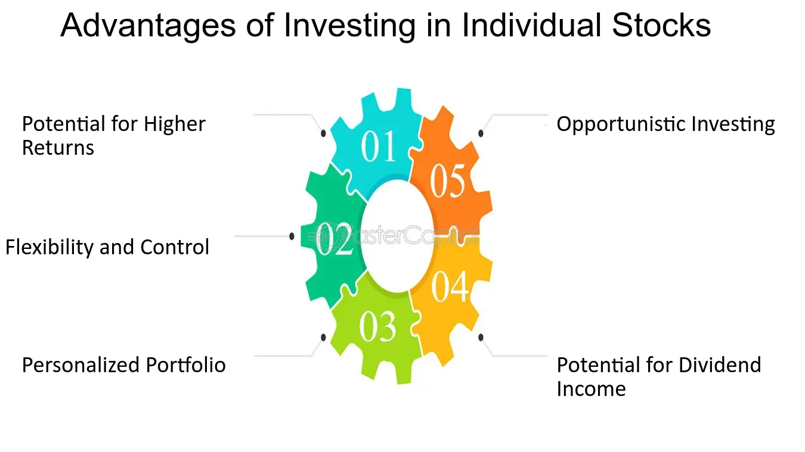

## Table of Contents

## What is a single stock?

A single stock is a piece of ownership in one company. When you buy a single stock, you are buying a small part of that company. The price of the stock can go up or down based on how well the company is doing and what people think about it. If the company does well, the price of the stock might go up, and you could make money. But if the company does poorly, the price might go down, and you could lose money.

Investing in a single stock can be risky because it depends on the success of just one company. If that company has problems, your investment could be in trouble. However, some people like to invest in single stocks because they believe in the company and think it will do well in the future. It's important to do a lot of research before buying a single stock to understand the company and its risks.

## What does it mean to hold a single stock in a portfolio?

Holding a single stock in a portfolio means you have invested in just one company's stock among all your investments. This means a big part of your money is tied to how well that one company does. If the company does great, your investment could grow a lot. But if the company has problems, your investment could lose value.

Because you are relying on just one company, holding a single stock can be risky. If something bad happens to that company, like losing customers or having money troubles, it can hurt your whole portfolio. That's why many people choose to spread their money across different stocks or other types of investments. This way, if one investment goes down, others might still do well and balance things out.

## What are the potential benefits of holding single stocks?

Holding single stocks can give you a chance to make a lot of money if the company does really well. If you believe in a company and think it will grow, buying its stock can be a good way to get a big return on your money. For example, if you had bought stock in a company like Apple or Amazon years ago, your investment could be worth a lot more now. This is because these companies grew a lot and their stock prices went up a lot too.

Another benefit is that you can learn a lot about how businesses work by following a single stock. When you invest in one company, you might start to pay more attention to what that company is doing, how it makes money, and what challenges it faces. This can help you become a better investor over time because you learn more about how different parts of the economy work and how companies succeed or fail.

## What are the risks associated with holding single stocks?

Holding single stocks can be risky because your money depends on how one company does. If that company has problems, like losing customers or not making enough money, the price of its stock can go down a lot. This means you could lose a big part of your investment. For example, if you put all your money in one company and that company goes bankrupt, you could lose everything.

Another risk is that the stock market can be unpredictable. Even if a company is doing well, things like bad news or changes in the economy can make the stock price go down. This means you might see the value of your investment go up and down a lot, which can be stressful. It's hard to know what will happen, so it's important to be ready for the price to change in ways you might not expect.

## How does diversification impact the decision to hold single stocks?

Diversification means spreading your money across different investments, like stocks, bonds, or real estate. When you diversify, you're not putting all your eggs in one basket. This can help lower the risk of losing a lot of money if one investment does badly. If you hold single stocks, you're not diversifying because all your money is in one company. This makes your investment riskier because if that company has problems, your whole investment could be in trouble.

Choosing to hold single stocks instead of diversifying can be a big decision. If you believe strongly in one company and think it will do really well, you might decide to put a lot of money into its stock. But you need to understand that this is a riskier choice. Diversifying can help protect your money by balancing out the ups and downs of different investments. So, if you're thinking about holding single stocks, it's important to think about how much risk you're willing to take and whether you want to spread your money around to be safer.

## Can holding single stocks lead to higher returns compared to diversified portfolios?

Yes, holding single stocks can sometimes lead to higher returns than diversified portfolios. If you pick the right company and it does really well, the value of your stock can go up a lot. For example, if you bought stock in a company like Netflix when it was small and it grew big, you could make a lot more money than if you had spread your money across many different stocks.

But, it's important to know that this is riskier. When you put all your money into one company, you could lose a lot if that company has problems. Diversified portfolios spread the risk around, so if one stock goes down, others might still do well. So, while single stocks can lead to big wins, they can also lead to big losses, and it's not easy to pick the right ones that will do well.

## What is the impact of market volatility on single stock holdings?

Market volatility means the stock market can go up and down a lot in a short time. When you hold a single stock, this can be really scary. If the market is going crazy, the price of your stock can change a lot too. If people are worried about the economy or something bad happens to the company, the stock price might drop fast. This means you could lose money quickly if you're not ready for it.

But it's not all bad. If the market is going up and people are excited about the company, the price of your stock could go up a lot too. This means you could make more money if you hold onto the stock during good times. The key is to be ready for the ups and downs and understand that holding a single stock can be a wild ride because of market volatility.

## How does company-specific risk affect single stock investments?

Company-specific risk is all about the problems that can happen to just one company. When you hold a single stock, you are taking on this risk because your money is tied to how well that one company does. If the company loses customers, has money troubles, or faces a big lawsuit, the price of its stock can go down a lot. This means you could lose money if the company has problems. It's like betting all your money on one horse in a race - if that horse doesn't win, you lose everything.

This risk is different from the risks that affect the whole market, like a big economic downturn. When you hold a single stock, you're not just worried about what's happening in the economy; you're also worried about what's happening with that one company. That's why holding a single stock can be risky. If you spread your money across many different stocks, you can lower this risk because problems with one company won't hurt your whole investment. But if you believe in one company and think it will do well, you might decide to take on this risk and hold its stock.

## What role does research and analysis play in selecting single stocks?

Research and analysis are super important when you want to pick a single stock. Before you buy a stock, you need to learn a lot about the company. You should look at things like how much money the company makes, how it's doing compared to other companies, and what people think about its future. You can read news about the company, look at its financial reports, and even listen to what the company's leaders say. The more you know, the better you can decide if the stock is a good choice for you.

Doing this homework helps you understand the risks and rewards of buying the stock. If you find out the company has a lot of debt or is losing customers, you might decide it's too risky. But if the company is growing fast and has a good plan for the future, you might feel more confident about buying its stock. Good research can help you avoid bad choices and find stocks that might do well. It's like studying for a test - the more you know, the better you'll do.

## How can tax implications influence the decision to hold single stocks?

When you hold single stocks, you need to think about taxes. If you make money from selling a stock, you have to pay capital gains tax. This tax can be different depending on how long you held the stock. If you sell it after holding it for more than a year, you might pay a lower tax rate than if you sell it sooner. So, if you think the stock will go up a lot, you might want to hold it for over a year to save on taxes.

Also, if the company you own stock in pays dividends, you'll have to pay taxes on that money too. Sometimes, these taxes can be lower if the company is set up in a certain way. Knowing about these tax rules can help you decide if holding a single stock is a good idea for you. It's important to think about how much you might have to pay in taxes and if it's worth it compared to other investments.

## What are the psychological factors to consider when holding single stocks?

Holding single stocks can be an emotional rollercoaster. When you put all your money into one company, you might feel really happy when the stock price goes up. You might start to dream about all the money you could make and feel excited about the future. But if the stock price goes down, you could feel really worried or scared. You might start to think about all the money you could lose and feel stressed about your decision. These ups and downs can make it hard to stay calm and make good choices about your investments.

Another thing to think about is how much you believe in the company. If you really like the company and its products, you might feel more confident about holding its stock. You might feel proud to own a piece of a company you believe in and think it will do well. But if you start to doubt the company or hear bad news about it, you might feel nervous and want to sell the stock. It's important to think about how your feelings about the company can affect your decisions and whether you can handle the stress that comes with holding a single stock.

## How do professional investors approach the strategy of holding single stocks in their portfolios?

Professional investors often use a mix of strategies when they decide to hold single stocks in their portfolios. They do a lot of research to find companies they think will do well. They look at things like how much money the company makes, how it's doing compared to other companies, and what the future might hold for the company. They also think about how much risk they want to take. Some professional investors might choose to hold a few single stocks if they really believe in those companies, but they usually don't put all their money in just one stock. They know that holding single stocks can be risky, so they might mix in other investments to be safer.

Another thing professional investors do is keep an eye on the market and the companies they invest in. They watch the news and read reports to see if anything changes that might affect their stocks. If they see something bad happening with a company, they might decide to sell the stock to avoid losing money. On the other hand, if they see good news, they might decide to hold onto the stock or even buy more. Professional investors try to stay calm and not let their feelings get in the way of their decisions. They know that the stock market can go up and down, and they plan for that by thinking about the long term.

## What are the cons of investing in single stocks?

Investing in single stocks carries a higher risk due to a lack of diversification. When investors choose to allocate capital to individual stocks, their portfolios become susceptible to company-specific risks, which can lead to significant losses if the chosen company underperforms or fails. Unlike diversified investment strategies, which spread risk across various assets, single stock investments concentrate risk on specific entities, exposing investors to [volatility](/wiki/volatility-trading-strategies) resulting from company-specific news, management decisions, and industry shifts.

Volatility is a critical concern when investing in single stocks. It refers to the degree of variation in the price of a stock over time, often measured by the standard deviation of returns. High volatility can lead to rapid and substantial changes in the value of single stocks, amplifying the potential for losses. For instance, if a company's earnings report falls short of market expectations, its stock price may experience a sharp decline, quickly eroding investment value.

Consider the formula for standard deviation, $\sigma$, which is often used to quantify the risk or volatility of an investment:

$$
\sigma = \sqrt{\frac{1}{N}\sum_{i=1}^{N}(x_i - \mu)^2}
$$

where $N$ is the number of observations, $x_i$ is each individual observation, and $\mu$ is the mean of the observations. In single stock investment, a high $\sigma$ reflects greater uncertainty and risk.

Moreover, investing in single stocks demands extensive research and continuous monitoring. Investors are required to stay informed about a company's operations, financial health, competitive landscape, and macroeconomic factors affecting its performance. This research is necessary to make informed decisions and mitigate potential risks but can be time-consuming and require a deep understanding of market mechanics and financial reports.

Active monitoring also plays a crucial role in single stock investing. Investors need to remain vigilant to react promptly to market changes, such as earnings releases, industry developments, and geopolitical events that could influence stock prices. This level of engagement might not be feasible for all investors, particularly those with limited time, expertise, or access to resources required for detailed analysis.

In summary, while single stocks offer the potential for high returns, they also bear heightened risks due to lack of diversification, inherent volatility, and the need for thorough research and active management. These factors make single stock investments a more challenging and risky endeavor for individual investors.

## References & Further Reading

[1]: Bergstra, J., Bardenet, R., Bengio, Y., & Kégl, B. (2011). ["Algorithms for Hyper-Parameter Optimization."](https://dl.acm.org/doi/10.5555/2986459.2986743) Advances in Neural Information Processing Systems 24.

[2]: ["Advances in Financial Machine Learning"](https://www.amazon.com/Advances-Financial-Machine-Learning-Marcos/dp/1119482089) by Marcos Lopez de Prado

[3]: ["Evidence-Based Technical Analysis: Applying the Scientific Method and Statistical Inference to Trading Signals"](https://www.amazon.com/Evidence-Based-Technical-Analysis-Scientific-Statistical/dp/0470008741) by David Aronson

[4]: ["Machine Learning for Algorithmic Trading"](https://github.com/stefan-jansen/machine-learning-for-trading) by Stefan Jansen

[5]: ["Quantitative Trading: How to Build Your Own Algorithmic Trading Business"](https://www.amazon.com/Quantitative-Trading-Build-Algorithmic-Business/dp/1119800064) by Ernest P. Chan