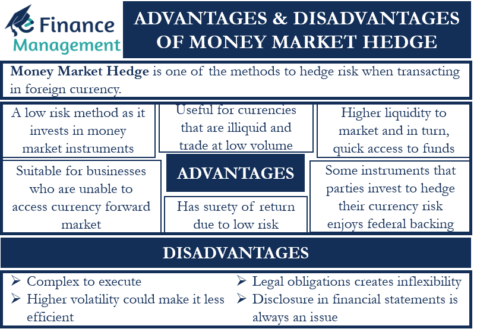

## Table of Contents

## What are money market funds?

Money market funds are a type of mutual fund that invests in very safe, short-term debt securities like government bonds, treasury bills, and commercial paper. These funds aim to maintain a stable value and offer investors a place to park their money while earning a small amount of interest. They are considered low-risk investments because they focus on securities that are less likely to lose value.

People often use money market funds as a temporary holding place for their cash. For example, if someone is saving up for a big purchase or waiting to invest in the stock market, they might put their money in a money market fund to keep it safe and earn a little interest in the meantime. While the returns are not high, the main advantage is the safety and liquidity, meaning you can easily access your money when you need it.

## How do money market funds work?

Money market funds work by pooling money from many investors and using it to buy short-term, safe investments like government bonds and commercial paper. These investments are chosen because they are less likely to lose value and usually pay back the money with a little interest after a short time, like a few months. The goal is to keep the value of the fund stable, usually at $1 per share, so investors feel their money is safe.

When you put money into a money market fund, you're buying shares in the fund. The interest earned from the investments is then shared among all the shareholders, which gives you a small return on your investment. You can take your money out whenever you need it, making these funds a good place to keep your cash if you want it to be safe and easy to access. While the returns are not big, the main benefit is the safety and the ability to get your money quickly when you need it.

## What are the typical investments in a money market fund?

Money market funds usually invest in safe, short-term things like government bonds, treasury bills, and commercial paper. Government bonds are loans to the government that pay back with interest. Treasury bills are similar but are issued by the U.S. Treasury and last for a short time, like a few months. Commercial paper is a type of short-term loan that big companies use to borrow money for a short time.

These investments are chosen because they are very safe and don't lose value easily. They also pay back the money with a little interest after a short time. This helps the money market fund keep its value stable, usually at $1 per share. By investing in these safe options, money market funds can offer a place for people to keep their money safe while [earning](/wiki/earning-announcement) a small amount of interest.

## What are the advantages of investing in money market funds?

Money market funds are a good choice if you want to keep your money safe. They invest in very safe things like government bonds and treasury bills, which means your money is less likely to lose value. This makes them a good place to park your cash if you're saving up for something or waiting to invest in something else. You don't have to worry about big losses, which can give you peace of mind.

Another advantage is that you can get your money out easily when you need it. Money market funds are very liquid, which means you can take your money out whenever you want without waiting. While you won't earn a lot of interest, the small amount you do earn is better than keeping your money in a regular savings account. So, if you want safety and the ability to access your money quickly, money market funds are a good option.

## What are the disadvantages of investing in money market funds?

One disadvantage of money market funds is that they don't give you a lot of money back in interest. If you're looking to grow your money a lot over time, these funds might not be the best choice because the returns are small. They are meant to keep your money safe, not to make it grow quickly.

Another downside is that while money market funds are very safe, they are not completely risk-free. There is a small chance that the value of the fund could drop below $1 per share, which is called "breaking the buck." This is rare, but it can happen if the investments the fund makes don't pay back as expected. So, even though they are low risk, they are not totally without risk.

## How do money market funds compare to other investment options like savings accounts or bonds?

Money market funds, savings accounts, and bonds each offer different things when you want to put your money somewhere. Money market funds are good because they are safe and you can get your money out easily. They invest in things like government bonds and treasury bills, which are very safe. But, they don't give you a lot of interest. Savings accounts are similar because they are also very safe and easy to get your money from. But, savings accounts usually give you even less interest than money market funds. So, if you want to keep your money safe and earn a bit more interest than a savings account, a money market fund might be a good choice.

Bonds are a bit different. When you buy a bond, you're lending money to a government or a company, and they pay you back with interest over time. Bonds can give you more interest than money market funds or savings accounts, but they are also a bit riskier. The value of a bond can go up or down, and you might have to wait until the bond matures to get your money back. So, if you want to earn more interest and are okay with a bit more risk, bonds might be a better option than money market funds. But if you need your money to be safe and easy to get, a money market fund is usually better than a bond.

## What is the risk level associated with money market funds?

Money market funds are considered to be low risk. They invest in very safe things like government bonds and treasury bills. These investments are chosen because they are less likely to lose value. This makes money market funds a good place to keep your money if you want it to be safe. They are often used as a temporary spot to park cash while you decide what to do with it next.

However, money market funds are not completely risk-free. There is a small chance that the value of the fund could drop below $1 per share, which is called "breaking the buck." This is rare, but it can happen if the investments the fund makes don't pay back as expected. So, even though they are low risk, there is still a little bit of risk involved. If you're looking for something with almost no risk at all, a regular savings account might be safer, but it will also give you less interest.

## How does the liquidity of money market funds benefit investors?

The [liquidity](/wiki/liquidity-risk-premium) of money market funds is a big help to investors because it means you can get your money out quickly and easily whenever you need it. If you put your money in a money market fund, you don't have to wait a long time to use it. This is good if you're saving up for something and you need your money soon, or if you're waiting to invest in something else but want to keep your money safe in the meantime.

Being able to get your money out easily also gives you peace of mind. You know that if something unexpected happens and you need cash fast, you can take it out of the money market fund without any trouble. This makes money market funds a good choice for people who want to keep their money safe but also need to be able to use it whenever they want.

## What are the fees and expenses associated with money market funds?

Money market funds have fees and expenses that you should know about. One common fee is the expense ratio, which is a yearly fee that covers the costs of running the fund. This fee is taken out of the fund's earnings before they are given to you, so it reduces the amount of interest you earn. The expense ratio for money market funds is usually low, often around 0.1% to 0.5% of your investment each year, but it can vary depending on the fund.

There might also be other fees, like account fees or transaction fees. An account fee could be charged if your account balance falls below a certain amount. A transaction fee might be charged if you take money out of the fund more often than allowed. These fees can add up, so it's a good idea to read the fund's prospectus to understand all the costs before you invest. Knowing the fees and expenses will help you figure out if a money market fund is the right choice for you.

## How do interest rate changes affect money market funds?

Interest rate changes can have a big effect on money market funds. When interest rates go up, the returns on the short-term investments that money market funds hold, like government bonds and treasury bills, also go up. This means the money market fund can earn more interest, which can be good for investors because they get a higher return on their money. On the other hand, when interest rates go down, the returns on these investments also go down, so the money market fund earns less interest, and investors get a lower return.

But it's not just about the returns. When interest rates change, it can also affect how much people want to invest in money market funds. If interest rates are going up, more people might put their money into money market funds to take advantage of the higher returns. If interest rates are going down, people might look for other places to invest their money where they can earn more. So, [interest rate](/wiki/interest-rate-trading-strategies) changes can change both how much money the fund earns and how popular the fund is with investors.

## What regulatory requirements do money market funds have to comply with?

Money market funds have to follow rules set by the government to make sure they are safe for people to invest in. In the United States, these rules come from the Securities and Exchange Commission (SEC). One big rule is that money market funds have to invest in high-quality, short-term things like government bonds and treasury bills. This helps keep the fund safe and makes sure it can pay back investors when they want their money.

Another important rule is about how much risk the fund can take. Money market funds have to be careful and can't put too much money into one investment. This is called diversification, and it helps spread out the risk. There are also rules about how much the fund can change in value. The SEC wants the value of the fund to stay stable, usually at $1 per share, so they have rules to help make sure that happens. By following these rules, money market funds can offer a safe place for people to keep their money.

## How can an investor evaluate the performance of a money market fund?

To evaluate the performance of a money market fund, an investor should look at the fund's yield, which is the interest rate it earns. The yield tells you how much money the fund is making from its investments. You can compare the yield of different money market funds to see which one gives you the best return. But remember, the yield can change over time, so it's good to check it regularly. Also, look at the fund's expense ratio, which is the fee you pay each year for the fund to be managed. A lower expense ratio means you get to keep more of the interest the fund earns.

Another thing to consider is the stability of the fund's value. Money market funds aim to keep their value at $1 per share, so you should check if the fund has ever "broken the buck," which means its value fell below $1. This is rare, but it can happen. You can find this information in the fund's history or by reading reports about the fund. Also, look at how well the fund is managed. Good management can help the fund perform better and stay safe. By looking at these things, you can get a good idea of how well a money market fund is doing and if it's a good choice for you.

## What are the considerations for investors?

When considering an investment in money market funds, several factors can influence the decision-making process. Understanding these factors is crucial for aligning investments with financial goals and risk tolerance.

### Factors to Consider Before Investing

**1. The Impact of Algo Trading on Investment Strategy:**

Algorithmic trading, or algo trading, involves the use of computer algorithms to automate trading strategies. In the context of money market funds, this technology can improve efficiency and optimize returns by executing trades at optimal prices, reducing transaction costs, and managing risks more effectively. However, investors need to be aware of the constraints and potential risks associated with relying on algorithmic systems, such as technical failures or algorithmic inefficiencies that could impact fund performance.

**2. Balancing Risk and Return in a Diversified Portfolio:**

Money market funds are generally considered low-risk investments, making them suitable for conservative portfolios or for investors seeking a safe haven during market [volatility](/wiki/volatility-trading-strategies). However, the key to successful investing is diversification. This involves allocating assets across various investment types to balance potential risks and returns. The formula for the risk of a portfolio $\sigma_p$ is given by:

$$
\sigma_p = \sqrt{\sum_{i=1}^{n}\sum_{j=1}^{n} w_i w_j \sigma_i \sigma_j \rho_{ij}}
$$

Where $w_i$ and $w_j$ represent the portfolio weights for assets $i$ and $j$, $\sigma_i$ and $\sigma_j$ are the standard deviations of the assets, and $\rho_{ij}$ is the correlation coefficient between assets $i$ and $j$. Properly balancing a portfolio ensures that while some funds are placed in safer money market funds, others may be allocated to riskier assets to potentially enhance returns.

**3. Understanding Market Conditions:**

Market conditions, including interest rates and economic outlook, play a significant role in the performance of money market funds. These funds tend to perform better in high-interest-rate environments due to increased yield on short-term investments. Conversely, during periods of low interest rates, returns may diminish. Investors should regularly assess economic indicators and adjust their fund allocations accordingly to maximize potential yield or minimize risk exposure.

**4. Selecting the Right Money Market Fund:**

When choosing a money market fund, investors should consider factors such as the fund's historical performance, management fees, minimum investment requirements, and the strategies employed, including the use of [algorithmic trading](/wiki/algorithmic-trading). Funds that leverage algorithms may offer efficiency advantages, but it's important to evaluate the sophistication and reliability of the technology used. Additionally, assessing the fund's composition—such as the variety of underlying instruments like Treasury bills, commercial paper, or certificates of deposit—can provide insights into its risk profile and potential returns. 

By carefully analyzing these factors, investors can make more informed decisions, aligning their money market fund investments with their overall financial objectives while taking advantage of both traditional and technological strategies.

## References & Further Reading

[1]: Mishkin, F. S. (2012). ["The Economics of Money, Banking, and Financial Markets."](https://www.pearsonhighered.com/assets/preface/0/1/3/4/0134855388.pdf) Pearson Education.

[2]: BlackRock. (n.d.). ["Understanding Money Market Funds."](https://www.blackrock.com/cash/en-gb/bank-deposits-vs-mmfs) Retrieved from BlackRock website.

[3]: Teall, J. L. (2013). ["Financial Trading and Investing."](https://www.sciencedirect.com/book/9780323909556/financial-trading-and-investing) Academic Press.

[4]: Hasbrouck, J. (2007). ["Empirical Market Microstructure: The Institutions, Economics, and Econometrics of Securities Trading."](https://archive.org/details/empiricalmarketm0000hasb) Oxford University Press.

[5]: Alexander, C. (2020). ["Market Risk Analysis, Volume II: Practical Financial Econometrics."](https://www.wiley.com/en-us/Market+Risk+Analysis%2C+Volume+II%2C+Practical+Financial+Econometrics-p-9780470998014) Wiley.