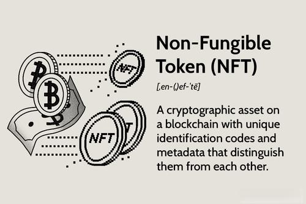

In recent years, investments in non-fungible tokens (NFTs) and algorithmic trading have gained significant traction in the financial sector. NFTs, a class of digital assets, have introduced a new dimension to the concept of ownership by providing a digital certificate of authenticity and ownership that is maintained on a blockchain. While initially associated with digital art and collectibles, NFTs are now extending into various sectors, including real estate and entertainment, thereby broadening their appeal and use cases. The unprecedented growth in the NFT market has piqued the interest of investors seeking to capitalize on the digital scarcity and uniqueness that NFTs present.

Concurrently, algorithmic trading is reshaping how financial markets operate. By using computer algorithms to execute trades based on predefined strategies, investors and institutions aim to optimize trading decisions. The primary allure of algorithmic trading lies in its ability to process vast amounts of data at high speeds, thereby reducing human error and the influence of emotions on trading activities. These systems can identify market patterns and execute trades much faster than a human trader, aspiring to maximize efficiency and profits.



However, the adoption of these innovative financial products does not come without challenges. The speculative nature of the NFT market and the potential for significant volatility create risks that investors must navigate cautiously. Regulatory requirements are still evolving, adding another layer of complexity to NFTs as an investment vehicle. Similarly, algorithmic trading requires sophisticated technology and infrastructure, coupled with a strong understanding of market dynamics and strategies.

This article provides an exploration of both the benefits and pitfalls associated with these emerging investment opportunities, aiming to present a balanced perspective. By examining the fundamental characteristics and implications of investing in NFTs and engaging in algorithmic trading, we aspire to equip potential investors with the knowledge necessary to make informed decisions.

## Table of Contents

## Understanding NFTs in Investment

Non-fungible tokens (NFTs) have emerged as a revolutionary concept in digital asset ownership, leveraging the power of blockchain technology to create digital scarcity and unique asset identification. NFTs are digital assets that represent ownership of distinctive items, ranging from digital art and music to in-game items and real estate. Each NFT is minted on a blockchain, most commonly Ethereum, which ensures that it cannot be replicated or replaced, a quality that sets it apart from traditional cryptocurrencies like Bitcoin and Ethereum itself, which are fungible.

Digital art has become one of the most prominent applications of NFTs, enabling artists to monetize their work in new ways. Platforms such as OpenSea and Rarible have facilitated the trading of digital art NFTs, allowing collectors to buy and sell pieces with recorded ownership and provenance stored securely on the blockchain. Beyond art, NFTs have found utility in collectibles, including items like trading cards and digital merchandise, offering collectors a verified and immutable record of ownership.

Recently, the scope of NFTs has expanded to include real estate fractionalization, where physical real estate assets are divided into digital fractions represented by NFTs. This innovation permits multiple investors to own a portion of a property, democratizing access to real assets by lowering the barrier to entry. This method also allows for the seamless transfer of ownership shares, enhancing [liquidity](/wiki/liquidity-risk-premium) in a traditionally illiquid market.

The principal appeal of NFTs lies in their ability to verify the ownership and authenticity of assets. Blockchain technology provides a decentralized and tamper-proof ledger that records every transaction involving an NFT, ensuring transparent and secure provenance tracking. This capability has significant implications for digital commerce and intellectual property rights management, potentially transforming how assets are bought, sold, and leveraged.

Despite their potential, NFTs are subject to a highly speculative market environment. The rapid price fluctuations often seen in NFT markets are driven, in part, by hype and speculation, leading to concerns about asset bubbles and financial instability. Furthermore, the NFT market currently operates with minimal regulatory oversight, posing risks to investors who may encounter fraudulent activities or insufficient consumer protections. Buyers need to exercise caution, conduct due diligence, and be aware of these challenges as they engage with the evolving NFT landscape.

## Pros of Investing in NFTs

Non-fungible tokens (NFTs) offer a streamlined digital approach for verifying and establishing asset ownership. This technological innovation leverages the blockchain to provide distinct advantages for investors. One significant benefit of NFTs lies in their capability to enable fractional ownership of high-value items, such as art, real estate, and rare collectibles. By dividing ownership into smaller, digital shares, these assets become more accessible to a broader range of investors, democratizing investment opportunities traditionally reserved for the wealthy.

The security of NFTs is reinforced by blockchain technology, which ensures a tamper-proof record of ownership. This immutable ledger provides transparency and safety that is not as easily achievable through traditional methods. Each transaction is permanently recorded, preventing fraud and verifying the authenticity of the asset. This capability is particularly advantageous in domains where provenance and originality are critical, such as in art and collectibles.

Moreover, NFTs have the potential to revolutionize digital commerce and rights management. Through smart contracts, which are self-executing contracts with the terms of the agreement directly written into code, NFTs can automate royalty payments to authors, artists, and creators. This innovation mitigates the need for intermediaries, thereby reducing costs and streamlining processes. For example, a digital artist could receive a percentage of sales each time their artwork is resold, providing a continuous revenue stream and protecting intellectual property rights.

Overall, the structural benefits of NFTs offer compelling prospects for investors, who can capitalize on the fusion of blockchain technology and digital assets to explore new markets and investment strategies.

## Cons of Investing in NFTs

The market for non-fungible tokens (NFTs) presents several challenges and potential disadvantages that investors must consider carefully. One significant concern is the susceptibility of the NFT market to fraud and market manipulation. Due to the nascent nature of this market, bad actors can easily exploit inexperienced investors through schemes such as false bidding, fake scarcity, and counterfeit tokens. The lack of regulation further exacerbates these issues, posing a substantial risk as there are few laws and guidelines to protect investors and ensure marketplace integrity.

Moreover, NFTs do not generate passive income, such as dividends or interest, and their profitability is primarily dependent on the appreciation of their value over time. This reliance on price appreciation makes them inherently speculative investments, which can result in significant financial loss if the market does not favorably move for investors.

Additionally, the environmental impact of NFTs, due to the underlying blockchain technology, has sparked considerable concern. Most NFTs are minted on blockchains that use a proof-of-work consensus mechanism, which is energy-intensive and contributes significantly to carbon emissions. For example, Ethereum, a common platform for NFTs, has been criticized for its high energy consumption. Although there are moves towards more environmentally friendly options, such as proof-of-stake, these have not yet been widely adopted.

Overall, investing in NFTs requires a thorough understanding of these challenges, and potential investors should weigh these cons against any perceived benefits to make well-informed investment decisions.

## Overview of Algorithmic Trading

Algorithmic trading is a method that utilizes computer algorithms to execute trades in financial markets. These algorithms follow pre-defined criteria, which may include timing, price, quantity, or any mathematical model. The primary objective of [algorithmic trading](/wiki/algorithmic-trading) is to minimize human intervention and, consequently, human error, while enhancing the speed and accuracy of trade executions.

The automation provided by algorithmic trading often surpasses manual trade execution capabilities. Computers can process and react to market conditions more rapidly than humans, enabling traders to capitalize on short-lived market opportunities. A key feature of certain algorithmic strategies is their ability to operate with minimal to no human oversight, commonly referred to as zero-touch algorithms. These zero-touch systems automatically interpret market data and make instant trading decisions based on preprogrammed rules.

Zero-touch algorithms typically employ statistical and mathematical models to predict future market movements and determine optimal trading actions. They can manage trades at a scale and speed impossible for human traders, allowing for greater market efficiency. Additionally, algorithmic trading helps in managing and optimizing trading costs, by executing trades more precisely and reducing the market impact.

In summary, algorithmic trading revolutionizes traditional trading methodologies by leveraging technology to enhance efficiency, reduce costs, and assist with strategic decision-making.

## Pros of Algorithmic Trading

Algorithmic trading offers several distinct advantages that contribute to its appeal among investors and financial institutions. One of the most significant benefits is the increased speed and accuracy of trade execution. Algorithms can process large volumes of financial data quickly and execute trades in fractions of a second, far surpassing human capabilities. This rapid execution helps traders capitalize on short-lived market opportunities that might otherwise be missed due to delays in human processing and decision-making.

Additionally, algorithmic trading significantly reduces transaction costs. High-frequency trading ([HFT](/wiki/high-frequency-trading-strategies)), a subset of algorithmic trading, takes advantage of minute price differences in large volumes of stocks. By executing thousands of trades at lightning speed, these algorithms can generate profits from these small price differentials, which traditional trading methods may not easily capture. Furthermore, algorithmic trading minimizes the impact of human error, thus reducing costs associated with manual trading mistakes.

Another key advantage of algorithmic trading is that it eliminates emotional decision-making. Traders are often subject to biases, fear, and greed, which can adversely affect their decision-making process. Algorithms, on the other hand, operate on predefined rules and criteria, ensuring that trades are executed with discipline and consistency. This objectivity prevents emotional responses that typically influence market decisions, enabling more rational and data-driven trading strategies.

Algorithmic trading also facilitates diversification by allowing for simultaneous trade execution across multiple markets and asset classes. Traders can deploy a variety of strategies and manage several portfolios at once, optimizing returns and balancing risks. For example, an algorithm can be programmed to trade stocks, commodities, and foreign exchange simultaneously, adjusting positions based on real-time data, market conditions, and pre-defined risk parameters.

Together, these advantages reinforce the growing adoption of algorithmic trading across modern financial markets. Embracing technological innovations allows investors to optimize their trading strategies, reduce costs, and improve overall performance, thereby enhancing their competitive advantage in the increasingly complex financial landscape.

## Cons of Algorithmic Trading

Algorithmic trading, while offering numerous advantages, also has several drawbacks that investors must consider. One of the primary concerns is the heavy reliance on technology, which inherently brings the risk of technical glitches. These can range from minor software bugs to significant system failures that may result in financial losses. Historical events, such as the 2010 "Flash Crash," highlight how technical issues in algorithmic trading systems can have widespread market impacts.

Another challenge is the possibility of over-optimization, where trading strategies are excessively fine-tuned to perform well on historical data but fail in live trading due to the dynamic nature of financial markets. This phenomenon, known as "curve fitting," can lead to strategies that are not robust and do not adjust well to unexpected market conditions. Over-optimized strategies may show impressive [backtesting](/wiki/backtesting) results but could falter when exposed to the unpredictable real world.

The development and management of algorithmic trading systems necessitate significant technical expertise. This includes knowledge in programming, statistical analysis, and financial markets. Writing effective algorithms often requires proficiency in languages such as Python, R, or C++. For example, a Python script used in algorithmic trading might look like this:

```python
import pandas as pd

def moving_average_strategy(prices, short_window=40, long_window=100):
    signals = pd.DataFrame(index=prices.index)
    signals['signal'] = 0.0

    # Create short simple moving average and long simple moving average
    signals['short_mavg'] = prices['Close'].rolling(window=short_window, min_periods=1, center=False).mean()
    signals['long_mavg'] = prices['Close'].rolling(window=long_window, min_periods=1, center=False).mean()

    # Generate signals
    signals['signal'][short_window:] = np.where(signals['short_mavg'][short_window:] > signals['long_mavg'][short_window:], 1.0, 0.0)   

    return signals
```

In addition to technical skills, continuous monitoring of algorithmic systems is vital to ensure smooth operation and to quickly address any errors that may arise. Market conditions can change rapidly, and algorithms may need adjustments to adapt to new patterns or mitigate risks from unforeseen events. Regular supervision is crucial to ensure algorithms are performing as expected and to prevent unintended trading activities that could lead to losses.

Overall, while algorithmic trading can provide efficiencies and opportunities, investors must balance these against the potential risks associated with technology dependence, strategy robustness, and the necessary expertise required to manage such systems effectively.

## Conclusion

Both non-fungible tokens (NFTs) and algorithmic trading present distinct opportunities for investors who are open to embracing risk and pursuing innovation. NFTs offer a novel way to establish digital ownership and authenticity of unique assets, while algorithmic trading enhances efficiency and precision in executing trades. However, with these opportunities come inherent risks and challenges, highlighting the importance of thorough due diligence.

Before committing to these investment strategies, it is essential to conduct comprehensive research to understand the associated risks and potential rewards. The NFT market is speculative and currently lacking in regulatory oversight, whereas algorithmic trading demands a high degree of technical expertise and the ability to manage technological risks. 

Investors should carefully assess their investment goals and risk tolerance. NFTs may appeal to those interested in digital art and unique digital assets, while algorithmic trading suits those who prioritize speed and efficiency in the stock market. Being clear on these factors will guide investors in determining the suitability of these investment avenues.

As the investment landscape evolves, staying continuously informed is crucial. This involves monitoring market trends, understanding regulatory developments, and keeping abreast of technological advancements. By doing so, investors can better position themselves to leverage the emerging opportunities presented by NFTs and algorithmic trading.

## References & Further Reading

[1]: Ma, W., & Xia, J. (2019). ["Auction Models and Market Design for NFTs."](https://scholar.google.com/citations?user=aDdHQ9oAAAAJ) Nature-Inspired Computation in Navigation and Routine Problems in Financial Markets. Springer.

[2]: Jialin, M., & Xiaoshan, J. (2022). ["The Rise of NFTs in the Art Industry: Causes and Consequences."](http://english.ict.cas.cn/people/scien/bln/202303/t20230315_328233.html) The Conversation.

[3]: Narayanan, A., Bonneau, J., Felten, E. W., Miller, A., & Goldfeder, S. (2016). ["Bitcoin and Cryptocurrency Technologies."](https://press.princeton.edu/books/hardcover/9780691171692/bitcoin-and-cryptocurrency-technologies) Princeton University Press.

[4]: Treleaven, P., & Batrinca, G. (2017). ["Algorithmic Trading: Pros and Cons."](https://www.semanticscholar.org/paper/Algorithmic-Regulation%3A-Automating-Financial-and-AI-Treleaven-Batrinca/dbd777d9210aa15322fd5b978ce3c55bcb36ca68) Journal of Economic Dynamics and Control.

[5]: Evans, J. (2019). ["Digital Real Estate: The Impact of NFTs on Property Investment."](https://link.springer.com/article/10.1007/s44268-023-00016-0) New Republic.