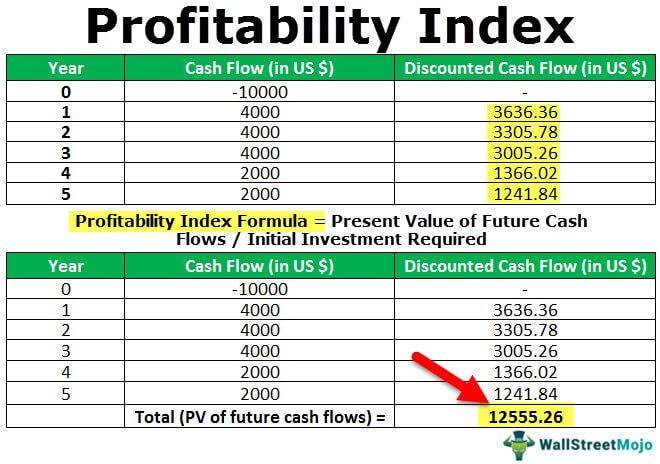

In recent years, algorithmic trading, commonly referred to as algo trading, has significantly transformed the landscape of financial markets. This innovative trading method utilizes complex computer algorithms to transact large volumes at speeds and frequencies beyond human capability. Algo trading is characterized by its rapid execution, where trades are driven by pre-defined criteria that analyze vast amounts of market data in real time.

The advantages of algo trading are numerous. Its capacity for increased execution speed allows traders to capitalize on tiny price discrepancies that are typically missed in manual trading. Furthermore, the precision of these algorithmic trades enhances accuracy and reduces the likelihood of human-induced errors. Algorithms operate strictly according to set rules, free from the emotional biases that can influence human trading.



However, the growth of algorithmic trading also brings unique challenges and disadvantages. The heavy reliance on technological infrastructure means that any technological glitch or connectivity issue can lead to missed opportunities or unintended consequences. Additionally, the high initial investment required for developing an algo trading system, including the need for sophisticated programming skills, can be prohibitive for individual traders.

This article aims to provide a detailed understanding of the advantages and disadvantages associated with both indexes and algo trading, highlighting their significance to investors and traders. As we explore these facets, we will shed light on how these tools impact investment strategies, profitability, and risk management in financial markets.

## Table of Contents

## Understanding Indexes and Index Funds

Indexes are crucial components in understanding the performance of financial markets. They represent hypothetical portfolios of securities, measuring how a particular segment of the market, such as stocks or bonds, is performing. Some of the most noted indexes include the Standard & Poor's 500 Index (S&P 500), which encompasses 500 of the largest publicly traded companies in the United States, and the NASDAQ Composite, heavily weighted towards technology stocks.

Index funds are investment vehicles designed to follow these indexes. This provides investors with an opportunity to invest in a broad market or a specific sector without purchasing individual stocks. These funds effectively replicate the holdings of a particular index, aiming to match its performance as closely as possible. For instance, an S&P 500 index fund would attempt to mirror the performance of the S&P 500 index by holding positions in all 500 stocks included within it, in proportion to their representation in the index.

One significant advantage of indexes is that they offer a swift and effective measure of market health. Investors and analysts can use indexes to quickly gauge how specific sectors or the market as a whole is performing. Furthermore, the historical data provided by indexes serves as an invaluable tool for making informed investment decisions. By analyzing the performance trends, such as average annual returns or [volatility](/wiki/volatility-trading-strategies), investors can form strategies to optimize their portfolios.

However, relying solely on indexes and index funds has its drawbacks. A recurring issue is the overweighting of large-cap stocks. Many indexes, particularly those that are market-capitalization weighted, tend to have a significant portion of their composition dominated by the largest market-cap companies. This can skew the representation, diminishing the exposure to smaller-cap companies that might offer substantial growth potential.

Additionally, index funds, by their design, are inherently inflexible. They do not allow for an active response to specific market conditions. This means that during periods of market downturns, investors in index funds might experience declines corresponding to the market movements without the possibility of strategic intervention by an active manager.

In summary, while indexes and index funds offer a straightforward method for gaining broad market exposure and leveraging historical data for decision-making, they also come with limitations related to their concentration in large-cap stocks and intrinsic inflexibility. These factors are vital considerations for investors seeking to diversify their portfolio while managing risk and return expectations.

## Advantages of Algo Trading

Algorithmic trading, commonly known as algo trading, offers significant advantages that have transformed the landscape of financial markets. One of the primary benefits is the ability to execute trades at unprecedented speeds. Algorithms can rapidly process and analyze vast amounts of market data, enabling traders to capitalize on price inefficiencies that arise within fractions of a second. This high-speed execution is particularly advantageous in markets where even minuscule price movements can result in significant financial gains.

Another critical advantage of algo trading is its precision. The trade orders generated by algorithms are executed based on pre-established criteria and do not suffer from human errors or emotional biases. This mechanical precision often results in higher trade accuracy. For example, an algorithm programmed to buy a stock only when it drops below a particular price will do so consistently, ensuring adherence to the trading strategy without deviation caused by psychological influences like fear or greed.

Furthermore, the automation inherent in [algorithmic trading](/wiki/algorithmic-trading) reduces transaction costs over time. Automating trade execution minimizes the necessity for manual intervention, streamlining the entire process. This not only curtails labor costs but also allows for the simultaneous processing of large volumes of trades. The ability to handle numerous transactions concurrently without human oversight means that traders can achieve economies of scale, further reducing costs associated with [liquidity](/wiki/liquidity-risk-premium) and market impact. 

The advantages of speed, accuracy, and cost reduction associated with algo trading make it an increasingly popular choice for participants in the financial markets, from institutional investors to individual traders. However, it remains essential for users to account for initial setup investments and ongoing maintenance of the trading algorithms.

## Disadvantages of Algo Trading

Algorithmic trading, while offering numerous advantages, presents several disadvantages primarily stemming from its reliance on technology and the necessity of constant adaptation.

Firstly, algo trading is heavily dependent on robust technology and infrastructure. This reliance means that any technology failure, such as server downtime or internet connectivity issues, can lead to missed trading opportunities and potential financial loss. The system's efficacy hinges on uninterrupted execution, making technological stability crucial.

Secondly, the initial setup costs for developing an algo trading system are considerable. Developing bespoke algorithms requires not just financial resources but also a deep understanding of both programming and financial markets. Programming skills are indispensable, as traders need to code strategies using programming languages such as Python or C++. For instance, a simple moving average crossover strategy could be implemented as follows:

```python
import pandas as pd

def moving_average_crossover(data, short_window, long_window):
    signals = pd.DataFrame(index=data.index)
    signals['signal'] = 0.0
    signals['short_mavg'] = data['Close'].rolling(window=short_window, min_periods=1).mean()
    signals['long_mavg'] = data['Close'].rolling(window=long_window, min_periods=1).mean()
    signals['signal'][short_window:] = np.where(signals['short_mavg'][short_window:] 
                                                 > signals['long_mavg'][short_window:], 1.0, 0.0)   
    signals['positions'] = signals['signal'].diff()
    return signals
```

This reliance on specialized skills and significant financial outlay poses substantial barriers for individual traders or small firms wishing to enter the algorithmic trading market.

Moreover, algorithms necessitate continual monitoring and updates to remain effective. Financial markets are dynamic environments where patterns, rules, and volatility can change rapidly. Consequently, algorithms must be regularly refactored to reflect new data and market conditions, increasing the complexity of managing these systems. This ongoing requirement for refinement adds another layer of difficulty, as traders must remain vigilant to prevent their algorithms from becoming obsolete or ineffective.

Overall, while algorithmic trading offers remarkable speed and precision, its disadvantages lie in the technological dependencies, high barriers to entry due to setup costs, and the continuous need for adaptation to the changing market landscape.

## Disadvantages of Indexes and Index Funds

Indexes and index funds offer a straightforward approach to investing by mirroring the performance of a specific market segment. However, they come with notable drawbacks that investors need to consider. One significant disadvantage of indexes is their tendency to overweight large-cap stocks. This means that established, larger companies can disproportionately influence the index's performance, overshadowing smaller-cap stocks that might have greater growth potential. For instance, in a capitalization-weighted index, the formula used to determine the index value is:

$$
\text{Index Value} = \sum_{i=1}^{n} (P_i \times Q_i)
$$

where $P_i$ represents the price of stock $i$ and $Q_i$ the quantity of stock $i$. In this system, stocks with a higher market capitalization have a more substantial influence, potentially skewing the representation towards larger firms.

Furthermore, index funds are often criticized for their inflexibility. Unlike actively managed funds, which may adjust investments based on market trends, index funds aim to replicate index movements precisely. This rigid approach can expose investors to the full brunt of market downturns, as there is no active manager to strategically withdraw from declining sectors. For example, during periods of high volatility, the lack of adaptability might result in significant drawdowns since index funds follow market movements passively.

Additionally, during volatile market periods, this inflexibility can result in substantial losses. Since these funds are designed to track the index's performance, they have no mechanism to deviate from the declining trajectory. The inability to reposition becomes particularly apparent when the market experiences sharp downturns, as index funds do not possess the capacity for tactical withdrawal or reallocation to mitigate potential losses.

Overall, while index funds provide a cost-effective and simple investment strategy, their inherent disadvantages necessitate careful consideration. Investors need to evaluate whether the passive nature of index funds aligns with their financial goals and risk tolerance.

## Conclusion

Both indexes and algorithmic trading have transformed the investment landscape, each offering unique benefits and posing specific challenges. Indexes provide investors with a cost-effective solution for gaining broad market exposure. They allow for a straightforward entry into the financial markets by replicating the performance of a market segment, such as the S&P 500 or the NASDAQ Composite. However, their inherent limitations in adaptability cannot be overlooked. Indexes, often dominated by large-cap stocks, may not adequately reflect the dynamics of smaller, high-growth companies. Additionally, they lack the flexibility required to respond swiftly to specific market conditions, particularly during downturns.

On the other hand, algorithmic trading offers a significant technological advancement by enabling rapid trading execution that surpasses human capabilities. This method allows traders to exploit small price fluctuations through precise, rules-based strategies, potentially reducing human error and trading costs. Nonetheless, the implementation of algorithmic trading requires substantial investment in technological infrastructure and the continuous development of algorithms to remain effective amidst evolving market conditions. The reliance on technology introduces vulnerabilities, such as the risk of system failures and the necessity for sophisticated programming skills.

Therefore, investors and traders must meticulously evaluate the pros and cons of indexes and algorithmic trading relative to their individual investment goals and available resources. The choice between these two approaches depends on factors such as risk tolerance, investment capital, and the desired level of market engagement. By aligning these considerations with their strategic objectives, market participants can determine the most suitable investment approach that aligns with their specific needs and circumstances.

## References & Further Reading

[1]: ["Algorithmic Trading: Winning Strategies and Their Rationale"](https://books.google.com/books/about/Algorithmic_Trading.html?id=WAlFDwAAQBAJ) by Ernie Chan

[2]: Aldridge, I. (2013). ["High-Frequency Trading: A Practical Guide to Algorithmic Strategies and Trading Systems"](https://www.amazon.com/High-Frequency-Trading-Practical-Algorithmic-Strategies/dp/1118343506). Wiley.

[3]: ["Advances in Financial Machine Learning"](https://www.amazon.com/Advances-Financial-Machine-Learning-Marcos/dp/1119482089) by Marcos Lopez de Prado

[4]: ["Quantitative Trading: How to Build Your Own Algorithmic Trading Business"](https://www.amazon.com/Quantitative-Trading-Build-Algorithmic-Business/dp/1119800064) by Ernest P. Chan

[5]: ["A Random Walk Down Wall Street: The Time-Tested Strategy for Successful Investing"](https://www.amazon.com/Random-Walk-Down-Wall-Street/dp/0393358380) by Burton G. Malkiel