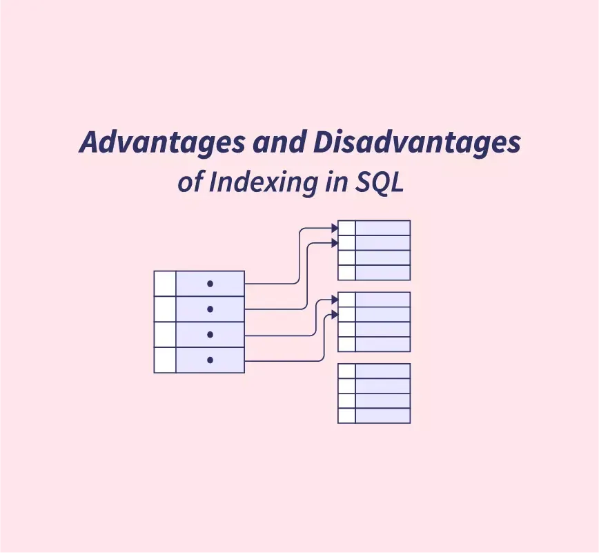

## Table of Contents

## What is an index in a database?

An index in a database is like a table of contents in a book. It helps the database find and retrieve data faster. When you search for something, the index tells the database where to look, so it doesn't have to check every single piece of data.

Indexes are very useful, but they also have some downsides. They take up extra space in the database and can slow down the process of adding, updating, or deleting data. So, it's important to use indexes wisely, only on the data that you search for often.

## How does an index improve query performance?

An index helps make searching in a database faster. Imagine you're looking for a specific word in a big book. Without an index, you'd have to read every page until you find it. But with an index, you can just look at the index page, find the word, and it tells you exactly which pages to check. In a database, the index does the same thing. It keeps a list of where to find certain data, so the database can go straight to that data instead of looking through everything.

However, using an index isn't always perfect. It takes up extra space in the database, like how an index page takes up space in a book. Also, every time you add, change, or remove data, the index needs to be updated too, which can slow things down a bit. So, it's best to use indexes on data that you search for a lot, but not on data that you change often. This way, the benefits of faster searches outweigh the extra work of keeping the index up to date.

## What are the different types of indexes?

There are several types of indexes in databases, each designed for different purposes. One common type is the **primary index**, which is often used to uniquely identify each record in a table. It's like having a special number for each item in a list, so you can find it easily. Another type is the **secondary index**, which helps speed up searches on columns that aren't the primary key. It's like having an extra index in a book for common words or topics.

Another important type is the **clustered index**, which sorts and stores the actual data rows in the order of the index. It's like rearranging the pages of a book so that all the information on a certain topic is grouped together. On the other hand, a **non-clustered index** doesn't change the way the data is stored; it just keeps a separate list of where to find the data, similar to a regular index in a book. Each type of index has its own benefits and trade-offs, so choosing the right one depends on how you use your database.

## Can indexes speed up data retrieval in all scenarios?

Indexes can make finding data faster in many cases, but they don't always speed things up. Imagine you're looking for a word in a book. If you use the index, you can find the word quickly. In a database, if you often search for the same information, an index can help a lot. It tells the database exactly where to look, so it doesn't have to check every piece of data.

However, indexes aren't always helpful. They take up extra space in the database, like how an index page takes up space in a book. Also, every time you add, change, or delete data, the index needs to be updated too, which can slow things down. So, if you're always changing the data, the index might actually make things slower instead of faster. It's best to use indexes on data that you search a lot but don't change often.

## What are the potential drawbacks of using indexes?

Using indexes in a database can make things slower when you add, change, or delete data. Imagine you have a book and every time you add a new page, you also have to update the index. This extra work can slow things down, especially if you're always making changes to the data. So, if your database is constantly being updated, the index might actually make it take longer to do those updates.

Indexes also take up extra space in the database. Think of it like having an extra page in a book just for the index. This can make the database bigger, which might be a problem if you don't have a lot of space. If you use too many indexes or use them on data that you don't search for often, you might end up wasting space without getting much benefit. So, it's important to use indexes wisely and only on the data that you search for a lot.

## How do indexes affect the performance of INSERT, UPDATE, and DELETE operations?

Indexes can slow down INSERT, UPDATE, and DELETE operations in a database. When you add new data with an INSERT, the database not only has to store the new data but also update all the indexes that point to it. This extra work can make the process take longer, especially if you have a lot of indexes. It's like adding a new page to a book and then having to update the index page to show where the new page is.

The same thing happens with UPDATE and DELETE operations. When you change or remove data, the database has to update the indexes to reflect those changes. This means more work for the database, which can slow things down. If your database is constantly being updated or if you have many indexes, this can really affect how quickly you can make changes to your data. So, it's important to think carefully about where to use indexes, making sure they help more than they slow things down.

## What is the impact of indexes on disk space?

Indexes take up extra space on your computer's disk. Imagine you have a book and you add an index page to it. That index page takes up space, just like how indexes in a database need their own space to store information about where to find the data. The more indexes you have, the more space they use. If you have a lot of data and many indexes, this can make your database much bigger.

Using indexes wisely can help balance the need for faster searches with the need to save disk space. If you only use indexes on the data that you search for a lot, you can keep the size of your database from growing too much. But if you use too many indexes or use them on data that you don't search often, you might end up wasting space without getting much benefit. So, it's important to think about how you use your database and use indexes only where they really help.

## How can one determine if an index is beneficial for a specific query?

To figure out if an index will help with a specific query, you need to look at how often you search for that data and how the query works. If you're always searching for the same information, an index can make those searches much faster. It's like using the index in a book to find a word quickly instead of reading every page. But if the query is simple and doesn't need to search through a lot of data, an index might not make much difference.

You also need to think about how often you change the data. If you're always adding, updating, or deleting information, an index can slow things down because it needs to be updated every time the data changes. So, if your query searches for data that you don't change often, an index can be very helpful. But if you're constantly updating the data, the index might not be worth it because it could make the updates slower.

## What are covering indexes and how do they work?

A covering index is like a special kind of index that includes all the data you need for a query, so the database doesn't have to look anywhere else. Imagine you're looking for information in a book. If the index not only tells you where to find the word but also gives you all the details you need right there, you don't have to flip through the pages. That's what a covering index does. It makes the search even faster because everything is right in the index.

Covering indexes are really helpful when you often run the same kind of query. They can make those queries much faster because the database can get all the information it needs from the index without looking at the main data. But, just like any index, they take up extra space and need to be updated when the data changes. So, it's best to use them on queries that you run a lot and on data that doesn't change too often.

## How do composite indexes differ from single-column indexes?

Composite indexes and single-column indexes are two types of indexes in a database. A single-column index is like having an index in a book for just one word. It helps you find data quickly when you're searching based on that one column. For example, if you often search for people by their last name, a single-column index on the last name field can make those searches faster.

A composite index, on the other hand, is like having an index for multiple words together. It's used when you search for data using more than one column at the same time. For instance, if you often look up people by both their last name and first name, a composite index on those two columns can speed up those searches. Composite indexes can be more powerful because they help with complex queries, but they also take up more space and can slow down updates to the data.

## What are the best practices for index maintenance?

Keeping indexes in good shape is important for making your database work well. You should check your indexes regularly to see if they're still helping. Sometimes, as your data changes, an index that used to be useful might not be anymore. You can use tools that come with your database to see how well your indexes are doing. If you find an index that isn't helping much, it might be a good idea to get rid of it to save space and make updates faster.

It's also smart to update your indexes when you change your data a lot. This keeps them working well. If you add a lot of new data, your indexes might get out of date, which can slow down searches. You can use special commands to rebuild or reorganize your indexes, which makes them work better. Remember, using indexes wisely means balancing the need for fast searches with the need to keep your database running smoothly.

## How can index fragmentation affect database performance and how can it be managed?

Index fragmentation can slow down your database. Imagine a book where the pages are out of order. It would take longer to find what you need, right? The same happens with indexes in a database. When you add, change, or delete data often, the index can get split into pieces that are stored in different places on the disk. This makes the database work harder to put the pieces back together when it searches, which can make everything slower.

To manage index fragmentation, you need to keep your indexes tidy. Think of it like rearranging the pages of a book so they're in the right order again. You can use special tools that come with your database to rebuild or reorganize the indexes. Rebuilding an index means making it from scratch, which can take some time but makes it work really well. Reorganizing an index is like cleaning it up a bit, which is quicker but might not fix everything. It's a good idea to do this regularly, especially if you're always changing your data, to keep your database running smoothly.

## What are the disadvantages of indexes and index funds?

Indexes and index funds offer a straightforward approach to investing by mirroring the performance of a specific market segment. However, they come with notable drawbacks that investors need to consider. One significant disadvantage of indexes is their tendency to overweight large-cap stocks. This means that established, larger companies can disproportionately influence the index's performance, overshadowing smaller-cap stocks that might have greater growth potential. For instance, in a capitalization-weighted index, the formula used to determine the index value is:

$$
\text{Index Value} = \sum_{i=1}^{n} (P_i \times Q_i)
$$

where $P_i$ represents the price of stock $i$ and $Q_i$ the quantity of stock $i$. In this system, stocks with a higher market capitalization have a more substantial influence, potentially skewing the representation towards larger firms.

Furthermore, index funds are often criticized for their inflexibility. Unlike actively managed funds, which may adjust investments based on market trends, index funds aim to replicate index movements precisely. This rigid approach can expose investors to the full brunt of market downturns, as there is no active manager to strategically withdraw from declining sectors. For example, during periods of high [volatility](/wiki/volatility-trading-strategies), the lack of adaptability might result in significant drawdowns since index funds follow market movements passively.

Additionally, during volatile market periods, this inflexibility can result in substantial losses. Since these funds are designed to track the index's performance, they have no mechanism to deviate from the declining trajectory. The inability to reposition becomes particularly apparent when the market experiences sharp downturns, as index funds do not possess the capacity for tactical withdrawal or reallocation to mitigate potential losses.

Overall, while index funds provide a cost-effective and simple investment strategy, their inherent disadvantages necessitate careful consideration. Investors need to evaluate whether the passive nature of index funds aligns with their financial goals and risk tolerance.

## References & Further Reading

[1]: ["Algorithmic Trading: Winning Strategies and Their Rationale"](https://books.google.com/books/about/Algorithmic_Trading.html?id=WAlFDwAAQBAJ) by Ernie Chan

[2]: Aldridge, I. (2013). ["High-Frequency Trading: A Practical Guide to Algorithmic Strategies and Trading Systems"](https://www.amazon.com/High-Frequency-Trading-Practical-Algorithmic-Strategies/dp/1118343506). Wiley.

[3]: ["Advances in Financial Machine Learning"](https://www.amazon.com/Advances-Financial-Machine-Learning-Marcos/dp/1119482089) by Marcos Lopez de Prado

[4]: ["Quantitative Trading: How to Build Your Own Algorithmic Trading Business"](https://www.amazon.com/Quantitative-Trading-Build-Algorithmic-Business/dp/1119800064) by Ernest P. Chan

[5]: ["A Random Walk Down Wall Street: The Time-Tested Strategy for Successful Investing"](https://www.amazon.com/Random-Walk-Down-Wall-Street/dp/0393358380) by Burton G. Malkiel