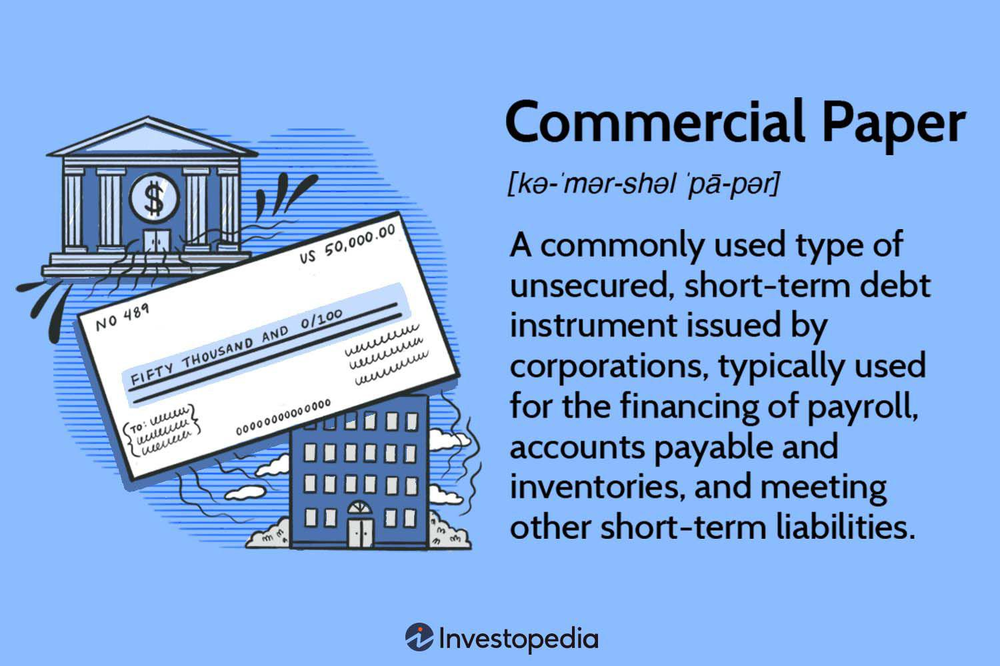

In the fast-paced world of trading, mastering the basics before entering real-world markets is crucial. This article offers insights into trading practice with a specific focus on paper trading, investment strategies, and algorithmic trading. As the majority of trading happens electronically, algorithmic trading has gained significant traction. Understanding these concepts can help you stay ahead in the trading game. 

Algorithmic trading, which involves using computer programs to execute trades at optimal speeds and efficiency, is revolutionizing market dynamics. This shift towards automation demands that traders not only understand traditional trading principles but also how algorithmic strategies can be developed and implemented. With traders increasingly seeking to eliminate emotional biases, algorithms help optimize trade executions and risk management.



Whether you're a beginner eager to grasp the fundamentals or an experienced trader looking to test new strategies, understanding and utilizing these tools can significantly impact your success. For newcomers, paper trading platforms provide an indispensable sandbox environment to build confidence and refine skills without financial risk. They allow traders to simulate buying and selling in financial markets without using actual money and offer an excellent opportunity to practice and evolve strategies. With platforms like TD Ameritrade, E*TRADE, and Interactive Brokers offering sophisticated paper trading functionalities, traders are equipped to handle complex trading scenarios and track performance metrics effectively.

Algorithmic trading not only reduces the human error factor but also enhances trading efficiency through backtesting and optimization in a virtual setup. It offers the opportunity to adapt strategies to changing market conditions without the pressure of immediate financial ramifications. As technology evolves, the tools available for traders expand, necessitating a mindset geared towards continual learning and adaptability.

This article will explore the benefits of paper trading as a training ground for developing effective strategies. It will delve into how traders can leverage technology to enhance their trading outcomes, thereby incorporating these advanced strategies into their routine. By understanding the nuances of both manual and algorithmic trading, readers can adopt a methodical approach that balances strategic insight with technological innovation. By the end of this article, you will have a clear understanding of how to incorporate these strategies into your trading routine, paving the way for a more informed and potentially successful trading experience.

## Table of Contents

## Understanding Paper Trading

Paper trading serves as a critical tool for traders looking to simulate real market conditions without the risk of financial loss. This simulated trading environment allows traders to execute buy and sell transactions using virtual currency, offering a risk-free platform to build confidence and enhance trading skills. The concept of paper trading is particularly beneficial for novice traders who are still getting accustomed to the market dynamics and functionalities of various trading platforms.

Platforms such as TD Ameritrade, E*TRADE, and [Interactive Brokers](/wiki/interactive-brokers-api) provide robust paper trading features, enabling users to engage in a hands-on learning experience. These platforms replicate real-world market conditions, thereby offering traders a comprehensive understanding of market mechanisms before they commit actual funds. These tools are essential for practicing trading strategies, understanding order types, and evaluating trading outcomes without the psychological pressure associated with real money trading.

One of the primary advantages of paper trading is the ability to focus solely on trading strategy without the emotional stress that accompanies live trading. Real-world trading can evoke strong emotional responses, such as fear and greed, which can impact decision-making processes. By practicing in a virtual environment, traders can develop and refine strategies free from emotional influences, thereby cultivating a disciplined approach to trading.

Moreover, paper trading platforms provide traders the opportunity to track various performance metrics, including profit and loss, win rate, and other key indicators. This continual assessment is vital for strategic improvement. For instance, traders can analyze data to identify patterns or discrepancies in their trading methods, refine their techniques based on empirical results, and improve decision-making processes. Such tracking fosters a deeper understanding of the intricacies involved in effective trading, paving the way for more informed real-market transactions.

While paper trading offers an invaluable learning experience, it is vital to acknowledge its limitations. The absence of emotional pressure in paper trading does not replicate the real-world intensity and potential for financial loss, aspects that significantly affect trading decisions. Additionally, paper trading may not expose the trader to hidden costs such as slippage and commissions, factors that can affect profitability in actual trading.

In summary, paper trading is a foundational component in the trader's learning journey. It provides a structured environment to simulate market participation, allowing traders to practice and perfect their strategies. By leveraging the comprehensive tools and features of platforms like TD Ameritrade, E*TRADE, and Interactive Brokers, traders can enhance their understanding and preparedness, laying the groundwork for successful real-world trading endeavors.

## Investment Strategies in Paper Trading

Utilizing paper trading effectively requires the development of robust investment strategies, which may vary widely depending on the trader's goals and risk tolerance. Among the popular strategies are [day trading](/wiki/day-trading-spy), swing trading, and long-term investing. Each strategy involves different time horizons and approaches to market analysis.

### Day Trading
Day trading involves buying and selling financial instruments within the same trading day, taking advantage of small price movements. Traders using this strategy often rely on technical analysis and chart patterns to make quick decisions. Volatility is crucial here, as it provides opportunities for profit. Key day trading methods include [scalping](/wiki/gamma-scalping), which targets minor price gaps following a trade execution.

### Swing Trading
Swing trading is a medium-term strategy where trades are held from a few days to several weeks. The aim is to capture gains from expected upward or downward market shifts. Unlike day traders, swing traders are exposed to overnight and weekend market changes, making this strategy suitable for those who are keen on technical analysis but without the fast-paced demands of day trading. Swing traders often use trend lines, moving averages, and [momentum](/wiki/momentum) indicators to determine optimal entry and [exit](/wiki/exit-strategy) points.

### Long-term Investing
In contrast, long-term investing focuses on holding positions for months or even years, based on [fundamental analysis](/wiki/fundamental-analysis) of a company's financial health and future growth prospects. This strategy is less concerned with short-term market fluctuations and more with underlying economic indicators and business performance. It is suitable for traders who can exercise patience and have a higher tolerance for market [volatility](/wiki/volatility-trading-strategies).

### Structuring a Plan
Whether you're a day trader, swing trader, or long-term investor, it's essential to create a structured trading plan within the paper trading environment. This plan should outline clear objectives, assess personal risk tolerance, and specify precise trading strategies. For example, a day trader might set a goal to increase account equity by 1% daily, while a long-term investor might focus on a 10% annual growth rate.

### Practice Without Financial Risk
Paper trading provides the perfect platform to practice these strategies without financial risk. Through simulation, traders can refine their approaches based on real-time market data, enabling them to prepare more effectively for actual market conditions. By repeatedly applying strategies in paper trading, one can identify weaknesses and iteratively refine techniques.

### Reviewing and Refining Strategies
Regularly reviewing and refining strategies based on performance metrics like profit and loss, win rate, and risk-to-reward ratios is crucial. This iterative process helps traders enhance their skills, adapt to changing market conditions, and maximize potential returns. For example, an analysis of swing trades over several months might reveal a consistent pattern of losing trades during specific market conditions, prompting a reassessment of the indicators used for those scenarios.

### Practical Example
Consider a trader developing a Python script to automate stock selection based on historical price patterns. The script could backtest different strategies by accessing historical data, executing trades when predefined criteria are met. Here is a simple example of how this might be structured:

```python
import pandas as pd

def backtest_strategy(data, buy_threshold, sell_threshold):
    buy_signals = (data['Moving_Average'] < buy_threshold)
    sell_signals = (data['Moving_Average'] > sell_threshold)

    holdings = 0
    balance = 0

    for i in range(1, len(data)):
        if buy_signals[i] and holdings == 0:
            holdings = data['Close'][i]
        elif sell_signals[i] and holdings > 0:
            balance += data['Close'][i] - holdings
            holdings = 0

    return balance

# Example dataframe setup
data = pd.DataFrame({'Close': [...], 'Moving_Average': [...]})
profit = backtest_strategy(data, buy_threshold=100, sell_threshold=150)
```

This [backtesting](/wiki/backtesting) setup allows the trader to simulate different buy/sell thresholds, analyze the results, and refine the strategy before attempting live trading.

By exploring these varied strategies in a paper trading context, traders can cultivate a deeper understanding of market dynamics and optimize their trading plans to enhance the likelihood of success when transitioning to real-world trading.

## Incorporating Algorithmic Trading

Algorithmic trading, defined as the execution of trades using pre-programmed software to make decisions, analyze data, and trade at high speeds and volumes, is increasingly prevalent in modern financial markets. This trading method utilizes mathematical models to determine trading decisions and execute them at speeds typically unimaginable by human traders. Various algorithms exist, each designed to capitalize on different strategies or patterns observed in market data.

One significant advantage of incorporating [algorithmic trading](/wiki/algorithmic-trading) within the trading practice is the capability to backtest trading algorithms. Backtesting involves applying a trading strategy or algorithm to historical data to assess its viability without risking actual capital. By conducting these tests in a paper trading environment, traders can explore how algorithms would have performed under different historical market conditions. This process not only helps identify the efficacy and reliability of the algorithm but also highlights any potential adjustments needed to optimize performance.

For traders aiming to gain an edge, understanding and deploying algorithms can translate into more efficient and effective trading operations. Algorithms can be used for a range of functions, such as exploiting market inefficiencies, leveraging statistical [arbitrage](/wiki/arbitrage), and managing large orders without substantially affecting market prices. In particular, high-frequency trading ([HFT](/wiki/high-frequency-trading-strategies)), a subset of algorithmic trading, uses algorithms to execute thousands, or even millions of orders across markets and exchanges in seconds.

Both novice traders and seasoned professionals can integrate algorithmic trading into their broader trading strategy to maximize gains. Beginners should start by familiarizing themselves with Python or other programming languages commonly used in quantitative finance, along with understanding basic algorithmic constructs and the financial metrics driving algorithmic decisions. There are educational resources and platforms like QuantConnect, Alpaca, and Interactive Brokers providing frameworks and APIs to develop, test, and execute algorithms.

For those already proficient in algorithmic trading, enhancing strategies to include [machine learning](/wiki/machine-learning) techniques or expanding to multi-asset algorithms could offer additional advantages. Utilizing machine learning can help in adapting to new market conditions by learning from the data over time and improving algorithm robustness.

To get started with algorithmic trading, a practical step is employing user-friendly software tools that assist in the development and execution of algorithms. Python, due to its simplicity and the rich ecosystem of data analysis libraries such as NumPy, pandas, and scikit-learn, is highly recommended for algorithm development. Below is an example of a simple momentum trading strategy implemented in Python:

```python
import pandas as pd

# Load historical market data
data = pd.read_csv('historical_prices.csv')

# Calculate moving average for momentum
data['MA10'] = data['Close'].rolling(window=10).mean()

# Generate trading signals
data['Signal'] = 0
data.loc[data['Close'] > data['MA10'], 'Signal'] = 1
data.loc[data['Close'] < data['MA10'], 'Signal'] = -1

print(data[['Close', 'MA10', 'Signal']].tail())
```

This code snippet illustrates a basic moving average crossover strategy where stock prices are compared against a 10-day moving average to generate buy and sell signals. As traders gain experience, these algorithms can be made more complex to include various technical indicators and signals.

In conclusion, algorithmic trading offers a powerful suite of tools for modern traders. Through backtesting and integration with paper trading frameworks, traders can enhance their strategies and potentially increase their profitability, all while refining their understanding of market dynamics through strategic deployment of technology.

## Pros and Cons of Paper Trading

Paper trading offers aspiring traders an invaluable opportunity to hone their skills and test trading strategies in a simulated market environment, free from any financial risk. One of its primary advantages lies in the ability to experiment with different trading strategies, such as day trading or swing trading, without the fear of losing money. This risk-free testing ground helps build confidence as traders navigate the complexities of the financial market. By practicing in a controlled setting, traders can also become proficient in utilizing trading platforms and tools, refining their technical and analytical skills before committing actual capital to the market.

Despite its benefits, paper trading has inherent limitations that must be acknowledged. While it provides a practical platform to test strategies, it often fails to account for emotional factors that are intrinsic to live trading environments. Traders might find it easier to stick to their plans when their finances are not on the line, leading to a potential discrepancy in behavior between simulated and real-world trading scenarios. Additionally, paper trading does not typically [factor](/wiki/factor-investing) in hidden costs like slippage, where the execution price may differ from the expected price, and commissions, which can affect the profitability of a trading strategy.

To maximize the effectiveness of paper trading, it is essential to bridge the gap between simulated and real trading experiences. Realism can be introduced by considering hypothetical slippage and commission scenarios during practice trades. Moreover, incorporating emotional self-awareness can also help prepare for the psychological pressures of live trading. Traders must strive to emulate real-world trading conditions by setting realistic financial limits within the simulated environment and treating the practice with the same seriousness as actual trading. By acknowledging both the advantages and limitations of paper trading, traders can better prepare for the transition from simulation to live trading and enhance their overall trading proficiency.

## Tips for Effective Paper Trading

To maximize the benefits of paper trading, it is essential to approach it with the same seriousness and discipline as one would with real trading. A strategic, methodical approach to paper trading not only aids in skill development but also prepares traders for the psychological and practical aspects of real-world trading.

One effective strategy for optimizing paper trading is to maintain a detailed trading journal. This journal should include comprehensive records of all trading decisions, strategies employed, and emotional responses experienced during the trading process. By documenting these elements, traders can reflect on and analyze their performance, identifying areas of strength and opportunities for improvement. Over time, this continuous feedback loop fosters self-awareness and strategic refinement.

Another crucial aspect is to limit trades to the financial amounts anticipated for use in actual trading scenarios. This practice reinforces realism and discipline in the simulated environment, ensuring that traders do not develop unrealistic expectations based on unconstrained trading. It allows for a more authentic learning experience by mirroring the financial constraints and considerations present in real markets.

Regularly reviewing and analyzing trading results is fundamental to adjusting strategies and preparing for real trading challenges. By evaluating performance metrics such as profit and loss, win rates, and risk management outcomes, traders can fine-tune their approaches and better align with their financial goals. This iterative process of analysis and adjustment enhances preparedness for live market conditions.

Establishing a consistent routine of regular practice is vital to achieving significant improvements in trading capabilities. Routine practice solidifies new skills and strategies, helping traders internalize and automatize decision-making processes. Consistent engagement with paper trading ensures that traders remain agile and responsive to evolving market dynamics and emerging opportunities.

In conclusion, by treating paper trading with the rigor and focus of real trading, recording detailed insights and reflections, adhering to realistic trade sizes, systematically reviewing trading outcomes, and practicing consistently, traders can effectively harness paper trading as a powerful tool for growth and development in the world of trading.

## The Bottom Line

Trading practice through paper trading platforms serves as a fundamental tool for both novice and experienced traders seeking to solidify their understanding of market dynamics without the immediate pressures of financial risk. By integrating paper trading into one's trading regimen, individuals can not only test and improve their strategic planning but also explore algorithmic trading techniques. The combination of these elements lays a robust groundwork for informed and potentially successful trading.

Strategic thinking is a critical component that paper trading fosters. The ability to construct, evaluate, and adjust strategies with no financial hazards allows traders to develop a disciplined approach to decision-making. This risk-free environment is ideal for experimenting with various trading methodologies, whether it be day trading, swing trading, or long-term investments. Regular reflection on these strategies enhances foresight and preparedness for real market conditions. Moreover, by simulating algorithmic trading within paper trading platforms, traders can test the viability of their algorithms, ensuring they are optimized for efficiency and accuracy before deploying them in live markets.

In parallel to strategic prowess, psychological preparation forms another vital facet of successful trading. When transitioning from paper to real-world trading, the emotional challenges can be profound. While paper trading may not perfectly replicate these psychological pressures, it offers an opportunity for traders to build resilience and emotional intelligence. Recognizing the emotional aspects tied to trading decisions and outcomes through simulated environments helps in crafting mental fortitude necessary for navigating actual market volatilities.

In embracing paper trading as a continual learning process, traders open themselves to ongoing improvement and adaptation. The regular review and refinement of strategies within this risk-free space can lead to substantial developments in trading skills. Establishing a disciplined routine and keeping a detailed journal of trades, decisions, and emotional responses further enhances the learning experience, allowing traders to make data-driven adjustments.

Future traders can harness these insights to reduce the learning curve traditionally associated with trading. By leveraging paper trading platforms to practice, strategize, and psychologically prepare, traders set themselves on a path toward more comprehensive and informed trading practices. This holistic preparation entails not only a grasp of technical strategy and market analysis but also a deeper understanding of one's emotional responses to trading situations.

In conclusion, the value of paper trading as a foundational practice in the world of trading cannot be overstated. Its role in fostering strategic planning, algorithmic testing, and psychological readiness marks it as an indispensable tool for those aiming to thrive in the competitive and ever-evolving financial markets.

## References & Further Reading

[1]: Bergstra, J., Bardenet, R., Bengio, Y., & Kégl, B. (2011). ["Algorithms for Hyper-Parameter Optimization."](https://papers.nips.cc/paper/4443-algorithms-for-hyper-parameter-optimization) Advances in Neural Information Processing Systems 24.

[2]: ["Advances in Financial Machine Learning"](https://www.amazon.com/Advances-Financial-Machine-Learning-Marcos/dp/1119482089) by Marcos Lopez de Prado

[3]: ["Evidence-Based Technical Analysis: Applying the Scientific Method and Statistical Inference to Trading Signals"](https://www.amazon.com/Evidence-Based-Technical-Analysis-Scientific-Statistical/dp/0470008741) by David Aronson

[4]: ["Machine Learning for Algorithmic Trading"](https://github.com/stefan-jansen/machine-learning-for-trading) by Stefan Jansen

[5]: ["Quantitative Trading: How to Build Your Own Algorithmic Trading Business"](https://www.amazon.com/Quantitative-Trading-Build-Algorithmic-Business/dp/1119800064) by Ernest P. Chan