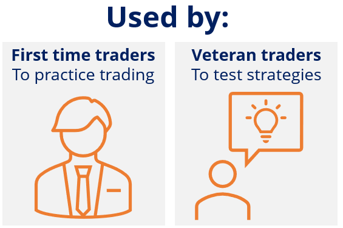

## Table of Contents

## What is paper trading?

Paper trading is when you pretend to buy and sell stocks or other investments without using real money. It's like a practice game where you can learn how the stock market works without risking any of your own money. You keep track of your pretend trades on paper or using a computer program, and you see how much money you would have made or lost if you had used real money.

People use paper trading to learn about investing and to practice their trading strategies. It's a safe way to get familiar with the stock market and to test out different ideas before you start using real money. It can also help you build confidence in your ability to make good investment decisions.

## How does paper trading work?

Paper trading works by letting you pretend to buy and sell stocks or other investments without using real money. You start by choosing a pretend amount of money to use, like $10,000. Then, you pick stocks or other investments you want to buy and decide how many shares to buy. You keep track of these pretend trades on paper or using a computer program. When the price of the stocks changes, you update your records to see how much your pretend portfolio is worth.

As you keep trading, you see how much money you would have made or lost if you had used real money. This helps you learn about the stock market and how different investments work. You can try out different strategies and see what works best without any risk. Paper trading is a great way to practice and build confidence before you start investing with real money.

## What are the basic advantages of paper trading for beginners?

Paper trading is a great way for beginners to learn about investing without losing any money. It lets you practice buying and selling stocks or other investments using pretend money. This means you can try out different strategies and see what works without any risk. It's like playing a game where you can learn the rules and get better at it before you start playing for real.

Another advantage is that paper trading helps you get familiar with the stock market. You can see how stock prices move up and down and learn how to read charts and other information. This can make you feel more confident when you start investing with real money. It's a safe way to practice and build your skills before you take the plunge into real investing.

## Can paper trading help in understanding market trends?

Yes, paper trading can help you understand market trends. When you pretend to buy and sell stocks, you watch how the prices go up and down. This helps you see patterns in how the market moves. You can learn about things like how certain news or events affect stock prices, or how stocks move together in different ways.

By keeping track of your pretend trades, you can also see how different strategies work with market trends. For example, you might try to buy stocks that are going up and sell them when they start to go down. Or you might try to buy stocks that are going down, thinking they will go back up later. Paper trading lets you practice these strategies and see how well they work with the ups and downs of the market.

## What are the limitations of paper trading for novice traders?

Paper trading is a good way for novice traders to practice without losing real money, but it has some limitations. One big limitation is that it doesn't feel the same as trading with real money. When you use real money, you feel more stress and emotion, which can affect your decisions. In paper trading, you might take more risks or not feel the same pressure to make good choices because you're not losing anything.

Another limitation is that paper trading can't fully show you how the market really works. Sometimes, the pretend trades you make might not match up perfectly with what's happening in the real market. This can happen because of delays in the data or because the pretend trading platform doesn't work exactly like the real market. So, even though paper trading helps you learn, it's not the same as trading for real.

Overall, while paper trading is a useful tool for beginners to learn and practice, it's important to remember its limitations. It can't fully prepare you for the emotional and practical challenges of trading with real money. So, when you start trading for real, you might find it different and more challenging than what you experienced in paper trading.

## How can paper trading affect a trader's psychology?

Paper trading can affect a trader's psychology because it doesn't have the same emotional impact as trading with real money. When you're using pretend money, you might take bigger risks or make decisions without feeling the same pressure. This can make you feel overconfident or think that trading is easier than it really is. But when you start using real money, the fear of losing it can make you feel stressed and anxious, which can lead to different decisions than you made in paper trading.

Also, paper trading can give you a false sense of security. Since you're not losing anything, you might not feel the same urgency to learn from your mistakes or to stick to a good trading plan. This can make it hard to develop the discipline you need for real trading. When you start trading with real money, you might find it harder to stay calm and stick to your strategies because the emotions are stronger and the consequences are real.

## What advanced strategies can be tested using paper trading?

Paper trading lets you test advanced strategies like options trading without risking real money. Options are contracts that give you the right to buy or sell a stock at a certain price. You can practice different options strategies, like buying calls or puts, or using more complex strategies like spreads and straddles. This helps you see how these strategies work in different market conditions and helps you understand the risks and rewards without any real financial loss.

Another advanced strategy you can test is [algorithmic trading](/wiki/algorithmic-trading). This is when you use computer programs to make trading decisions based on set rules. You can write and test these programs in a paper trading environment to see how well they work. This can help you fine-tune your algorithms and see how they perform over time without the risk of losing money. It's a great way to learn about and improve your algorithmic trading skills before you start using them with real money.

Lastly, you can practice swing trading, which involves holding stocks for a few days to a few weeks to take advantage of price movements. Paper trading lets you try different entry and [exit](/wiki/exit-strategy) points, and see how different indicators and patterns affect your trades. This can help you develop a solid swing trading strategy and understand how to manage your trades effectively, all without the pressure of real money.

## How accurate is paper trading in simulating real market conditions?

Paper trading is a good way to learn about the stock market without using real money, but it can't copy the real market perfectly. One reason is that paper trading uses pretend money, so you might take bigger risks or not feel the same stress as you would with real money. This can make you think that trading is easier than it really is. Also, the data in paper trading might not be exactly the same as the real market because of delays or differences in how the platform works.

Even though paper trading has some limits, it's still very useful for practicing and learning. You can try different trading strategies and see how they work over time without losing any money. This helps you get better at understanding how the market moves and how to make smart trading decisions. But remember, when you start trading with real money, it might feel different because the emotions and risks are real, and the market might not behave exactly like it did in your paper trading.

## What are the potential pitfalls of over-relying on paper trading?

Over-relying on paper trading can make you feel too confident. When you're using pretend money, you might take bigger risks because you're not scared of losing anything. This can make you think that trading is easier than it really is. But when you start using real money, the fear of losing it can make you feel stressed and anxious. This can lead to different decisions than the ones you made in paper trading. So, if you rely too much on paper trading, you might not be ready for the real emotions and pressures of trading with real money.

Another problem with over-relying on paper trading is that it doesn't always show the real market perfectly. Sometimes, the data in paper trading might be a bit off because of delays or how the platform works. This can make your pretend trades not match up exactly with what's happening in the real market. If you depend too much on paper trading, you might not fully understand how the real market works. So, when you start trading for real, it might be harder than you expected because the real market can be different from what you practiced.

## How can experienced traders use paper trading to refine their skills?

Experienced traders can use paper trading to test new strategies without risking real money. They might want to try out new ways of trading, like using different indicators or trying new types of investments like options. Paper trading lets them see how these new strategies work over time. They can make changes and see what works best without losing any money. This helps them learn and improve their skills without the stress of real trading.

Another way experienced traders can use paper trading is to practice managing their emotions. Even though paper trading doesn't feel the same as using real money, it can still help them practice sticking to their trading plan. They can work on staying calm and making good decisions, even when the market moves in unexpected ways. This can help them build the discipline they need for real trading, where emotions can make things harder.

Lastly, paper trading can help experienced traders keep up with the market. The stock market is always changing, and new trends and technologies can affect how it works. By using paper trading, experienced traders can stay sharp and adapt to these changes. They can try out new tools and see how they work in different market conditions. This helps them stay ready for whatever the real market throws at them.

## What are the technological tools available for effective paper trading?

There are many technological tools that can help you with paper trading. One popular tool is a trading simulator, which is a computer program that lets you pretend to buy and sell stocks or other investments. These simulators often look and work a lot like real trading platforms, so you can practice in a way that feels close to the real thing. Some well-known trading simulators are offered by companies like Thinkorswim by TD Ameritrade and [Interactive Brokers](/wiki/interactive-brokers-api). These tools let you set up a pretend account with fake money and trade just like you would with real money.

Another helpful tool is a mobile app for paper trading. Apps like Investopedia and TradeStation let you practice trading on your phone or tablet. This is great because you can practice anytime, anywhere. These apps often have easy-to-use interfaces and can give you real-time market data, so you can see how your pretend trades would work in the current market. They also let you try out different strategies and see how they work over time.

Lastly, there are online platforms and websites that offer paper trading features. For example, platforms like eToro and Robinhood have paper trading options where you can practice trading without using real money. These platforms often have educational resources and community features, so you can learn from other traders and get tips on how to improve your skills. Using these technological tools can make paper trading more effective and help you learn more about the stock market.

## How does paper trading compare to other forms of trading simulation for experts?

Paper trading is one way for experts to practice trading without using real money. It lets them pretend to buy and sell stocks or other investments and see how their strategies work over time. This is helpful because they can try out new ideas and see how they work without any risk. But paper trading might not feel the same as real trading because there's no real money on the line. This can make it hard for experts to practice managing their emotions and sticking to their trading plans in the same way they would with real money.

Another form of trading simulation for experts is using a trading simulator, which is a computer program that acts more like a real trading platform. These simulators can give a more accurate picture of the market because they use real-time data and can show more of the real market's ups and downs. Experts might find these simulators more useful for testing complex strategies like options trading or algorithmic trading. But like paper trading, simulators still don't have the same emotional impact as real trading, so experts need to be careful not to rely too much on them and forget about the real pressures of the market.

## References & Further Reading

[1]: Bergstra, J., Bardenet, R., Bengio, Y., & Kégl, B. (2011). ["Algorithms for Hyper-Parameter Optimization."](https://papers.nips.cc/paper/4443-algorithms-for-hyper-parameter-optimization) Advances in Neural Information Processing Systems 24.

[2]: ["Advances in Financial Machine Learning"](https://www.amazon.com/Advances-Financial-Machine-Learning-Marcos/dp/1119482089) by Marcos Lopez de Prado

[3]: ["Evidence-Based Technical Analysis: Applying the Scientific Method and Statistical Inference to Trading Signals"](https://www.amazon.com/Evidence-Based-Technical-Analysis-Scientific-Statistical/dp/0470008741) by David Aronson

[4]: ["Machine Learning for Algorithmic Trading"](https://github.com/stefan-jansen/machine-learning-for-trading) by Stefan Jansen

[5]: ["Quantitative Trading: How to Build Your Own Algorithmic Trading Business"](https://www.amazon.com/Quantitative-Trading-Build-Algorithmic-Business/dp/1119800064) by Ernest P. Chan