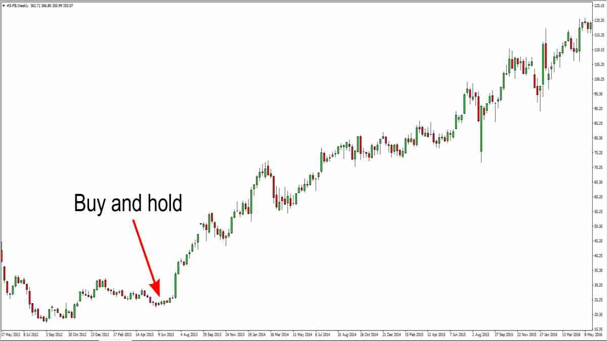

## Table of Contents

## What is a passive buy and hold strategy?

A passive buy and hold strategy is a simple way to invest in the stock market. Instead of trying to guess which stocks will go up or down, you pick a mix of investments and keep them for a long time. This could be stocks, bonds, or funds that track the whole market. The idea is to not worry about short-term changes in the market and instead focus on long-term growth.

This strategy is popular because it's easy to follow and doesn't need much work after you set it up. You don't have to watch the market every day or make quick decisions. Over many years, the market usually goes up, so holding onto your investments can lead to good returns. It's a way to grow your money without the stress of trying to time the market.

## How does a passive buy and hold strategy differ from active trading?

A passive buy and hold strategy is all about keeping things simple and long-term. You choose your investments, like stocks or funds, and then you hold onto them for many years. You don't worry about what the market is doing every day. The idea is that over time, the market grows, and so do your investments. It's a low-stress way to invest because you're not trying to guess when to buy or sell based on short-term changes.

On the other hand, active trading is like the opposite. People who do active trading are always watching the market and trying to make quick decisions. They buy and sell stocks often, hoping to make money from small changes in prices. It can be exciting but also stressful and risky. Active traders need to spend a lot of time and effort to try and beat the market, which isn't easy to do.

So, the main difference is in how much you do and how you think about time. Passive buy and hold is about patience and long-term growth, while active trading is about quick moves and trying to outsmart the market in the short term.

## What are the basic advantages of using a passive buy and hold strategy for beginners?

For beginners, using a passive buy and hold strategy is great because it's easy to understand and follow. You don't need to know a lot about the stock market to start. All you do is pick some good investments, like a mix of stocks or funds, and then you just keep them for a long time. This means you don't have to spend a lot of time watching the market every day or trying to figure out when to buy or sell. It's less stressful because you're not trying to guess what will happen next in the market.

Another advantage is that this strategy can lead to good growth over time. The stock market usually goes up over many years, so if you hold onto your investments, they can grow a lot. This means you might see your money grow without having to do much work after you've set everything up. It's a simple way to build wealth over the long term, which is perfect for beginners who are just starting to invest.

## Can you explain the concept of compound interest in relation to a buy and hold strategy?

Compound interest is like magic for your money when you use a buy and hold strategy. It means that the money you earn from your investments starts to earn money too. Imagine you put some money into a stock or a fund. Over time, that money grows a little bit. With compound interest, you don't just take out the growth; you leave it in. So, the next time your investment grows, it's not just growing on the money you started with, but also on the money you've already earned. This makes your money grow faster and faster the longer you hold onto your investments.

This is why a buy and hold strategy can be so powerful. When you keep your money invested for many years, compound interest has more time to work its magic. You might not see huge changes from year to year, but over ten, twenty, or thirty years, the growth can be amazing. It's all about being patient and letting your money grow on its own. So, if you're a beginner, a buy and hold strategy with compound interest can help you build wealth without having to do much after you've set it up.

## What are the potential risks and disadvantages of a passive buy and hold approach?

One big risk of a passive buy and hold approach is that the market can go down. If you're holding onto your investments and the market drops a lot, you could lose money. It might take a long time for the market to go back up, and if you need your money before then, you could be in a tough spot. Also, if you pick the wrong investments at the start, they might not grow as much as you hoped, or they might even lose value.

Another disadvantage is that this strategy can be hard to stick with when things get tough. It's easy to feel worried and want to sell your investments when the market goes down. But if you do that, you might miss out on the recovery when the market goes back up. Plus, holding onto investments for a long time means you're not taking advantage of any new opportunities that come up. If new, better investments appear, you might miss out on them because you're sticking with what you already have.

So, while a passive buy and hold strategy can be simple and effective, it's not perfect. You need to be ready to handle market ups and downs, and you have to be patient. If you can do that, it can work well, but it's important to understand these risks before you start.

## How does market volatility affect a passive buy and hold strategy?

Market [volatility](/wiki/volatility-trading-strategies) means the market can go up and down a lot in a short time. For someone using a passive buy and hold strategy, this can be scary. When the market drops, it might look like you're losing money. But the key to this strategy is to not worry about these short-term changes. If you keep your investments for a long time, the market usually goes back up. So, even though it can be hard to watch your investments go down, the idea is to stay calm and not sell them.

The good thing about a passive buy and hold strategy during volatile times is that you don't have to do anything. You don't need to try to guess when the market will go up or down. You just hold onto your investments and wait for the market to recover. Over many years, the ups and downs tend to even out, and your investments can grow. So, while market volatility can be tough to handle emotionally, sticking with your strategy can still lead to good results in the long run.

## What role does diversification play in a passive buy and hold investment portfolio?

Diversification is like spreading your money around in different places instead of putting it all in one spot. When you use a passive buy and hold strategy, you want to pick a mix of investments, like stocks, bonds, or funds that track different parts of the market. This way, if one part of the market goes down, you won't lose all your money because other parts might still be doing okay. It's like not putting all your eggs in one basket.

By having a diversified portfolio, you make your investments safer over the long run. If you only had one type of investment and it did badly, you could lose a lot. But with different kinds of investments, the good ones can help balance out the bad ones. This helps you stick with your buy and hold strategy even when the market is up and down, because you know your money is spread out and safer.

## How can tax implications influence the effectiveness of a buy and hold strategy?

Taxes can make a big difference in how well your buy and hold strategy works. When you sell your investments, you might have to pay taxes on any money you made. But if you hold onto your investments for a long time, you might pay less in taxes. In many places, if you keep an investment for more than a year before selling it, you get a special lower tax rate on the profit. This is called a long-term capital gains tax. So, by holding onto your investments, you can save money on taxes, which means more money stays in your pocket.

On the other hand, if you're always buying and selling, you might end up paying more in taxes. This is because short-term capital gains, which are profits from investments you held for less than a year, are usually taxed at a higher rate. So, if you're trying to save on taxes, sticking with a buy and hold strategy can be a smart move. It lets you take advantage of lower tax rates and keep more of your investment growth.

## What historical data supports the effectiveness of a passive buy and hold strategy?

Historical data shows that a passive buy and hold strategy can work well over time. If you look at the stock market, like the S&P 500, it has gone up a lot over the last 50 or 100 years. Even though there have been some big drops, like during the Great Depression or the 2008 financial crisis, the market always came back and kept growing. People who held onto their investments through these tough times ended up making a lot of money in the long run. This shows that if you can be patient and not sell when the market goes down, your investments can grow a lot over many years.

Another example is looking at how index funds have done. These are funds that just try to match the performance of the whole market. Over the last few decades, many studies have shown that most actively managed funds, where someone is trying to pick the best stocks, don't do as well as these simple index funds. This means that just holding onto a broad mix of investments, like an index fund, can be a good way to grow your money without trying to guess which stocks will do the best. So, history tells us that a buy and hold strategy can be a smart way to invest if you're willing to wait and not worry about short-term ups and downs.

## How do economic cycles impact the performance of a buy and hold strategy?

Economic cycles are the ups and downs that happen in the economy over time. These cycles can affect how well a buy and hold strategy works. When the economy is doing well, like during a boom, the stock market usually goes up too. This means your investments can grow a lot. But when the economy is not doing so well, like during a recession, the stock market might go down. This can make it look like you're losing money. But the key to a buy and hold strategy is to keep your investments for a long time, through these ups and downs.

Even though economic cycles can make the market go up and down, history shows that the market usually goes back up after a downturn. If you hold onto your investments through these tough times, you can still see good growth in the long run. It's all about being patient and not selling your investments when the market goes down. Over many years, the ups and downs of economic cycles tend to even out, and your investments can grow a lot. So, while economic cycles can make things a bit bumpy along the way, they don't change the fact that a buy and hold strategy can work well if you stick with it.

## What advanced strategies can be employed to optimize a passive buy and hold approach?

One way to make a passive buy and hold strategy even better is by using dollar-cost averaging. This means you put money into your investments at regular times, like every month, instead of all at once. By doing this, you buy more shares when prices are low and fewer when prices are high. Over time, this can help you pay less for your investments on average, which can lead to more growth. It's a simple way to smooth out the ups and downs of the market and make your strategy work better.

Another strategy is to rebalance your portfolio now and then. This means you check your investments and make sure they still match the mix you want, like a certain amount in stocks and a certain amount in bonds. If one part of your portfolio has grown more than the others, you might sell some of it and buy more of the parts that haven't grown as much. This keeps your investments balanced and can help you take advantage of different parts of the market over time. It's a way to keep your strategy on track without changing it too much.

## How can an investor adjust a passive buy and hold strategy in response to significant market changes?

When big changes happen in the market, like a big drop or a big rise, an investor might need to make some small changes to their passive buy and hold strategy. One way to do this is by rebalancing their portfolio. This means they look at their investments and make sure they still have the right mix of stocks, bonds, or other things they wanted at the start. If one part of their portfolio has grown a lot more than the others, they might sell some of it and buy more of the parts that haven't grown as much. This keeps their investments balanced and can help them stay on track with their long-term plan.

Another way to adjust is by using dollar-cost averaging. Instead of putting all their money into investments at once, they can put in a little bit at regular times, like every month. This way, they buy more shares when prices are low and fewer when prices are high. Over time, this can help them pay less for their investments on average, which can lead to more growth. Even with big market changes, sticking to a regular investment schedule can smooth out the ups and downs and keep their strategy working well.

These adjustments don't mean they're changing their whole strategy. They're still holding onto their investments for the long term. But by making these small changes, they can make sure their portfolio stays strong and keeps growing, no matter what's happening in the market.

## References & Further Reading

[1]: Bergstra, J., Bardenet, R., Bengio, Y., & Kégl, B. (2011). ["Algorithms for Hyper-Parameter Optimization."](https://dl.acm.org/doi/10.5555/2986459.2986743) Advances in Neural Information Processing Systems 24.

[2]: ["Advances in Financial Machine Learning"](https://www.amazon.com/Advances-Financial-Machine-Learning-Marcos/dp/1119482089) by Marcos Lopez de Prado

[3]: ["Evidence-Based Technical Analysis: Applying the Scientific Method and Statistical Inference to Trading Signals"](https://www.amazon.com/Evidence-Based-Technical-Analysis-Scientific-Statistical/dp/0470008741) by David Aronson

[4]: ["Machine Learning for Algorithmic Trading"](https://github.com/stefan-jansen/machine-learning-for-trading) by Stefan Jansen

[5]: ["Quantitative Trading: How to Build Your Own Algorithmic Trading Business"](https://github.com/LucindaYa/quant-resources/blob/master/Quantitative%20Trading%20How%20to%20Build%20Your%20Own%20Algorithmic%20Trading%20Business.pdf) by Ernest P. Chan