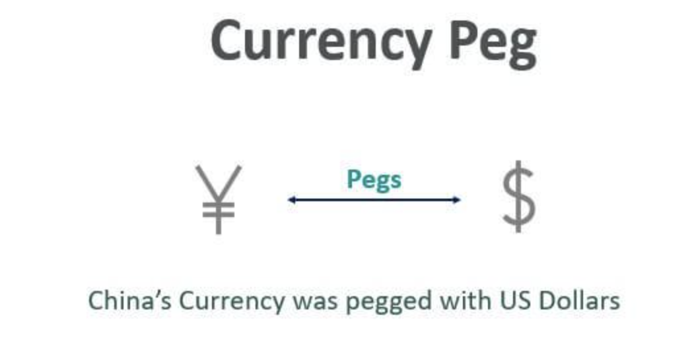

## Table of Contents

## What is a pegged exchange rate?

A pegged exchange rate is when a country decides to fix its currency's value to another currency or a basket of currencies. This means that the country's central bank will buy and sell its own currency to keep its value steady compared to the other currency. For example, if a country pegs its currency to the US dollar, it will make sure that its currency does not go up or down too much against the dollar.

Countries use a pegged exchange rate to make trade and investments easier and more predictable. When a currency is pegged, businesses know how much their money is worth in another country, which can help them plan better. However, keeping a currency pegged can be hard work for the central bank, especially if there are big changes in the global economy. If the central bank cannot keep the peg, it might have to let the currency float freely or change the peg to a different rate.

## How does a pegged exchange rate work?

A pegged exchange rate is when a country decides to keep its money's value the same as another country's money. For example, if a country pegs its currency to the US dollar, it means they want their money to always be worth the same amount of US dollars. To do this, the country's central bank will buy and sell its own money. If their money starts to be worth less than the US dollar, the central bank will buy its own money with US dollars to make its value go up. If their money starts to be worth more than the US dollar, the central bank will sell its own money for US dollars to make its value go down.

The reason countries use a pegged exchange rate is to make buying and selling things with other countries easier. When a country's money is pegged, businesses know exactly how much their money is worth in another country. This makes it easier for them to plan and do business. However, keeping the money pegged can be hard for the central bank. If there are big changes in the world's economy, it can be tough to keep the money's value the same. If the central bank can't keep the peg, they might have to let the money's value change freely or change the peg to a different rate.

## What are the main types of pegged exchange rates?

There are two main types of pegged exchange rates: fixed pegs and crawling pegs. A fixed peg is when a country decides to keep its currency's value the same as another currency, like the US dollar. The central bank will buy and sell its own currency to make sure it stays at the same value. This type of peg is used to make trade and investments easier because businesses know exactly how much their money is worth in another country.

A crawling peg is a bit different. Instead of keeping the currency's value the same all the time, the country lets the value change slowly over time. The central bank will still buy and sell its currency, but it will let the value go up or down a little bit each day or each month. This type of peg is used when a country wants to slowly change the value of its currency without making big sudden changes. It can help the country adjust to changes in the economy more smoothly.

## What are the advantages of a pegged exchange rate for a country's economy?

A pegged exchange rate can make trade and investments easier for a country. When a country's money is pegged to another currency, businesses know exactly how much their money is worth in that other country. This makes it easier for them to plan and do business because they don't have to worry about the money's value changing a lot. For example, if a country pegs its currency to the US dollar, businesses in that country know exactly how many dollars they will get for their money, which helps them make better decisions about buying and selling things.

Another advantage of a pegged exchange rate is that it can help keep prices stable in the country. When the value of the money stays the same, it can help keep the prices of things like food and clothes from going up too fast. This can make people feel more confident about the economy because they know what to expect. It can also make the country look more reliable to other countries, which can attract more investment and help the economy grow.

## Can you provide examples of countries that use pegged exchange rates?

Some countries peg their money to another country's money. For example, Hong Kong pegs its currency, the Hong Kong dollar, to the US dollar. They have been doing this since 1983. This means that the Hong Kong dollar's value stays the same as the US dollar's value. This makes it easier for businesses in Hong Kong to trade with the United States because they know exactly how much their money is worth in dollars.

Another example is Saudi Arabia. They peg their currency, the Saudi riyal, to the US dollar too. They have been doing this since 2003. This helps Saudi Arabia because a lot of their trade and investments are with the United States. By pegging their currency to the US dollar, they make it easier for businesses in Saudi Arabia to plan and do business with the US.

There are other countries that use different types of pegs. For example, China used to peg its currency, the yuan, to the US dollar, but now they use a different type of peg called a managed float. This means they let the value of the yuan change a little bit each day, but they still control it to keep it stable. This helps China keep their economy steady and makes it easier for them to trade with other countries.

## What are the potential disadvantages of maintaining a pegged exchange rate?

Maintaining a pegged exchange rate can be tough for a country. It requires the central bank to always be ready to buy and sell its own money to keep the value steady. This can use up a lot of the country's money reserves. If the central bank runs out of money, it might not be able to keep the peg, and the currency's value could change suddenly. This can make people lose trust in the country's money and cause problems for the economy.

Another problem with a pegged exchange rate is that it can make it hard for a country to deal with changes in the global economy. If the country's economy is growing fast, but the country it is pegged to is not, the peg can make it hard for the country to keep up. The country might need to change its interest rates or use other ways to control its economy, but these might not work well with the peg. This can lead to inflation or a slowdown in the economy, which can hurt businesses and people in the country.

## How does a pegged exchange rate affect international trade?

A pegged exchange rate makes international trade easier and more predictable for countries. When a country pegs its money to another country's money, like the US dollar, businesses know exactly how much their money is worth in that other country. This helps them plan better because they don't have to worry about the value of their money changing a lot. For example, if a business in Hong Kong wants to buy things from the United States, they know exactly how many US dollars they will get for their Hong Kong dollars. This makes it easier for them to decide how much to buy and sell.

However, a pegged exchange rate can also make things harder for a country. If the global economy changes a lot, it can be tough for the country to keep its money pegged. The central bank might have to use a lot of its money reserves to buy and sell its own money to keep the value steady. If it runs out of money, it might not be able to keep the peg, and the value of the money could change suddenly. This can make people lose trust in the country's money and cause problems for businesses that trade with other countries.

## What role do central banks play in maintaining a pegged exchange rate?

Central banks are really important for keeping a country's money pegged to another currency. They do this by buying and selling their own money to make sure its value stays the same as the other currency. For example, if a country pegs its money to the US dollar and its money starts to be worth less than the dollar, the central bank will buy its own money with US dollars. This makes the value of their money go up. If their money starts to be worth more than the US dollar, the central bank will sell its own money for US dollars to make its value go down.

This can be hard work for the central bank because they need to keep a lot of money ready to buy and sell. If the global economy changes a lot, it can be tough to keep the money's value the same. The central bank might use up all its money trying to keep the peg. If that happens, they might not be able to keep the peg anymore, and the value of the money could change suddenly. This can make people lose trust in the country's money and cause problems for the economy.

## How can speculative attacks impact a pegged exchange rate system?

Speculative attacks can really hurt a country that has a pegged exchange rate. When people think a country won't be able to keep its money's value the same as another currency, they might start selling that country's money. This can make the value of the money go down a lot. The central bank then has to use its money reserves to buy its own money to keep the value steady. If the central bank runs out of money, it might not be able to keep the peg, and the value of the money could change suddenly. This can cause a lot of problems for the country's economy.

For example, if people think the Hong Kong dollar, which is pegged to the US dollar, will lose its value, they might start selling Hong Kong dollars. The Hong Kong Monetary Authority would then have to buy Hong Kong dollars with US dollars to keep the value the same. If they run out of US dollars, they might not be able to keep the peg, and the value of the Hong Kong dollar could drop. This can make people lose trust in the Hong Kong dollar and cause big problems for businesses and the economy in Hong Kong.

## What are the long-term sustainability challenges of a pegged exchange rate?

Keeping a currency's value pegged to another currency over a long time can be really hard for a country. The central bank has to always be ready to buy and sell its own money to keep the value steady. This can use up a lot of the country's money reserves. If the global economy changes a lot, it can be tough for the central bank to keep up. They might run out of money and not be able to keep the peg. This can make people lose trust in the country's money and cause big problems for the economy.

Another challenge is that a pegged exchange rate can make it hard for a country to deal with changes in its own economy. If the country's economy is growing fast, but the country it is pegged to is not, the peg can make it hard for the country to keep up. The country might need to change its interest rates or use other ways to control its economy, but these might not work well with the peg. This can lead to inflation or a slowdown in the economy, which can hurt businesses and people in the country. Over time, these problems can make it harder and harder for the country to keep the peg, and they might have to let the value of their money change freely or change the peg to a different rate.

## How do pegged exchange rates influence inflation and monetary policy?

A pegged exchange rate can affect how much prices go up in a country, which is called inflation. When a country pegs its money to another country's money, like the US dollar, it can help keep prices stable. This is because the value of the money stays the same, which can stop prices from going up too fast. But if the country's economy is growing faster than the country it is pegged to, it can be hard to keep prices from going up. The central bank might have to use other ways to control the economy, like changing interest rates, but these might not work well with the peg. This can lead to inflation, which can hurt businesses and people in the country.

A pegged exchange rate also affects how a country controls its money, which is called monetary policy. The central bank has to always be ready to buy and sell its own money to keep the value steady. This can use up a lot of the country's money reserves. If the global economy changes a lot, it can be tough for the central bank to keep up. They might run out of money and not be able to keep the peg. This can make people lose trust in the country's money and cause big problems for the economy. The central bank might need to change interest rates or use other ways to control the economy, but these might not work well with the peg. Over time, this can make it harder for the country to keep the peg, and they might have to let the value of their money change freely or change the peg to a different rate.

## What are the advanced strategies countries use to manage and adjust their pegged exchange rates?

Countries use different smart ways to manage and change their pegged exchange rates. One way is called a crawling peg. Instead of keeping the money's value the same all the time, the country lets the value change slowly over time. The central bank will still buy and sell its money, but it will let the value go up or down a little bit each day or each month. This helps the country adjust to changes in the economy more smoothly. Another way is using a currency band. This means the country lets the money's value move within a certain range, like between 1 and 2 US dollars. If the value goes outside this range, the central bank will step in to bring it back. This gives the country some flexibility while still keeping the money's value stable.

Another advanced strategy is called a managed float. This is when a country lets the value of its money change a little bit each day, but the central bank still controls it to keep it stable. This helps the country keep its economy steady and makes it easier for them to trade with other countries. For example, China used to peg its money to the US dollar, but now they use a managed float. This way, they can adjust the value of their money to fit changes in their economy while still keeping it under control. These strategies help countries balance the need for a stable money value with the need to adjust to changes in the global economy.

## References & Further Reading

[1]: Krugman, P., & Obstfeld, M. (2009). ["International Economics: Theory and Policy"](https://books.google.com/books/about/International_Economics.html?id=NZnk5C2r8qEC). Pearson Education Limited.

[2]: Obstfeld, M. (1998). [“The Global Capital Market: Benefactor or Menace?”](https://www.jstor.org/stable/2646892) Journal of Economic Perspectives, 12(4), 9-30.

[3]: Soros, G. (1998). ["The Crisis of Global Capitalism."](https://archive.org/details/crisisofglobalca0000soro) PublicAffairs.

[4]: Frankel, J. A. (1999). ["No Single Currency Regime is Right for All Countries or at All Times."](https://www.nber.org/papers/w7338) NBER Working Paper Series, National Bureau of Economic Research.

[5]: Chang, R., & Velasco, A. (2001). ["A Model of Financial Crises in Emerging Markets."](https://www.jstor.org/stable/2696471) The Quarterly Journal of Economics, 116(2), 489-517.

[6]: Lopez de Prado, M. (2018). ["Advances in Financial Machine Learning"](https://www.amazon.com/Advances-Financial-Machine-Learning-Marcos/dp/1119482089). Wiley.

[7]: IMF. (2023). ["International Monetary Fund Annual Report."](https://www.imf.org/external/pubs/ft/ar/2023/english/) International Monetary Fund.