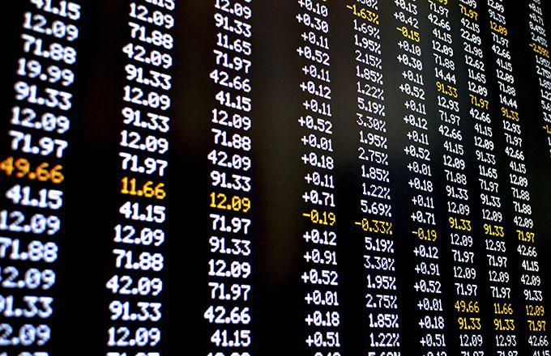

In today's financial landscape, the array of investment options available to investors is both diverse and complex. Among these options, preference shares, financial securities, and algorithmic trading stand out for their unique characteristics and potential benefits. Preference shares, often referred to as preferred stock, are of particular interest due to their dual nature, combining elements of both equity and debt. This hybrid security class offers a higher claim on assets and earnings compared to common stocks, primarily due to its fixed dividend feature.

Investors also look to financial securities, an umbrella term encompassing a wide range of investment instruments such as stocks, bonds, and derivatives. Each type of security serves a specific purpose in a diversified portfolio, catering to different risk and return profiles. The strategic selection of these instruments is crucial in aligning investment portfolios with individual financial goals and risk tolerance levels.



Algorithmic trading has brought a technological revolution to investment management. By employing computer programs and algorithms to execute trades based on predefined criteria, algorithmic trading ensures rapid execution and enhances the efficiency of financial markets. This method alleviates the emotional biases often associated with human trading, promoting consistency and discipline. However, it also presents challenges, such as the need for sophisticated technology and the risk of system failures.

Understanding the characteristics, advantages, and potential disadvantages of these investment options enables investors to make informed decisions. Choosing the right combination of preference shares, financial securities, and algorithmic trading strategies can significantly impact investment outcomes, helping investors achieve their financial objectives while managing risk effectively.

## Table of Contents

## Preference Shares: An Overview

Preference shares, also known as preferred stock, are a unique class of ownership in a corporation, distinguished by their higher claim on assets and earnings compared to common stock. This prioritization means that, in the event of liquidation, preference shareholders are paid before common shareholders, but after debt holders.

One of the defining characteristics of preference shares is the fixed dividend. Holders of preference shares are typically entitled to receive dividends at a predetermined rate before any dividends can be distributed to common shareholders. This makes preference shares particularly appealing to income-focused investors seeking stability, as they provide a predictable income stream. The fixed dividend is often specified as a percentage of the par value or as a fixed amount.

Another notable feature of preference shares is their classification as a hybrid security. They exhibit traits of both equity and debt, offering a balance between risk and return. Like equity, preference shares represent ownership interest in the company. However, similar to debt, they come with a fixed income feature in the form of dividends. This hybrid nature provides companies with more flexibility in capital structure management and can be a beneficial tool for financial strategy.

Despite these benefits, preference shares typically do not [carry](/wiki/carry-trading) voting rights. This lack of voting power means that preference shareholders have limited influence over corporate governance and decision-making processes, unlike common shareholders who may vote on major matters such as mergers and acquisitions, or changes to corporate policy.

In summary, preference shares offer a blend of benefits and limitations. They provide higher asset claims and income stability through fixed dividends, making them attractive to risk-averse investors who prioritize income over control. However, the compromise on voting rights means that some investors may choose other forms of securities depending on their financial objectives and involvement with the company.

## Advantages and Disadvantages of Preference Shares

Preference shares, often referred to as preferred stock, possess characteristics that both attract and deter investors based on their financial objectives and risk profiles. These shares are particularly appealing to risk-averse investors due to their hierarchical dividend payment structure and asset claim priority during liquidation. Unlike common shareholders, preference shareholders are entitled to receive fixed dividends before any distribution to common shareholders, ensuring a stable income stream. This predictable return can be particularly advantageous in turbulent market conditions, where the consistency of dividend payouts offers a degree of financial security.

However, one significant disadvantage is the absence of voting rights. Preference shareholders generally do not have the power to vote on corporate policies or board elections, which can be a considerable limitation for investors who seek influence over corporate governance. This lack of control means that preference shareholders must place considerable trust in the company's existing management and board decisions.

Furthermore, preference shares exhibit sensitivity to [interest rate](/wiki/interest-rate-trading-strategies) fluctuations. Since they often come with fixed dividend rates, their attractiveness can wane in a rising interest rate environment. In such situations, fixed-income securities like preference shares may offer lower yields compared to newer issues, whose rates adjust higher in response to the increased interest rates. This sensitivity can potentially affect their market value negatively, making them less appealing relative to other fixed-income options.

In summary, while preference shares provide prioritized dividends and enhanced liquidation claims, making them suitable for income-focused investors, they lack voting rights and can be adversely impacted by rising interest rates. This dual nature requires investors to carefully balance the benefits of income stability against the potential drawbacks related to interest rate risk and the relinquishment of corporate influence.

## Financial Securities: A Broad Spectrum

Financial securities represent a vast array of investment instruments, each serving a unique role in the broader context of financial markets. At their core, these securities are financial contracts that represent some form of financial value, forming the backbone of investment and trading activities. The primary categories of financial securities include stocks, bonds, and derivatives, each offering distinct characteristics that cater to diverse investor needs and preferences.

### Stocks

Stocks, or equities, represent ownership in a corporation and a claim on a part of the corporation's assets and earnings. They are a fundamental element of investment portfolios, providing investors with the potential for capital appreciation and dividend income. Stocks can be broadly categorized into common and preferred stocks. Common stocks offer voting rights and potential for higher returns but come with higher [volatility](/wiki/volatility-trading-strategies) and risk compared to bonds. The performance of stocks is influenced by factors such as company performance, industry conditions, and broader economic trends.

### Bonds

Bonds are fixed-income securities that represent a loan made by an investor to a borrower, typically a corporation or government. Bonds generally provide periodic interest payments, known as coupon payments, and return the principal at maturity. They are considered less risky than stocks due to their priority in claims over a company's earnings and assets in case of liquidation. Bonds are categorized based on the issuer: government bonds, corporate bonds, and municipal bonds, each with its risk-return profile. Interest rate fluctuations and credit ratings are key factors influencing bond prices.

### Derivatives

Derivatives are financial instruments whose value is derived from the value of an underlying asset, group of assets, or benchmark. Common types of derivatives include options, futures, and swaps. They are used for hedging risk, speculating on price movements, or gaining access to otherwise unavailable markets or assets. Derivatives can be complex and carry higher risk, requiring a robust understanding of the underlying assets and market conditions. They provide flexibility to structure deals and manage financial exposure effectively.

### Building Strategies with Financial Securities

Each type of financial security plays a critical role in a diversified investment portfolio, offering varying levels of risk and return. For instance, stocks may offer high growth potential but come with significant volatility, while bonds provide stability and regular income, acting as a buffer against market fluctuations. Derivatives, on the other hand, can enhance portfolio efficiency and risk management, albeit requiring careful management.

By understanding the characteristics of these securities, investors can construct strategies that align with their financial objectives and risk tolerance. Diversification across different types of securities can mitigate risk, while strategic allocation can optimize overall returns. The combination of stocks, bonds, and derivatives in a portfolio allows investors to balance growth, income, and risk according to their investment goals. 

Incorporating a strategic mix of these securities enables investors to create portfolios that can weather economic cycles and capitalize on market opportunities, thereby enhancing long-term financial outcomes.

## Algorithmic Trading: Automation in Finance

Algorithmic trading uses computer algorithms to execute trades according to predefined criteria, significantly enhancing the speed and efficiency of trading activities. This method of trading leverages technology to process vast amounts of market data, identify profitable trading opportunities, and perform transactions at optimal prices, often in milliseconds or microseconds—speeds unattainable by human traders.

A key advantage of [algorithmic trading](/wiki/algorithmic-trading) is its ability to backtest strategies. This involves running trading algorithms on historical market data to evaluate their effectiveness before deploying them in live markets. By simulating trading strategies on past data, traders can estimate their potential performance, identify weaknesses, and refine algorithms for better outcomes. The objective analysis afforded by [backtesting](/wiki/backtesting) ensures strategies are robust and statistically sound, minimizing exposure to unforeseen risks in actual trading environments.

Algorithmic trading also removes emotions from decision-making processes, fostering discipline and consistency. Human traders are susceptible to biases such as fear and greed, which can lead to irrational trading decisions and increased risk. In contrast, algorithms execute trades solely based on predefined rules and criteria, maintaining consistency and adhering strictly to risk management protocols. This automation ensures that trades are conducted impartially, removing the emotion-driven fluctuations that often accompany manual trading.

However, the complexity of developing effective trading algorithms presents a substantial challenge. Creating a successful algorithm requires sophisticated programming skills, strong analytical abilities, and an in-depth understanding of market dynamics. Even minor errors in algorithm design can result in significant financial losses. Moreover, the increasing prevalence of algorithmic trading introduces additional market challenges, such as reduced [liquidity](/wiki/liquidity-risk-premium) and increased volatility, particularly during periods of market stress.

Additionally, algorithmic trading is susceptible to technology failures. Any disruption in technological infrastructure—such as network outages, software bugs, or cyberattacks—can result in substantial financial and reputational damage. Traders and firms must implement robust risk management and contingency planning measures to mitigate these risks, including redundancy systems and real-time monitoring of trading activities.

In conclusion, while algorithmic trading offers numerous advantages in terms of speed, efficiency, and reduced emotional bias, traders must be mindful of its inherent complexities and potential technological pitfalls. By carefully crafting and rigorously testing algorithms, traders can leverage automation to enhance their trading strategies and achieve better investment outcomes.

## Integrating Algorithmic Trading with Investment Choices

Many institutional investors are increasingly utilizing algorithmic trading to implement high-frequency trading ([HFT](/wiki/high-frequency-trading-strategies)) strategies, which capitalize on minute price differences in different markets or securities. These sophisticated investors develop complex algorithms that execute a high [volume](/wiki/volume-trading-strategy) of trades at rapid speeds, often in fractions of a second. The primary advantage of HFT lies in its ability to exploit short-lived market inefficiencies, thus providing potential for increased returns.

Retail investors are also gaining access to algorithmic trading through platforms that offer pre-built algorithms and customizable trading strategies. These platforms often feature user-friendly interfaces, enabling investors without extensive technical backgrounds to engage with algorithmic trading technologies. Popular platforms frequently used by retail investors include MetaTrader and TradingView, which provide tools to automate trading strategies based on technical analysis indicators and other criteria.

Algorithmic trading can be effectively applied across a wide range of financial securities, including preference shares. For example, investors can design algorithms to monitor market conditions and trigger buy or sell orders for preference shares when specific criteria, such as price-to-dividend ratios, are met. This systematic approach can help investors optimize their investment returns by minimizing human error and emotional biases.

However, integrating algorithmic trading into an investment portfolio requires careful consideration of several factors. Investors must assess their own risk tolerance; algorithmic trading, particularly HFT, can be high-risk due to the rapid execution and potential for significant market exposure in a short period. Additionally, the development and implementation of algorithmic strategies necessitate a certain level of technical expertise. Proficiency in programming languages like Python and familiarity with quantitative analysis techniques are beneficial for creating and optimizing trading algorithms.

The following Python snippet illustrates a simple algorithmic trading strategy based on moving averages:

```python
import numpy as np
import pandas as pd

# Sample data - replace with actual market data
data = pd.DataFrame({'Close': [100, 102, 101, 105, 107, 104, 108]})

# Calculate moving averages
data['SMA_5'] = data['Close'].rolling(window=5).mean()
data['SMA_10'] = data['Close'].rolling(window=10).mean()

# Generate signals
data['Signal'] = np.where(data['SMA_5'] > data['SMA_10'], 1, 0)  # Buy signal
data['Position'] = data['Signal'].diff()

print(data)
```

In this example, a simple moving average crossover strategy is implemented. The algorithm issues a buy signal when the 5-day simple moving average (SMA) crosses above the 10-day SMA, indicating a potential upward trend.

Investors contemplating the use of algorithmic trading must also consider the possibility of technology failures, such as connectivity issues or software bugs, which could lead to unintended trading losses. Finally, there is the importance of regularly backtesting strategies against historical data to validate their effectiveness before applying them in live trading environments.

By assessing these factors and leveraging algorithmic trading appropriately, both institutional and retail investors can enhance their investment strategies in a constantly evolving financial market.

## Conclusion

Preference shares, financial securities, and algorithmic trading each offer distinct benefits and challenges. Investors navigating the modern financial landscape must carefully consider their individual financial objectives, risk appetite, and level of expertise. Understanding the nuanced characteristics of each investment option is crucial for constructing a portfolio that aligns with their goals.

Preference shares provide a higher claim on assets and earnings, appealing to those seeking income stability. However, the lack of voting rights necessitates a willingness to relinquish influence over corporate decisions. Meanwhile, financial securities, ranging from stocks and bonds to derivatives, enable investors to diversify their portfolios. Each type of security presents its own risk-return profile, requiring a strategic blend to achieve desired outcomes.

Algorithmic trading introduces automation and efficiency into portfolio management. By executing trades based on predetermined criteria, these systems can enhance consistency and remove emotional biases. Yet, the development of effective algorithms and potential technical failures demand a measure of technical proficiency and readiness to tackle challenges.

To optimize investment outcomes, investors need to stay informed and utilize the appropriate tools effectively. Leveraging advancements in technology and an understanding of diverse investment vehicles can significantly elevate their approach in a rapidly evolving market. Through informed decision-making, investors can align their strategies with their financial aspirations, paving the path towards achieving their investment goals.

## References & Further Reading

[1]: Bodie, Z., Kane, A., & Marcus, A. J. (2014). ["Investments."](https://books.google.com/books/about/EBOOK_Investments_Global_edition.html?id=BMsvEAAAQBAJ) McGraw-Hill Education.

[2]: ["The Intelligent Investor: The Definitive Book on Value Investing"](https://www.amazon.com/Intelligent-Investor-Third-Definitive-Investing/dp/0063423537) by Benjamin Graham

[3]: Fabozzi, F. J., & Markowitz, H. M. (2011). ["The Theory and Practice of Investment Management."](https://onlinelibrary.wiley.com/doi/book/10.1002/9781118267028) Wiley.

[4]: O'Shaughnessy, J. P. (2005). ["What Works on Wall Street: A Guide to the Best-Performing Investment Strategies of All Time."](https://www.amazon.com/What-Works-Wall-Street-Fourth/dp/0071625763) McGraw-Hill Education.

[5]: Aldridge, I. (2013). ["High-Frequency Trading: A Practical Guide to Algorithmic Strategies and Trading Systems."](https://www.amazon.com/High-Frequency-Trading-Practical-Algorithmic-Strategies/dp/1118343506) Wiley.

[6]: Murphy, J. J. (1999). ["Technical Analysis of the Financial Markets: A Comprehensive Guide to Trading Methods and Applications."](https://archive.org/details/technicalanalysi0000murp) New York Institute of Finance.