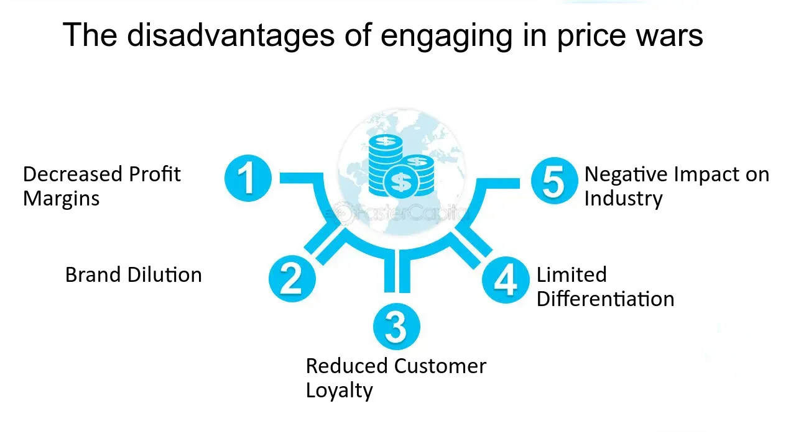

## Table of Contents

## What is a price war?

A price war happens when companies selling similar things start lowering their prices to try to get more customers. They do this because they want to sell more than their competitors. When one company lowers its prices, others might lower theirs too, to stay competitive. This can go on for a while, with prices getting lower and lower.

Price wars can be good for customers because they can buy things cheaper. But they can be bad for the companies. If prices keep going down, companies might not make enough money to cover their costs. This can lead to some companies going out of business or having to change what they do. In the end, it's a risky strategy that can help some companies but hurt others.

## How do price wars start?

Price wars usually start when one company decides to lower its prices to attract more customers. This can happen because the company wants to get a bigger share of the market or because it's trying to get rid of extra stock. When one company lowers its prices, it puts pressure on other companies selling similar things. These other companies might feel they have to lower their prices too, or they'll lose customers to the first company.

Once the other companies start lowering their prices, a price war begins. Each company keeps cutting prices to try to stay ahead of the others. This can go on until prices get so low that companies start losing money. Sometimes, a price war can start because of a new company entering the market with lower prices, or because of changes in the economy that make people more sensitive to price changes.

## What are the immediate effects of a price war on consumers?

When a price war starts, the immediate effect on consumers is that they can buy things cheaper. This is because companies are lowering their prices to try to get more customers. For example, if two stores are selling the same toy, and one store lowers the price of the toy, the other store might lower its price too. This means consumers can save money and get more for what they spend.

But there can also be some downsides for consumers. If the price war goes on for too long, some companies might not be able to keep up. They might have to close down or stop selling certain things. This can mean fewer choices for consumers. Also, if companies are losing money, they might cut back on things like customer service or the quality of their products to save money. So while prices might be lower, the shopping experience might not be as good.

## What are the potential benefits of price wars for businesses?

Price wars can help businesses get more customers. When a business lowers its prices, more people might want to buy from them instead of their competitors. This can help the business sell more things and get a bigger share of the market. If they can keep their costs low, they might even make more money overall, even though they're charging less for each item.

However, there are also risks. If the price war goes on for too long, the business might start losing money because the prices are too low. But if they can outlast their competitors, they might end up with fewer rivals in the market. This can give them more power to set prices later on. So, while price wars can be tough, they can also lead to a stronger position in the market if the business plays its cards right.

## How can price wars negatively impact a company's profitability?

Price wars can hurt a company's profitability because when companies keep lowering their prices, they might not make enough money to cover their costs. If the prices get too low, the company could lose money on every item they sell. This is bad because businesses need to make a profit to stay open and keep growing. If they can't make a profit, they might have to cut back on things like employee salaries or even close down some stores.

Also, price wars can lead to a situation where companies spend a lot of money trying to beat their competitors. They might have to pay for more advertising or come up with special deals to attract customers. All these extra costs can add up and make it even harder for the company to make a profit. In the end, if the price war goes on for too long, the company might find itself in a tough spot, struggling to stay profitable.

## What are the long-term effects of price wars on market structure?

Price wars can change the market structure over time. If some companies can't keep up with the low prices, they might go out of business or leave the market. This means fewer companies are left, and the ones that survive might have more power. They can control more of the market and set prices more easily because they have less competition. This can lead to a market where a few big companies dominate, making it harder for new companies to start up and compete.

On the other hand, if the price war ends quickly, it might not change the market structure much. Companies might go back to their old prices and ways of doing business. But if the price war lasts a long time, it can hurt the whole industry. Companies might cut back on things like research and development to save money, which can mean fewer new products or innovations. This can make the market less exciting and less competitive in the long run, as companies focus more on surviving than on growing and improving.

## How do price wars influence brand loyalty and customer perception?

Price wars can make customers see brands in a new way. When a company keeps lowering its prices, people might start to think that the brand is not as good as it used to be. They might wonder why the prices are so low and think that the quality must be going down too. This can hurt the brand's image and make customers less loyal. Instead of sticking with one brand because they trust it, they might start looking for the cheapest option every time they need to buy something.

On the other hand, if a company can keep its prices low and still offer good quality, it might win over new customers. People might start to see the brand as a good value and become more loyal to it. But this can be hard to do, especially if the price war goes on for a long time. Companies need to find a balance between offering low prices and keeping their customers happy with the quality and service they provide. If they can do this, they might come out of the price war with stronger brand loyalty and a better reputation.

## What strategies can businesses use to survive a price war?

To survive a price war, businesses can focus on keeping their costs down. This means they might need to find cheaper ways to make their products or cut back on other expenses. If they can do this, they might be able to keep their prices low without losing money. Another way to survive is by offering something special that other businesses don't have. This could be better customer service, a unique product, or a loyalty program that keeps customers coming back. By doing these things, a business can attract customers even if its prices aren't the lowest.

Businesses can also try to avoid getting into a price war in the first place. They can do this by focusing on what makes them different from their competitors. If customers see a business as offering something special, they might be willing to pay a bit more for it. If a price war does start, a business can choose to not join in and keep its prices the same. This can be risky, but if the business has a strong brand and loyal customers, it might be able to weather the storm and come out stronger on the other side.

## Can price wars lead to innovation in products or services?

Price wars can sometimes lead to innovation in products or services, but it's not always a sure thing. When companies are fighting to keep their prices low, they might look for new ways to make their products cheaper. This can push them to find new technologies or ways of doing things that save money. For example, they might start using new materials that are less expensive but still good quality. So, the need to keep prices low can make companies think creatively and come up with new ideas.

However, price wars can also make companies focus more on cutting costs than on coming up with new products or services. If a company is just trying to survive, it might not have the time or money to spend on research and development. This means they might not come up with new innovations. Instead of trying new things, they might stick to what they know and just try to make it cheaper. So, while price wars can sometimes lead to innovation, they can also make companies less likely to take risks and try new ideas.

## How do price wars affect small businesses compared to large corporations?

Price wars can be really tough on small businesses. When big companies start lowering their prices, small businesses often can't keep up. They don't have as much money to spend on things like advertising or special deals, so it's harder for them to attract customers. Also, small businesses usually can't buy things in bulk like big companies can, so their costs are higher. This means that if they try to lower their prices to match the big companies, they might start losing money. In the end, a lot of small businesses might have to close down because they can't survive the price war.

On the other hand, large corporations often have an easier time during price wars. They have more money to spend, so they can keep their prices low for longer without going broke. They can also buy things in bulk, which makes their costs lower. This means they can still make a profit even when prices are low. Big companies might even use price wars to get rid of smaller competitors and take over more of the market. So, while price wars can be a big problem for small businesses, large corporations often have the resources to handle them better.

## What are the ethical considerations of engaging in price wars?

Price wars can raise ethical questions because they can hurt other businesses and the people who work for them. When big companies lower their prices a lot, smaller businesses might not be able to keep up. They might have to close down, and then the people who worked there lose their jobs. This can be bad for the community because fewer businesses means fewer jobs and less money being spent locally. It's not fair if big companies use their power to push smaller ones out of the market.

On the other hand, price wars can be good for customers because they can buy things cheaper. But it's important for companies to think about how their actions affect everyone, not just their own profits. If companies focus only on beating their competitors and don't care about the harm they cause, that can be seen as unethical. Companies should try to find a balance between offering good prices and being fair to other businesses and their employees.

## How can regulatory bodies intervene in price wars to protect market health?

Regulatory bodies can step in during price wars to make sure the market stays healthy. They can do this by watching how companies are setting their prices and making sure no one is doing anything unfair. For example, they might stop companies from working together to set prices too low, which can hurt other businesses. They can also look at how price wars might be hurting small businesses and think about rules to protect them. By doing these things, regulatory bodies can help keep the market fair and make sure everyone has a chance to compete.

Sometimes, regulatory bodies might need to take stronger action if a price war is causing big problems. They can set rules about how low prices can go or make sure companies can't use their size to push smaller ones out of the market. This helps keep the market from getting too dominated by just a few big companies. By keeping an eye on things and stepping in when needed, regulatory bodies can help make sure that price wars don't harm the overall health of the market and that everyone gets a fair shot.

## What are Algorithmic Pricing Strategies?

Algorithmic pricing involves using algorithms to set prices dynamically based on market conditions. This method fundamentally relies on data analytics to process large volumes of data and uncover insights that can facilitate real-time price adjustments. The adoption of algorithmic pricing strategies is prevalent in rapidly changing markets where supply and demand fluctuate often, such as e-commerce, airline industries, and ride-sharing services.

### Role of Data Analytics

Data analytics is integral to shaping pricing strategies through algorithms. Algorithms require vast amounts of historical and real-time data, including competitor pricing, consumer behavior patterns, and market trends, to make pricing decisions. Machine learning models, such as regression analysis or [reinforcement learning](/wiki/reinforcement-learning) algorithms, can predict optimal pricing by recognizing patterns within data sets. For instance, a basic linear regression model for price prediction can be expressed mathematically as:

$$

P = \beta_0 + \beta_1 X_1 + \beta_2 X_2 + \ldots + \beta_n X_n + \epsilon
$$

where $P$ is the price, $X_1, X_2, \ldots, X_n$ are different variables affecting the price, $\beta$ represent the coefficients, and $\epsilon$ is the error term.

Python libraries such as `pandas` for data manipulation and `scikit-learn` for [machine learning](/wiki/machine-learning) models can be employed to implement and test these algorithms. Here is a basic example of employing a linear regression model using Python:

```python
import pandas as pd
from sklearn.model_selection import train_test_split
from sklearn.linear_model import LinearRegression

# Sample dataset for pricing
data = pd.read_csv('pricing_data.csv')
X = data.drop('price', axis=1)  # features
y = data['price']  # target variable

# Splitting the dataset into training and testing sets
X_train, X_test, y_train, y_test = train_test_split(X, y, test_size=0.2, random_state=42)

# Training a Linear Regression model
model = LinearRegression()
model.fit(X_train, y_train)

# Predicting on test set
predictions = model.predict(X_test)
```

### Challenges in Implementation

Businesses may face several challenges while implementing algorithmic pricing models. The significant investment in technology infrastructure and skilled personnel for managing these systems is a primary hurdle. Integrating these models into existing systems demands time and technical expertise. Moreover, the dynamic nature of markets necessitates continual adjustments to algorithms, which can be resource-intensive.

Maintaining data quality is another critical challenge. Inaccurate or outdated data can lead to suboptimal pricing decisions, adversely affecting both competitiveness and profitability.

### Ethical Implications

Algorithmic pricing also brings forth ethical concerns. The primary issue lies in the transparency and fairness of automated pricing decisions. As algorithms can potentially lead to price discrimination—charging different prices to different customers for the same product—it's crucial to ensure fairness and equality. There’s also the risk of algorithms inadvertently engaging in anti-competitive behavior, such as price fixing, which could violate antitrust laws.

Regulatory frameworks need to evolve to address these concerns, ensuring that algorithmic pricing strategies are transparent and do not undermine consumer trust or market fairness.

In summary, algorithmic pricing strategies leverage data analytics to adapt to dynamic market conditions, offering efficient price-setting mechanisms. However, companies must carefully navigate implementation challenges and ethical considerations to capitalize on their benefits responsibly.

## References & Further Reading

[1]: Wolfram, G. (1983). ["The Effects of a Price War: A Game Theory Approach."](https://en.wikipedia.org/wiki/Stephen_Wolfram)90008-4) International Journal of Industrial Organization, 1(1).

[2]: Fama, E. F. (1970). ["Efficient Capital Markets: A Review of Theory and Empirical Work."](https://www.jstor.org/stable/2325486) The Journal of Finance, 25(2), 383-417.

[3]: Shapiro, C. (1986). ["Investment, Market Share, and the Pricing of New Products."](https://www.jstor.org/stable/pdf/1833204.pdf)90035-X) The International Journal of Industrial Organization, 4(3), 195-223.

[4]: Lopez de Prado, M. (2018). ["Advances in Financial Machine Learning."](https://www.amazon.com/Advances-Financial-Machine-Learning-Marcos/dp/1119482089) Wiley.

[5]: Chan, E. P. (2017). ["Machine Trading: Deploying Computer Algorithms to Conquer the Markets."](https://github.com/ftvision/quant_trading_echan_book) Wiley.

[6]: Nalebuff, B., & Brandenburger, A. (1996). ["Co-opetition."](https://www.amazon.com/Co-Opetition-Adam-M-Brandenburger/dp/0385479506) Currency Doubleday.