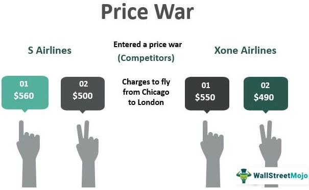

In today's rapidly evolving business landscape, competitive strategies are crucial for companies striving to maintain or expand their market presence. Integral to these strategies is pricing, a pivotal element that can determine a company's success or failure. Pricing strategies are often used to manage competition effectively, influence consumer behavior, and achieve financial objectives. They serve not only as a mechanism for revenue generation but also as a tool for positioning within a market.

One manifestation of competitive pricing is a phenomenon known as "price wars." Price wars occur when rival companies continuously lower their prices to undercut each other, aiming to capture greater market share. While this can lead to immediate gains for consumers, such as reduced prices, it often results in diminished profit margins for businesses involved. Moreover, sustained price wars can reshape market dynamics, sometimes leading to the downfall of less financially resilient companies. The significance of price wars in market strategy cannot be understated, as they necessitate strategic foresight and careful consideration of long-term objectives.



Concurrent with the evolution of pricing strategies is the rise of algorithmic trading, which is exerting increasing influence within competitive markets. Algorithmic trading involves the use of computer algorithms to manage trading decisions, optimizing them based on large volumes of data. This approach contrasts traditional methods, offering precision, speed, and the ability to handle complex datasets far beyond human capabilities. Algorithmic trading can thus provide a competitive edge, especially as markets become more data-driven and interconnected.

The objective of this article is to explore the intricate relationship between price wars, market strategy, and algorithmic trading. By examining how these elements interact, we aim to provide insights into how businesses can navigate competitive landscapes. Readers can expect a comprehensive discussion, spanning topics from the fundamentals of price wars to the advanced applications of algorithmic pricing strategies. We will analyze real-world case studies, identify successful market strategies, and consider future trends and implications, ultimately offering a forward-looking perspective on business competition.

## Table of Contents

## Understanding Price Wars

Price wars are pervasive competitive phenomena where businesses repeatedly lower prices to undercut competitors. These conflicts are prevalent in various sectors, such as retail, telecommunications, and the airline industry. A classic example from the retail sector is the ongoing price battle between e-commerce giants Amazon and Walmart, who continuously adjust their prices to attract consumers. In telecommunications, global players such as Verizon and T-Mobile engage in price wars by offering lower data plan rates to capture market share. The airline industry has also seen its share of price wars, with carriers frequently cutting ticket prices to outdo competitors.

Price wars significantly affect businesses, consumers, and industry structures. For businesses, engaging in price wars often leads to reduced profit margins and increased pressure to cut costs. Companies may sacrifice short-term profits in exchange for increased market share or to drive competitors out of the market. For consumers, price wars can be beneficial, offering lower prices and more purchasing power. However, if price wars lead to reduced competition due to smaller companies exiting the market, consumers may face higher prices in the long run.

The dynamics of entire industries can also shift due to price wars. These conflicts may hasten technological advancements or innovation as businesses seek alternative methods to differentiate themselves without relying solely on price. A shift toward improved service quality, customer experience, or product features can be a strategic response.

Companies deploy various strategies to initiate or respond to price wars. Initiating a price war might involve an aggressive pricing strategy intended to capture market share quickly. For responding to price wars, businesses can adopt several approaches: focusing on product differentiation, enhancing customer service, or forming strategic alliances to strengthen their market position. Another tactic is price matching, where companies commit to matching competitors' pricing on identical products, thereby negating the effectiveness of price cuts.

Engaging in price wars can present both advantages and disadvantages for businesses. On the pro side, price wars can drive market expansion, enhance brand recognition, and eliminate weaker competitors, potentially yielding higher market concentration. However, the cons include reduced profit margins, potential brand devaluation, and the risk of initiating a mutually destructive cycle of price cuts that can harm long-term financial stability.

In conclusion, price wars are intricate phenomena with various implications across industries. While they can offer immediate advantages in terms of increased market share and consumer benefits, they may also usher in challenges concerning profitability and market health. Businesses must carefully consider their market strategies when engaging in or responding to price wars to support sustainable growth and competitive advantage.

## Market Strategy in Competitive Environments

Market strategy is a fundamental part of achieving business success, particularly in competitive environments where companies vie for market share, customer attention, and profitability. A well-crafted market strategy aligns a company's strengths with market opportunities, ultimately driving growth and competitive advantage.

**The Role of Market Strategy**

The essence of market strategy lies in maximizing a firm's potential in a given market. It involves a comprehensive analysis of external factors, such as consumer behavior, economic conditions, and competitive forces, as well as internal resources and capabilities. A successful market strategy not only differentiates a company from its competitors but also aligns with the company's overarching mission and objectives.

For businesses to thrive in high-pressure environments, they must develop strategies that consider pricing, product differentiation, market penetration, and customer segmentation. These factors help businesses create a sustainable competitive edge, ensuring their long-term success.

**Aligning Market Strategies to Handle Competition**

Businesses can effectively manage intense competition by aligning their market strategies with their core competencies and market needs. Key approaches include:

1. **Differentiation**: Offering unique products or services that provide distinct value to customers. By investing in innovation and maintaining quality, businesses can stand out from competitors.

2. **Cost Leadership**: Pursuing efficiency in operations to offer competitive pricing while maintaining profitability. This often involves optimizing supply chains and leveraging economies of scale.

3. **Focus Strategy**: Targeting a specific market niche where the company can offer specialized products or services. This approach allows businesses to serve a defined segment better than broadly focused competitors.

These strategies require businesses to be agile and responsive to changing market conditions, allowing them to adapt quickly and appropriately.

**Case Studies of Successful Market Strategies**

Successful companies often serve as exemplars of strategic market approaches. For instance:

- **Apple Inc.**: Apple's focus on innovation and brand equity allows it to charge premium prices for its products while consistently delivering value through high-quality design and technology integration.

- **Walmart Inc.**: Employing a cost leadership strategy, Walmart leverages its vast supply chain and purchasing power to offer everyday low prices, maintaining a strong market presence.

- **Tesla, Inc.**: By concentrating on a niche market with its electric vehicles, Tesla has established a leadership position in sustainable transportation, blending technological innovation with environmental awareness.

These examples illustrate how distinct strategies can be tailored to industry circumstances and consumer demands to gain competitive advantages.

**Balancing Pricing and Value Proposition**

Crafting market strategies invariably involves balancing pricing with value proposition. A robust value proposition is crucial to justify pricing strategies, allowing businesses to attract and retain customers:

- **Value-based Pricing**: Setting prices based on the perceived value delivered to the customer rather than solely on cost. This approach often requires businesses to communicate their product benefits effectively.

- **Dynamic Pricing Models**: Utilizing real-time data and algorithmic tools to adjust prices based on demand, competition, and other external factors. It enables businesses to remain competitive and optimize revenue.

To achieve this balance, businesses must understand customer needs, expectations, and willingness to pay. Implementing data analytics can provide insights into these factors, leading to more informed pricing decisions.

In conclusion, market strategy plays an essential role in navigating competitive landscapes. By harmonizing pricing, differentiation, and targeted marketing efforts with their strategic objectives, businesses can create enduring advantages that contribute to long-term success.

## The Role of Algorithmic Trading

Algorithmic trading, commonly referred to as algo trading, is a method of executing orders using automated and pre-programmed trading instructions. These instructions account for variables such as time, price, and [volume](/wiki/volume-trading-strategy) to optimize trading outcomes. The core technological underpinnings of [algorithmic trading](/wiki/algorithmic-trading) include computer algorithms that leverage vast datasets to make informed trading decisions without human intervention. As a technological evolution of financial markets, algorithmic trading has transformed the landscape by increasing the speed and efficiency of trade execution.

One of the primary distinctions between algorithmic trading and traditional trading methods is the automation involved. Traditional trading relies heavily on human judgment and manual execution of trades, which can be subject to emotional biases and slower reaction times. In contrast, algorithmic trading eliminates these human limitations by employing advanced algorithms and computers to process and execute trades at high speeds. These algorithms can analyze multiple market conditions simultaneously, adapting trade strategies in real-time to capitalize on market opportunities or mitigate risks.

The advantages of using algorithms in trading are particularly pronounced during price wars—periods characterized by intense price competition among businesses aiming to capture greater market share. Algorithmic trading systems can quickly adjust pricing strategies based on competitor activity, market demand, and historical pricing data, enabling businesses to maintain competitive pricing while maximizing profitability. This level of responsiveness ensures that companies participating in price wars can continuously optimize their pricing without the lag typically associated with manual pricing strategies.

Algorithmic trading also significantly influences market conditions and pricing strategies through its ability to introduce [liquidity](/wiki/liquidity-risk-premium) and stabilize markets. By executing trades rapidly, these algorithms can flatten sudden price swings, providing a smoother market experience for all participants. Furthermore, algorithms can be programmed to seek [arbitrage](/wiki/arbitrage) opportunities, effectively taking advantage of price discrepancies across different markets, which aids in aligning prices to their fair market value.

An example of algorithmic trading's influence is seen in high-frequency trading ([HFT](/wiki/high-frequency-trading-strategies)), a subset of algorithmic trading characterized by extremely high-speed trade executions. HFT firms often engage in market-making strategies, providing buy and sell quotes for securities, thus adding liquidity to the markets. Moreover, during market [volatility](/wiki/volatility-trading-strategies) or price wars, these firms can effectively navigate the tumultuous environment by rapidly adjusting positions, which can both stabilize and, at times, exacerbate market conditions depending on the strategies employed.

To summarize, algorithmic trading represents a paradigm shift from traditional methods, offering speed, efficiency, and strategic adaptability in today's competitive markets. These capabilities are critical during price wars, where rapid response and real-time data analysis can significantly impact pricing strategies and market positioning. Through the use of advanced algorithms, businesses can maintain a competitive edge by optimizing their pricing and trading strategies in the dynamic landscape of modern financial markets.

## Algorithmic Pricing Strategies

Algorithmic pricing involves using algorithms to set prices dynamically based on market conditions. This method fundamentally relies on data analytics to process large volumes of data and uncover insights that can facilitate real-time price adjustments. The adoption of algorithmic pricing strategies is prevalent in rapidly changing markets where supply and demand fluctuate often, such as e-commerce, airline industries, and ride-sharing services.

### Role of Data Analytics

Data analytics is integral to shaping pricing strategies through algorithms. Algorithms require vast amounts of historical and real-time data, including competitor pricing, consumer behavior patterns, and market trends, to make pricing decisions. Machine learning models, such as regression analysis or [reinforcement learning](/wiki/reinforcement-learning) algorithms, can predict optimal pricing by recognizing patterns within data sets. For instance, a basic linear regression model for price prediction can be expressed mathematically as:

$$

P = \beta_0 + \beta_1 X_1 + \beta_2 X_2 + \ldots + \beta_n X_n + \epsilon
$$

where $P$ is the price, $X_1, X_2, \ldots, X_n$ are different variables affecting the price, $\beta$ represent the coefficients, and $\epsilon$ is the error term.

Python libraries such as `pandas` for data manipulation and `scikit-learn` for [machine learning](/wiki/machine-learning) models can be employed to implement and test these algorithms. Here is a basic example of employing a linear regression model using Python:

```python
import pandas as pd
from sklearn.model_selection import train_test_split
from sklearn.linear_model import LinearRegression

# Sample dataset for pricing
data = pd.read_csv('pricing_data.csv')
X = data.drop('price', axis=1)  # features
y = data['price']  # target variable

# Splitting the dataset into training and testing sets
X_train, X_test, y_train, y_test = train_test_split(X, y, test_size=0.2, random_state=42)

# Training a Linear Regression model
model = LinearRegression()
model.fit(X_train, y_train)

# Predicting on test set
predictions = model.predict(X_test)
```

### Challenges in Implementation

Businesses may face several challenges while implementing algorithmic pricing models. The significant investment in technology infrastructure and skilled personnel for managing these systems is a primary hurdle. Integrating these models into existing systems demands time and technical expertise. Moreover, the dynamic nature of markets necessitates continual adjustments to algorithms, which can be resource-intensive.

Maintaining data quality is another critical challenge. Inaccurate or outdated data can lead to suboptimal pricing decisions, adversely affecting both competitiveness and profitability.

### Ethical Implications

Algorithmic pricing also brings forth ethical concerns. The primary issue lies in the transparency and fairness of automated pricing decisions. As algorithms can potentially lead to price discrimination—charging different prices to different customers for the same product—it's crucial to ensure fairness and equality. There’s also the risk of algorithms inadvertently engaging in anti-competitive behavior, such as price fixing, which could violate antitrust laws.

Regulatory frameworks need to evolve to address these concerns, ensuring that algorithmic pricing strategies are transparent and do not undermine consumer trust or market fairness.

In summary, algorithmic pricing strategies leverage data analytics to adapt to dynamic market conditions, offering efficient price-setting mechanisms. However, companies must carefully navigate implementation challenges and ethical considerations to capitalize on their benefits responsibly.

## Case Studies and Real-World Applications

Algorithmic trading and pricing strategies have been transformative across various industries, reshaping how companies engage in competitive practices. Notable companies have spearheaded the adoption of these strategies, resulting in successful navigation of intense market conditions.

One prominent example is Amazon, which utilizes sophisticated algorithms to dynamically adjust prices in response to competitor actions, inventory levels, and customer demand. This real-time pricing capability allows Amazon to maintain a competitive edge by ensuring its offerings are consistently attractive to consumers. The lesson here highlights the importance of leveraging real-time data and advanced algorithms to stay ahead in competitive markets.

Another illustrative case is the airline industry, where companies like Delta Air Lines and American Airlines have employed algorithmic pricing strategies to optimize ticket pricing. These algorithms analyze myriad factors, including seasonal trends, booking pace, and competitor pricing, to maximize revenue and fill rates. The strategic use of algorithms in this context underscores the balance between maximizing revenue potential and maintaining competitive pricing, demonstrating the significant positive impact of data-driven strategies.

The retail sector further exemplifies the use of algorithmic strategies through companies like Walmart. By implementing algorithmic pricing, Walmart can rapidly adjust prices across its vast network of stores, adapting to local market conditions and competitor pricing tactics. This approach has enabled Walmart to sustain its "Everyday Low Prices" promise while enhancing profitability.

In the ride-sharing industry, Uber has set a benchmark with its algorithmic surge pricing model. By using algorithms to adjust prices based on real-time supply and demand dynamics, Uber ensures optimal balance between driver availability and rider demand, particularly during peak periods. This model serves as a case study demonstrating how algorithms can effectively mediate market fluctuations, ensuring both service reliability and company profitability.

These examples collectively offer insights into industry-specific applications of algorithmic strategies and illustrate the uniqueness of each market scenario. The airline, retail, and ride-sharing industries, among others, reveal the versatility and adaptability of algorithmic solutions across different business models and market conditions.

Moreover, these case studies emphasize several lessons. Firstly, the successful application of algorithmic strategies requires a robust data infrastructure capable of processing and analyzing large datasets in near real-time. Companies must invest in advanced analytics and machine learning capabilities to harness the full potential of algorithmic pricing.

Secondly, businesses must consider the ethical implications of such strategies. The use of dynamic pricing, especially in essential services or during emergencies, can raise concerns among consumers and regulators. Hence, companies must balance profitability with fairness and transparency to maintain consumer trust.

In conclusion, the examination of these real-world applications highlights the transformative power of algorithmic trading and pricing strategies across diverse industries. Companies that effectively exploit these strategies can achieve a sustainable competitive advantage, provided they address both operational and ethical considerations.

## Future Trends and Considerations

Emerging trends in algorithmic trading and pricing models reflect significant shifts influenced by technological advancements and changing market dynamics. As businesses strive to maintain a competitive edge, understanding these trends has become crucial for strategic planning.

One notable trend is the integration of [artificial intelligence](/wiki/ai-artificial-intelligence) (AI) and machine learning (ML) into algorithmic trading strategies. AI and ML enable more sophisticated data analysis, which enhances the ability of trading algorithms to predict market movements and adapt pricing models in real time. Machine learning models can analyze vast datasets to identify patterns and correlations that human analysts might overlook. For example, unsupervised learning algorithms can cluster historical trades to identify strategies that correlate with successful outcomes. This allows for a more nuanced approach to price setting, taking into account an array of variables such as market volatility, competitor pricing, and consumer behavior.

```python
from sklearn.cluster import KMeans
import numpy as np

# Example: Clustering past trade outcomes to find patterns
data = np.array([[5.1, 3.5, 1.4, 0.2], [4.9, 3.0, 1.4, 0.2], [6.2, 3.4, 5.4, 2.3]])
kmeans = KMeans(n_clusters=3)
kmeans.fit(data)

print(kmeans.labels_)  # Output: Cluster labels for each data point
```

For businesses aiming to integrate algorithmic solutions, several considerations must be addressed. First, the quality and quantity of data available for algorithms are fundamental. Robust data governance practices, including data privacy and security, should be prioritized to ensure the accuracy and integrity of the inputs driving algorithmic decisions. Moreover, businesses must consider the scalability of their infrastructure to handle high-frequency data processing required by real-time algorithmic trading models.

The regulatory landscape surrounding algorithmic trading and pricing continues to evolve, presenting both challenges and opportunities. Regulators are increasingly focusing on transparency and accountability. Regulations such as the European Union's MiFID II and the U.S. Securities and Exchange Commission's rules on market stability impose stringent requirements on algorithmic trading activities. Businesses must navigate these regulations, ensuring compliance while leveraging the agility that algorithmic strategies offer. This includes implementing thorough testing and validation of algorithms, as well as robust monitoring systems to prevent unintended market manipulations.

In summary, as AI and ML continue to drive innovation in algorithmic trading, businesses must strategically embrace these technologies while managing associated risks and regulatory compliance. This approach will position them to effectively harness the potential of algorithmic pricing models to maintain competitiveness in dynamic market environments.

## Conclusion

In today's fiercely competitive business environment, the interplay between price wars, market strategy, and algorithmic trading has become a focal point for companies striving to maintain a competitive edge. The discussions have underscored the critical role that price strategies play in aligning with broader business objectives. Companies must ensure that their pricing tactics support broader strategic goals, rather than solely focusing on short-term gains. By effectively integrating pricing strategies with overall business plans, businesses can better withstand competitive pressures and sustain long-term growth.

Algorithmic trading and pricing have been highlighted as pivotal components that will significantly shape future market competition. These technologies offer businesses the tools to make more informed and timely decisions, leveraging data analytics to optimize pricing and execute trades with precision. As markets continue to evolve and technology advances, the influence of algorithmic approaches is poised to increase, offering substantial advantages in terms of speed, efficiency, and adaptability.

Looking ahead, businesses are encouraged to embrace technological innovations and adapt to emerging trends in algorithmic trading and pricing. By doing so, they can enhance their competitive positioning and navigate the complexities of modern markets. This adaptation requires a forward-thinking mindset, where companies continuously explore new technologies and refine their strategies. Ultimately, as the regulatory landscape and market conditions shift, the successful integration of algorithmic solutions into business strategies will be a defining [factor](/wiki/factor-investing) for future success.

## References & Further Reading

[1]: Wolfram, G. (1983). ["The Effects of a Price War: A Game Theory Approach."](https://en.wikipedia.org/wiki/Stephen_Wolfram)90008-4) International Journal of Industrial Organization, 1(1).

[2]: Fama, E. F. (1970). ["Efficient Capital Markets: A Review of Theory and Empirical Work."](https://www.jstor.org/stable/2325486) The Journal of Finance, 25(2), 383-417.

[3]: Shapiro, C. (1986). ["Investment, Market Share, and the Pricing of New Products."](https://www.jstor.org/stable/pdf/1833204.pdf)90035-X) The International Journal of Industrial Organization, 4(3), 195-223.

[4]: Lopez de Prado, M. (2018). ["Advances in Financial Machine Learning."](https://www.amazon.com/Advances-Financial-Machine-Learning-Marcos/dp/1119482089) Wiley.

[5]: Chan, E. P. (2017). ["Machine Trading: Deploying Computer Algorithms to Conquer the Markets."](https://github.com/ftvision/quant_trading_echan_book) Wiley.

[6]: Nalebuff, B., & Brandenburger, A. (1996). ["Co-opetition."](https://www.amazon.com/Co-Opetition-Adam-M-Brandenburger/dp/0385479506) Currency Doubleday.