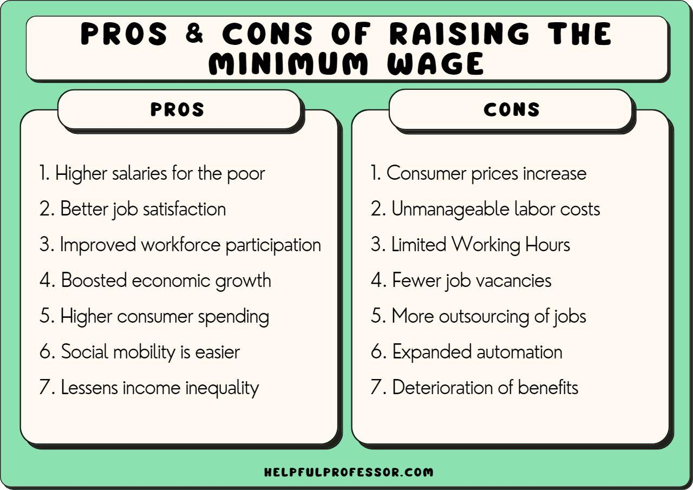

## Table of Contents

## What is the minimum wage?

The minimum wage is the lowest amount of money that employers can legally pay their workers per hour. It is set by the government to make sure that workers earn enough to live on. Different countries have different minimum wages, and some places within a country might have their own minimum wage too.

In the United States, the federal minimum wage is $7.25 per hour, but some states and cities have higher minimum wages. For example, in California, the minimum wage is higher than the federal rate. The minimum wage can change over time, usually going up to keep up with the cost of living. This helps workers afford basic needs like food, housing, and healthcare.

## Why do governments set a minimum wage?

Governments set a minimum wage to make sure that workers get paid enough money to live on. They want to stop companies from paying very low wages, which could make it hard for workers to buy food, pay for a place to live, or take care of their families. By setting a minimum wage, the government helps make sure that even the lowest-paid workers can afford the basic things they need.

Another reason governments set a minimum wage is to help reduce the gap between rich and poor people. If everyone earns at least a certain amount, it can help make things more fair. This can also help the whole economy because when workers have more money, they can spend more on things like food, clothes, and other goods, which can help businesses grow.

## What are the immediate effects of raising the minimum wage on low-income workers?

When the government raises the minimum wage, low-income workers get more money for each hour they work. This means they can buy more things they need, like food and clothes, or save some money for the future. It can also make them feel happier and less worried about money because they know they will earn more.

But, raising the minimum wage can also have some problems. Some businesses might not be able to pay their workers more, so they might hire fewer people or even let some workers go. This could mean that some low-income workers might lose their jobs or have a harder time finding a new one. So, while many workers will benefit from [earning](/wiki/earning-announcement) more, others might face challenges if their hours are cut or if they can't find work.

## How does raising the minimum wage impact small businesses?

Raising the minimum wage can make things harder for small businesses. They might have to pay their workers more money, but they don't always have a lot of extra money to do that. This can mean they have to raise the prices of what they sell, which might make customers go somewhere else. Or, they might have to cut back on the number of workers they have or the hours they work, which can make it tough for the business to keep running smoothly.

On the other hand, if small businesses can handle the higher wages, it can be good for them too. When workers earn more, they can spend more money at local businesses, which can help the whole community. But it's a tricky balance, and small businesses need to think carefully about how they can manage the extra costs without hurting their business too much.

## Can raising the minimum wage lead to higher prices for consumers?

Yes, raising the minimum wage can lead to higher prices for consumers. When businesses have to pay their workers more money, they might need to charge more for their products or services to cover these extra costs. For example, if a fast food restaurant has to pay its workers more, it might raise the price of burgers and fries to make up for it.

This can make things more expensive for everyone who buys things from these businesses. But it's not just about higher prices. Sometimes, businesses might find other ways to save money, like using fewer workers or finding cheaper ways to make their products. So, while prices might go up, it depends on how each business decides to handle the higher wages.

## What are the potential long-term economic effects of increasing the minimum wage?

Increasing the minimum wage can have big effects on the economy over time. If workers earn more money, they can spend more on things they need and want. This can help the economy grow because when people spend more, businesses make more money. More money for businesses can mean they hire more workers, which can help lower unemployment. Also, when low-income workers earn more, it can help reduce the gap between rich and poor people, making things more fair.

But there are also some challenges. If businesses have to pay their workers more, they might need to raise the prices of their products or services. This can make things more expensive for everyone, which might slow down the economy if people start spending less. Some businesses, especially small ones, might struggle to pay the higher wages and could even close down. This could mean fewer jobs and higher unemployment in some areas. So, while increasing the minimum wage can help many workers, it's important to think about how it might affect the whole economy over time.

## How does raising the minimum wage affect income inequality?

Raising the minimum wage can help make income inequality smaller. Income inequality means that some people have a lot more money than others. When the minimum wage goes up, people who earn the least get more money. This means they can buy more things they need and maybe even save some money. It helps them have a better life and can make the difference between rich and poor people smaller.

But, raising the minimum wage doesn't always fix everything about income inequality. Some businesses might have to pay their workers more, and they might not be able to do that. They could cut jobs or raise prices, which might hurt other people who don't earn the minimum wage. So, while it helps the lowest-paid workers, it can also make things harder for others. It's a tricky balance, but the goal is to make things more fair for everyone.

## What are the arguments against raising the minimum wage?

Some people think raising the minimum wage is not a good idea. They say it can make businesses pay more money to their workers, and some businesses might not be able to do that. If businesses have to pay more, they might have to let some workers go or hire fewer people. This could make it harder for people to find jobs, especially young people or those without much experience. Also, if businesses pay more, they might have to raise the prices of what they sell. This could make things more expensive for everyone, not just the people who get paid more.

Another argument against raising the minimum wage is that it might not help the people it's meant to help. Some people say that if the minimum wage goes up, businesses might find other ways to save money, like using machines instead of people. This could mean fewer jobs for people. Also, some workers might not stay in minimum wage jobs for very long. They might move to better-paying jobs quickly, so the raise doesn't help them that much. Instead of raising the minimum wage, some people think the government should help in other ways, like giving tax breaks or helping people learn new skills to get better jobs.

## How do different countries approach the issue of minimum wage?

Different countries have different ways of dealing with minimum wage. In some countries like the United States, the federal government sets a minimum wage, but states and cities can also set their own, which can be higher. In other places, like the United Kingdom, the government sets a national minimum wage that changes every year to keep up with the cost of living. Some countries, like Sweden and Denmark, don't have a set minimum wage at all. Instead, they rely on agreements between workers and businesses to decide on fair pay.

In developing countries, the approach can be different too. For example, in India, the minimum wage varies by state and type of work, trying to make sure workers in different areas get paid enough. In some places, like Brazil, the minimum wage is set by the government and is meant to help workers afford basic needs. Each country looks at its own economy, cost of living, and what people need to live well when deciding on a minimum wage. This means that what works in one country might not work the same way in another.

## What role does inflation play in discussions about minimum wage adjustments?

Inflation is when the prices of things go up over time. When people talk about changing the minimum wage, they often think about inflation. If the minimum wage stays the same but prices go up, workers can buy less with their money. This means their money doesn't go as far as it used to. So, some people say the minimum wage should go up when there's inflation to make sure workers can still afford what they need.

But, it's not always easy to decide how much to raise the minimum wage because of inflation. If the minimum wage goes up too fast, it might make prices go up even more. This could make inflation worse. So, people have to think carefully about how much to raise the minimum wage to keep up with inflation without making things too expensive for everyone. It's a tricky balance to get right.

## How can the effects of raising the minimum wage be measured and evaluated?

To measure and evaluate the effects of raising the minimum wage, people look at different things. They check if workers who earn the minimum wage get more money and if they can buy more things they need. They also see if fewer people are poor because they earn more. Another thing they look at is if businesses have to let workers go or if they hire fewer people because they have to pay more. They also check if prices for things like food and clothes go up because businesses need to cover the higher wages.

To get this information, people use studies and surveys. They might ask workers if they are better off after the minimum wage goes up. They also look at numbers from businesses to see if they changed how many people they hire or how much they charge for things. By putting all this information together, they can see if raising the minimum wage helps more people than it hurts or if it causes more problems than it solves. It's important to keep looking at this information over time to understand how things change.

## What are some proposed alternatives to raising the minimum wage to address low income?

One way to help people with low income without raising the minimum wage is to give them tax breaks or credits. This means the government gives them some money back when they pay taxes. For example, in the United States, there's something called the Earned Income Tax Credit (EITC). It helps people who work but don't earn a lot of money. By giving them more money through tax breaks, they can afford more things they need without making businesses pay more to their workers.

Another idea is to help people learn new skills so they can get better jobs. This can be done through training programs or education. If people learn new things, they might be able to find jobs that pay more money. This can help them earn more without the government having to change the minimum wage. It's good for workers because they can move up in their careers, and it's good for businesses because they can hire people with the skills they need.

## What are the economic interactions and synergies?

Exploring the interconnections between the labor market, minimum wage policies, and [algorithmic trading](/wiki/algorithmic-trading) reveals intricate economic synergies. Each of these elements plays a significant role in shaping economic stability and growth, with their ripple effects often intertwined. Understanding these connections requires a comprehensive examination of how one component influences the others and the broader economic context.

Changes in minimum wage policies, for instance, have a direct impact on labor market dynamics. Raising minimum wages can lead to increased purchasing power for workers, thus boosting consumer spending and stimulating economic growth. However, the effect on employment levels can vary. In some sectors, higher wages may lead employers to reduce workforce numbers or increase prices to offset added costs, thereby affecting employment and inflation rates. This is captured by the equation:

$$
\text{Employment } (E) = f(W, P, D)
$$

where $W$ is the wage level, $P$ represents prices, and $D$ reflects demand. Adjusting $W$ affects $E$, with potential consequences for inflation and unemployment rates.

Moreover, the labor market's response to wage changes can influence algorithmic trading strategies. For algorithmic traders focusing on macroeconomic indicators, variations in employment data and consumer spending trends become instrumental in formulating trading algorithms. Algorithmic trading, which thrives on high-speed transactions and data analysis, can respond rapidly to labor market changes, adjusting investment strategies to optimize returns.

Feedback loops and systemic interactions among these elements contribute to economic resilience. For example, an increase in wages may initially reduce employment in certain sectors. Still, the resulting rise in consumer demand may eventually lead to job creation in other areas, potentially stabilizing the economy over time. This interconnected feedback is crucial for developing sustainable economic strategies that consider short-term disruptions and long-term benefits.

Case studies provide valuable insights into this complex web of effects. In regions where minimum wage hikes were implemented, such as several U.S. states, differing outcomes in employment and economic activity were observed. Some saw robust job creation in sectors oriented toward consumer services, while others experienced job declines in industries more sensitive to labor costs. These varied outcomes highlight the essential consideration of local economic contexts and the interplay of global financial markets, mediated by algorithmic trading.

By analyzing these interactions, we can comprehend how economic systems adjust and adapt to policy changes and technological advancements. Policymakers and stakeholders must understand these synergies to craft informed strategies that support economic stability and growth while accommodating changes in the financial and labor markets.

## References & Further Reading

[1]: Autor, D. H. (2015). ["Why Are There Still So Many Jobs? The History and Future of Workplace Automation,"](https://www.aeaweb.org/articles?id=10.1257/jep.29.3.3) Journal of Economic Perspectives, 29(3), 3-30.

[2]: Card, D., & Krueger, A. B. (1994). ["Minimum Wages and Employment: A Case Study of the Fast Food Industry in New Jersey and Pennsylvania."](https://davidcard.berkeley.edu/papers/njmin-aer.pdf) American Economic Review, 84(4), 772-793.

[3]: McKinsey Global Institute (2017). ["A Future that Works: Automation, Employment, and Productivity."](https://www.mckinsey.com/~/media/mckinsey/featured%20insights/Digital%20Disruption/Harnessing%20automation%20for%20a%20future%20that%20works/MGI-A-future-that-works-Executive-summary.ashx?trk=public_post_comment-text)

[4]: Fama, E. F., & French, K. R. (1993). ["Common Risk Factors in the Returns on Stocks and Bonds."](https://people.hec.edu/rosu/wp-content/uploads/sites/43/2023/09/Fama-French-Common-risk-factors-1993.pdf) Journal of Financial Economics, 33(1), 3-56.

[5]: U.S. Securities and Exchange Commission (SEC). (2010). ["Findings Regarding the Market Events of May 6, 2010."](https://www.sec.gov/news/studies/2010/marketevents-report.pdf)