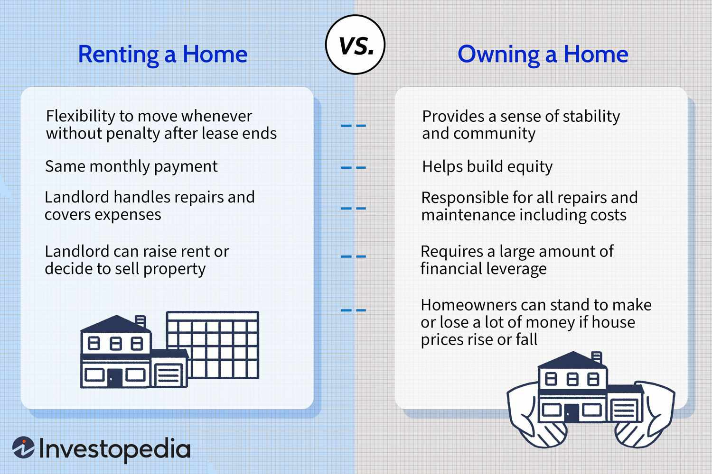

The intersection of rental properties, property management, real estate investment, and algorithmic trading marks a transformative shift in how individuals and organizations approach real estate investment strategies. Traditional real estate methods, which have relied heavily on human intuition and static data points, are rapidly evolving in light of technological advancements. These advancements enable investors to apply data-driven methodologies that enhance market understanding and decision-making processes. By integrating algorithmic trading within real estate investments, stakeholders can utilize sophisticated algorithms that analyze large datasets in real-time, allowing for optimized investment decisions and improved returns on investment. 

Historically, real estate has been viewed as a stable, long-term investment primarily focused on location and market trends. However, the dynamic nature of modern markets, influenced by factors such as economic fluctuations and technological disruptions, necessitates a more adaptive approach. The incorporation of advanced technology into these investment strategies allows for a more nuanced response to market changes. It is crucial for investors and property managers to embrace these changes, as failure to do so could lead to missed opportunities and diminished returns.

This article will explore how each component—rental properties, property management, real estate investment, and algorithmic trading—plays a vital role in creating a robust investment strategy. By examining their convergence, we will highlight the potential for technological innovation to refine and expand traditional real estate practices, ultimately maximizing returns. Covering the fundamentals of rental properties and property management, the intricacies of algorithmic trading, and the challenges associated with integrating these elements, the article seeks to provide a comprehensive overview of how to leverage both traditional and modern tactics for successful real estate investments.

## Table of Contents

## Rental Properties and Real Estate Investment Basics

Rental properties serve as a fundamental element of real estate investment portfolios. As tangible assets, they offer investors a dual opportunity for income generation and capital appreciation. These properties are acquired primarily for leasing to tenants, thereby establishing a steady revenue stream through monthly rental payments. The ongoing demand for rental units and historical trends of property appreciation bolster their attractiveness as long-term investment vehicles.

Investing in rental properties comes with its set of benefits and challenges. One prominent advantage is the consistent cash flow provided by rental income, which can serve as a hedge against market volatility. Additionally, real estate exhibits potential tax advantages, such as depreciation deductions and mortgage interest offsets, which can enhance investors' after-tax returns. As property values tend to increase over time, investors benefit from capital appreciation, adding to the wealth accumulation potential.

However, several challenges must be navigated to ensure profitability. Location is a critical determinant of a property's success, with factors such as proximity to amenities, schools, and employment hubs influencing occupancy rates and rental yield. Market trends also play a pivotal role; for instance, shifts in population demographics and changes in housing demand can impact rental income stability. Financing considerations, such as securing favorable mortgage terms and managing leverage, are essential to optimizing return on investment while minimizing financial strain.

Rental properties generate income primarily through tenant payments, which cover operating expenses like maintenance, property taxes, and insurance. Any surplus after these expenses is the net operating income (NOI), which represents the profitability of the property before debt service and taxes. Over time, as mortgage principal is paid down, equity in the property increases, contributing to net worth growth.

Moreover, property appreciation refers to the increase in property value over time due to factors like market conditions, inflation, and property improvements. This appreciation is realized upon the sale of the property, adding a substantial profit layer beyond the regular income from rent. The interplay of these dynamics underscores the significance of rental properties in comprehensive real estate investment strategies.

## Property Management Essentials

Effective property management is crucial in maximizing returns from rental properties. It encompasses various activities that ensure a property's efficient operation, tenant satisfaction, and compliance with legal requirements. Proper management not only preserves the property's value but also enhances its attractiveness to potential tenants, ultimately leading to increased profitability.

**Tenant Management**

Tenant management involves a range of responsibilities from tenant selection to retention. Selecting the right tenant is foundational, as a reliable tenant ensures consistent rental income and reduces the costs associated with vacancies and evictions. Screening processes typically include credit checks, background checks, and verifying employment and rental history. Tools such as property management software can automate many tasks related to tenant management, from application processing to ongoing communication.

Retaining tenants is equally important. High tenant turnover can lead to increased costs, including those for marketing and repairs. Strategies for improving tenant retention include addressing maintenance requests promptly, engaging in regular communication, and offering lease renewal incentives. Creating a sense of community through tenant events or loyalty programs can also enhance tenant satisfaction.

**Maintenance Management**

Regular maintenance is vital for the continued functionality and aesthetic appeal of a property. It involves scheduled inspections, prompt response to repair requests, and the periodic updating of essential systems (e.g., heating, ventilation, air conditioning). A well-maintained property ensures tenant safety and comfort and can preempt larger, costlier repairs in the future.

Modern tools like predictive maintenance software can optimize this process by using historical data to anticipate future maintenance needs. For instance, scheduling roof inspections and HVAC tune-ups based on past performance and climatic conditions can prevent unexpected breakdowns. Moreover, digital platforms can streamline maintenance request submissions and tracking, leading to quicker response times and improved tenant satisfaction.

**Compliance with Local Regulations**

Ensuring compliance with local regulations is a non-negotiable aspect of property management. This includes adhering to building codes, health and safety regulations, and tenant-landlord laws. Staying informed about changes in legislation is crucial, as non-compliance can result in fines, legal battles, and damage to the property's reputation.

Many property managers use specialized legal services or software solutions to keep abreast of regulatory changes and ensure that the property remains compliant. Additionally, maintaining clear and accurate records of all transactions and communications with tenants can provide legal protection and facilitate regulatory compliance.

**Enhancing Property Value and Tenant Satisfaction**

Strategic improvements and enhancements can significantly increase a property's value and tenant satisfaction. Renovations that improve energy efficiency, such as installing double-glazed windows or energy-efficient appliances, are attractive to environmentally conscious tenants and can reduce utility costs. Additionally, aesthetic upgrades like landscaping or modernizing interiors can increase curb appeal and tenant satisfaction.

Employing smart technology is another strategy. Smart locks, thermostats, and security systems offer tenants convenience and safety, making properties more appealing. Moreover, allowing tenants some degree of personalization, such as paint choices or flexible lease terms, can increase tenant satisfaction and retention.

In conclusion, effective property management harmonizes operational excellence with strategic enhancements to maximize returns and tenant satisfaction. By focusing on tenant management, maintenance, compliance, and value-added upgrades, property managers can significantly improve the performance and profitability of rental properties.

## Leveraging Algorithmic Trading in Real Estate

Algorithmic trading, also known as algo trading, is a method of executing orders using automated pre-programmed trading instructions accounting for variables such as time, price, and [volume](/wiki/volume-trading-strategy). Its origins date back to the late 20th century, when financial markets began to embrace technology to enhance trading efficiency and effectiveness. With the rapid advancement of computer technology in the 1970s and 1980s, financial markets saw the introduction of computerized trading systems that evolved over time into highly sophisticated algorithms leveraging vast data sets to optimize trade execution.

The application of [algorithmic trading](/wiki/algorithmic-trading) principles to real estate investments is an emerging trend that aims to harness the power of data analytics and automated systems to enhance decision-making processes. By applying algorithms to assess market trends, property values, and other economic indicators, investors can make more informed decisions regarding property acquisitions and portfolios. This approach is a natural progression for the real estate sector, where data has historically played a crucial role in guiding investment decisions.

Algorithms can provide investors with enhanced data-driven insights by processing vast amounts of information more quickly and accurately than traditional methods. For instance, algorithms can analyze trends in property prices, rental yields, demographic shifts, zoning laws, and economic indicators, offering predictive analytics that help investors anticipate market movements. This application mitigates some of the subjective biases inherent in human analysis and introduces a level of precision that can substantially improve investment outcomes.

Using algorithms in real estate allows for more dynamic and responsive investment strategies. For example, an algorithm could be designed to generate real-time alerts regarding potential investment opportunities based on predefined criteria, such as a desirable cap rate or a significant change in local housing demand. This immediate access to analytical insights equips investors with the means to react swiftly to market opportunities or risks, enhancing their ability to maximize returns while minimizing exposure to unfavorable market conditions.

The integration of algorithmic trading in real estate is facilitated by technological advancements, particularly in [machine learning](/wiki/machine-learning) and [artificial intelligence](/wiki/ai-artificial-intelligence). These technologies enable the development of increasingly complex algorithms capable of uncovering patterns and relationships in data that might remain hidden through conventional analysis. For instance, machine learning algorithms can be employed to forecast long-term property value appreciation by evaluating historical data alongside current market trends and conditions.

Moreover, platforms and tools specifically tailored for algorithmic trading in real estate are becoming more prevalent. These tools allow investors to customize algorithms to suit their specific investment objectives and risk tolerances. As these technologies continue to evolve, they are likely to offer even greater precision and efficiency in real estate investment.

In summary, the incorporation of algorithmic trading into real estate investment practices represents a significant advancement in the pursuit of data-driven decision-making and market analysis. By leveraging algorithms, investors can achieve more accurate forecasts, enhance their strategic responsiveness, and ultimately optimize their investment portfolios.

## Combining Real Estate Investment with Algorithmic Trading

Integrating algorithmic trading with real estate investment offers numerous opportunities to optimize returns. By leveraging algorithmic systems, investors can take advantage of data analytics, pattern recognition, and automated decision-making to enhance real estate investment strategies. Algorithms employ statistical models to forecast market trends, manage risk, and identify lucrative opportunities quickly and efficiently.

### Integration Benefits

1. **Data-Driven Insights**: Algorithms can process vast amounts of data, identifying patterns and trends in real estate markets that might be overlooked by human analysis. This can include property price movements, rental yield fluctuations, and macroeconomic indicators. Data-driven insights help investors make more informed decisions.

2. **Risk Management**: Algorithms can be programmed to assess and mitigate risks, ensuring that investments are protected under volatile market conditions. By continuously monitoring market conditions, algorithms can adjust investment strategies in real-time to avoid potential losses.

3. **Efficient Portfolio Management**: Automating aspects of portfolio management allows for more dynamic asset allocation. By using predictive analytics, algorithms can suggest when to buy, hold, or sell real estate assets, optimizing the portfolio's performance.

### Case Studies

Several firms have successfully integrated algorithmic trading into their real estate investment strategies:

- **RealtyMogul**: This platform uses machine learning algorithms to evaluate crowdfunding opportunities in real estate. By analyzing historical data, market trends, and other key metrics, RealtyMogul's algorithms aim to predict and enhance investment returns for its users.

- **Fundrise**: Known for revolutionizing the real estate investment trust (REIT) with a technological edge, Fundrise utilizes algorithms to manage asset selection, thereby significantly improving both the acquisition strategy and asset performance across their properties.

### Technological Tools and Platforms

Advancements in technology have given rise to sophisticated tools and platforms that aid the integration process:

- **Python Libraries**: Libraries such as `pandas`, `NumPy`, and `Scikit-learn` offer functionalities for data analysis, statistical models, and machine learning processes, vital for developing custom algorithms for real estate investments.

- **Blockchain Technology**: Blockchain facilitates transparent and secure real estate transactions. Platforms using blockchain can effectively integrate algorithmic systems for enhanced transaction security and process efficiency.

- **AI and Machine Learning Platforms**: Platforms such as Google AI and IBM Watson provide advanced analytical tools that support machine learning, assisting in the development of predictive models for real estate investments.

By combining the precision of algorithmic trading with the diverse opportunities in real estate, investors can enhance their capability to maximize returns while effectively managing risk. As technology continues to evolve, these integrations are expected to become increasingly sophisticated, offering even greater potential for innovative investment strategies.

## Challenges and Risks in Real Estate and Algo Trading

Investing in rental properties and engaging in algorithmic trading each come with their own sets of challenges and inherent risks. Understanding these challenges is crucial for investors looking to maximize their returns while mitigating potential downsides.

### Potential Risks in Rental Property Investments

**1. Economic Factors:**

The real estate market is heavily influenced by macroeconomic indicators such as interest rates, employment rates, and overall economic growth. High-interest rates, for instance, can increase the cost of borrowing, making real estate investments less attractive. Conversely, in a booming economy, property values and rental demands may rise, positively affecting investment returns.

**2. Market Volatility:**

Real estate markets are subject to fluctuations that can affect property values and rental income. Factors such as demographic shifts, changes in consumer preferences, and unexpected economic downturns can lead to market [volatility](/wiki/volatility-trading-strategies). Investors need to be prepared for periods of low occupancy rates or declining property values.

**3. Regulatory Considerations:**

Rental property investments are subject to various local, state, and federal regulations. These include zoning laws, rent control ordinances, and health and safety standards. Adhering to these regulations is essential, as non-compliance can result in fines and legal issues that can erode profitability.

### Potential Risks in Algorithmic Trading

**1. Technological Dependence:**

Algorithmic trading relies heavily on technology; issues such as software glitches, network disruptions, or hardware failures can lead to significant financial losses. Ensuring a robust technology infrastructure and having contingency plans is vital.

**2. Market Volatility:**

Similar to real estate, financial markets are prone to volatility triggered by economic events, geopolitical tensions, or sudden market movements. Algorithms that aren't designed to account for such volatility might execute trades at inopportune times, exacerbating losses.

**3. Regulatory Challenges:**

Financial markets are subject to a stringent regulatory environment that is continuously evolving. Compliance with regulations such as the Dodd-Frank Act in the United States or the Markets in Financial Instruments Directive (MiFID II) in Europe is necessary to avoid penalties.

### Strategies for Risk Management and Mitigation

**1. Diversification:**

Diversifying investments across different asset classes, geographical locations, and market sectors can reduce risk. In real estate, this might mean investing in a mix of residential, commercial, and industrial properties. In algorithmic trading, it implies varying trading strategies and assets.

**2. Data-Driven Decision Making:**

Leveraging data analytics can help investors make informed decisions by identifying trends and predicting market movements. Using historical data, investors can simulate various scenarios to prepare for potential risks.

**3. Incorporating Stop-Loss Orders:**

In algorithmic trading, implementing stop-loss orders can protect against significant losses by automatically exiting a position when it reaches a predetermined loss threshold.

**4. Continuous Monitoring and Adjustment:**

Markets are dynamic, and continuous monitoring of investment performance is crucial. For rental properties, this might involve regular assessment of property condition and market rents. For algorithmic trading, it involves adjusting algorithms based on back-testing results and current market conditions.

**5. Legal and Regulatory Compliance:**

Staying informed about changes in laws and regulations is crucial for both real estate and trading investments. Engaging with legal experts can ensure compliance and prevent potential legal issues.

By carefully assessing these risks and implementing effective management strategies, investors can protect their portfolios and enhance the potential for achieving robust returns in both rental property investments and algorithmic trading.

## Conclusion

In summary, rental properties remain a fundamental pillar of real estate investment portfolios, offering both income generation and potential appreciation. The role of effective property management is crucial in optimizing these returns, ensuring tenant satisfaction, maintaining property standards, and adhering to regulatory requirements. While traditional real estate strategies provide a robust framework for investment, the introduction of algorithmic trading into this domain offers new avenues for enhancing decision-making through data-driven analysis.

Algorithmic trading, rooted in financial markets, provides the capability to analyze vast datasets and identify patterns that may not be immediately discernible to human analysts. Integrating these insights with real estate investments can enable investors to anticipate market shifts more accurately and make informed decisions swiftly. The convergence of traditional methods with advanced technological tools represents a significant evolution in investment strategies.

To achieve maximized investment success, it is essential to blend conventional real estate approaches with emerging technological advancements. This integration not only enhances the predictability and efficiency of investments but also ensures that investors are well-positioned to capitalize on emerging opportunities. Furthermore, the importance of ongoing learning and adaptation to market dynamics cannot be overstated. As market conditions and technological landscapes evolve, continuous education and strategic adaptability are vital for sustained growth and resilience in the competitive world of real estate investment.

## References & Further Reading

[1]: Bergstra, J., Bardenet, R., Bengio, Y., & Kégl, B. (2011). ["Algorithms for Hyper-Parameter Optimization."](https://proceedings.neurips.cc/paper/2011/file/86e8f7ab32cfd12577bc2619bc635690-Paper.pdf) Advances in Neural Information Processing Systems 24.

[2]: ["Advances in Financial Machine Learning"](https://www.amazon.com/Advances-Financial-Machine-Learning-Marcos/dp/1119482089) by Marcos Lopez de Prado

[3]: ["Evidence-Based Technical Analysis: Applying the Scientific Method and Statistical Inference to Trading Signals"](https://www.amazon.com/Evidence-Based-Technical-Analysis-Scientific-Statistical/dp/0470008741) by David Aronson

[4]: ["Machine Learning for Algorithmic Trading"](https://github.com/stefan-jansen/machine-learning-for-trading) by Stefan Jansen

[5]: ["Quantitative Trading: How to Build Your Own Algorithmic Trading Business"](https://www.amazon.com/Quantitative-Trading-Build-Algorithmic-Business/dp/1119800064) by Ernest P. Chan