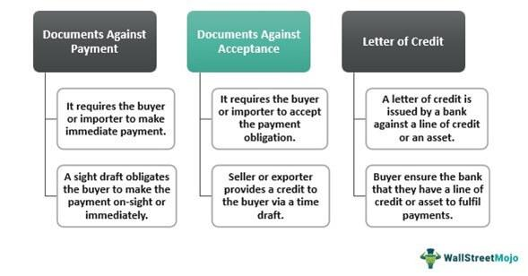

## Table of Contents

## What is an at sight payment?

An at sight payment is a type of payment where the money is paid immediately when the payment is due. It is often used in international trade, where the buyer pays the seller as soon as the goods are received or the documents are presented.

This type of payment is also known as a sight draft or a demand draft. It is different from other types of payments where the buyer might have some time before they need to pay, like with a deferred payment. At sight payments help make sure that the seller gets their money quickly and safely.

## How does an at sight payment work?

An at sight payment is a way of paying where the buyer gives the money to the seller right away when they get the goods or the documents. This kind of payment is often used when people buy and sell things from different countries. The seller sends the goods and the documents to the buyer. When the buyer gets them, they need to pay the seller immediately.

To make an at sight payment, the seller usually works with a bank. The seller gives the bank the documents that show the goods have been sent. The bank then gives these documents to the buyer, but only after the buyer pays the full amount of money. This way, the seller knows they will get paid as soon as the buyer gets the goods, which makes the trade safe and quick.

## What are the basic advantages of using at sight payments?

At sight payments help make sure that the seller gets their money quickly. When the buyer gets the goods or the documents, they have to pay right away. This is good for the seller because they don't have to wait a long time to get paid. It makes the seller feel safe because they know they will get their money as soon as the buyer gets what they bought.

At sight payments also make things clear and simple for both the buyer and the seller. The rules are easy to understand: the buyer pays when they get the goods. This can help avoid problems and disagreements about when the payment should happen. It's a straightforward way to do business, especially when buying and selling things from different countries.

## What are the basic disadvantages of using at sight payments?

At sight payments can be hard for the buyer because they have to pay right away when they get the goods or documents. This means the buyer needs to have all the money ready before they can get what they bought. If the buyer doesn't have enough money at that time, they might not be able to buy the things they need. This can be a problem, especially if the buyer is waiting for money from somewhere else.

Another problem with at sight payments is that they can be risky for the buyer. Since the buyer has to pay before they can check the goods carefully, there's a chance that the goods might not be what they expected. If the goods are damaged or not what was promised, the buyer has already paid and might have a hard time getting their money back. This can make buyers feel unsure about using at sight payments, especially if they don't fully trust the seller.

## How do at sight payments affect cash flow for businesses?

At sight payments can be tough on a business's cash flow. When a business uses at sight payments, they have to pay right away when they get the goods or documents. This means they need to have all the money ready before they can get what they ordered. If the business doesn't have enough money at that time, they might not be able to buy the things they need. This can slow down their work and make it hard to keep things running smoothly.

On the other hand, at sight payments can help a business get paid quickly if they are the seller. When a business sells something and uses at sight payments, they get their money as soon as the buyer gets the goods. This can help the business have more money to use right away. It can make it easier for them to buy what they need for their next project or to keep their business going without waiting a long time for payment.

## In what scenarios are at sight payments most beneficial?

At sight payments are most helpful for sellers who need to get their money quickly. When a seller uses at sight payments, they get paid as soon as the buyer gets the goods or documents. This is good for businesses that don't have a lot of money to wait for payments. It helps them have cash right away to use for other things they need, like buying more supplies or paying their workers.

Buyers might also find at sight payments useful if they have enough money ready and want to get their goods quickly. If a buyer knows they can pay right away, they can get what they ordered without waiting. This can be important for businesses that need things fast to keep their work going smoothly. But, buyers need to be sure they trust the seller and that the goods are what they expect, since they have to pay before they can check everything carefully.

## What risks do businesses face when using at sight payments?

Businesses that use at sight payments face risks, especially if they are the buyers. When a buyer has to pay right away upon receiving the goods or documents, they might not have enough money ready. This can be a big problem if they were expecting money from somewhere else that hasn't come yet. If they can't pay, they might not get the goods they need, which can slow down their work and cause other problems.

Another risk is that the goods might not be what the buyer expected. Since payment happens before the buyer can fully check the goods, there's a chance the goods could be damaged or not what was promised. If this happens, the buyer has already paid and might find it hard to get their money back. This can make buyers feel unsure about using at sight payments, especially if they don't fully trust the seller.

For sellers, the main risk is that the buyer might refuse to pay even after receiving the goods or documents. While at sight payments are meant to ensure quick payment, there can still be disagreements or issues that lead to delays or non-payment. This can affect the seller's cash flow and make it harder for them to plan their business activities.

## How do at sight payments compare to other payment methods like letters of credit?

At sight payments are different from letters of credit in how and when the buyer pays the seller. With at sight payments, the buyer has to pay right away when they get the goods or documents. This means the seller gets their money quickly, but the buyer needs to have all the money ready before they can get what they ordered. On the other hand, a letter of credit is a promise from a bank that the buyer will pay the seller. The bank checks the documents and pays the seller only after everything is right. This can take more time, but it gives the buyer some protection because they don't have to pay until the bank says it's okay.

Both at sight payments and letters of credit have their own good points and risks. At sight payments are good for sellers who need their money fast and for buyers who can pay right away and want their goods quickly. But, buyers have to be careful because they pay before they can fully check the goods, and there's a risk the goods might not be what they expected. Letters of credit are safer for buyers because the bank makes sure everything is right before anyone pays. This can help avoid problems, but it might take longer for the seller to get their money, which can be hard if they need it quickly.

## What are the legal and regulatory considerations for at sight payments?

When businesses use at sight payments, they need to follow the rules and laws of the countries where they are doing business. These rules can be different in each country and can affect how at sight payments work. For example, some countries might have strict rules about how money can be moved across borders. Businesses need to make sure they know and follow these rules to avoid problems. They might also need to work with banks or other financial services that understand these rules and can help them do things the right way.

Another important thing to think about is the contract between the buyer and the seller. The contract should clearly say that the payment will be at sight and explain what that means. It should also say what happens if there are problems, like if the goods are not what the buyer expected. Having a good contract can help avoid disagreements and make sure both the buyer and the seller know what to expect. If there are any legal problems, the contract can be very important in deciding who is right.

## How can businesses mitigate the risks associated with at sight payments?

To lower the risks of at sight payments, businesses can take some important steps. First, they should make sure they have a strong contract with the other party. The contract should clearly say that payment will be at sight and explain what that means. It should also say what happens if there are problems, like if the goods are not what the buyer expected. Having a good contract can help avoid disagreements and make sure both the buyer and the seller know what to expect. If there are any legal problems, the contract can be very important in deciding who is right.

Another way to reduce risks is by working with a trusted bank or financial service. Banks can help make sure that at sight payments are done safely and correctly. They can check the documents and make sure the money is moved the right way. This can be especially helpful if the buyer and seller are in different countries, where there might be different rules about moving money. By using a bank, businesses can feel more sure that they will get their money or their goods without big problems.

## What impact do at sight payments have on international trade?

At sight payments help make international trade quicker and easier for sellers. When a seller uses at sight payments, they get their money right away as soon as the buyer gets the goods or documents. This is good for sellers because they don't have to wait a long time to get paid. It helps them have the money they need to keep their business going and to buy more things to sell. For countries that sell a lot of goods to other countries, at sight payments can help their businesses grow faster and make more money.

For buyers, at sight payments can be harder. They have to pay right away when they get the goods or documents, so they need to have all the money ready before they can buy what they need. If they don't have enough money at that time, they might not be able to buy the things they want. Also, buyers have to be careful because they pay before they can fully check the goods. If the goods are not what they expected, they might have a hard time getting their money back. This can make some buyers feel unsure about using at sight payments, especially if they don't fully trust the seller.

## How do technological advancements influence the use and efficiency of at sight payments?

Technology has made at sight payments easier and quicker. With new technology, businesses can send and get money faster than before. They can use online banking and electronic payments to move money right away when the buyer gets the goods or documents. This helps sellers get their money quickly and makes it easier for buyers to pay right away. Also, technology like blockchain can make at sight payments safer because it keeps a clear record of all the payments and makes it hard for anyone to change it.

Technology also helps businesses keep track of their payments and goods better. With digital systems, businesses can see where their money and goods are at any time. This can help them plan better and make sure they have enough money ready for at sight payments. Using technology can also help businesses talk to each other more easily, so they can solve any problems quickly. This makes at sight payments work better and helps businesses trust each other more when they are buying and selling things from different countries.

## What are the disadvantages of at sight payments?

Immediate payment demands associated with at sight payments can present significant challenges for buyers, particularly in transactions involving substantial sums. When large amounts are due immediately, buyers may face [liquidity](/wiki/liquidity-risk-premium) constraints that strain their cash flow. This immediate requirement can deter companies from venturing into at sight agreements, especially if they lack sufficient liquid assets or access to quick financing options.

Currency fluctuations introduce another layer of complexity to at sight payments. Since these contracts often occur in international trade, the time between the issuance of at sight terms and the final settlement can expose both parties to currency exchange risks. For example, if a buyer commits to an at sight payment in a foreign currency and that currency appreciates against their home currency before settlement, the buyer could incur higher costs. This [volatility](/wiki/volatility-trading-strategies) can be quantified using the formula:

$$
\text{Exchange Rate Impact} = \left( \text{Final Exchange Rate} - \text{Initial Exchange Rate} \right) \times \text{Transaction Amount}
$$

Where:
- **Final Exchange Rate** is the rate at the time of payment.
- **Initial Exchange Rate** is the rate at the issuance of the payment terms.
- **Transaction Amount** is the value of the transaction in the foreign currency.

Administrative processes associated with at sight payments can also create bottlenecks. The prompt nature of these transactions necessitates that all documentation is accurate and swiftly processed to avoid delays. Any hiccup in documentation, whether due to incorrect information or slow processing times, can hinder the release of goods, causing operational setbacks for businesses. The pressure to meet tight deadlines for documentation can strain administrative resources and create inefficiencies, especially if multiple departments or cross-border coordination are involved. 

Recognizing these potential drawbacks is crucial for buyers as they consider participating in at sight payment agreements. Understanding and mitigating these risks can help in devising strategies to maintain financial stability and operational efficiency during such transactions.

## References & Further Reading

[1]: ["The Basics of Algorithmic Trading"](https://www.investopedia.com/articles/active-trading/101014/basics-algorithmic-trading-concepts-and-examples.asp) - Investopedia

[2]: Lam, W. R. W., & Tam, C. S. (2011). ["Algorithmic Trading and Its Implications on Conventional Trading Methods and Market Efficiency."](https://en.wikipedia.org/wiki/Rosaceae) Procedia Computer Science, 7.

[3]: ["Mastering Bitcoin: Unlocking Digital Cryptocurrencies"](https://www.amazon.com/Mastering-Bitcoin-Unlocking-Digital-Cryptocurrencies/dp/1449374042) by Andreas M. Antonopoulos

[4]: Chiu, J. (2016). ["Understanding At-Sight Payments and Their Challenges."](https://www.emerald.com/insight/content/doi/10.1108/apjie-08-2017-029/full/html) Journal of International Trade Law and Policy.

[5]: ["Automated Trading with R: Quantitative Research and Platform Development"](https://link.springer.com/book/10.1007/978-1-4842-2178-5) by Chris Conlan