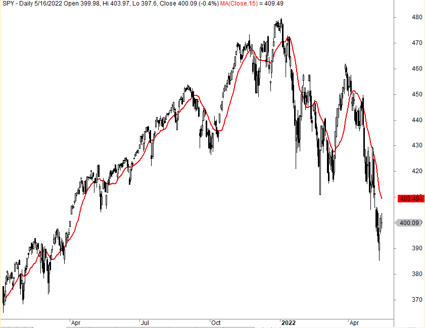

The Simple Moving Average (SMA) is a fundamental indicator widely used in algorithmic trading to analyze price data by generating a smoothed price trend over a specified period. It is calculated as the arithmetic mean of a given set of prices, typically closing prices, over a specific number of periods. For example, a 10-day SMA is calculated by summing the closing prices of a financial instrument over the last ten days and dividing by ten. This basic yet effective tool assists traders in recognizing the underlying trends in financial markets, which can be pivotal for making informed trading decisions.

Moving averages, such as the SMA, play a crucial role in identifying trends by filtering out the "noise" created by short-term price volatility. They transform raw price data into a more digestible form, enabling traders to determine the overall direction of the market. By doing so, SMAs help traders to observe whether an asset is generally moving upward, downward, or sideways over time, providing essential insights to support strategic decisions in buying, selling, or holding assets.



However, there is an ongoing debate regarding the advantages and disadvantages of using SMAs in trading. Proponents of the SMA argue that its simplicity and ease of interpretation make it an excellent tool for beginners and experienced traders alike. It provides a clear, visual means of assessing price trends. Critics, on the other hand, point out the inherent lag in SMAs due to their equal weighting of past data points, which can delay reaction times to new market trends. Additionally, the reliance on outdated data can result in missed opportunities during rapid price movements. This debate underscores the notion that while SMAs offer valuable insights into market trends, their effectiveness largely depends on the context and specific trading strategies employed by individuals.

## Table of Contents

## Understanding Simple Moving Average

The Simple Moving Average (SMA) is a widely-used technical analysis tool that provides a clear depiction of market trends by smoothing out price data over a specific period. The SMA is calculated by taking the arithmetic mean of a set number of prices, typically closing prices, over a defined time frame. The formula for calculating a 𝑛-day SMA can be expressed as:

$$
SMA_t = \frac{P_t + P_{t-1} + \ldots + P_{t-(n-1)}}{n}
$$

where $SMA_t$ represents the Simple Moving Average at time $t$, and $P$ denotes the closing price.

Different time frames are utilized when employing the SMA, with common periods including 5-day, 10-day, 50-day, and 200-day averages. A 5-day SMA, for example, would compute the average of the closing prices of the last five days, recalculating this every day as new price data comes in. This type of short-term SMA may be preferred in fast-moving markets where quick trend identifications are essential. Conversely, a 200-day SMA considers a broader time horizon, making it better suited for identifying longer-term trends and smoothing out more [volatility](/wiki/volatility-trading-strategies).

The main advantage of using an SMA lies in its ability to reduce short-term price fluctuations, effectively smoothing the data. This smoothing process helps traders distinguish real price trends from random noise or temporary price spikes. By providing a clear trend line, the SMA assists traders in making informed decisions, as it becomes easier to recognize whether the market is trending upwards, downwards, or sideways. Such simplicity does not only help in spotting trends but also aids in visualization, making the SMA a basic yet powerful tool for analyzing financial markets.

## Advantages of Using SMA in Trading

The Simple Moving Average (SMA) is a fundamental tool in [algorithmic trading](/wiki/algorithmic-trading), providing a smoothed representation of price data that reduces the noise created by short-term market fluctuations. By calculating the arithmetic mean of a specified number of past data points, the SMA effectively eliminates erratic price movements and presents a clearer view of the market trend. This smoothing effect allows traders to discern underlying trends that might otherwise be obscured by the day-to-day volatility of financial markets. 

The simplicity and ease of interpretation offered by the SMA make it a favored tool among traders. The calculation of an SMA can be expressed with the formula: 

$$
SMA = \frac{P_1 + P_2 + ... + P_n}{n}
$$

where $P_1, P_2, ..., P_n$ are the closing prices of a security over $n$ periods. This straightforward calculation provides traders with a quick and easy method for analyzing market movements and makes the SMA a suitable tool for traders at all levels of expertise.

Additionally, the SMA serves as a significant indicator for identifying support and resistance levels. In technical analysis, a support level is a price point where a downward trend can be expected to pause due to demand concentration, while a resistance level is a price point where an upward trend is likely to stall as a result of a supply concentration. SMAs can highlight these critical levels, as prices tend to bounce off the SMA line when approaching support or resistance zones. Traders often use SMAs to observe the crossing patterns of price and average lines. For instance, when a security's price crosses above its SMA, it might suggest a potential upward shift in [momentum](/wiki/momentum), indicating a support level. Conversely, when the price falls below the SMA, it may indicate the presence of resistance.

Overall, the advantages of the SMA in providing a visual and analytical tool for understanding market trends, combined with its role in identifying pivotal price levels, make it a key element in a trader's analytical toolbox.

## Disadvantages of Using SMA in Trading

The Simple Moving Average (SMA) is a popular tool in algorithmic trading due to its ability to simplify price data by creating a constant line that represents the average price over a specific number of periods. However, it has certain disadvantages that traders should consider when employing it as part of their strategy.

One of the primary drawbacks of SMA is the lag effect inherent in its calculation, as it assigns equal weight to all data points within the chosen period. The formula for SMA can be expressed as:

$$
\text{SMA} = \frac{P_1 + P_2 + \cdots + P_n}{n}
$$

where $P_1, P_2, \ldots, P_n$ are the prices at each period and $n$ is the total number of periods. This equal weighting means that SMA reacts slower to recent price movements, which can be a disadvantage in rapidly changing markets. As markets move quickly, the SMA may be slow to catch up with the latest price trends, potentially leading to missed trading opportunities.

Moreover, the reliance on outdated data can be seen as a significant limitation of SMA, particularly in volatile or fast-paced markets where prices can change direction swiftly. The equal weighting given to all data points implies that older price data, possibly irrelevant to the current market context, can skew the SMA. As such, newly emerging trends may not be promptly reflected in the moving average, compromising the trader's ability to make timely decisions.

Critics argue that the use of SMA might not be as effective in markets where prices are sensitive to recent events or news and require a quicker response mechanism. While SMA provides a general idea of the market direction, its inability to adapt quickly to short-term changes can diminish its effectiveness as a trading indicator.

Therefore, while the SMA is a helpful tool for simplifying price data and smoothing out trends, traders must carefully consider its lag effect and ponder whether it aligns with their trading objectives and the market conditions they are dealing with.

## Comparison: SMA vs. Exponential Moving Average (EMA)

### Comparison: SMA vs. Exponential Moving Average (EMA)

The Simple Moving Average (SMA) and the Exponential Moving Average (EMA) are both pivotal tools for analyzing trends in financial markets. However, they incorporate data differently and serve distinct purposes for traders.

The SMA calculates the average of price data over a specific period with equal weighting for all data points. For instance, a 10-day SMA is computed as:

$$
\text{SMA}_{10} = \frac{P_1 + P_2 + \cdots + P_{10}}{10}
$$

where $P_i$ represents the price at day $i$. This equal weighting makes SMA a straightforward tool to smooth price action and discern longer-term trends without short-term fluctuations.

In contrast, the EMA assigns exponentially decreasing weights to older price data, giving more importance to the recent prices. The general formula for EMA is:

$$
\text{EMA}_{t} = \left( \frac{2}{N+1} \right) \times (P_t - \text{EMA}_{t-1}) + \text{EMA}_{t-1}
$$

where $N$ is the number of days, $P_t$ is the price at current time $t$, and EMA$_{t-1}$ is the EMA calculated for the previous time period. The sensitivity of EMA to recent prices allows it to react quickly to market changes, making it suitable for traders focusing on short-term price movements. This adaptability makes EMA preferable in scenarios where market conditions are fast-changing, or when traders need to capture momentum shortly after it begins.

While the EMA is responsive to new price alterations, the SMA offers steadiness by moderating the influence of sudden price shifts, which may be anomalies rather than indicators of real trend change. This aspect of SMA renders it a reliable tool for long-term traders who seek to confirm consistent patterns without reacting to transient market noise. By smoothing out volatility, SMA supports the identification of sustainable trends that align with strategic objectives.

Both SMA and EMA offer valuable perspectives, yet a trader's choice between them should hinge on their specific trading frames and styles. EMA is preferred when sensitivity to price movement is critical; SMA is advantageous for maintaining a stable depiction of general market trends. These characteristics define their respective strengths and ideal applications in varied trading scenarios.

## Simple Moving Average Trading Strategies

In algorithmic trading, strategies based on Simple Moving Averages (SMA) are widely used for their straightforwardness in identifying market trends and generating trading signals. One popular strategy involves the use of SMA crossovers to determine optimal entry and [exit](/wiki/exit-strategy) points in the market. This strategy employs two SMA lines with different time frames, often a shorter-term SMA and a longer-term SMA. For example, a trader might use a 50-day SMA and a 200-day SMA. A common signal is generated when the short-term SMA crosses above the long-term SMA, known as a "golden cross," indicating a potential buy opportunity. Conversely, a "death cross" occurs when the short-term SMA crosses below the long-term SMA, suggesting a sell signal.

Utilizing multiple SMAs with various time frames is another tactic to confirm market trends. Traders might observe a combination of 5-day, 10-day, and 50-day SMAs to gauge both short-term fluctuations and medium-term trends more accurately. The alignment of these SMAs, where a shorter-term SMA is above longer-term ones, could provide confirmation of an uptrend, while the reverse alignment might indicate a downtrend.

To enhance the predictive power of SMAs, traders often integrate them with other technical indicators. For instance, combining SMA with a Relative Strength Index (RSI) can offer insights into both the trend direction and the momentum of price changes. A strategy might involve looking for convergence between an oversold level in the RSI and a bullish crossover on SMAs as a robust buy signal. Similarly, using SMAs with [volume](/wiki/volume-trading-strategy) indicators can help confirm the legitimacy of a price move, as a crossover with high trading volumes may indicate stronger confirmation of a trend or reversal.

Additionally, incorporating SMAs into programming algorithms allows automated execution of these strategies. Here is a basic Python example illustrating an SMA crossover strategy using the pandas library:

```python
import pandas as pd

# Sample data: 'data' is a DataFrame with a 'Close' column of closing prices
data = pd.read_csv('sample_stock_data.csv')

# Calculate SMAs
data['SMA_50'] = data['Close'].rolling(window=50).mean()
data['SMA_200'] = data['Close'].rolling(window=200).mean()

# Identify crossover points
data['Signal'] = 0  # Default signal
data.loc[data['SMA_50'] > data['SMA_200'], 'Signal'] = 1  # Buy signal
data.loc[data['SMA_50'] < data['SMA_200'], 'Signal'] = -1  # Sell signal

# Print resulting data with signals
print(data[['Close', 'SMA_50', 'SMA_200', 'Signal']])
```

This script calculates the 50-day and 200-day SMAs for a given stock's closing prices and generates buy or sell signals based on the crossover condition. Strategies like this can be back-tested on historical data to evaluate their effectiveness before applying them to live trading environments.

## Practical Considerations and Tips

Choosing the appropriate Simple Moving Average (SMA) period is crucial, as it should align with an individual's trading style. For short-term traders, shorter time frames like 5-day or 10-day SMAs offer responsiveness to recent price movements. In contrast, long-term investors might benefit from longer periods like 50-day or 200-day SMAs, which emphasize overarching trends and smooth out daily volatility.

Back-testing SMA strategies on historical data is indispensable. Historical testing allows traders to gauge how well an SMA strategy would have performed under previous market conditions. By simulating trades using historical data, traders can evaluate the effectiveness of their SMA choices and refine their strategies. Python offers effective libraries like pandas and [backtrader](/wiki/backtrader) that streamline this process. For example, using pandas to calculate and visualize an SMA might look like this:

```python
import pandas as pd
import matplotlib.pyplot as plt

# Assuming 'data' is a DataFrame with a 'Close' column
data['SMA_50'] = data['Close'].rolling(window=50).mean()

plt.figure(figsize=(12,6))
plt.plot(data['Close'], label='Close Price')
plt.plot(data['SMA_50'], label='50-Day SMA', color='orange')
plt.legend(loc='best')
plt.title('50-Day Simple Moving Average')
plt.show()
```

Another key consideration is the necessity of adjusting SMA settings in response to evolving market environments. Markets are dynamic, influenced by economic indicators, geopolitical events, and investor sentiment. An SMA period that performed well in one market condition may not necessarily excel in another. Traders should continually evaluate their strategies, being open to modifying time frames or combining SMAs with other indicators for enhanced accuracy.

Adaptability in analyzing past performance and recalibrating strategies according to market shifts is a hallmark of successful trading. Through careful selection, testing, and adjustment of SMA strategies, traders can better position themselves to achieve their financial objectives.

## Conclusion

In conclusion, the Simple Moving Average (SMA) remains a fundamental tool in the arsenal of traders due to its ability to smoothen price data and highlight trends. One of its primary advantages is its simplicity and ease of interpretation, which makes it accessible even to novice traders. SMA's capability to offer a clearer view of the price movement by reducing short-term market noise is invaluable for identifying support and resistance levels. However, these advantages are paired with notable disadvantages, such as the lag effect created by equal weighting of past data points. This lag can result in missed opportunities, particularly in rapidly changing markets, and can render the SMA less responsive to newly emerging trends because of its reliance on historical data.

The choice of whether to use SMA or other moving averages, such as the Exponential Moving Average (EMA), largely hinges on individual trading goals and the specific market conditions. For instance, traders seeking a more agile response to price changes might prefer EMA, which weights recent prices more heavily. Conversely, those with a long-term perspective might find the stability of SMA more suitable.

Ultimately, it is recommended that traders experiment with incorporating SMAs into their trading systems. By back-testing SMA strategies on historical data and continuously reviewing their outcomes in live trading, traders can better understand the nuances of this tool and adjust their usage to align with their unique trading objectives and market environments.

## References & Further Reading

[1]: Murphy, J. J. (1999). ["Technical Analysis of the Financial Markets: A Comprehensive Guide to Trading Methods and Applications."](https://archive.org/details/technicalanalysi0000murp) New York Institute of Finance.

[2]: Pring, M. J. (2002). ["Technical Analysis Explained: The Successful Investor's Guide to Spotting Investment Trends and Turning Points."](https://www.amazon.com/Technical-Analysis-Explained-Fifth-Successful/dp/0071825177) McGraw-Hill Education.

[3]: Pardo, R. (2008). ["The Evaluation and Optimization of Trading Strategies."](https://onlinelibrary.wiley.com/doi/book/10.1002/9781119196969) Wiley.

[4]: Zhang, L., & Kirilenko, A. (2014). ["Social Media Sentiment and Market Behavior."](https://www.mdpi.com/2673-8392/4/4/104) Available at SSRN 2710277.

[5]: Achelis, S. B. (2000). ["Technical Analysis from A to Z."](https://www.mhebooklibrary.com/doi/book/10.1036/9780071380119) McGraw-Hill Education.