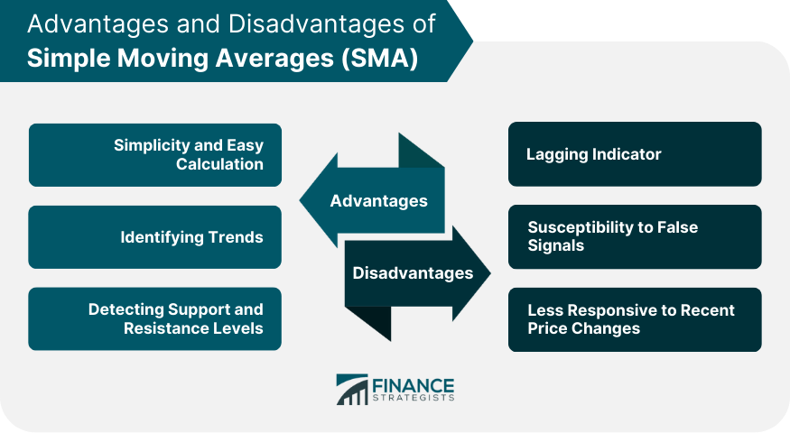

## Table of Contents

## What is a Simple Moving Average (SMA)?

A Simple Moving Average (SMA) is a way to smooth out price data over a certain period of time. It's like taking the average price of something, like a stock, over a set number of days. For example, if you want to find the 10-day SMA, you add up the closing prices of the stock for the last 10 days and then divide by 10. This gives you a single number that represents the average price over those 10 days.

SMAs are used by people who invest in stocks or trade in the market to help them make decisions. They can show if a stock's price is going up or down over time. If the SMA is going up, it might mean the stock's price is increasing, and if it's going down, the price might be decreasing. This can help investors see trends and decide when to buy or sell a stock.

## How is a Simple Moving Average calculated?

To calculate a Simple Moving Average (SMA), you start by choosing a time period, like 10 days, 50 days, or 200 days. Once you've picked your time period, you add up the closing prices of the stock for each of those days. For example, if you're calculating a 10-day SMA, you add up the closing prices for the last 10 days.

After you've added up all the closing prices, you divide the total by the number of days in your time period. So, if you're using a 10-day period, you divide the sum of the closing prices by 10. The number you get is the Simple Moving Average for that time period. This average helps smooth out the ups and downs of the stock's price, making it easier to see the overall trend.

## What are the basic advantages of using a Simple Moving Average in trading?

Using a Simple Moving Average (SMA) in trading can help traders see the big picture of a stock's price movement. By smoothing out the day-to-day ups and downs, an SMA makes it easier to spot trends. For example, if the SMA is going up over time, it might mean the stock's price is on an upward trend. This can help traders decide when it might be a good time to buy the stock, as they might expect the price to keep going up.

Another advantage of using an SMA is that it can help traders identify potential support and resistance levels. Support levels are prices where the stock tends to stop falling and start going up again, while resistance levels are where the stock stops rising and starts to fall. By looking at where the SMA lines are, traders can make guesses about where these levels might be. This can help them make better decisions about when to buy or sell a stock, making their trading strategies more effective.

## Can you explain how SMAs help in identifying trends?

Simple Moving Averages (SMAs) help traders see trends by smoothing out the ups and downs of a stock's price. When you look at a stock's price every day, it can go up and down a lot. But if you use an SMA, it takes the average price over a certain number of days, like 10 or 50 days. This average price line is easier to follow and can show you if the stock's price is going up or down over time. If the SMA is going up, it means the stock's price is on an upward trend, which might be a good time to buy. If the SMA is going down, it means the stock's price is on a downward trend, and it might be a good time to sell.

Another way SMAs help with trends is by showing crossovers. A crossover happens when a short-term SMA, like a 10-day SMA, crosses above or below a longer-term SMA, like a 50-day SMA. If the short-term SMA crosses above the long-term SMA, it's called a "golden cross," and it might mean the start of an upward trend. This can be a signal to buy the stock. On the other hand, if the short-term SMA crosses below the long-term SMA, it's called a "death cross," and it might mean the start of a downward trend. This can be a signal to sell the stock. By watching these crossovers, traders can make better decisions about when to buy or sell based on the trends they see.

## What are the common time periods used for SMAs and why?

Common time periods used for Simple Moving Averages (SMAs) are 10 days, 50 days, 100 days, and 200 days. These time periods are popular because they help traders see different kinds of trends in a stock's price. A 10-day SMA is short-term and can show quick changes in the stock's price. A 50-day SMA is medium-term and can show trends that last a few months. A 100-day or 200-day SMA is long-term and can show big trends that last for half a year or more.

Traders use these different time periods because they want to see both short-term and long-term trends. For example, a trader might use a 10-day SMA to decide when to buy or sell a stock based on its recent price changes. But they might also look at a 200-day SMA to understand the bigger picture and see if the stock is in a long-term upward or downward trend. By looking at different SMAs, traders can make better decisions about when to buy or sell a stock.

## How does the choice of time period affect the sensitivity of an SMA?

The choice of time period for a Simple Moving Average (SMA) affects how quickly it reacts to changes in a stock's price. A shorter time period, like a 10-day SMA, is more sensitive to recent price changes. This means it will go up or down faster when the stock's price changes. Traders who want to see quick trends and make fast decisions might use a shorter time period because it shows them what's happening right now.

On the other hand, a longer time period, like a 200-day SMA, is less sensitive to recent price changes. It takes more time for the SMA to go up or down because it's based on a longer history of prices. Traders who want to see big trends that last a long time might use a longer time period because it helps them understand the overall direction of the stock's price over months or even years.

## What are the limitations or disadvantages of using a Simple Moving Average?

One limitation of using a Simple Moving Average (SMA) is that it can be slow to react to new price changes. Because an SMA takes the average price over a set number of days, it doesn't show you what's happening right now. If a stock's price suddenly goes up or down a lot, the SMA might not change much right away. This can make it hard for traders who need to make quick decisions based on the latest price movements.

Another disadvantage is that SMAs can give false signals. Sometimes, the SMA might show a trend that isn't really there. For example, if the stock's price goes up and down a lot, the SMA might go up and down too, even if there's no real trend. This can trick traders into thinking there's a trend when there isn't one, leading them to buy or sell at the wrong times.

## How does an SMA compare to other types of moving averages like EMA?

A Simple Moving Average (SMA) is different from an Exponential Moving Average (EMA) because they calculate the average price in different ways. An SMA takes the average price over a set number of days, like 10 or 50 days. It gives equal weight to each day's price, so all the prices are treated the same. This makes the SMA slower to react to new price changes because it's based on a longer history of prices. On the other hand, an EMA gives more weight to the most recent prices. This means it can react faster to what's happening right now in the stock's price. Traders who need to see quick changes might prefer using an EMA because it's more sensitive to the latest price movements.

Both SMAs and EMAs have their own uses in trading. An SMA is good for seeing big trends over time because it smooths out the ups and downs of the stock's price. It's helpful for traders who want to understand the overall direction of the stock's price over months or even years. An EMA, however, is better for traders who need to make quick decisions based on recent price changes. It can help them spot new trends faster and react to them. So, the choice between an SMA and an EMA depends on what kind of information the trader needs and how fast they need to react to changes in the stock's price.

## In what scenarios might an SMA be less effective?

An SMA might be less effective in fast-moving markets where prices change a lot in a short time. Because an SMA takes the average price over a set number of days, it can be slow to show these quick changes. Traders who need to make fast decisions might miss out on good chances to buy or sell if they only use an SMA. It's like trying to follow a fast car with a slow camera; you might not catch all the turns and stops.

Another scenario where an SMA might not work well is during times when there are a lot of ups and downs in the stock's price but no clear trend. The SMA can go up and down too, making it hard to see if the stock is really going up or down over time. This can trick traders into thinking there's a trend when there isn't one, leading them to make bad choices about when to buy or sell.

## How can SMAs be used in combination with other indicators for better results?

Using Simple Moving Averages (SMAs) with other indicators can help traders get a better picture of what's happening with a stock's price. One way to do this is by using SMAs together with the Relative Strength Index (RSI). The RSI helps traders see if a stock is overbought or oversold. If the RSI is high, it might mean the stock's price has gone up too fast and could go down soon. If the RSI is low, it might mean the stock's price has gone down too fast and could go up soon. By looking at the SMA and RSI together, traders can see both the trend and if the stock is overbought or oversold, which can help them make better decisions about when to buy or sell.

Another way to use SMAs with other indicators is by combining them with the Moving Average Convergence Divergence (MACD). The MACD helps traders see when a stock's price is gaining or losing momentum. It does this by looking at the difference between two moving averages. If the MACD line crosses above the signal line, it might mean the stock's price is starting to go up faster. If the MACD line crosses below the signal line, it might mean the stock's price is starting to go down faster. By using the SMA to see the overall trend and the MACD to see changes in momentum, traders can get a clearer idea of what's happening with the stock's price and make better trading decisions.

## What are some advanced strategies involving SMAs that experienced traders use?

Experienced traders often use a strategy called the "SMA Crossover" to make trading decisions. This strategy involves using two SMAs with different time periods, like a short-term 10-day SMA and a long-term 50-day SMA. When the short-term SMA crosses above the long-term SMA, it's called a "golden cross," and it might mean the stock's price is starting to go up. This can be a signal to buy the stock. On the other hand, when the short-term SMA crosses below the long-term SMA, it's called a "death cross," and it might mean the stock's price is starting to go down. This can be a signal to sell the stock. By watching these crossovers, traders can try to catch the start of new trends and make money from them.

Another advanced strategy is using SMAs to set up trading channels. Traders draw lines above and below the SMA to create a channel. The upper line is set at a certain percentage above the SMA, and the lower line is set at a certain percentage below the SMA. When the stock's price touches the upper line, it might be a good time to sell because the price might go down soon. When the stock's price touches the lower line, it might be a good time to buy because the price might go up soon. This strategy helps traders see when a stock's price is moving too far away from its average and might come back to the middle. By using SMAs in this way, traders can find good times to buy and sell based on how the stock's price moves within the channel.

## How can one optimize the use of SMAs for different market conditions?

To optimize the use of Simple Moving Averages (SMAs) for different market conditions, traders need to choose the right time periods for their SMAs. In a fast-moving market, where prices change a lot in a short time, a shorter time period like a 10-day SMA can be more helpful. This is because it reacts faster to new price changes, helping traders make quick decisions. On the other hand, in a slow-moving market, where prices don't change much, a longer time period like a 200-day SMA can be better. It helps traders see the big trends over time, which is useful for understanding the overall direction of the stock's price.

Another way to optimize SMAs for different market conditions is by using them with other indicators. For example, in a market that's going up and down a lot but doesn't have a clear trend, combining SMAs with the Relative Strength Index (RSI) can help. The RSI can show if a stock is overbought or oversold, which can help traders decide when to buy or sell based on both the trend and the stock's current state. In a market with strong trends, using SMAs with the Moving Average Convergence Divergence (MACD) can be useful. The MACD helps traders see changes in momentum, which can signal when a trend might be starting or ending. By adjusting the time periods and using other indicators, traders can make the most of SMAs in different market conditions.

## What is Understanding Simple Moving Average?

The Simple Moving Average (SMA) is a widely-used technical analysis tool that provides a clear depiction of market trends by smoothing out price data over a specific period. The SMA is calculated by taking the arithmetic mean of a set number of prices, typically closing prices, over a defined time frame. The formula for calculating a 𝑛-day SMA can be expressed as:

$$
SMA_t = \frac{P_t + P_{t-1} + \ldots + P_{t-(n-1)}}{n}
$$

where $SMA_t$ represents the Simple Moving Average at time $t$, and $P$ denotes the closing price.

Different time frames are utilized when employing the SMA, with common periods including 5-day, 10-day, 50-day, and 200-day averages. A 5-day SMA, for example, would compute the average of the closing prices of the last five days, recalculating this every day as new price data comes in. This type of short-term SMA may be preferred in fast-moving markets where quick trend identifications are essential. Conversely, a 200-day SMA considers a broader time horizon, making it better suited for identifying longer-term trends and smoothing out more [volatility](/wiki/volatility-trading-strategies).

The main advantage of using an SMA lies in its ability to reduce short-term price fluctuations, effectively smoothing the data. This smoothing process helps traders distinguish real price trends from random noise or temporary price spikes. By providing a clear trend line, the SMA assists traders in making informed decisions, as it becomes easier to recognize whether the market is trending upwards, downwards, or sideways. Such simplicity does not only help in spotting trends but also aids in visualization, making the SMA a basic yet powerful tool for analyzing financial markets.

## What are the advantages of using SMA in Trading?

The Simple Moving Average (SMA) is a fundamental tool in [algorithmic trading](/wiki/algorithmic-trading), providing a smoothed representation of price data that reduces the noise created by short-term market fluctuations. By calculating the arithmetic mean of a specified number of past data points, the SMA effectively eliminates erratic price movements and presents a clearer view of the market trend. This smoothing effect allows traders to discern underlying trends that might otherwise be obscured by the day-to-day volatility of financial markets. 

The simplicity and ease of interpretation offered by the SMA make it a favored tool among traders. The calculation of an SMA can be expressed with the formula: 

$$
SMA = \frac{P_1 + P_2 + ... + P_n}{n}
$$

where $P_1, P_2, ..., P_n$ are the closing prices of a security over $n$ periods. This straightforward calculation provides traders with a quick and easy method for analyzing market movements and makes the SMA a suitable tool for traders at all levels of expertise.

Additionally, the SMA serves as a significant indicator for identifying support and resistance levels. In technical analysis, a support level is a price point where a downward trend can be expected to pause due to demand concentration, while a resistance level is a price point where an upward trend is likely to stall as a result of a supply concentration. SMAs can highlight these critical levels, as prices tend to bounce off the SMA line when approaching support or resistance zones. Traders often use SMAs to observe the crossing patterns of price and average lines. For instance, when a security's price crosses above its SMA, it might suggest a potential upward shift in [momentum](/wiki/momentum), indicating a support level. Conversely, when the price falls below the SMA, it may indicate the presence of resistance.

Overall, the advantages of the SMA in providing a visual and analytical tool for understanding market trends, combined with its role in identifying pivotal price levels, make it a key element in a trader's analytical toolbox.

## What are the disadvantages of using SMA in Trading?

The Simple Moving Average (SMA) is a popular tool in algorithmic trading due to its ability to simplify price data by creating a constant line that represents the average price over a specific number of periods. However, it has certain disadvantages that traders should consider when employing it as part of their strategy.

One of the primary drawbacks of SMA is the lag effect inherent in its calculation, as it assigns equal weight to all data points within the chosen period. The formula for SMA can be expressed as:

$$
\text{SMA} = \frac{P_1 + P_2 + \cdots + P_n}{n}
$$

where $P_1, P_2, \ldots, P_n$ are the prices at each period and $n$ is the total number of periods. This equal weighting means that SMA reacts slower to recent price movements, which can be a disadvantage in rapidly changing markets. As markets move quickly, the SMA may be slow to catch up with the latest price trends, potentially leading to missed trading opportunities.

Moreover, the reliance on outdated data can be seen as a significant limitation of SMA, particularly in volatile or fast-paced markets where prices can change direction swiftly. The equal weighting given to all data points implies that older price data, possibly irrelevant to the current market context, can skew the SMA. As such, newly emerging trends may not be promptly reflected in the moving average, compromising the trader's ability to make timely decisions.

Critics argue that the use of SMA might not be as effective in markets where prices are sensitive to recent events or news and require a quicker response mechanism. While SMA provides a general idea of the market direction, its inability to adapt quickly to short-term changes can diminish its effectiveness as a trading indicator.

Therefore, while the SMA is a helpful tool for simplifying price data and smoothing out trends, traders must carefully consider its lag effect and ponder whether it aligns with their trading objectives and the market conditions they are dealing with.

## What are the differences between Simple Moving Average (SMA) and Exponential Moving Average (EMA)?

### Comparison: SMA vs. Exponential Moving Average (EMA)

The Simple Moving Average (SMA) and the Exponential Moving Average (EMA) are both pivotal tools for analyzing trends in financial markets. However, they incorporate data differently and serve distinct purposes for traders.

The SMA calculates the average of price data over a specific period with equal weighting for all data points. For instance, a 10-day SMA is computed as:

$$
\text{SMA}_{10} = \frac{P_1 + P_2 + \cdots + P_{10}}{10}
$$

where $P_i$ represents the price at day $i$. This equal weighting makes SMA a straightforward tool to smooth price action and discern longer-term trends without short-term fluctuations.

In contrast, the EMA assigns exponentially decreasing weights to older price data, giving more importance to the recent prices. The general formula for EMA is:

$$
\text{EMA}_{t} = \left( \frac{2}{N+1} \right) \times (P_t - \text{EMA}_{t-1}) + \text{EMA}_{t-1}
$$

where $N$ is the number of days, $P_t$ is the price at current time $t$, and EMA$_{t-1}$ is the EMA calculated for the previous time period. The sensitivity of EMA to recent prices allows it to react quickly to market changes, making it suitable for traders focusing on short-term price movements. This adaptability makes EMA preferable in scenarios where market conditions are fast-changing, or when traders need to capture momentum shortly after it begins.

While the EMA is responsive to new price alterations, the SMA offers steadiness by moderating the influence of sudden price shifts, which may be anomalies rather than indicators of real trend change. This aspect of SMA renders it a reliable tool for long-term traders who seek to confirm consistent patterns without reacting to transient market noise. By smoothing out volatility, SMA supports the identification of sustainable trends that align with strategic objectives.

Both SMA and EMA offer valuable perspectives, yet a trader's choice between them should hinge on their specific trading frames and styles. EMA is preferred when sensitivity to price movement is critical; SMA is advantageous for maintaining a stable depiction of general market trends. These characteristics define their respective strengths and ideal applications in varied trading scenarios.

## References & Further Reading

[1]: Murphy, J. J. (1999). ["Technical Analysis of the Financial Markets: A Comprehensive Guide to Trading Methods and Applications."](https://archive.org/details/technicalanalysi0000murp) New York Institute of Finance.

[2]: Pring, M. J. (2002). ["Technical Analysis Explained: The Successful Investor's Guide to Spotting Investment Trends and Turning Points."](https://www.amazon.com/Technical-Analysis-Explained-Fifth-Successful/dp/0071825177) McGraw-Hill Education.

[3]: Pardo, R. (2008). ["The Evaluation and Optimization of Trading Strategies."](https://onlinelibrary.wiley.com/doi/book/10.1002/9781119196969) Wiley.

[4]: Zhang, L., & Kirilenko, A. (2014). ["Social Media Sentiment and Market Behavior."](https://www.mdpi.com/2673-8392/4/4/104) Available at SSRN 2710277.

[5]: Achelis, S. B. (2000). ["Technical Analysis from A to Z."](https://www.mhebooklibrary.com/doi/book/10.1036/9780071380119) McGraw-Hill Education.