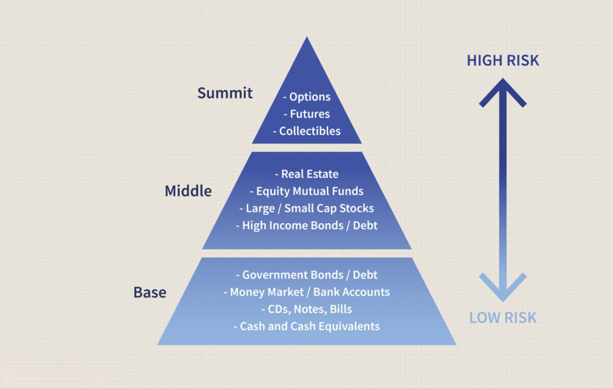

In the fast-paced world of finance and sports, investing strategies are evolving rapidly. Algorithmic trading, or 'algo trading', has emerged as a pivotal approach, combining complex algorithms and data analysis for trading decisions, including in sports investments. This article explores the application of financial analysis and algo trading in sports investments, highlighting the pros and cons of this innovative strategy. By understanding these dynamics, investors can make informed decisions about incorporating algorithms into their sports investment portfolios. We will cover the advantages and challenges of using algo trading, providing insights into how this method is reshaping investment strategies in sports. Join us as we explore the intersection of sports, finance, and technology, and the implications for contemporary investors.

Sports investments have become increasingly attractive due to the growing value and popularity of sports franchises and related businesses. As a result, the need for innovative investment approaches is more significant than ever. Algo trading stands out by offering the capability to analyze extensive data sets rapidly and execute trades with precision. This approach leverages the power of algorithms to recognize patterns, predict price movements, and make swift decisions, bypassing human limitations such as emotional bias and slower reaction times.



This method's transformative potential lies in its ability to integrate complex data analytics with real-time market movements. Algorithms used in trading are designed to identify statistical indicators and trends, perform sentiment analysis, and even apply machine learning models to continuously enhance their decision-making prowess. The outcome is an elevated trading practice where decisions are data-driven and time-sensitive, critical factors in the competitive arena of sports investment.

However, the integration of algo trading in sports investment is not without its challenges. Accessible market information can lead to increased volatility as algorithms react to each other's decisions, creating feedback loops. Furthermore, while algorithms can process vast amounts of information, they require proper oversight to ensure they align with broader investment strategies and risk tolerances. Thus, successful investors blend algorithmic efficiency with human intuition, balancing automated strategies with rational oversight.

In summary, algo trading offers a glimpse into the future of sports investments, where technology and finance intersect to create a dynamic trading environment. As investors become more attuned to the potential of these tools, the sports investment landscape will undoubtedly become more sophisticated, driving the need for continual adaptation and learning.

## Table of Contents

## Understanding Sports Investment

Sports investment has grown into a lucrative field, driven by the substantial increase in the value and popularity of sports franchises and associated businesses. Key components of sports investments include team ownership, merchandise, and media rights, each playing a significant role in generating revenues and shaping the investment landscape.

Team ownership offers direct investment opportunities through purchasing stakes in sports franchises. Owning a sports team can be highly profitable, particularly if the team performs well, leading to increased ticket sales, sponsorships, and merchandise revenues. Investors benefit from the team's brand equity and community loyalty, where high levels of fan engagement contribute to the financial stability and growth potential of the franchise.

Merchandise sales represent another critical component of sports investments. The global demand for sports apparel and memorabilia creates substantial revenue streams, driven by fan loyalty and consumer attachment to particular teams or athletes. The correlation between a team's success and merchandise sales often provides a buffer against market [volatility](/wiki/volatility-trading-strategies), making it an attractive investment avenue.

Media rights have evolved into a major revenue source in sports investment. Broadcasting agreements enable leagues and teams to capitalize on their media presence, with significant income generated from television networks and online streaming platforms. The negotiation of media rights deals often reflects the sport's popularity and its reach to a global audience, thus directly impacting revenue projections and investment decisions.

Understanding the unique market dynamics governing sports investments is crucial for evaluating potential opportunities. Unlike traditional investments, sports investments benefit from an almost inelastic demand, where consumer interest remains steady regardless of economic conditions. While other industries might struggle during a downturn, sports investments often exhibit resilience, owing to their ability to engage large audiences consistently.

Market competition also significantly impacts sports investments. The drive to secure top-tier athletes, innovative sponsorship deals, and technological advancements in broadcasting creates an ever-evolving landscape. Investors need to be aware of these competitive forces as they indirectly shape the potential returns and risks associated with sports investments.

These insights underscore the distinctiveness of sports investments compared to other forms of investment. The inherent consumer loyalty, unique revenue models, and market dynamics contribute to making sports investments an intriguing and potentially rewarding sector for investors. Understanding these components is essential for anyone looking to capitalize on the growing sports market.

## Algorithmic Trading in Financial Analysis

Algorithmic trading, often abbreviated as algo trading, employs computer algorithms to execute trades automatically. This innovative approach harnesses the power of big data and high-speed computing to optimize investment strategies across various financial markets, including sports investments.

At its core, [algorithmic trading](/wiki/algorithmic-trading) involves the use of complex mathematical models and algorithms that analyze vast datasets to identify trading opportunities. These algorithms can process multiple variables and crunch immense amounts of data in real-time, allowing traders to capitalize on favorable market conditions that would be impossible to detect manually. Primarily, algorithms are programmed to execute trades based on pre-defined criteria such as price, timing, or market conditions. This precision and speed provide a competitive edge in the financial market, where swift and informed decision-making is crucial.

The variety of algo trading strategies includes trend-following, [arbitrage](/wiki/arbitrage), and market-making, among others. Trend-following strategies aim to capitalize on market [momentum](/wiki/momentum) by buying assets that are rising and selling those that are falling. Arbitrage strategies exploit price discrepancies between different markets or instruments, while market-making strategies provide [liquidity](/wiki/liquidity-risk-premium) by simultaneously offering to buy and sell assets, profiting from the bid-ask spread.

In real-time trading scenarios, algorithms continuously scan and interpret data from multiple sources, adjusting trading positions accordingly. This process helps in minimizing human error and emotional biases, which can negatively influence investment decisions. Furthermore, algorithms can backtest strategies using historical data to assess their potential effectiveness before actual deployment, reducing the risk of financial loss.

Among the benefits of algorithmic trading, improved efficiency stands out as trades are executed at optimal speed and accuracy, which human traders cannot match. The cost reduction is substantial as well, since transaction costs decrease with automated trading, and it requires fewer man-hours compared to manual trading approaches. Additionally, the emotion-free trading environment of algorithmic systems prevents common psychological pitfalls, such as fear or greed, which may cloud judgment. Enhanced risk management is another critical advantage, as algorithms can be designed to adapt to various market conditions and mitigate potential risks by automatically balancing portfolios or triggering stop-loss orders.

These significant advantages demonstrate why algorithmic trading is becoming an essential component of sophisticated investors' toolkits, particularly as they seek to navigate complex financial landscapes efficiently and effectively. As the technology behind these systems continues to evolve, it will likely play an increasingly pivotal role in shaping the strategies investors employ in various sectors, including sports investments.

## Pros of Combining Algo Trading with Sports Investment

Combining algorithmic trading with sports investment offers several efficiencies and strategic advantages, enhancing the effectiveness of investment decisions significantly. Firstly, algorithmic trading provides increased efficiency and speed, which are crucial for capitalizing on short-term market opportunities inherent in sports investments. As technological advancements allow for the processing of trades at high frequencies, investors can respond to market changes within milliseconds, ensuring they capture fleeting opportunities that manual trading might miss.

Moreover, algorithmic trading reduces trading costs and mitigates emotional biases, a substantial advantage in high-stakes sports investments. Automated systems execute trades based on pre-defined criteria without the influence of psychological factors that often affect human traders. This eliminates impulsive decisions driven by emotions like fear or greed, which can skew investment outcomes.

The utilization of algorithmic systems in sports investments also enhances the ability to process large datasets, facilitating swift data-driven decision-making. In the fast-evolving sports market, analyzing vast amounts of data rapidly enables investors to identify trends and patterns that might not be visible immediately. Advanced algorithms utilize [machine learning](/wiki/machine-learning) techniques to predict market movements and optimize asset allocations effectively.

Additionally, these systems improve risk management by automatically adjusting investment positions based on market metrics. For instance, algorithms can employ complex mathematical models to assess risk levels and execute hedging strategies in real-time. This proactive approach helps minimize potential losses and ensures that portfolios remain aligned with the investor's risk appetite and market conditions.

In sum, the integration of algorithmic trading into sports investment offers a competitive edge through enhanced efficiency, reduced costs, improved decision-making, and superior risk management capabilities. These advantages make it an increasingly indispensable tool for investors seeking to optimize their sports investment strategies.

## Cons of Relying on Algo Trading in Sports Investment

Algorithmic trading, while providing numerous advantages, also presents several challenges when applied to sports investment. One significant concern is the lack of human oversight. Algorithms, though designed to make autonomous decisions, can malfunction or misinterpret data inputs, potentially leading to erroneous trades. Since these programs lack the nuanced understanding and adaptability of a human trader, mechanical errors can have far-reaching consequences. 

Furthermore, algorithmic trading can amplify market volatility. Automated trades, executed at [high frequency](/wiki/high-frequency-trading), can lead to rapid and unpredictable market swings. In volatile market conditions, algorithms may not have the capacity for nuanced interpretations necessary to adjust to sudden changes, leading to unintended trading outcomes.

Another implication of relying on algo trading is technological dependence. While computers handle vast amounts of data quickly, they are also susceptible to technical breakdowns. System crashes or connectivity problems can prevent trades from executing in a timely manner, resulting in missed opportunities or errors in trade execution that could cost investors significantly. 

Finally, the financial barrier to entry is non-negligible. Developing and maintaining these advanced trading systems require substantial investment in software and infrastructure. The ongoing costs associated with real-time data processing and system updates can be prohibitive, particularly for individual investors or smaller firms who may struggle to keep pace with the technological advancements.

In summary, while algorithmic trading in sports investment offers tools for efficiency and speed, these benefits come with notable risks. Ensuring a balance between algorithmic precision and human oversight, preparing for technical contingencies, and considering financial feasibility are imperative steps for those engaging with this investment strategy.

## Case Studies: Successful and Unsuccessful Applications

### Successful Applications of Algorithmic Trading in Sports Investment

1. **Data-Driven Strategies for Improved Outcomes**: A prime example of successful application is the case of a hedge fund that implemented machine learning algorithms to handle sports investments. By analyzing player statistics, weather conditions, historical performance, and market sentiment, the algorithms enabled the fund to make highly informed bets on sports events. The data-driven approach allowed the fund to capture small but consistent margins over the general market. Over three years, this led to a significant increase in ROI, showcasing how sophisticated algorithms can leverage large datasets for optimized decision-making.

2. **Real-Time Analysis and Reaction**: Another success story is a sports investment firm that deployed algorithms capable of real-time market analysis. During live sports events, the firm’s systems processed streaming data to adjust investments dynamically. The algorithms could execute trades within milliseconds based on real-time game developments, such as player injuries or momentum shifts. This agility allowed them to capitalize on market inefficiencies before manual traders could react, further demonstrating the power of algorithmic precision.

### Unsuccessful Applications and Lessons Learned

1. **Algorithm Misinterpretation and Losses**: A notable unsuccessful application involved a proprietary trading firm that relied excessively on an algorithm designed to predict game outcomes. The algorithm, although sophisticated, failed during a major sports event due to unforeseen factors such as abrupt weather changes affecting game conditions. The system's lack of adaptability to these variables led to significant financial losses, bringing to light the risks of over-reliance on models lacking human oversight or adaptive capabilities.

2. **System Failures and Technological Dependence**: In another case, a sports trading platform experienced catastrophic failures due to server overloads during a high-stakes event. Their algorithms, unable to process the sudden spike in data volume, executed trades based on outdated information. The incident emphasized that technical robustness is paramount in sustaining the reliability of algorithmic trading systems, especially during peak activities when market conditions can be volatile and unpredictable.

### Insights and Lessons for Adjusting Sports Investment Strategies

These case studies emphasize key lessons for investors considering algorithmic trading in sports investments. Successful applications prove the efficiency of data-centric algorithms in optimizing outcomes. However, they also underline the necessity of a balanced approach where human judgment, system robustness, and adaptability are integrated into the algorithm. Continuous monitoring, periodic reviews, and incorporating unforeseen variables into algorithmic models can help mitigate risks associated with automated trades. Understanding both successes and failures ensures investors can craft more resilient and yielding sports investment strategies.

## Best Practices for Investors

Investors can capitalize on algorithmic trading in sports investments by incorporating several best practices to harness the full potential of this modern approach while mitigating risks. Balancing algorithmic decisions with human judgment is crucial. Algorithms can process and analyze data faster than humans, but they can lack the intuition and nuanced understanding that a seasoned investor brings to the table. Therefore, a hybrid approach where algorithms handle data-heavy tasks, while humans oversee and validate decisions, typically yields better results. 

Continuous monitoring and adjustment of algorithms to stay aligned with current market conditions is another key practice. Financial markets, including those tied to sports investments, are dynamic and can shift quickly. Algorithms need to be updated and recalibrated to account for new data, emerging trends, or changes in market dynamics to maintain their efficacy. Consider the following Python pseudo-code snippet that outlines a basic framework for ongoing algorithm evaluation:

```python
def update_algorithm_params(algorithm, market_data):
    # Analyze new market data
    analysis_results = perform_analysis(market_data)

    # Adjust algorithm parameters based on analysis
    algorithm.adjust_params(analysis_results)

    return algorithm
```

Leveraging [backtesting](/wiki/backtesting) and optimization can substantially improve trading strategies before they are applied in real time. Backtesting involves simulating a strategy's performance using historical data. This allows investors to see how well an algorithm might perform, identifying strengths and weaknesses before deploying it in live markets. Optimization further refines these strategies by finding the best parameters to maximize returns while minimizing risk. Using Python, investors can utilize libraries like PyAlgoTrade or Backtrader for such tasks:

```python
import backtrader as bt

# Create a strategy class
class MyStrategy(bt.Strategy):
    def __init__(self):
        self.sma = bt.indicators.SimpleMovingAverage(self.data, period=15)

    def next(self):
        if self.data.close > self.sma:
            self.buy()
        elif self.data.close < self.sma:
            self.sell()

# Backtest the strategy
cerebro = bt.Cerebro()
cerebro.addstrategy(MyStrategy)
cerebro.run()
```

Finally, fully understanding both the capabilities and limitations of algo trading is critical for successful investment outcomes. While algo trading can greatly enhance efficiency and decision-making speed, its limitations, such as vulnerability to rapid market changes and system failures, must be acknowledged. A well-rounded approach that combines the strengths of algorithms with a comprehensive risk management strategy, and an understanding of market intricacies, equips investors to navigate the complexities of sports investments effectively.

## Conclusion

Algorithmic trading, or algo trading, has introduced a revolutionary method in the domain of sports investment. Its blend of speed, efficiency, and analytical depth allows investors to uncover insights and opportunities quickly, presenting a significant edge in a competitive market. The ability to process and analyze large datasets in real-time empowers investors to make informed decisions, capitalizing on short-term fluctuations and long-term trends in sports markets.

Despite these advantages, caution is necessary. The automated nature of algo trading introduces risks, such as system failures or algorithmic errors, which can lead to substantial financial loss. The lack of human oversight might also result in the misinterpretation of market changes if algorithms are not properly designed or updated. Thus, the integration of human expertise remains essential in ensuring that the algorithms are aligned with dynamic market conditions and investment goals.

By strategically merging technology with human insight, investors can unlock the potential of algo trading while mitigating its inherent risks. Continuous monitoring, along with adjustment and optimization of algorithms, is crucial to staying competitive in the fast-paced landscape of sports investment.

This article has provided a detailed exploration of sports investment and algorithmic trading. This knowledge equips investors to skillfully navigate the complexities and exploit the advantages that technology brings to sports investments. As the sector continues to grow, algo trading will undoubtedly play a central role in shaping strategies, offering new avenues for growth and development in sports investments.

## References & Further Reading

[1]: Bergstra, J., Bardenet, R., Bengio, Y., & Kégl, B. (2011). ["Algorithms for Hyper-Parameter Optimization."](https://papers.nips.cc/paper/4443-algorithms-for-hyper-parameter-optimization) Advances in Neural Information Processing Systems 24.

[2]: ["Advances in Financial Machine Learning"](https://www.amazon.com/Advances-Financial-Machine-Learning-Marcos/dp/1119482089) by Marcos Lopez de Prado

[3]: ["Evidence-Based Technical Analysis: Applying the Scientific Method and Statistical Inference to Trading Signals"](https://www.amazon.com/Evidence-Based-Technical-Analysis-Scientific-Statistical/dp/0470008741) by David Aronson

[4]: ["Machine Learning for Algorithmic Trading"](https://github.com/stefan-jansen/machine-learning-for-trading) by Stefan Jansen

[5]: ["Quantitative Trading: How to Build Your Own Algorithmic Trading Business"](https://www.amazon.com/Quantitative-Trading-Build-Algorithmic-Business/dp/1119800064) by Ernest P. Chan