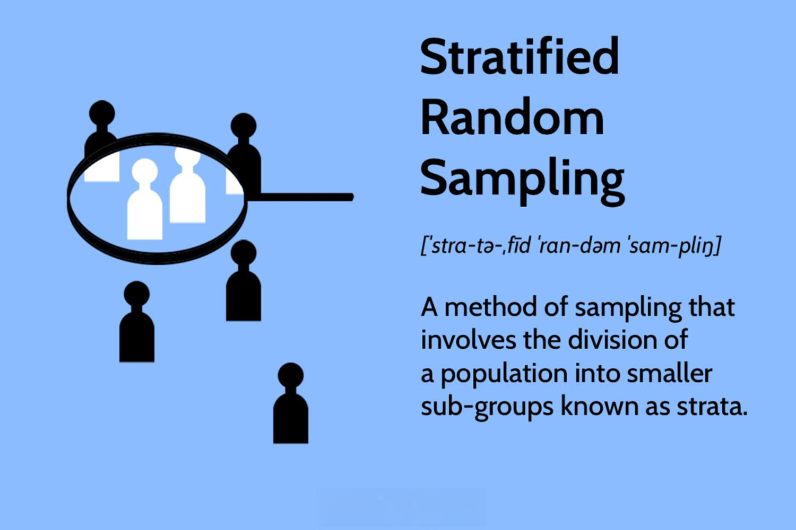

## Table of Contents

## What is stratified random sampling?

Stratified random sampling is a way of choosing a smaller group from a bigger group to study. You divide the bigger group into smaller groups called strata, based on things they have in common, like age or location. Then, you randomly pick people from each of these smaller groups to make sure every type of person is included in your study.

This method helps make sure your smaller group looks like the bigger group in terms of important characteristics. By doing this, you get more accurate results because you're not missing out on any important types of people. For example, if you're studying people's opinions on a new product, you want to make sure you hear from all different kinds of people, not just one type.

## How does stratified random sampling differ from simple random sampling?

Stratified random sampling and simple random sampling are two different ways to pick a smaller group from a bigger group for a study. In simple random sampling, you just pick people randomly from the whole big group. It's like picking names out of a hat without any special rules. This method is easy and works well if everyone in the big group is pretty similar. But, if the big group has different types of people, you might not get a good mix in your smaller group.

On the other hand, stratified random sampling is more careful about making sure different types of people are included. First, you divide the big group into smaller groups, or strata, based on things like age, gender, or location. Then, you pick people randomly from each of these smaller groups. This way, you make sure your smaller group looks like the big group in terms of important characteristics. It's like making sure you have a little bit of everything in your sample, which can give you more accurate results, especially if the big group is diverse.

In summary, simple random sampling is quick and easy but might miss out on different types of people. Stratified random sampling takes more effort but helps make sure your smaller group is a good match for the bigger group, which can lead to better and more reliable results.

## What are the basic steps to implement stratified random sampling?

To implement stratified random sampling, you first need to divide your big group into smaller groups, called strata. These strata should be based on important characteristics that you want to make sure are represented in your study, like age, gender, or location. For example, if you're studying people's opinions on a new product, you might divide your big group into strata based on age groups, like teenagers, adults, and seniors. Once you have your strata, you need to figure out how many people you want to include in your study from each group. This is usually done by deciding on the total number of people you want in your study and then dividing that number among the strata based on their size in the big group.

After you've set up your strata and decided how many people to include from each, the next step is to randomly pick people from each stratum. You can do this by using a random number generator or by drawing names out of a hat. The key is to make sure that everyone in each stratum has an equal chance of being picked. Once you've picked the right number of people from each stratum, you'll have your smaller group, which should be a good representation of the big group. This method helps make sure your study results are accurate because you've included a mix of different types of people.

## What are the main advantages of using stratified random sampling?

Stratified random sampling helps make sure your study results are more accurate and reliable. When you divide the big group into smaller groups, called strata, based on important characteristics like age or location, you make sure that every type of person is included in your study. This means your smaller group will look a lot like the big group, which helps you get a better picture of what's really going on. If you just picked people randomly without thinking about these characteristics, you might miss out on important types of people, and your results might not be as good.

Another big advantage of stratified random sampling is that it can help you understand how different groups of people might feel or act differently. For example, if you're studying people's opinions on a new product, you might find that teenagers like it more than seniors. By making sure you have enough people from each group in your study, you can see these differences clearly. This can be really helpful for making decisions or planning for the future, because you have a more complete understanding of everyone's views and needs.

## Can you provide examples of when stratified random sampling is most beneficial?

Stratified random sampling is really helpful when you're studying a big group of people that has different types within it. For example, if you're a school principal and you want to know what students think about a new lunch menu, you might want to make sure you hear from students in different grades. By dividing the students into groups like elementary, middle, and high school, and then picking students randomly from each group, you'll get a good mix of opinions. This way, you won't miss out on what younger or older students think, and you can make a better decision about the menu.

Another time when stratified random sampling is beneficial is when you're looking at health issues in a community. Imagine you're a health researcher studying heart disease in a city with lots of different neighborhoods. Some neighborhoods might be richer, while others are poorer, and this can affect people's health. By dividing the city into groups based on income levels and then picking people randomly from each group, you'll get a clearer picture of how heart disease affects different parts of the community. This can help you understand if certain groups need more help or different kinds of help to stay healthy.

## What are the potential disadvantages of stratified random sampling?

Stratified random sampling can be tricky because it takes more time and effort to set up than simple random sampling. You have to figure out how to divide the big group into smaller groups, called strata, based on things like age or location. Then, you need to decide how many people to pick from each group, which can be hard if you don't know the exact size of each group. All of this extra work can make the whole process more complicated and might take longer to get started.

Another problem with stratified random sampling is that it might not work well if the information you use to divide the big group into smaller groups is not accurate or up-to-date. For example, if you're using old data to divide people by income levels, you might end up with groups that don't really match the current situation. This can lead to mistakes in your study and make your results less reliable. So, it's really important to make sure the information you use is correct and recent.

## How does the choice of strata affect the outcome of stratified random sampling?

The choice of strata is really important in stratified random sampling because it decides how well your smaller group matches the bigger group. If you pick the right things to divide people into groups, like age or location, you can make sure your study includes all different types of people. This helps make your results more accurate and reliable. For example, if you're studying how people feel about a new product, and you divide them by age, you'll get a good mix of opinions from teenagers, adults, and seniors.

But, if you choose the wrong things to divide people into groups, your results might not be as good. If you don't include important characteristics, like income levels when studying health issues, you might miss out on understanding how different groups are affected. Also, if the information you use to create the groups is old or not correct, it can mess up your study. So, it's really important to think carefully about what you use to divide people into groups and make sure the information is up-to-date.

## What are the common challenges faced when determining the appropriate strata?

Deciding on the right way to divide people into groups, or strata, can be tricky. You need to pick things that are important for your study, like age, gender, or location. If you don't include the right things, your study might miss out on important types of people, and your results might not be as good. For example, if you're studying how people feel about a new product, you might want to divide them by age to make sure you hear from teenagers, adults, and seniors. But if you don't think about income levels, you might miss out on understanding how people with different amounts of money feel about the product.

Another challenge is making sure the information you use to divide people into groups is correct and up-to-date. If you use old or wrong information, like outdated data on income levels, your groups might not match the current situation. This can lead to mistakes in your study and make your results less reliable. It's important to check that the information you use is recent and accurate, so your study can give you a true picture of what's going on.

## How can the accuracy of stratified random sampling be measured and improved?

To measure the accuracy of stratified random sampling, you need to see how well your smaller group matches the bigger group. One way to do this is by comparing the characteristics of your smaller group, like age or location, to the bigger group. If the percentages are similar, then your sampling is accurate. For example, if 20% of the bigger group is teenagers, then about 20% of your smaller group should be teenagers too. Another way to check accuracy is by looking at the results of your study. If the results make sense and match what you know about the bigger group, then your sampling is probably good.

To improve the accuracy of stratified random sampling, you need to make sure you're using the right things to divide people into groups. Choose characteristics that are important for your study, like age, gender, or income levels. Also, make sure the information you use to create these groups is up-to-date and correct. If you're not sure about the information, try to get the latest data. Another way to improve accuracy is by picking enough people from each group. The more people you include, the more likely your smaller group will match the bigger group. By doing these things, you can make your study more accurate and reliable.

## What statistical techniques are used to analyze data collected through stratified random sampling?

When you collect data using stratified random sampling, you can use different statistical techniques to understand the information better. One common technique is to calculate the mean, or average, for each group you created, called strata. This helps you see if there are differences between the groups. For example, if you divided people by age to study their opinions on a new product, you might find that teenagers have a different average opinion than adults or seniors. Another technique is to use analysis of variance (ANOVA) to see if these differences are big enough to matter. ANOVA helps you figure out if the differences between the groups are just by chance or if they are real and important.

Another useful technique is to use regression analysis to see how different characteristics, like age or income, affect the results. Regression can help you understand how much each characteristic influences the outcome of your study. For example, if you're looking at health issues in a community, regression can show how income levels affect people's health. You can also use chi-square tests to see if there's a connection between different characteristics. For instance, a chi-square test can tell you if there's a link between age and opinions on the new product. By using these techniques, you can get a clearer picture of what your data is telling you and make better decisions based on your study.

## How does the size of the sample within each stratum impact the overall results?

The size of the sample within each stratum can really affect how good your study's results are. If you pick too few people from each group, your results might not be very accurate. For example, if you're studying how people feel about a new product and you only pick a few teenagers, you might miss out on what most teenagers think. Picking enough people from each group helps make sure your smaller group looks like the bigger group in terms of important characteristics. This way, your results will be more reliable and give you a better picture of what's really going on.

On the other hand, if you pick too many people from each group, it can make your study take longer and cost more money. But, having a bigger sample size within each stratum can also make your results more accurate. It's like having a bigger piece of the puzzle, which helps you see the whole picture more clearly. So, it's important to find a good balance. You need to pick enough people to get accurate results, but not so many that it makes your study too hard or expensive. By doing this, you can make sure your study gives you the best information possible.

## What advanced considerations should be taken into account when applying stratified random sampling in complex surveys?

When using stratified random sampling in complex surveys, you need to think about how the different groups, or strata, are connected to each other. Sometimes, people in one group might affect people in another group. For example, if you're studying how families feel about a new school policy, the opinions of parents might influence their children. You need to make sure your study takes these connections into account so your results are more accurate. Another thing to consider is how to handle missing information. If some people in your sample don't answer all the questions, you need a plan to deal with this. You might need to use special techniques to guess what their answers might have been, or you might need to collect more data to fill in the gaps.

Another important thing to think about is how to weight the data. In complex surveys, some groups might be more important than others, or some groups might be harder to reach. You might need to give more importance, or weight, to the answers from these groups to make sure your results are fair. For example, if you're studying health issues in a city and it's hard to get information from people in certain neighborhoods, you might need to give more weight to the data you do get from those areas. Also, you should think about how to use technology to help with your study. Using computers and special software can make it easier to manage your data and do the analysis, especially when you're dealing with a lot of information from different groups. By considering these things, you can make your study better and get more reliable results.

## What is Stratified Sampling?

Stratified sampling is a statistical method used to enhance the accuracy and representativeness of a sample by dividing a population into distinct subgroups, known as strata, based on shared characteristics. These characteristics can include demographics such as age, gender, income level, or any other variable of interest that is relevant to the research objectives.

The process of stratified sampling begins by identifying the various strata within the population. Once these strata are established, a random sample is drawn from each subgroup. The size of the sample from each stratum is typically proportional to the stratum’s size relative to the total population. This ensures that each subgroup is adequately represented in the final sample, which helps in reducing sampling bias and increasing the precision of the results.

Mathematically, if a population is divided into $k$ strata, where each stratum has a population size of $N_i$ and a sample size of $n_i$ is selected from each stratum, the total population size $N$ and sample size $n$ can be expressed as:

$$
N = \sum_{i=1}^{k} N_i
$$

$$
n = \sum_{i=1}^{k} n_i
$$

To maintain proportional representation, the relationship between $n_i$ and $N_i$ for each stratum can be defined as:

$$
\frac{n_i}{N_i} = \frac{n}{N}
$$

This relationship ensures proportional allocation, where the sample size for each stratum is in line with its proportion in the overall population.

One of the key advantages of stratified sampling is its ability to provide more precise estimates than simple random sampling, especially when there are significant differences between strata. By ensuring proportional representation, stratified sampling reduces the variability within each subgroup and focuses on capturing the diversity between subgroups. This makes it particularly useful when researchers aim to highlight differences between specific subgroups within a population, such as comparing income distributions across different age groups or educational attainment levels.

Overall, stratified sampling enhances the representativeness of a sample while minimizing bias, making it a valuable technique in research where population diversity and subgroup analysis are paramount.

## References & Further Reading

[1]: Cochran, W.G. (1977). ["Sampling Techniques."](https://archive.org/details/samplingtechniqu0000coch_t4x6) John Wiley & Sons.

[2]: Lohr, S.L. (2009). ["Sampling: Design and Analysis."](https://www.taylorfrancis.com/books/mono/10.1201/9780429296284/sampling-sharon-lohr) Duxbury Press.

[3]: ["Advances in Financial Machine Learning"](https://www.amazon.com/Advances-Financial-Machine-Learning-Marcos/dp/1119482089) by Marcos Lopez de Prado

[4]: ["Evidence-Based Technical Analysis: Applying the Scientific Method and Statistical Inference to Trading Signals"](https://www.amazon.com/Evidence-Based-Technical-Analysis-Scientific-Statistical/dp/0470008741) by David Aronson

[5]: ["Quantitative Trading: How to Build Your Own Algorithmic Trading Business"](https://books.google.com/books/about/Quantitative_Trading.html?id=j70yEAAAQBAJ) by Ernest P. Chan

[6]: Thompson, S.K. (2002). ["Sampling."](https://onlinelibrary.wiley.com/doi/abs/10.1002/env.532) John Wiley & Sons.

[7]: Cochran, W.G. (1983). ["Statistical Methods for Rates and Proportions."](https://journals.sagepub.com/doi/10.1177/00131640121971220) John Wiley & Sons.