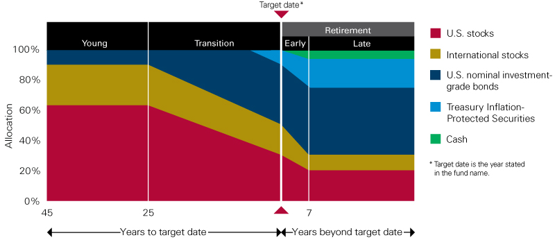

## Table of Contents

## What are target-date funds?

Target-date funds are a type of investment that automatically adjusts over time to become more conservative as you get closer to a specific date, usually your retirement. When you invest in a target-date fund, you pick a fund with a date that matches when you plan to retire. For example, if you plan to retire in 2050, you would choose a 2050 target-date fund. Early on, these funds might invest more in stocks, which can be riskier but offer higher potential returns. As the target date approaches, the fund shifts more towards bonds and other safer investments to protect your money.

These funds are popular because they are easy to use and require little management on your part. You don't need to be an expert in investing or spend time adjusting your investments as you get older. The fund managers do all the work for you, gradually changing the mix of investments to balance risk and reward. However, it's important to remember that not all target-date funds are the same. Different funds might have different strategies and levels of risk, so it's a good idea to look at the details before you choose one.

## How do target-date funds work?

Target-date funds are like a set-it-and-forget-it type of investment. You pick a fund with a date that matches when you want to retire. For example, if you're retiring in 2040, you'd choose a 2040 target-date fund. The fund starts off by investing more in stocks, which can be risky but might grow your money faster. As you get closer to your retirement date, the fund slowly changes to include more bonds and other safer investments. This shift happens automatically, so you don't have to do anything.

The main idea behind target-date funds is to make investing easier for you. They do all the work of adjusting your investments over time, so you don't need to be an expert or spend time managing your money. But remember, not all target-date funds are the same. Some might take more risks than others, and the way they change over time can be different. So, it's smart to look at what each fund does before you decide which one to pick.

## What are the main advantages of investing in target-date funds?

Target-date funds are really easy to use. You just pick the fund with the date that matches when you want to retire, and the fund does the rest. It automatically changes your investments to become less risky as you get closer to that date. This means you don't need to be a financial expert or spend time adjusting your investments. It's like setting your investments on autopilot, which can save you a lot of time and worry.

Another big advantage is that target-date funds help you balance risk and reward. When you're young and far from retirement, the fund invests more in stocks, which can grow your money faster but are riskier. As you get older, the fund shifts to safer investments like bonds. This way, your money is protected as you near retirement. It's a smart way to plan for the future without having to constantly watch and change your investments.

## What are the potential disadvantages of target-date funds?

One potential disadvantage of target-date funds is that they can be too simple. They follow a one-size-fits-all approach, which might not be perfect for everyone. Your personal situation, like how much risk you're okay with or when you actually need the money, might be different from what the fund is set up for. So, you might end up with a fund that doesn't match your needs as well as it could.

Another issue is that target-date funds can be a bit of a mystery. The way they change over time can be hard to understand, and different funds can do things differently. Some might take more risks than others, even if they have the same target date. This means you might not know exactly what you're getting into, and it can be tough to compare different funds to see which one is best for you.

Lastly, fees can be a problem. Target-date funds often come with management fees because someone is making all those changes for you. These fees can add up over time and eat into your savings. It's important to check how much you're paying in fees and make sure it's worth it for the convenience and automatic management you're getting.

## How do target-date funds adjust their asset allocation over time?

Target-date funds adjust their asset allocation over time by slowly changing the mix of investments they hold. When you're far from your retirement date, these funds usually invest more in stocks. Stocks can be riskier, but they also have the potential to grow your money faster. As you get closer to your retirement date, the fund starts to shift more of your money into bonds and other safer investments. This helps protect your money as you near the time when you'll need to start using it.

The way target-date funds make these changes is set up in advance by the fund managers. They follow a plan called a "glide path," which shows how the mix of investments will change over time. Different target-date funds might have different glide paths, so some might shift to safer investments faster or slower than others. But the main idea is the same: to start off with more risk and then gradually become more conservative as you approach your retirement date.

## Can you explain the glide path in target-date funds?

The glide path in target-date funds is like a plan that shows how the fund will change its investments over time. When you're young and far from retirement, the fund will have more money in stocks, which can be risky but might help your money grow faster. As you get closer to your retirement date, the fund starts to move more of your money into safer investments like bonds. This helps protect your money when you're going to need it soon.

Different target-date funds can have different glide paths. Some might start moving to safer investments earlier, while others might wait longer. It's important to look at the glide path of a fund to see if it matches how much risk you're okay with and when you'll need your money. Even though the glide path is automatic, understanding it helps you pick the right fund for your retirement goals.

## Are target-date funds suitable for all types of investors?

Target-date funds are great for people who want an easy way to invest for retirement without having to manage their investments a lot. They are perfect for people who don't want to spend time learning about stocks and bonds or making changes to their investments as they get older. If you're someone who likes to set it and forget it, a target-date fund can be a good choice because it automatically adjusts to become safer as you get closer to retiring.

However, target-date funds might not be the best fit for everyone. If you like to have more control over your investments or if you have a specific way you want to invest your money, these funds might be too simple for you. Also, if you're someone who knows a lot about investing and wants to take more risks or make different choices, a target-date fund's one-size-fits-all approach might not work for you. It's important to think about your own needs and how much risk you're okay with before deciding if a target-date fund is right for you.

## How do fees and expenses impact the performance of target-date funds?

Fees and expenses can really affect how well your target-date fund does over time. Every target-date fund charges a fee for managing your money and making changes to your investments. These fees can add up, especially over many years. If the fees are high, they can eat into your savings and reduce the amount of money you have when you retire. It's like paying a little bit every year, but over 20 or 30 years, those little bits can become a big chunk of your money.

It's important to look at the fees when you're choosing a target-date fund. Some funds might have lower fees than others, and those lower fees can mean more money in your pocket when you retire. Even a small difference in fees can make a big difference over time. So, it's a good idea to compare the fees of different funds and pick one that has a good balance of low fees and the right investment strategy for you.

## What role do target-date funds play in a diversified investment portfolio?

Target-date funds can be a big help in making your investment portfolio more diverse. When you invest in a target-date fund, you're putting your money into a mix of different investments like stocks, bonds, and maybe even some other types of assets. This mix changes over time, so you don't have to worry about [picking](/wiki/asset-class-picking) and choosing different investments yourself. By having a target-date fund in your portfolio, you're spreading your money across many different kinds of investments, which can help lower your risk. If one type of investment doesn't do well, the others might make up for it.

However, target-date funds might not be enough on their own to make your portfolio as diverse as it could be. These funds follow a set plan, which might not match your personal goals or how much risk you're okay with. If you want to be really diverse, you might need to add other types of investments to your portfolio, like real estate, commodities, or international stocks. By mixing a target-date fund with other investments, you can create a portfolio that's tailored to your needs and helps you feel more secure about your future.

## How do different target-date fund providers vary in their investment strategies?

Different target-date fund providers can have different ways of investing your money. Some might start with more money in stocks when you're young and then switch to bonds faster as you get closer to retiring. Others might keep more money in stocks for longer, thinking that the extra risk could lead to bigger rewards over time. The way they change the mix of investments over time, called the "glide path," can also be different. Some providers might start changing to safer investments earlier, while others might wait until you're almost at your retirement date.

Another way target-date fund providers can vary is in the types of investments they choose. Some might focus more on U.S. stocks, while others might include a lot of international stocks or even things like real estate. The fees they charge can also be different. Some providers might have lower fees, which means you keep more of your money over time. It's important to look at these differences to pick a target-date fund that matches what you want for your retirement.

## What are the tax implications of investing in target-date funds?

When you invest in target-date funds, you need to think about taxes. These funds are usually held in retirement accounts like a 401(k) or an IRA. In these accounts, your money grows without being taxed until you take it out. This can be a big advantage because it means more of your money can stay invested and grow over time. But when you do take the money out, you'll have to pay taxes on it as regular income.

If you have target-date funds in a regular investment account, things are a bit different. Any time the fund sells investments and makes a profit, you might have to pay capital gains tax on that profit. This can happen even if you don't take any money out of the fund. The tax rate depends on how long the fund held the investment before selling it. So, it's a good idea to think about where you put your target-date funds to manage your taxes better.

## How have target-date funds performed historically compared to other investment options?

Target-date funds have done pretty well over the years, but how they compare to other investments can change depending on the time and the specific fund. When the stock market is doing great, target-date funds can grow a lot, especially if you're young and the fund has a lot of money in stocks. But when the market goes down, these funds can lose money too. Over the long term, target-date funds usually do better than just keeping your money in a savings account, but they might not do as well as if you picked your own stocks and did really well.

Compared to other funds, like index funds or actively managed funds, target-date funds have their ups and downs. Index funds, which just follow the market, can sometimes do better than target-date funds because they have lower fees. Actively managed funds, where someone picks the investments, might do better or worse depending on how good the manager is at picking winners. But target-date funds are easier to use and don't need you to make changes over time, which can be a big plus for people who don't want to spend a lot of time managing their investments.

## References & Further Reading

[1]: ["Target Date Funds: Why, How, and When?"](https://www.forbes.com/advisor/retirement/target-date-fund-pros-and-cons/) by the U.S. Securities and Exchange Commission

[2]: ["The Target Date Effect: Quantitative Analysis of Target Date Mutual Funds"](https://www.morningstar.com/business/insights/blog/retirement/target-date-mutual-funds) by David Blanchett

[3]: ["Algorithmic Trading and DMA: An introduction to direct access trading strategies"](https://www.amazon.com/Algorithmic-Trading-DMA-introduction-strategies/dp/0956399207) by Barry Johnson

[4]: ["The Basics of Algorithmic Trading: Concepts and Examples"](https://www.investopedia.com/articles/active-trading/101014/basics-algorithmic-trading-concepts-and-examples.asp) from Investopedia

[5]: ["Lifecycle Investing and the Path of Least Resistance"](https://www.hbs.edu/faculty/Pages/item.aspx?num=21962) by Donald R. Chambers