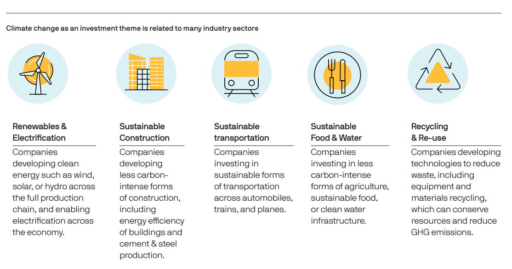

Thematic ETFs, or exchange-traded funds, are investment vehicles designed to capture specific themes, trends, or sectors within the market. They aim to align with future economic or societal shifts by selecting companies and assets that are expected to benefit from these trends. Thematic investing, thus, involves creating a portfolio that emphasizes a particular theme rather than focusing solely on traditional financial metrics like market capitalization or industry sectors. This strategy allows investors to target growth areas they believe will outperform in the long run.

The popularity of thematic investing has surged in recent years. This growth can be attributed to investors' desire to align their portfolios with emerging global trends such as technological advancements, environmental sustainability, and demographic shifts. Thematic ETFs offer an efficient and diversified way to gain exposure to these opportunities without requiring individual stock selection.

The focus of this article is to explore the risks and benefits associated with thematic ETFs, as well as the role algorithmic trading plays in this investment approach. While thematic ETFs present significant upside potential, they also come with unique risks, including concentration in niche sectors and exposure to market volatility. Algorithmic trading provides tools to optimize these investments, offering speed and precision, but it also brings its own challenges. Investors must navigate these factors to make informed decisions.

## Table of Contents

## Understanding Thematic ETFs

Thematic Exchange-Traded Funds (ETFs) are specialized investment vehicles that concentrate on specific themes or trends within the market. Unlike traditional ETFs, which typically track a broad market index, thematic ETFs focus on particular sectors, industries, or ideas that are believed to represent long-term growth potential. These themes can range from technological advancements and environmental solutions to demographic shifts and emerging consumer preferences.

Thematic ETFs function by pooling investments from various investors to collectively purchase a diversified portfolio of securities that align with their specified theme. The portfolio typically comprises stocks of companies that are directly involved or are expected to benefit from the theme under consideration. For instance, a thematic ETF focused on clean energy might include shares in solar energy companies, wind turbine manufacturers, and electric vehicle producers.

One of the primary roles of thematic ETFs is to provide investors with targeted exposure to innovative and transformative sectors that might not be adequately represented in broad market indices. By concentrating on specific trends or ideas, thematic ETFs allow investors to express their perspectives on market dynamics and capitalize on potential high-growth opportunities.

Thematic ETFs differ from traditional ETFs mainly in their investment strategy and focus. Traditional ETFs commonly aim to replicate the performance of a market index, such as the S&P 500 or the NASDAQ Composite, and are thereby broadly diversified across various sectors and industries. In contrast, thematic ETFs are inherently more concentrated as they focus on securities pertaining to a particular theme, which can lead to increased [volatility](/wiki/volatility-trading-strategies) and risk.

Furthermore, while traditional ETFs generally offer exposure to well-established companies with a strong track record, thematic ETFs often include smaller or emerging companies with a higher potential for growth, but also a higher level of risk. This targeted approach requires investors to have a greater conviction in the theme's long-term viability and potential impact on the market.

In summary, thematic ETFs offer a unique investment avenue for those looking to concentrate their portfolios on specific market trends, providing an opportunity to gain exposure to innovative and potentially high-growth areas. However, this focus also brings unique challenges compared to traditional investing methods.

## Benefits of Thematic ETFs

Thematic Exchange-Traded Funds (ETFs) offer several compelling benefits to investors seeking exposure to emerging trends and innovative industries. By focusing on specific themes such as technology, clean energy, or biotechnology, thematic ETFs provide the potential for significant returns, particularly when these trends gain [momentum](/wiki/momentum) in the market.

One of the primary advantages of investing in thematic ETFs is the potential for substantial returns. These funds allow investors to capitalize on emerging trends that may not yet be fully recognized by the broader market. As these trends develop and gain widespread attention, the underlying assets within the [ETF](/wiki/etf-trading-strategies) can experience significant appreciation. This potential for outsized gains makes thematic ETFs attractive for investors looking to enhance their portfolios' growth prospects.

Diversification benefits are another key feature of thematic ETFs. While traditional ETFs often focus on a broad market index or sector, thematic ETFs allow investors to gain exposure to a curated selection of securities that align with a specific theme. Although these funds may be concentrated in a particular sector or idea, they still offer diversification within the theme itself. For example, a thematic ETF centered around renewable energy might include a mix of solar, wind, and battery technology companies, mitigating the risk associated with individual stock performance.

Thematic ETFs also provide accessibility to niche markets or innovative sectors that might otherwise be challenging for individual investors to access. Many thematic trends involve industries at the forefront of technological, environmental, or social transformation, where specialized knowledge and research are required. Thematic ETFs simplify the investment process by packaging a variety of these sector-specific securities into a single, tradable instrument. This convenience opens up opportunities for investors who may lack the time or expertise to curate a portfolio of such assets independently.

Expert management plays a crucial role in the effectiveness of thematic ETFs. Portfolio managers with deep industry knowledge and analytical expertise are responsible for selecting the most relevant and promising securities within a given theme. This expert management ensures that the ETF remains aligned with its thematic focus and adjusts to any shifts in the market landscape. It provides investors with confidence that their investments are being guided by professionals who can identify and exploit emerging opportunities within the theme.

In conclusion, thematic ETFs offer a range of benefits, including the promise of high returns from emerging trends, diversification within specific themes, and access to specialized markets. The involvement of expert management further enhances these advantages by ensuring that the investments remain relevant and well-positioned within the evolving market. As investors look to tap into new and dynamic areas of the economy, thematic ETFs present a compelling option for optimizing growth and diversification.

## Risks Associated with Thematic ETFs

Thematic ETFs, which concentrate investments on specific trends or sectors, present distinct risks that investors should be aware of. One primary concern is concentration risk. Thematic ETFs allocate a significant portion of their assets to niche sectors or industries, which can lead to increased exposure to specific economic, regulatory, or market challenges. This lack of diversification might result in higher volatility compared to broader-based ETFs, where risk is spread across various sectors.

Market volatility significantly affects thematic ETFs due to their focused investment strategy. Unlike traditional ETFs that spread investments across a wide array of assets, thematic ETFs are inherently more vulnerable to fluctuations in the market. For example, a sudden downturn in a specific sector, such as technology or renewable energy—an area thematic ETFs might focus on—can lead to sizable losses for investors. The impact of volatility is magnified in thematic ETFs due to their concentrated nature.

Regulatory and political risks also pose substantial challenges. Emerging industries often lack established regulatory frameworks, and sudden changes in laws or policies can adversely affect their growth prospects. For instance, a government decision to cut subsidies for renewable energy projects could negatively impact thematic ETFs concentrated in that sector. Similarly, geopolitical tensions can disrupt supply chains or market dynamics, affecting the performance of these focused funds.

Liquidity is another vital consideration. Thematic ETFs that target highly specific or novel sectors may attract fewer investors, leading to lower trading volumes. This reduced [liquidity](/wiki/liquidity-risk-premium) can complicate buying or selling shares at desired prices, potentially resulting in higher transaction costs or difficulties in exiting positions. Investors in less popular thematic ETFs might encounter a lack of market participants, contributing to wider bid-ask spreads and increased trading costs.

In summary, while thematic ETFs offer the potential for high returns by targeting emerging trends, they come with inherent risks like concentration risk, market volatility, regulatory challenges, and liquidity constraints that require careful consideration by investors.

## The Intersection of Thematic Investing and Algo Trading

Algorithmic trading, commonly known as algo trading, involves the use of computer algorithms to execute trading instructions at high speeds and with minimal human intervention. It is founded on complex mathematical models and formulas. Over recent years, algo trading has grown significantly in the financial markets due to its ability to analyze vast datasets, execute trades rapidly, and minimize human errors. It accounts for a substantial portion of trade volumes in major stock exchanges worldwide.

For thematic investing, which targets specific emerging trends or sectors through thematic ETFs, algo trading offers several optimization opportunities. Algorithms can assist in identifying potential trends by analyzing historical and real-time data, market signals, or economic indicators. This data-driven approach enables investors to quickly adapt to changing market conditions, thereby optimizing their thematic investment strategies.

The use of algo trading in thematic ETFs comes with several advantages. Speed is a notable benefit, as algorithms can execute thousands of transactions in milliseconds, capturing opportunities that may be missed by manual trading. Precision is another advantage, as algorithms can meticulously analyze data to make informed trading decisions, ensuring that the portfolio remains aligned with the chosen theme. Furthermore, algo trading can facilitate systematic rebalancing of thematic ETF portfolios by dynamically adjusting the weightings of different assets based on pre-defined criteria.

However, integrating algo trading with thematic investing does present some challenges and risks. One concern is model risk, where algorithms may not adequately capture market complexities or adapt to unexpected market events, potentially leading to suboptimal results. Another challenge is the reliance on accurate data, as flawed data inputs can impact the effectiveness of trading algorithms. Moreover, algo trading strategies are often opaque or complex, making it difficult for investors to understand the rationale behind specific trades. This opacity can be a barrier for those who prefer more transparent investment approaches.

In summary, while [algorithmic trading](/wiki/algorithmic-trading) can significantly enhance thematic investing strategies through speed, precision, and data-driven decision-making, it is crucial for investors to be aware of potential risks. They must ensure that algorithms are robust, data inputs are accurate, and the overall approach is transparent and aligned with their investment goals.

## Conclusion

Thematic Exchange-Traded Funds (ETFs) offer a unique blend of opportunities and challenges, characterized by their potential to deliver significant returns through targeted investments in emerging trends and innovative sectors. These ETFs provide valuable diversification within specific themes, granting investors access to niche markets that traditional investment vehicles might overlook. Additionally, expert management plays a crucial role in selecting securities that align with these themes, enhancing the strategic advantage of thematic ETFs.

However, thematic ETFs are not without their risks. Investors must be cognizant of concentration risks inherent in niche sectors, where a lack of diversification can amplify losses. Market volatility poses another challenge, especially in fast-evolving industries linked with thematic ETFs. Furthermore, investors should be wary of regulatory and political risks, as evolving policies can drastically impact emerging sectors. Liquidity concerns also loom over less popular thematic ETFs, potentially complicating entry and [exit](/wiki/exit-strategy) strategies.

Algorithmic trading has emerged as a valuable tool in the landscape of thematic investing, offering speed, precision, and optimization capabilities. By leveraging sophisticated algorithms, investors can efficiently manage thematic ETF portfolios, potentially enhancing performance while navigating market complexities. However, integrating algorithmic trading with thematic investing is not without its challenges, such as the need for extensive technical expertise and the risk of over-reliance on automated systems.

Before committing to thematic ETFs, investors are encouraged to conduct comprehensive research to fully grasp the intricacies of these investment vehicles and their associated risks. Diligent evaluation and an informed approach are essential for mitigating potential pitfalls and capitalizing on the benefits these ETFs offer. 

The future of thematic investing holds promise, with its continued growth likely to influence the financial industry. As trends evolve and new themes emerge, thematic ETFs can potentially reshape investment strategies, offering investors novel pathways to participate in the financial markets. Balancing the advantages of thematic investments with prudent risk management and embracing technological advancements like algo trading may very well define the next chapter of investment strategies in a rapidly changing global economy.

## References & Further Reading

[1]: ["ETFs for Thematic Investing: Understanding the Model."](https://www.investopedia.com/investing/benefits-and-risks-thematic-etfs/) Morgan Stanley.

[2]: ["The Search for Thematic Alpha: Analyzing the Performance Characteristics of Thematic Equity Funds."](https://journals.sagepub.com/doi/10.1177/16094069231205789) S&P Global Market Intelligence.

[3]: ["Thematic Funds: Child’s Play or Important Carve-out in the Asset Management Community?"](https://www.morningstar.com/lp/guide-to-thematic-funds) EDHEC Risk Institute.

[4]: ["Algorithmic Trading: Winning Strategies and Their Rationale"](https://www.amazon.com/Algorithmic-Trading-Winning-Strategies-Rationale-ebook/dp/B00CY5HC0U) by Ernie Chan

[5]: ["The Little Book of Common Sense Investing: The Only Way to Guarantee Your Fair Share of Stock Market Returns"](https://www.amazon.com/Little-Book-Common-Sense-Investing/dp/1119404509) by John C. Bogle

[6]: Korede, A., & Rompotis, G. G. (2020). ["A Critical Review of Smart Beta Exchange-Traded Funds (ETFs) in Europe."](https://www.semanticscholar.org/paper/Herding-Behavior-among-Exchange-Traded-Funds-Rompotis/f9ede8a677ba9d6ad50bbaa21a1156b7595911f0) Journal of Banking & Finance.