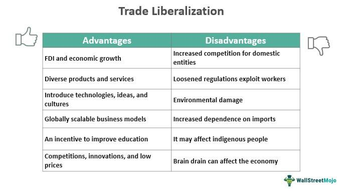

Trading from the West Coast of the United States involves a distinctive interplay of advantages and challenges. Despite being separated from the traditional financial power centers of the East Coast by several time zones, traders on the West Coast benefit from advancements in technology, allowing them to access the same trading algorithms used by their counterparts in New York or Chicago. The ability to harness powerful computing capabilities and high-speed internet has effectively leveled the playing field, bridging the geographical gap within the financial trading landscape.

Nevertheless, the West Coast’s unique geographical and economic context introduces specific benefits and drawbacks. In terms of time zone, the three-hour difference from the Eastern markets can be advantageous for those who prefer an early start, but it may necessitate adjustments to traditional working hours, challenging the typical work-life balance. For example, markets that open at 9:30 AM Eastern Standard Time begin trading at 6:30 AM on the West Coast, potentially requiring traders to adjust their schedules substantially.



The West Coast also sits at an advantageous position in relation to Asian financial markets. This geographic alignment provides supplementary trading opportunities with markets like Tokyo and Hong Kong, whose active hours overlap with the West Coast’s daytime. This connection can be particularly appealing for algorithmic trading strategies that thrive in diverse and liquid markets.

Proximity to Silicon Valley offers another significant advantage, granting traders access to cutting-edge technological developments and a culture of innovation. The West Coast’s tech-centric ecosystem can aid traders in leveraging disruptive technologies and advanced financial services that enhance algorithmic trading.

However, there are challenges too, particularly concerning high-frequency trading. The increased physical distance from major exchanges such as NYSE and Nasdaq results in latency issues, potentially putting West Coast traders at a disadvantage when speed is critical. Furthermore, the West Coast’s higher living costs, particularly in cities like San Francisco and Los Angeles, add financial pressure, which can influence trading decisions and profitability.

In summary, trading from the West Coast entails a complex balance of benefits and hurdles. This article aims to dissect these dimensions, examining how factors such as work-life balance, geographical positioning, time zone differences, and technology access interact to shape the experience of algorithmic trading from this unique locale.

## Table of Contents

## Pros of West Coast Trading Algorithm

One major advantage of trading algorithms on the West Coast is the potential for an enhanced work-life balance. Trading activity typically begins early in the morning to coincide with the opening hours of East Coast markets, such as the New York Stock Exchange (NYSE) and Nasdaq. This scheduling means trading on the West Coast can conclude by midday or early afternoon, providing traders with a significant portion of the day for personal activities, hobbies, or leisure, contributing to an improved overall work-life balance.

The geographic proximity to Silicon Valley is another key benefit for West Coast traders. Silicon Valley is renowned for being a hub of technological innovation and development. Traders operating out of the West Coast can leverage access to cutting-edge technologies, disruptive innovations, and a network of tech pioneers who could offer new algorithms and trading platforms. The ongoing innovations in financial technology being developed in Silicon Valley, such as [machine learning](/wiki/machine-learning) and [artificial intelligence](/wiki/ai-artificial-intelligence), have the potential to significantly enhance [algorithmic trading](/wiki/algorithmic-trading) strategies and operations.

Furthermore, the West Coast is strategically situated to align well with Asian markets. As the West Coast trading day comes to a close, Asian financial markets are opening. This alignment provides unique opportunities for traders interested in engaging with Asian markets, allowing them to take advantage of more trading sessions and possibly capitalize on [arbitrage](/wiki/arbitrage) opportunities created during the transition from Western to Asian trading hours.

Quality of life also presents notable advantages, with cities like San Francisco and Vancouver often ranking high in terms of livability and lifestyle quality. Such environments can minimize stress levels and support a more balanced lifestyle, which can be particularly beneficial for those engaged in the high-pressure world of trading.

The West Coast is equipped with robust technological infrastructure, including high-speed internet access, which is crucial for the execution of algorithmic trades. Efficient technology infrastructure ensures that trading algorithms can operate smoothly, with reduced latency and faster execution. This technological support, coupled with access to innovative tools, positions West Coast traders to efficiently manage and execute algorithm-driven strategies with a high degree of precision.

Ultimately, these factors create a distinctive set of advantages for trading algorithms on the West Coast, blending geographical benefits with access to cutting-edge technology and enhanced quality of life.

## Cons of West Coast Trading Algorithm

A significant disadvantage of algorithmic trading on the West Coast is the physical distance from major East Coast exchanges, such as the New York Stock Exchange (NYSE) and Nasdaq. This separation can negatively affect high-frequency trading ([HFT](/wiki/high-frequency-trading-strategies)) as it may increase latency, leading to slower execution speeds, which are critical in HFT strategies. In high-frequency environments, milliseconds can make the difference between profit and loss, and the additional time required for data to travel across the country can be detrimental.

Furthermore, career opportunities in financial trading can be more limited on the West Coast compared to prominent financial hubs on the East Coast. Cities like New York and Boston house many major financial institutions and hedge funds, offering a broader spectrum of job prospects in [quantitative trading](/wiki/quantitative-trading), portfolio management, and investment banking. The West Coast, while rich in technology startups and innovation, generally has fewer institutions focused specifically on traditional financial trading.

Another challenge faced by West Coast traders is the early start required to align with East Coast market openings. The stock market opens at 9:30 AM EST, which translates to 6:30 AM PST. Consequently, traders need to begin their workday in the pre-dawn hours, which can disrupt sleep patterns and lead to fatigue, potentially impacting decision-making and job performance.

The high cost of living in West Coast cities like San Francisco adds another layer of financial pressure. With housing, transportation, and general living expenses being higher compared to many East Coast locations, traders must manage these financial demands, potentially impacting their quality of life.

Additionally, algorithmic trading on the West Coast may require substantial investment in resource-intensive technologies to overcome geographical disadvantages. This includes advanced hardware, software, and communication networks to reduce latencies and maintain competitive edge, leading to increased operational costs. For example, investing in co-location services, where trading servers are placed as close as possible to exchange servers, can be a significant expense but is often necessary to remain competitive in high-frequency strategies.

## The Role of Algo Trading

Algorithmic trading, commonly referred to as algo trading, harnesses the power of computer algorithms to execute trades with remarkable speed and precision. This form of trading is particularly suited to making rapid and informed trading decisions, largely attributable to its systematic nature and its ability to process vast quantities of data swiftly. Algorithmic trading algorithms are designed to monitor market conditions, detect trade opportunities, and execute trades at optimal times, minimizing the potential for human error or emotional bias.

One of the primary benefits of algo trading is its increased speed and precision when executing trades. Unlike human traders, algorithms can manage multiple variables simultaneously and process information at a significantly faster rate, often executing trades in milliseconds. This capability is crucial in high-frequency trading environments, where time is of the essence. Additionally, algo trading helps lower transaction costs by reducing the need for human intervention and minimizing manual errors. Algorithms can also operate continuously over extended periods, something human traders cannot achieve, leading to more consistent trading performance.

Despite its numerous benefits, algorithmic trading is not without challenges, especially for traders operating from the West Coast. A primary concern is the dependence on technology infrastructure. High-quality technology is imperative for algo trading to function efficiently, necessitating substantial investment in both hardware and software. Furthermore, algorithms require regular monitoring and maintenance to adapt to changing market conditions. Developing and maintaining these complex algorithms demand not only computational resources but also a high level of expertise. Algorithms need constant updates and adjustments to align with market shifts, requiring a deep understanding of both market dynamics and the underlying technology.

Moreover, another inherent risk associated with algo trading is the lack of human oversight during critical periods. Algorithms, while proficient at processing numerical data, may falter when unexpected market events occur unless specifically coded to handle such situations. This places an onus on algorithm developers to ensure that their trading systems are robust and adaptive to unforeseen market conditions.

In code terms, a simplistic representation of an algorithm might include basic rules for buying and selling based on certain market indicators. For example, an algorithm might be set up in Python using libraries such as `pandas` and `numpy` to handle data, coupled with machine learning libraries such as `scikit-learn` to predict market trends.

```python
import pandas as pd
import numpy as np
from sklearn.ensemble import RandomForestClassifier

# Load market data
market_data = pd.read_csv('market_data.csv')

# Feature engineering
market_data['Moving_Avg'] = market_data['Price'].rolling(window=50).mean()

# Define the model
model = RandomForestClassifier()

# Train the model
model.fit(market_data[['Feature1', 'Feature2', 'Moving_Avg']], market_data['Buy_Sell_Signal'])

# Predict trading actions
market_data['Predicted_Action'] = model.predict(market_data[['Feature1', 'Feature2', 'Moving_Avg']])
```

This example illustrates how data can be processed and utilized to make trading decisions automatically. However, this oversimplification underscores the importance of designing intricate and well-tested algorithms for effective trading.

In summary, while algorithmic trading provides significant advantages in terms of speed, precision, and absence of emotional interference, it also brings challenges, particularly in terms of technological reliance and the expertise required for algorithm development and maintenance. Consequently, traders must weigh these factors carefully to leverage algo trading successfully.

## The Bottom Line

Trading on the West Coast with algorithms presents a unique set of opportunities and challenges that traders must navigate thoughtfully. The quality of life and the proximity to technological advancements are standout advantages. Cities like San Francisco and Seattle are not only hubs for innovation but also offer a lifestyle that can contribute positively to a trader's overall well-being. The presence of Silicon Valley, renowned for its technological innovation, provides unparalleled access to cutting-edge tools and resources essential for effective algorithmic trading. This environment fosters innovation and continuous improvement in trading strategies.

Conversely, the geographical distance from major East Coast exchanges such as the New York Stock Exchange (NYSE) and Nasdaq can be a hurdle for certain trading strategies, especially those reliant on high-frequency trading, where milliseconds can impact profitability. The physical distance might introduce latency, affecting the efficiency of executing trade orders compared to their East Coast counterparts. Furthermore, the higher cost of living in West Coast cities like San Francisco and Los Angeles introduces financial considerations, which can add pressure and may influence the sustainability of trading activities.

The decision to embrace trading on the West Coast hinges on personal preferences and professional goals. Traders must weigh the quality of life and technological advantages against logistical and financial challenges. The potential for a balanced lifestyle, coupled with access to advanced technology, could be appealing to those prioritizing work-life balance alongside career ambitions. However, the increased costs and potential logistical challenges may deter those for whom these considerations outweigh the benefits.

Adaptability is crucial for traders operating in this dynamic landscape. As the financial markets continue to evolve, staying abreast of technological developments and market trends is essential. Adopting a flexible approach and continuously refining trading strategies can help traders capitalize on the advantages while mitigating the challenges presented by trading from the West Coast. Ultimately, success in this environment requires a careful analysis of individual circumstances and the ability to adapt proactively to the ever-changing market conditions.

## References & Further Reading

[1]: Bergstra, J., Bardenet, R., Bengio, Y., & Kégl, B. (2011). ["Algorithms for Hyper-Parameter Optimization."](https://papers.nips.cc/paper/4443-algorithms-for-hyper-parameter-optimization) Advances in Neural Information Processing Systems 24.

[2]: ["Advances in Financial Machine Learning"](https://www.amazon.com/Advances-Financial-Machine-Learning-Marcos/dp/1119482089) by Marcos Lopez de Prado

[3]: ["Evidence-Based Technical Analysis: Applying the Scientific Method and Statistical Inference to Trading Signals"](https://www.amazon.com/Evidence-Based-Technical-Analysis-Scientific-Statistical/dp/0470008741) by David Aronson

[4]: ["Machine Learning for Algorithmic Trading"](https://github.com/stefan-jansen/machine-learning-for-trading) by Stefan Jansen

[5]: ["Quantitative Trading: How to Build Your Own Algorithmic Trading Business"](https://www.amazon.com/Quantitative-Trading-Build-Algorithmic-Business/dp/1119800064) by Ernest P. Chan