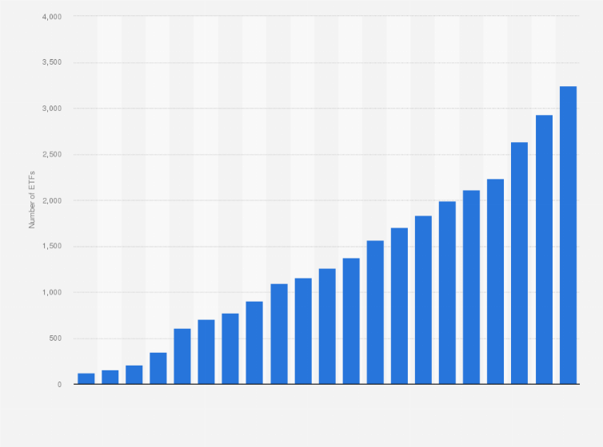

## Table of Contents

## What are U.S. Exchange-Traded Funds (ETFs)?

U.S. Exchange-Traded Funds (ETFs) are investment funds that are traded on stock exchanges, just like individual stocks. They are designed to track the performance of a specific index, such as the S&P 500, a commodity, bonds, or a basket of assets. This means that when you buy shares of an ETF, you are essentially buying a small piece of each of the assets that the ETF is designed to track.

ETFs are popular because they offer investors a way to diversify their portfolios without having to buy each asset individually. For example, instead of buying shares in each of the 500 companies in the S&P 500, you can simply buy shares in an ETF that tracks the S&P 500. This can be more cost-effective and easier to manage. Additionally, ETFs can be bought and sold throughout the trading day at market prices, making them more flexible than mutual funds, which are only priced at the end of the trading day.

## How do ETFs differ from mutual funds?

ETFs and mutual funds are both ways to invest in a group of assets, but they have some key differences. ETFs are traded on stock exchanges, like individual stocks. This means you can buy and sell them anytime during the trading day at the current market price. Mutual funds, on the other hand, are bought and sold at the end of the trading day at a price that is calculated based on the net asset value of the fund's holdings.

Another difference is how they are managed. ETFs usually track an index, like the S&P 500, which means they aim to match the performance of that index. This often makes them cheaper to own because they don't need a lot of active management. Mutual funds can be actively managed, where a fund manager tries to beat the market by [picking](/wiki/asset-class-picking) specific stocks or other investments. This can make mutual funds more expensive due to the management fees.

Lastly, ETFs often have lower minimum investment requirements than mutual funds. You can buy just one share of an [ETF](/wiki/etf-trading-strategies), which might be less than the minimum amount needed to invest in a mutual fund. This makes ETFs more accessible to people who want to start investing with a smaller amount of money.

## What are the main advantages of investing in U.S. ETFs?

One big advantage of investing in U.S. ETFs is that they let you spread your money across many different investments all at once. Instead of buying lots of different stocks or bonds yourself, you can just buy one ETF that holds a bunch of them. This makes it easier to have a diverse portfolio, which can help lower your risk. Plus, ETFs often have lower fees than other types of funds because they usually just follow an index and don't need a lot of managing.

Another advantage is that ETFs are easy to buy and sell. You can trade them on the stock market anytime during the day, just like you would with a single stock. This means you can quickly react to changes in the market if you need to. Also, ETFs usually don't require a lot of money to start investing. You can often buy just one share, which makes it more accessible for people who don't have a lot to invest at first.

## Can you explain the concept of diversification in the context of U.S. ETFs?

Diversification means spreading your money across different investments to lower your risk. When you invest in a U.S. ETF, you're buying a little bit of a lot of different things at once. For example, if you buy an ETF that tracks the S&P 500, you're getting a piece of 500 big companies all at the same time. This way, if one company does badly, it won't hurt your whole investment as much because the other companies might be doing well.

This kind of spreading out can help protect your money. Imagine if you put all your money into just one company's stock and that company has a bad year. You could lose a lot. But with an ETF, even if some companies in the fund don't do well, others might do better and balance it out. That's why ETFs are a popular way to diversify your investments without having to pick and choose a bunch of different stocks yourself.

## What are the tax benefits associated with U.S. ETFs?

One of the tax benefits of U.S. ETFs is something called "tax efficiency." This means ETFs often create fewer taxable events than mutual funds. When you own a mutual fund, the fund manager might sell stocks inside the fund to adjust the portfolio. If those sales make a profit, you could owe taxes on that profit, even if you didn't sell your shares in the fund. But with ETFs, they usually use a special way of trading called "in-kind" transactions. This method lets them swap stocks without selling them, so it can help avoid triggering taxes.

Another tax advantage is how ETFs handle dividends. When companies in an ETF pay dividends, the ETF can choose to pass those dividends directly to you, the investor. This can be more tax-efficient because you might pay a lower tax rate on qualified dividends than on other types of income. Plus, if you reinvest those dividends to buy more ETF shares, you're not immediately taxed on that reinvestment, which can help your investment grow over time.

## How does the liquidity of U.S. ETFs benefit investors?

The [liquidity](/wiki/liquidity-risk-premium) of U.S. ETFs means that you can easily buy and sell them during the trading day. This is great for investors because it lets you quickly change your investments if you need to. If you see a good chance to make money or if the market is going down, you can sell your ETFs right away. This can help you take advantage of market changes and manage your money better.

Also, because ETFs are traded like stocks, there are usually a lot of buyers and sellers. This means you can usually sell your ETFs at a fair price without waiting. It's different from some other investments where it might be hard to find someone to buy what you're selling. This ease of trading makes ETFs a flexible choice for investors who want to keep their money moving smoothly.

## What are the typical costs and fees associated with U.S. ETFs?

When you invest in U.S. ETFs, you'll usually have to pay some costs and fees. One of the main fees is the expense ratio, which is a yearly fee that pays for running the ETF. This fee is a percentage of your investment, and it can be pretty small, often less than 0.1% for big, popular ETFs. But some ETFs might charge more, especially if they focus on something more specific or harder to manage. 

Another cost to think about is the trading fee, which is what your broker charges you to buy or sell the ETF. This fee can be different depending on which broker you use. Some brokers might not charge you anything to trade certain ETFs, while others might charge a few dollars for each trade. It's a good idea to check these fees because they can add up if you're buying and selling a lot.

## What are some common disadvantages of investing in U.S. ETFs?

One common disadvantage of investing in U.S. ETFs is that they can have some hidden costs. Even though ETFs often have low expense ratios, you might still have to pay trading fees every time you buy or sell them. These fees can add up, especially if you trade a lot. Also, some ETFs might have wider bid-ask spreads, which means you could end up paying more than the ETF's actual value when you buy it, or getting less when you sell it.

Another downside is that ETFs might not always track their index perfectly. This is called tracking error. It can happen because of things like fees, how the ETF is managed, or changes in the market. If the ETF doesn't track its index well, your returns might be different from what you expected. This can be frustrating if you're counting on the ETF to match the performance of a specific index.

Lastly, while ETFs offer a lot of diversification, they might not give you the same level of control over your investments as picking individual stocks. If you want to invest in specific companies or sectors, an ETF might not be the best choice because it includes a lot of different things. You might end up with exposure to companies or areas you're not interested in, which could affect your overall investment strategy.

## How does market volatility affect U.S. ETFs?

Market [volatility](/wiki/volatility-trading-strategies) means the market can go up and down a lot. When this happens, the value of U.S. ETFs can change a lot too. If you own an ETF that tracks a certain part of the market, like tech stocks, and that part of the market is going through big ups and downs, your ETF will likely do the same. This can be good if the market goes up, but it can also be risky if the market goes down quickly.

Even though ETFs are a way to spread your money across many investments, they can still be affected by big market swings. If the whole market is having a volatile day, your ETF might lose value even if it's diversified. But because ETFs are traded all day, you can sell them if you think the market is going to keep dropping. This can be helpful, but it also means you need to keep an eye on the market and be ready to make quick decisions.

## What are the risks of tracking errors in U.S. ETFs?

Tracking errors happen when an ETF doesn't follow its index exactly. This can make the ETF's returns different from what you expected. The reasons for tracking errors can be things like fees, how the ETF is managed, or changes in the market. If the ETF has high fees, it might not be able to match the index's performance because some of the money is going to pay those fees. Also, if the ETF's managers have to buy or sell a lot of stocks to keep up with the index, they might not be able to do it at the best times, which can lead to tracking errors.

These tracking errors can be a problem for investors. If you're counting on the ETF to give you the same returns as the index it's supposed to track, you might be disappointed. Over time, even small tracking errors can add up and affect how much money you make from your investment. It's important to check how well an ETF has been tracking its index in the past to get an idea of what might happen in the future.

## How do U.S. ETFs perform during different economic cycles?

U.S. ETFs can perform differently depending on what's happening in the economy. During good times, when the economy is growing and people are spending more money, ETFs that focus on stocks, especially in growing sectors like technology or consumer goods, usually do well. These ETFs can go up in value because the companies they invest in are making more money and their stock prices are rising. But if the economy starts to slow down, these same ETFs might not do as well. People might spend less, and companies might make less money, which can cause stock prices to fall and the ETFs to lose value.

During bad times, like a recession, ETFs that invest in safer things like bonds or sectors that are less affected by economic downturns, such as utilities or healthcare, might do better. These ETFs can be more stable because people and companies still need these services even when the economy is struggling. But even these ETFs can be affected by big changes in the market. It's important to remember that no matter what kind of ETF you're looking at, economic cycles can change how well it does, and it's a good idea to think about what's happening in the economy when you're deciding where to invest your money.

## What advanced strategies can be used with U.S. ETFs for expert investors?

Expert investors might use a strategy called sector rotation with U.S. ETFs. This means they move their money into ETFs that focus on different parts of the economy at different times. For example, if they think the economy is going to grow, they might put more money into ETFs that invest in technology or consumer goods because these sectors usually do well when people are spending more. But if they think the economy is going to slow down, they might move their money into ETFs that invest in safer sectors like utilities or healthcare. By watching economic signs and moving their money around, expert investors can try to make more money and lower their risk.

Another advanced strategy is using leveraged and inverse ETFs. Leveraged ETFs aim to give you bigger returns by using borrowed money to invest more than you actually put in. For example, a 2x leveraged ETF tries to give you twice the daily return of the index it tracks. But this can be risky because if the market goes down, your losses can be bigger too. Inverse ETFs, on the other hand, go up in value when the market goes down. They can be used to bet against the market or to protect other investments. Both types of ETFs need to be watched closely because they can be very volatile and are usually better for short-term trading rather than long-term investing.

## References & Further Reading

[1]: Chan, E. (2013). ["Algorithmic Trading: Winning Strategies and Their Rationale"](https://github.com/hudson-and-thames/arbitragelab/blob/master/docs/source/cointegration_approach/cointegration_tests.rst). Wiley Trading.

[2]: Investment Company Institute. (2023). ["2023 Investment Company Fact Book"](https://www.ici.org/system/files/2023-05/2023-factbook.pdf).

[3]: Lopez de Prado, M. (2018). ["Advances in Financial Machine Learning"](https://www.amazon.com/Advances-Financial-Machine-Learning-Marcos/dp/1119482089). Wiley.

[4]: Jansen, S. (2020). ["Machine Learning for Algorithmic Trading: Predictive Models to Extract Signals from Market and Alternative Data for Systematic Trading Strategies with Python"](https://github.com/stefan-jansen/machine-learning-for-trading). Packt Publishing.

[5]: U.S. Securities and Exchange Commission (SEC). ["Exchange-Traded Funds (ETFs)"](https://www.sec.gov/about/reports-publications/investor-publications/introduction-mutual-funds).

[6]: Aronson, D. R. (2007). ["Evidence-Based Technical Analysis: Applying the Scientific Method and Statistical Inference to Trading Signals"](https://www.amazon.com/Evidence-Based-Technical-Analysis-Scientific-Statistical/dp/0470008741). Wiley.

[7]: Chan, E. (2009). ["Quantitative Trading: How to Build Your Own Algorithmic Trading Business"](https://github.com/ftvision/quant_trading_echan_book). Wiley.