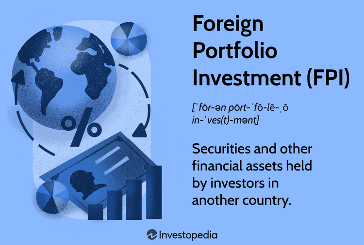

International finance plays a pivotal role in the contemporary global economy, facilitating cross-border trade, investment, and economic integration. It encompasses various financial activities that transcend national boundaries, including currency trading, international lending, and foreign investment, each contributing to economic growth and stability. The seamless flow of capital across countries leads to efficient allocation of resources and risk diversification, crucial for both developed and emerging economies.

One significant component of international finance is Foreign Portfolio Investment (FPI), which involves the purchase of financial assets such as stocks, bonds, and mutual funds in a foreign market. Unlike Foreign Direct Investment (FDI), which involves acquiring a lasting interest in a company or establishment, FPI is generally characterized by shorter-term investments and does not entail control over the enterprise. The significance of FPI lies in its ability to enhance global diversification. By investing in foreign assets, investors can reduce the risk inherent in their domestic markets and potentially achieve higher returns. Diversification is a fundamental investment strategy and can be expressed mathematically as the reduction in portfolio risk $\sigma_p$ through investing in uncorrelated asset classes. This can be represented by the formula:



$$
\sigma_p = \sqrt{\sum w_i^2 \sigma_i^2 + \sum_{i \neq j} w_i w_j \sigma_i \sigma_j \rho_{ij}}
$$

where $w_i$ is the weight of each asset in the portfolio, $\sigma_i$ is the standard deviation of each asset's return, and $\rho_{ij}$ is the correlation coefficient between the returns of asset $i$ and asset $j$. 

In recent years, the advent of algorithmic trading has been reshaping investment strategies, providing investors with tools to execute trades at speeds and with precision previously unattainable. Algorithmic trading, which uses computer algorithms to analyze data and execute trades, has become integral to both domestic and international markets. Algorithms can process vast arrays of market data to identify patterns and execute orders at optimal prices, thereby enhancing efficiency and reducing transaction costs. This is especially beneficial for FPI, where rapid response to changes in international markets can make the difference in capturing profit opportunities or avoiding losses.

The scope of this article includes exploring the benefits of FPI in terms of diversification and access to a broader range of investment opportunities. It will also discuss how algorithmic trading intersects with FPI, offering strategic advantages in managing investments across different markets. By leveraging both FPI and algorithmic trading, investors can potentially achieve better risk-adjusted returns while navigating the complexities of global finance.

## Table of Contents

## Understanding Foreign Portfolio Investment

Foreign Portfolio Investment (FPI) refers to investments made by individuals, institutions, or governments in financial assets situated in foreign countries. Unlike Foreign Direct Investment (FDI), which involves buying a significant stake in a foreign company to exert control or influence over its operations, FPI is characterized by investments in securities with no active management or control. FDI typically involves physical assets or a strong managerial component, such as constructing a manufacturing plant or acquiring a subsidiary in another country. In contrast, FPI focuses on passive investment in financial instruments for financial return.

The assets involved in FPI are diverse and include stocks, bonds, and mutual funds. Stocks represent equity shares in foreign companies and provide investors with potential capital gains and dividends. Bonds in the FPI context involve purchasing foreign government or corporate debt, offering fixed returns through interest payments. Finally, mutual funds pooling resources from multiple investors to buy a diversified portfolio of foreign securities offer another vehicle through which investors can engage in FPI.

FPI plays a critical role in a country's capital account, significantly impacting the balance of payments. The capital account reflects all transactions between a country and the rest of the world in terms of financial instruments. FPI contributes positively to the capital account by providing foreign capital, which can be used for various economic activities, influencing the financial markets and exchange rates. A robust FPI inflow suggests confidence in the host country's economic prospects, potentially leading to favorable exchange rates and increased foreign reserves.

However, the impact of FPI on the balance of payments is not unidimensional. While inflows surge during periods of economic stability and growth optimism, they can quickly reverse during economic turbulence, exacerbating financial [volatility](/wiki/volatility-trading-strategies) in the host country. Swift FPI outflows can pressure a country's currency and foreign reserves, necessitating careful management of FPI to maintain economic stability.

## Benefits of Foreign Portfolio Investment

Foreign Portfolio Investment (FPI) plays a crucial role in enhancing the overall performance of an investment portfolio by providing diversification benefits. Diversifying across various geographies helps in minimizing risks associated with a single market or economy. By incorporating FPIs, investors can reduce unsystematic risk, which is the risk specific to a particular country or company. This diversification is based on the principle that not all markets move in tandem, so losses in one area may be offset by gains in another, thus stabilizing returns over time.

Liquidity is another significant advantage associated with FPIs. Holding foreign securities often provides investors with greater market [liquidity](/wiki/liquidity-risk-premium) compared to domestic investments alone. Liquid markets are essential for investors who need to enter and [exit](/wiki/exit-strategy) positions efficiently. The ability to access a broader market ensures that investors can invest in a wide range of assets, which can be particularly advantageous during times of market volatility, as it provides more selling opportunities and often, better pricing.

FPIs also facilitate access to international credit markets. By investing in foreign debt instruments, investors can tap into favorable credit opportunities that may not be available in their home country. Moreover, FPIs can allow investors to benefit from favorable exchange rates. For instance, if an investor holds an asset in a foreign currency and that currency strengthens against the investor’s home currency, the investor may realize additional gains due to the currency appreciation. This currency effect can enhance the overall return on investment.

Real-world scenarios further illustrate the potential benefits of FPI. Emerging markets like India and Brazil have historically attracted significant FPI due to their strong economic growth, demographic advantages, and reform-oriented policies. In India, FPIs have been instrumental in funding the current account deficit, influencing stock and bond markets, and supporting the rupee. Similarly, Brazil's appeal lies in its abundant natural resources, large consumer market, and efforts to stabilize its economic environment, making it attractive for foreign investors seeking higher returns alongside diversification benefits. These cases demonstrate how FPIs can offer not only diversification and liquidity but also exposure to high-growth potential markets.

## Investment Risks Associated with FPI

Foreign Portfolio Investment (FPI) plays a critical role in international finance, providing investors with opportunities for diversification and potentially higher returns. However, it is not without its risks, which are primarily related to market volatility, foreign exchange fluctuations, political and economic instability, and the economic impact of large capital withdrawals.

### Market Volatility
Market volatility refers to the fluctuations in asset prices within a given market, which can significantly affect FPI holdings. These fluctuations can be triggered by changes in economic indicators, company earnings, geopolitical events, or shifts in investor sentiment. Volatility can lead to sudden and significant changes in asset values, which may result in either gains or losses.

One common measure to quantify market volatility is the standard deviation of returns. A higher standard deviation indicates greater volatility and, consequently, a higher risk associated with the investment. Investors often use volatility as a key [factor](/wiki/factor-investing) when evaluating the risk of their foreign investments.

### Foreign Exchange Fluctuations and Currency Conversion
Exchange rate risk is another critical factor for FPI investors. This risk arises from the possibility of adverse changes in currency exchange rates, which can affect the value of investments denominated in foreign currencies. For instance, if an investor holds assets in a country whose currency depreciates relative to the investor's home currency, the value of those investments will decrease when converted back to the home currency.

Investors can mitigate exchange rate risk using various hedging strategies, such as futures contracts or options. Python offers several libraries, such as NumPy and Pandas, that can be used to model and analyze currency risk. Here's a simple Python code snippet showing how to calculate the returns of an investment accounting for currency fluctuations:

```python
import numpy as np

# Returns of investment in foreign currency (%) and exchange rate changes (%)
investment_returns = np.array([5, 7, -3, 4])
exchange_rate_changes = np.array([-1, 2, 1, -1])

# Total returns in home currency
total_returns_home_currency = investment_returns + exchange_rate_changes
```

### Political and Economic Instability
FPI investors face the risk of political and economic instability in host countries. Political instability can include changes in government, legislative changes impacting foreign ownership rights, and unrest. Economic instability encompasses factors such as inflation, recessions, and changes in fiscal policy. These risks can lead to reduced confidence in the market, affecting capital flows and asset prices.

Investors often analyze country risk using indicators such as the Economic Freedom Index or Political Risk Index, which provide insights into the stability and investment climate of a nation.

### Economic Impact of Large FPI Withdrawals
Large FPI withdrawals can have a pronounced economic impact on host nations. Such withdrawals can lead to a depreciation of the host country’s currency, increased interest rates, and a reduction in foreign exchange reserves. These events can trigger a financial crisis, particularly in emerging markets with less developed financial systems.

Economists often use the balance of payments framework to analyze the impact of capital flows. The sudden reversal of foreign investment can lead to a capital account deficit, necessitating policy adjustments such as [interest rate](/wiki/interest-rate-trading-strategies) changes or intervention in foreign exchange markets to stabilize the economy.

Understanding and managing these risks are crucial for investors seeking to optimize their foreign portfolios. By employing strategies such as diversification, risk monitoring, and hedging, investors can better navigate the complexities of FPI and harness its benefits while minimizing potential downsides.

## The Role of Algorithmic Trading in FPI

Algorithmic trading, commonly referred to as algo trading, employs algorithms to make trading decisions, execute orders, and manage financial portfolios. As financial markets have become increasingly complex and fast-paced, algo trading has gained prominence due to its ability to process large datasets quickly and make split-second decisions. This has substantial importance in Foreign Portfolio Investment (FPI), where investors manage assets across various international markets, which are subject to different regulations, time zones, and currencies.

One of the primary benefits of [algorithmic trading](/wiki/algorithmic-trading) in managing FPI is the significant increase in speed, precision, and efficiency. Algorithms can analyze multiple financial indicators and execute trades much faster than a human trader. This speed advantage is critical in capitalizing on short-lived market opportunities and trends that might not be obvious to manual traders. For instance, algorithms can capitalize on immediate [arbitrage](/wiki/arbitrage) opportunities that arise from price discrepancies between different exchanges, something that would be almost impossible without automation.

Moreover, the precision offered by algorithmic trading reduces the likelihood of human error, which is crucial in maintaining the integrity of an investment portfolio. By eliminating emotional or irrational decision-making, algo trading helps maintain consistency in investment strategies, thereby adhering strictly to predefined criteria and thresholds for buying and selling assets.

In terms of market arbitrage, algorithms can be programmed to detect and exploit minor price differentials between different markets or financial instruments. This can be particularly beneficial for FPI, where exchange rates, political events, or changes in monetary policy can lead to transient disparities in market pricing. Algorithms are capable of executing trades across diverse international markets simultaneously, ensuring that investors can benefit from these temporary inefficiencies.

Volatility management is another critical function provided by algorithmic trading. Algorithms can be designed to monitor volatility indices and react to market fluctuations by dynamically adjusting the investment portfolio. This is especially beneficial for foreign investment, where geopolitical events or economic policy changes can lead to sudden market movements. By implementing strategies such as volatility-based position sizing or threshold-based trading, algorithms can mitigate losses during volatile periods while capturing gains during less turbulent times.

Overall, algorithmic trading enhances the management of Foreign Portfolio Investments by offering rapid response capabilities, precise execution, and strategic positioning in global markets. As international finance continues to evolve, leveraging the power of sophisticated algorithms is an increasingly vital strategy for investors seeking to optimize their global portfolios.

## Comparing FPI and FDI

Foreign Portfolio Investment (FPI) and Foreign Direct Investment (FDI) are two distinct methods through which investors engage with international markets. Both have unique characteristics that cater to different investment strategies and risk profiles.

### Differences Between FPI and FDI

- **Nature of Investment**: FPI involves purchasing financial assets like stocks and bonds in a foreign country. These are passive investments allowing investors benefits from potential capital appreciation or dividend payments without direct control over the companies. In contrast, FDI requires investing directly in a foreign business, often through mergers, acquisitions, or establishing new operations. This results in a significant influence or control over the management and operations of the company.

- **Liquidity**: FPI offers higher liquidity compared to FDI. Since FPI assets like stocks and bonds can be quickly bought or sold in financial markets, investors can easily adjust their positions in response to market changes. FDI, however, is less liquid due to the operational and managerial involvement required, making it difficult to exit quickly without incurring substantial costs.

- **Risk**: The risk profile of both investments differs significantly. FPI is subject to market volatility, exchange rate fluctuations, and investor sentiment, making it potentially more susceptible to external shocks and short-term risks. FDI, on the other hand, is vulnerable to country-specific risks including political instability, regulatory changes, and cultural differences, but can offer more stability as it involves long-term involvement in business operations.

- **Control**: FDI provides investors with direct managerial control over their investments, often allowing them to influence business decisions and strategies. FPI does not offer such control; investors generally remain passive stakeholders with influence limited to voting rights proportional to their shareholdings.

### Considerations for Choosing Between FPI and FDI

Investors might choose FPI when prioritizing liquidity and seeking diversification across multiple foreign markets with relatively lower transaction costs. FPI is attractive for those looking to benefit from market movements with the flexibility to enter and exit positions easily.

FDI is often preferred by investors seeking long-term growth and control over business operations. It is suited for those willing to commit resources and engage actively in the management and operations of a foreign venture. FDI provides the opportunity for substantial influence and integration into the host country's economic framework, potentially contributing to more stable returns over time.

In summary, the choice between FPI and FDI depends on the investor's goals, risk tolerance, desired level of involvement, and the strategic benefits they seek to gain from international exposure.

## How Retail Investors Can Participate in FPI

Retail investors can access Foreign Portfolio Investment (FPI) through various financial products, such as mutual funds, Exchange-Traded Funds (ETFs), and brokerage accounts. These instruments offer a practical avenue for individuals looking to diversify their investment portfolios on a global scale.

Mutual funds provide an easy entry point into FPI by pooling resources from multiple investors to purchase a diversified portfolio of securities, including international stocks and bonds. These funds are managed by professional portfolio managers who strategize based on global market trends, economic indicators, and financial analyses. This approach allows retail investors to gain exposure to international markets without needing in-depth knowledge or direct involvement in purchasing foreign assets.

ETFs function similarly to mutual funds but trade on stock exchanges like individual stocks. They offer the flexibility of buying and selling throughout the trading day at market prices, which can be advantageous for investors seeking liquidity and real-time pricing. International ETFs focus on specific regions or countries, enabling investors to target areas with potential for growth or stability.

Brokerage accounts provide another platform through which retail investors can engage in FPI. Through these accounts, investors can directly purchase foreign securities, such as stocks and bonds, across different global exchanges. Brokerage firms often offer research tools, market analysis, and international trading services that can assist investors in making informed decisions regarding FPI.

It is crucial for investors to understand the financial products targeting foreign markets. This comprehension encompasses awareness of market dynamics, geopolitical events, and currency fluctuations that influence foreign investments. Due diligence involves researching the financial health and performance of international markets, understanding economic policies, and analyzing global indices.

Managing risks and making informed decisions are critical aspects of engaging in FPI. Diversification remains a key strategy, as spreading investments across various geographic regions and sectors can mitigate the risks associated with market volatility, currency fluctuations, and political instabilities. Currency risk particularly requires attention, as exchange rate movements can affect investment returns. Investors may consider hedging techniques, such as options and futures contracts, to protect against adverse currency movements.

Regularly monitoring investments and staying updated with global financial news can help investors navigate the complexities of foreign portfolio investments effectively. Adopting algorithmic tools can also enhance decision-making by providing data-driven insights and predictive analytics.

Through mutual funds, ETFs, and brokerage accounts, retail investors can expand their portfolios internationally, benefiting from the potential for higher returns and diversification while managing the inherent risks judiciously.

## Managing the Risks of FPI

Foreign Portfolio Investments (FPIs) present both opportunities and challenges to investors, emphasizing the necessity for effective risk management strategies. Diversification, a foundational principle of investment risk management, is crucial in reducing exposure to any single asset or market. By spreading investments across different asset classes, sectors, and geographies, investors can minimize the impact of adverse market events on their portfolios. For instance, holding a mix of equities, bonds, and mutual funds from various countries can mitigate risks associated with individual market downturns.

Hedging against currency risk is another significant strategy for managing FPIs' risks. Currency fluctuations can considerably impact the returns on foreign investments. Investors can employ financial derivatives like futures and options contracts or engage in [forex](/wiki/forex-system) trading to hedge against adverse currency movements. For example, if an investor holds assets in a country whose currency is expected to depreciate, they might buy currency futures contracts to lock in an exchange rate and protect against potential losses.

Staying informed is vital in managing the risks associated with FPIs. Keeping abreast of geopolitical developments, economic indicators, and policy changes can inform timely decision-making. Additionally, algorithmic trading plays a pivotal role in risk management by offering speed, precision, and efficiency. Algorithms can quickly analyze vast datasets, identify patterns, and execute trades at optimal times, helping to capitalize on market inefficiencies and manage volatility. This technological advantage allows investors to respond swiftly to market changes, reducing potential risks.

A practical example of a risk management technique is the use of moving averages. Moving averages are used to smooth out price data by creating a constantly updated average price. They are instrumental in identifying trends and potential reversal points. The simple moving average (SMA) is calculated by averaging a set number of past prices, such as:

$$
\text{SMA} = \frac{(P_1 + P_2 + \cdots + P_n)}{n}
$$

where $P_1, P_2, \ldots, P_n$ are the past closing prices over a given period, and $n$ is the number of observations.

Python code, for instance, can be employed to compute and plot moving averages to assist in identifying entry and exit points in trading strategies:

```python
import pandas as pd
import matplotlib.pyplot as plt

# Example data
price_data = [120, 122, 121, 125, 127, 130, 128, 132]

# Create a DataFrame
df = pd.DataFrame(price_data, columns=['Price'])

# Calculate the moving average
df['SMA_3'] = df['Price'].rolling(window=3).mean()

# Plotting
plt.plot(df['Price'], label='Price', marker='o')
plt.plot(df['SMA_3'], label='3-day SMA', marker='x')
plt.title('Price and 3-day Simple Moving Average')
plt.xlabel('Day')
plt.ylabel('Price')
plt.legend()
plt.show()
```

In this example, a simple moving average over a 3-day period is calculated to help investors identify price trends. Leveraging such analytical tools can enhance the decision-making process by providing insights into potential market movements, thereby mitigating risks associated with FPIs.

## Conclusion

Foreign Portfolio Investments (FPI) play a crucial role in offering investors opportunities for diversification and access to international markets. The primary benefit of FPI lies in its ability to reduce overall portfolio risk by spreading investments across a variety of foreign assets, such as stocks, bonds, and mutual funds, which do not entirely correlate with domestic market movements. This diversification allows investors to mitigate risks associated with economic downturns in any single region, thus enhancing potential returns while balancing risk.

However, investors in FPI must also contend with several risks. Market volatility can significantly affect the value of foreign investments. Currency fluctuations present another risk, as changes in exchange rates can impact the actual returns in an investor’s home currency. Additionally, political and economic instability in host countries can pose challenges, potentially leading to large FPI withdrawals, which can destabilize local economies.

Algorithmic trading is reshaping how FPIs are managed, providing a strategic edge to investors. By using algorithms, investors can execute trades with high speed, precision, and efficiency. Algorithmic trading also enables the exploitation of market arbitrage opportunities and aids in managing market volatility. Tools like moving averages can be incorporated into algorithms for improved risk management and decision-making.

In conclusion, while Foreign Portfolio Investments offer significant benefits through diversification and exposure to global markets, they are not devoid of risks. Algorithmic trading stands out as an innovative method to enhance the management of FPIs, providing tools for better risk management and improved returns. Investors are encouraged to leverage these advantages while remaining vigilant of potential risks and employing robust management strategies. This comprehensive approach allows investors to maximize the benefits of FPIs in their investment portfolios, fostering better risk-adjusted returns.

## References & Further Reading

1. **Academic Articles**:
   - Bekaert, G., & Harvey, C. R. (2000). "Foreign speculation and emerging equity markets". *Journal of Finance*, 55(2), 565-613. This paper explores the impact of foreign investments on emerging equity markets, offering insights into market behavior and investor strategies.
   - Karolyi, G. A. (2002). "Did the Asian financial crisis scare foreign investors out of Japan?". *Pacific-Basin Finance Journal*, 10(4), 411-442. This study examines the behavior of foreign investors during financial crises, highlighting the risks associated with FPIs.

2. **Books**:
   - Reeb, D., & Kwok, C. C. (2000). *International Financial Management*. McGraw-Hill Education. This book provides comprehensive coverage of international finance principles, including sections on managing foreign portfolios.
   - Johnson, C. A. (2010). *Algorithmic Trading & DMA: An introduction to direct access trading strategies*. 4Myeloma Press. The book offers a thorough introduction to algorithmic trading techniques beneficial for managing international investments.

3. **Online Resources**:
   - Investopedia (www.investopedia.com): A valuable educational resource offering articles, tutorials, and tools focused on investment, including sections dedicated to foreign investments and algorithmic trading strategies.
   - Bloomberg Markets (www.bloomberg.com/markets): Provides global financial news, data, analysis, and features crucial for keeping up-to-date with current investment trends and market developments.

4. **Important Journals for Continued Research**:
   - *The Journal of International Economics*: Publishes articles related to international economic issues, which can be useful for understanding macroeconomic factors affecting FPIs.
   - *The Review of Financial Studies*: A leading academic journal covering theoretical and empirical research in financial economics. 

5. **Suggestions for Staying Updated**:
   - Subscribe to financial newsletters such as The Financial Times (www.ft.com) or The Wall Street Journal (www.wsj.com), which provide daily updates on global markets.
   - Follow organizations like the International Monetary Fund (IMF) and the World Bank, as they publish reports and insights on global economic trends that can impact FPIs.

6. **Online Courses**:
   - Coursera (www.coursera.org) offers courses on international finance and algorithmic trading, taught by professors from universities worldwide, to deepen understanding and keep skills sharp.
   - edX (www.edx.org) provides courses from Harvard, MIT, and other institutions focusing on finance and investment strategies, including modules on foreign investment dynamics and algorithms.

These resources are recommended for a comprehensive understanding and continued learning in the areas of foreign portfolio investments and algorithmic trading, which play a crucial role in modern international finance.

