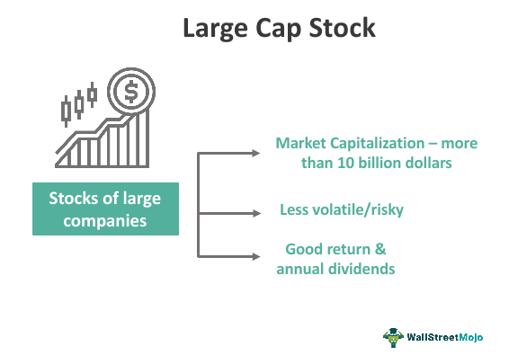

Investing in the stock market presents a wide array of opportunities, with large-cap stocks standing out due to their well-recognized stability and reliability. These stocks typically pertain to companies with a market capitalization of $10 billion or more, representing established and financially sound firms. This article will explore the numerous advantages associated with large-cap stocks, focusing on their stability and potential for steady dividend payouts. These attributes make them an appealing choice for conservative and income-seeking investors, as the robust business models of large-cap companies often enable them to sustain operations even during economic downturns.

Furthermore, large-cap stocks are subject to extensive research and valuation insights, facilitated by regulatory requirements for financial disclosure. This transparency, coupled with significant analyst coverage, aids investors in making informed decisions by providing access to a wealth of historical performance data and current market information. Such data-driven decision-making is particularly relevant in today's investing landscape.



In addition to these traditional investment advantages, the integration of algorithmic trading is revolutionizing the manner in which investors leverage large-cap stocks. Algorithmic trading uses computer algorithms to execute trades rapidly and accurately, optimizing the timing and pricing of transactions. This technological advancement reduces the risk of human error and biases, presenting enhanced opportunities to maximize investment performance.

Overall, large-cap stocks offer a reliable investment option, and when combined with algorithmic trading techniques, investors can further exploit market efficiencies. However, as with any investment decision, it is crucial to consider individual risk tolerance and investment horizons to achieve a balanced and effective investment strategy.

## Table of Contents

## Advantages of Investing in Large-Cap Stocks

Large-cap stocks are recognized for their stability, which makes them a safer investment choice relative to small-cap and mid-cap stocks. This stability stems from the large market capitalizations, typically at least $10 billion, that large-cap companies possess. These companies are generally well-established, financially sound, and often lead their respective industries, reducing the overall investment risk associated with them.

One of the prime attractions of large-cap stocks is their steady dividend payouts, which appeal particularly to income-seeking investors. Many large-cap companies have long histories of delivering regular dividends, made possible by their stable earnings and robust financial resources. These dividends contribute to a reliable income stream, allowing investors to reinvest or use the income for additional financial planning.

Furthermore, the availability of extensive research and data significantly aids the valuation and investment decisions concerning large-cap stocks. The comprehensive information available about these companies—ranging from financial metrics to strategic developments—makes it easier for investors to assess their investment potential. Analyst coverage is prolific for large-cap stocks, providing a wealth of insights and recommendations that guide investment choices.

Investors also benefit from the greater [liquidity](/wiki/liquidity-risk-premium) associated with large-cap stocks. Liquidity refers to the ease with which an asset can be bought or sold in the market without affecting its price. Large-cap stocks usually enjoy high trading volumes, ensuring that investors can quickly enter or [exit](/wiki/exit-strategy) positions. This liquidity provides flexibility and reduced transaction costs, further enhancing the appeal of investing in large-cap stocks.

In conclusion, large-cap stocks offer a combination of stability, steady income, informed decision-making, and liquidity. These attributes collectively make them a compelling option for both conservative and income-focused investors seeking to build a resilient investment portfolio.

## Stability and Dividend Payouts

Large-cap companies, by virtue of their significant market capitalization, are often industry leaders. This status not only supports their stock stability but also provides a relatively secure environment for investors. These firms typically have established business models, which ensure they can maintain operations and even thrive during economic downturns. For instance, a large-cap company may possess diversified revenue streams and strong market share, which are vital in buffering against cyclical economic variances.

Furthermore, large-cap stocks often exhibit regular and stable dividend payments, which appeal to income-seeking investors. Dividends, which are periodic payments made to shareholders out of profits, serve as a source of passive income. Companies like Coca-Cola, Johnson & Johnson, and Procter & Gamble, considered large-cap, have a longstanding history of making consistent dividend payments. This reliability is bolstered by their substantial earnings and cash reserves, which enable them to distribute profits to shareholders even during economic slumps.

Moreover, many large-cap stocks engage in dividend growth strategies, where they systematically increase dividend payouts over time. This not only enhances shareholder value but also offsets inflationary pressures. The Dividend Discount Model (DDM) is a common method used to value these stocks, relying on the present value of future dividends:

$$
P = \frac{D_1}{r - g}
$$

where $P$ is the price of the stock, $D_1$ is the expected dividend in the next period, $r$ is the required rate of return, and $g$ is the growth rate of the dividends. This model underscores the appeal of large-cap stocks with growing dividends, highlighting the intertwined nature of stability and investor returns. 

Overall, the established nature and financial solidity of large-cap companies significantly contribute to their perceived stability, offering investors both security and consistent income through dividends.

## Research and Valuation Insights

Large-cap stocks offer a high degree of transparency largely due to stringent regulatory requirements mandating regular financial disclosures. These companies, typically with a market capitalization exceeding $10 billion, are obligated to follow reporting regulations set by authorities such as the U.S. Securities and Exchange Commission (SEC). This ensures that comprehensive data concerning their financial performance is publicly accessible. For investors, this transparency translates to a well-documented trail of a company's financial health and operations, facilitating a more informed investment decision-making process.

The extensive analyst coverage that large-cap stocks receive further enhances investor access to information. Analysts from prominent financial institutions and research agencies routinely track these stocks, providing in-depth reports that include earnings forecasts, industry analysis, and valuation metrics. This layer of scrutiny translates into a wealth of information, making it easier for investors to evaluate potential investments. An abundance of data-derived insights aids investors in comparing large-cap stocks to their peers and market benchmarks, thus fostering sound decision-making.

Additionally, the valuations of large-cap stocks are firmly underpinned by historical performance and current market data. With extensive historical financial data available, investors can perform rigorous quantitative analyses such as calculating price-to-earnings ratios (P/E ratio), earnings before interest, taxes, depreciation, and amortization (EBITDA), and other financial metrics to gauge a stock's fair value. For example, the P/E ratio, which is calculated as:

$$
\text{P/E Ratio} = \frac{\text{Market Price per Share}}{\text{Earnings per Share (EPS)}}
$$

provides a snapshot of how much investors are willing to pay per dollar of earnings, offering insights into market sentiment and expectations concerning futures earnings growth.

Moreover, the availability of real-time market data allows for the assessment of current valuation in the context of present conditions. Advanced financial models and algorithms can be employed to assess large-cap stocks by factoring in both historical trends and contemporary market dynamics. The confluence of ample historical data with cutting-edge tools enables precise valuation and assessment of these stocks, providing investors with reliable means to identify investments that align with their financial goals and risk profiles. Together, these elements underscore the advantageous research and valuation prospects associated with large-cap stocks, reinforcing their appeal as stable and well-documented investment opportunities.

## Algorithmic Trading Benefits

Algorithmic trading has become a significant [factor](/wiki/factor-investing) in modern financial markets due to its ability to streamline and optimize the trading process. By leveraging algorithms to execute trades, investors can achieve high levels of precision and speed, which are crucial in today’s fast-paced trading environments.

One of the primary advantages of [algorithmic trading](/wiki/algorithmic-trading) is its ability to mitigate manual errors and reduce emotional influences on trading decisions. Human traders are often subject to emotional biases, such as fear and greed, which can lead to suboptimal trading decisions. In contrast, algorithms are designed to execute trades based on predefined criteria, removing the emotional component from trading and ensuring a more objective approach.

Another key benefit is the capacity to backtest trading strategies using historical data. Backtesting involves running a trading strategy on past data to assess its effectiveness before applying it in real-time markets. This process ensures the viability of the investment strategy, allowing traders to refine their approaches and optimize parameters for better performance. Python is a popular language for [backtesting](/wiki/backtesting), and libraries like `[backtrader](/wiki/backtrader)` provide robust frameworks for testing and implementing strategies:

```python
import backtrader as bt

class MyStrategy(bt.Strategy):
    def __init__(self):
        self.sma = bt.indicators.SimpleMovingAverage(self.data.close, period=15)

    def next(self):
        if self.data.close[0] > self.sma[0]:
            self.buy()
        elif self.data.close[0] < self.sma[0]:
            self.sell()

cerebro = bt.Cerebro()
cerebro.addstrategy(MyStrategy)
cerebro.run()
```

The efficiency of algorithmic trading stems from its ability to execute trades at optimal times and prices, often exploiting fleeting market inefficiencies that human traders might miss. By continuously scanning the market and analyzing vast amounts of data, algorithms can spot [arbitrage](/wiki/arbitrage) opportunities and execute large volumes of transactions with high accuracy. Thus, the integration of algorithmic frameworks into trading strategies can significantly enhance market participation by providing both speed and precision that are unattainable through manual trading methods alone.

## Common Algorithmic Trading Strategies

Algorithmic trading has transformed the landscape of financial markets by employing automated, complex strategies for executing trades. Among the numerous strategies employed, Trend Following and Mean Reversion are prevalent due to their ease of implementation and historical success.

Trend Following is a strategy that capitalizes on the assumption that assets which have been rising or falling will continue to move in the same direction. This technique often utilizes moving averages to determine entry and exit points. For instance, a simple moving average (SMA) can indicate a buy signal when a short-term SMA crosses above a long-term SMA. Python can be used to implement this straightforward technique as follows:

```python
import pandas as pd

def calculate_sma(data, window):
    return data.rolling(window=window).mean()

# Sample data: historical stock prices
data = pd.Series([150, 152, 153, 155, 157, 154, 159, 158])
short_window = 2
long_window = 4

short_sma = calculate_sma(data, short_window)
long_sma = calculate_sma(data, long_window)

# Generate signals
signals = pd.DataFrame(index=data.index)
signals['signal'] = 0.0
signals['short_sma'] = short_sma
signals['long_sma'] = long_sma
signals['signal'][short_window:] = np.where(signals['short_sma'][short_window:] > signals['long_sma'][short_window:], 1.0, 0.0)
```

Mean Reversion, on the other hand, is based on the concept that prices and returns eventually move back towards the mean or average level. This strategy identifies overbought or oversold conditions to execute trades. Bollinger Bands, which consist of a middle band being an SMA and two outer bands based on standard deviations, are commonly used to identify these conditions.

In the Index Fund Rebalancing strategy, opportunities arise from the predictable activity during periodic adjustments of index funds. These adjustments are made to mirror changes in an index, which can cause temporary discrepancies that algorithmic traders exploit.

Another sophisticated strategy is the Volume-Weighted Average Price (VWAP), which is used to execute large orders while minimizing market impact and obtaining an average price. VWAP serves as a benchmark to determine whether a trader's activity is in line with average market pricing over a specified period. It can be calculated as:

VWAP = (∑(Price × Volume)) / ∑Volume

This calculation ensures that traders' executions conform closely to the typical price levels of an asset, aiding institutions in achieving preferable outcomes over significant order flows.

Advanced algorithms employing these strategies can significantly improve trading efficiency and compliance with investment objectives. However, as with any investment approach, they require careful configuration to suit particular market conditions.

## Risks and Considerations

Investors should be mindful of various risks and considerations when investing in large-cap stocks and utilizing algorithmic trading systems. One of the primary risks is systematic risk, which refers to the vulnerability of large-cap stocks to global market movements. These stocks, while generally stable, can be affected by macroeconomic factors such as inflation, changes in interest rates, and political events. As large-cap companies often have significant international exposure, fluctuations in foreign currency exchange rates and global economic policies can also impact their performance.

Algorithmic trading, though beneficial for optimizing market opportunities, is not without its challenges. Technical issues are a notable concern as they can lead to significant disruptions. Network interruptions, system failures, and software glitches can all impair the functioning of an algorithmic trading system, potentially resulting in financial losses. Algorithms, which rely on speed and precision, can malfunction or cause unintended market impacts if not adequately monitored and maintained.

Moreover, despite being generally stable investments, large-cap stocks may offer limited growth potential compared to smaller, fast-growing companies. Large-cap companies are typically established firms with mature markets, which can restrict their capacity for rapid expansion. Consequently, investors focused on aggressive growth may find that large-cap stocks do not align with their objectives. Balancing stability and growth potential requires investors to assess their individual risk tolerance and investment strategy carefully.

## Conclusion

Investing in large-cap stocks remains a formidable choice for both conservative and income-oriented investors. These stocks, typically representing well-established firms with a strong market presence, offer a level of reliability and stability that appeals to those seeking steady returns. The consistent dividend payouts common with large-cap stocks provide an attractive source of passive income, augmenting overall investment portfolios.

The integration of algorithmic trading into investment strategies has further enhanced the potential for maximizing returns on large-cap stocks. By automating the trading process, algorithms enable faster decision-making, capturing optimal prices and market conditions with precision. This technologically advanced approach minimizes human errors and emotional biases, ensuring a more strategic execution of trades. Moreover, the capability to backtest strategies on historical data lends credence to the effectiveness of algorithmic trading, offering a robust framework for reliable investment tactics.

However, regardless of the opportunities presented by large-cap stocks and algorithmic trading, investors must maintain a balanced approach. It's crucial to consider individual risk tolerance and align investment strategies with personal financial goals and timelines. By weighing these factors, investors can craft a portfolio that not only leverages the stability and income potential of large-cap stocks but also optimizes performance through sophisticated trading methodologies.

## References & Further Reading

[1]: ["The Little Book of Common Sense Investing: The Only Way to Guarantee Your Fair Share of Stock Market Returns"](https://www.amazon.com/Little-Book-Common-Sense-Investing/dp/1119404509) by John C. Bogle

[2]: ["Common Stocks and Uncommon Profits and Other Writings"](https://www.wiley.com/en-us/Common+Stocks+and+Uncommon+Profits+and+Other+Writings%2C+2nd+Edition-p-9780471445500) by Philip Fisher

[3]: ["A Random Walk Down Wall Street: The Time-Tested Strategy for Successful Investing"](https://www.amazon.com/Random-Walk-Down-Wall-Street/dp/0393358380) by Burton G. Malkiel

[4]: ["Trading and Exchanges: Market Microstructure for Practitioners"](https://www.amazon.com/Trading-Exchanges-Market-Microstructure-Practitioners/dp/0195144708) by Larry Harris

[5]: Hasbrouck, J. (2007). ["Empirical Market Microstructure: The Institutions, Economics, and Econometrics of Securities Trading"](https://academic.oup.com/book/52241) Oxford University Press.