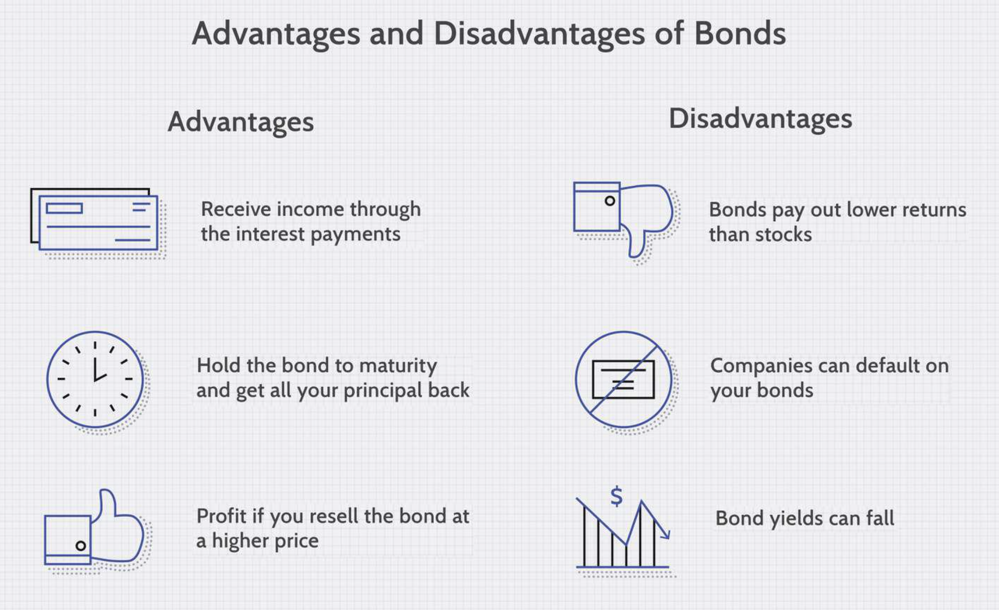

## Table of Contents

## What is a bond?

A bond is like a loan that you give to a company or the government. When you buy a bond, you are lending them money. In return, they promise to pay you back the money you lent them, plus some extra money called interest, over a certain period of time. This period can be a few years or even decades, depending on the bond.

Bonds are often seen as a safer investment compared to stocks because they provide a steady income through interest payments. However, they are not completely risk-free. If the company or government that issued the bond runs into financial trouble, they might not be able to pay you back. This is why it's important to check the credit rating of the bond issuer before buying a bond.

## How do bonds generate income for investors?

Bonds generate income for investors mainly through interest payments. When you buy a bond, the issuer, which could be a company or the government, agrees to pay you a certain amount of interest regularly. This interest is usually paid every six months until the bond reaches its maturity date. The amount of interest you get depends on the bond's interest rate, also called the coupon rate. For example, if you have a bond worth $1,000 with a 5% coupon rate, you will receive $50 every year, usually split into two payments of $25.

Besides interest payments, bonds can also generate income when they are sold at a higher price than what you paid for them. This is called capital appreciation. If interest rates go down after you buy your bond, the value of your bond might go up because new bonds being issued will have lower interest rates. You could then sell your bond to someone else for more than you paid for it, making a profit. However, if interest rates go up, the value of your bond might go down, and you could lose money if you sell it before it matures.

## What are the different types of bonds?

There are different kinds of bonds that people can invest in. One common type is government bonds. These are issued by governments to raise money for things like building roads or schools. In the U.S., you might hear about Treasury bonds, which are very safe because they're backed by the government. Another type is municipal bonds, which are issued by cities or states to fund local projects like hospitals or parks. These can be a bit riskier than Treasury bonds but still pretty safe.

Another type of bond is corporate bonds, which are issued by companies. These can be riskier than government bonds because companies can go bankrupt, but they often offer higher interest rates to make up for that risk. Within corporate bonds, there are investment-grade bonds, which are safer, and junk bonds, which are riskier but offer even higher interest rates. Lastly, there are also international bonds, which are issued by foreign governments or companies. These can be a good way to diversify your investments, but they come with extra risks like changes in currency values.

## Why might someone choose to invest in bonds rather than stocks?

People might choose to invest in bonds rather than stocks because bonds can be safer. When you buy a bond, you're basically lending money to a company or the government, and they promise to pay you back with interest. This means you get a steady income from the interest payments, which can be really helpful if you want a reliable source of money. Stocks, on the other hand, can go up and down a lot, and you might lose money if the company doesn't do well. So, if someone is looking for a more secure investment, they might go for bonds.

Another reason someone might pick bonds over stocks is if they want to balance out their investment portfolio. Bonds can help spread out the risk because they don't usually move in the same way as stocks. When the stock market is doing badly, bond prices might stay steady or even go up. This can protect your money from big losses. Plus, if you're getting close to retiring or need money soon, bonds can be a good choice because they're less likely to lose value quickly, giving you more peace of mind.

## How do bonds contribute to portfolio diversification?

Bonds can help spread out the risk in your investment portfolio. When you mix bonds with stocks, you're not putting all your eggs in one basket. If the stock market goes down, the value of your bonds might stay the same or even go up. This can help protect your money from big losses. It's like having a safety net that catches you if things go wrong with your other investments.

Adding bonds to your portfolio can also give you a steady income. While stocks can be up and down, bonds usually pay you interest regularly. This can be really helpful if you need money coming in every month or if you're getting close to retiring. By having bonds, you can balance out the ups and downs of the stock market and make your overall investments more stable.

## What is the relationship between interest rates and bond prices?

When interest rates go up, bond prices usually go down. This happens because new bonds that are issued will have higher interest rates, making the older bonds with lower rates less attractive to investors. If you want to sell your bond, you might have to lower the price to make it more appealing compared to the new bonds. It's like trying to sell an old phone when a new, better model comes out; you might have to offer it for less money.

On the other hand, when interest rates go down, bond prices usually go up. This is because the older bonds with higher interest rates become more valuable since new bonds being issued will have lower rates. If you have a bond with a good [interest rate](/wiki/interest-rate-trading-strategies), other people might want to buy it from you, and you could sell it for more than you paid. It's like having a popular toy that everyone wants; you can sell it for a higher price.

## What is the yield to maturity of a bond and how is it calculated?

The yield to maturity (YTM) of a bond is the total return you can expect to get if you hold the bond until it matures. It takes into account the bond's current market price, its face value, the interest payments you'll get, and how long you'll have to wait until the bond matures. It's like figuring out how much money you'll make from the bond over time, including both the interest and any profit or loss from the price you paid for it.

To calculate the YTM, you need to use a bit of math. You can use a financial calculator or a computer program to find it, but basically, you're solving for the interest rate that makes the present value of all future cash flows from the bond equal to its current market price. This means you add up all the interest payments you'll get, plus the face value you'll get back when the bond matures, and then figure out what interest rate makes that total worth the price you paid for the bond today. It's a bit tricky, but it gives you a good idea of what you can expect to earn from the bond if you keep it until it matures.

## How does the credit rating of a bond affect its risk and return?

The credit rating of a bond tells you how likely it is that the company or government that issued the bond will be able to pay you back. If a bond has a high credit rating, it means the issuer is seen as very reliable and less likely to run into financial trouble. This makes the bond safer, but because it's safer, it usually offers a lower interest rate. People are willing to accept less money because they feel more secure about getting their investment back.

On the other hand, if a bond has a low credit rating, it means the issuer is seen as riskier. There's a higher chance they might not be able to pay you back. Because of this higher risk, these bonds usually offer higher interest rates to attract investors. It's like a reward for taking on more risk. So, if you're okay with taking a chance, you might get more money from these bonds, but you could also lose your investment if the issuer can't pay up.

## What are callable bonds and how do they impact investment strategy?

Callable bonds are a type of bond that the issuer can decide to pay back early before the bond reaches its maturity date. This is like a company or government saying, "Hey, we want to give you your money back now instead of later." They do this if interest rates go down because they can then borrow money again at a lower rate. For the investor, this means you might get your money back sooner than you planned, but you'll miss out on the interest payments you were expecting for the rest of the bond's life.

When thinking about an investment strategy, callable bonds can be a bit tricky. If you're looking for a steady income over a long time, these bonds might not be the best choice because they could be called away early. You might need to find another investment to replace the income you were expecting. On the other hand, if you think interest rates might go down and the bond might be called, you could try to sell the bond to someone else before that happens, possibly making a profit. So, it's important to think about whether you're okay with the possibility of the bond being called back early when you're deciding if callable bonds fit into your investment plans.

## How do inflation-linked bonds protect investors against inflation?

Inflation-linked bonds, like Treasury Inflation-Protected Securities (TIPS) in the U.S., are special bonds that help protect your money from losing value because of inflation. Inflation is when the prices of things go up over time, making your money worth less. These bonds do something smart: they adjust the amount of money you get back when the bond matures and the interest payments you receive along the way. They use a measure of inflation, like the Consumer Price Index (CPI), to make these adjustments. So, if inflation goes up, the value of your bond goes up too, keeping your investment's buying power the same.

This means if you buy an inflation-linked bond and inflation rises, the bond's face value and the interest payments will increase to match the inflation rate. This way, even if the cost of living goes up, the money you get from the bond will be worth the same as when you first bought it. It's like having a shield against inflation, making these bonds a good choice if you're worried about your money losing value over time.

## What are the tax implications of investing in bonds?

When you invest in bonds, you need to think about taxes. The interest you earn from most bonds is usually taxed as regular income. This means you'll have to pay taxes on the interest every year, just like you do with your salary. The tax rate depends on your income and where you live. If you buy bonds from another country, you might also have to pay taxes in that country, which can make things a bit more complicated.

Some bonds, like municipal bonds, have special tax rules. If you buy municipal bonds from your own state, the interest you earn is often not taxed by the federal government or your state. This can be a big advantage if you're in a high tax bracket. But if you buy municipal bonds from another state, you might have to pay taxes on the interest in that state. It's important to understand these rules because they can affect how much money you actually keep from your bond investments.

## How can bond laddering be used as an investment strategy?

Bond laddering is a smart way to invest in bonds that helps you manage risk and keep a steady flow of money coming in. Imagine you have a ladder with different rungs, each rung representing a bond that matures at a different time. Instead of buying all your bonds at once and having them all mature at the same time, you spread them out. You buy bonds that mature in one year, two years, three years, and so on. This way, you get money back at different times, which can be really helpful if you need regular income or want to reinvest at different interest rates.

This strategy also helps you deal with changes in interest rates. If rates go up, you can reinvest the money from the bonds that mature at a higher rate. If rates go down, you still have bonds that were bought at higher rates, so you're not stuck with only low-rate bonds. It's like having a safety net that catches you no matter what happens with interest rates. Bond laddering can make your investments more stable and give you more control over your money, which is why many people find it a useful strategy.

## References & Further Reading

[1]: ["The Handbook of Fixed Income Securities"](https://www.amazon.com/Handbook-Fixed-Income-Securities-Ninth/dp/1260473899) by Frank J. Fabozzi

[2]: ["Algorithmic Trading and DMA: An introduction to direct access trading strategies"](https://www.amazon.com/Algorithmic-Trading-DMA-introduction-strategies/dp/0956399207) by Barry Johnson

[3]: ["Fixed Income Analysis"](https://en.wikipedia.org/wiki/Fixed_income_analysis) by Frank J. Fabozzi, CFA

[4]: ["Advances in Financial Machine Learning"](https://www.amazon.com/Advances-Financial-Machine-Learning-Marcos/dp/1119482089) by Marcos Lopez de Prado

[5]: ["Algorithmic and High-Frequency Trading"](https://www.amazon.com/Algorithmic-High-Frequency-Trading-Mathematics-Finance/dp/1107091144) by Álvaro Cartea, Sebastian Jaimungal, and José Penalva

[6]: Chaboud, A., Hjalmarsson, E., & Vega, C. (2010). ["Rise of the Machines: Algorithmic Trading in the Foreign Exchange Market."](https://www.jstor.org/stable/43612951) Federal Reserve Board Working Paper.

[7]: Treynor, J. L. (1962). ["Toward a Theory of Market Value of Risky Assets."](https://papers.ssrn.com/sol3/papers.cfm?abstract_id=628187) The first proposal for the concept of risk and return that eventually became part of the capital asset pricing model (CAPM).