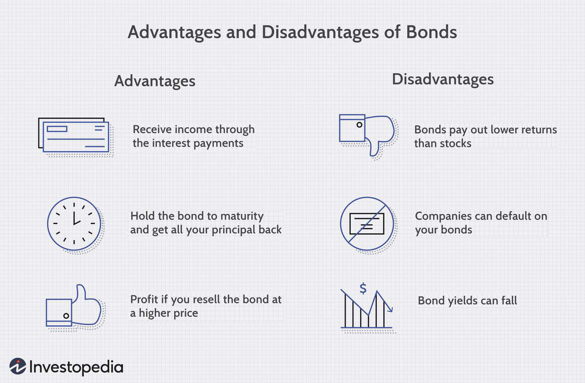

Investment in bonds is often overshadowed by the more glamorous stock market, yet bonds offer critical benefits that make them a necessary component of a diversified portfolio. Bonds, as fixed-income securities, have historically provided investors with a dependable stream of income and stability, contrasting with the volatility frequently associated with stock investments. This stability stems from the predictable nature of interest payments and the assurance of principal repayment upon maturity. As such, bonds serve not only as a conservative investment option but also as a hedge against stock market fluctuations.

In this article, we examine the financial advantages of bond investments alongside the emerging role of algorithmic trading, which enhances these benefits by optimizing trading strategies and decisions. The spectrum of bonds includes various types, such as government, corporate, and municipal bonds, each with distinct risk and return profiles. Investors can tailor their bond portfolios to suit their risk preferences and income goals, leveraging the diversity within bond markets.

Beyond traditional investment strategies, the integration of algorithmic trading in bond markets represents a significant paradigm shift. By automating trading processes, algorithmic systems provide improved execution speed and precision, essential in today's fast-paced financial environment. Furthermore, these systems can refine strategies such as bond ladders — a method of staggering bond maturities to manage interest rate risk — by dynamically adjusting portfolio allocations based on real-time market conditions. Through this lens, the convergence of bond investments and algorithmic trading promises a more efficient, data-driven approach to achieving financial stability and consistent income within a diversified investment portfolio.

## Table of Contents

## Understanding Bonds and Their Financial Advantages

Bonds are a class of fixed-income securities, offering a structured financial framework where investors receive periodic interest payments and the full return of principal upon maturity. This section explores their financial advantages and the nuances of various bond types, emphasizing their role as both a conservative investment option and a stabilizer during economic downturns.

Bonds are distinct from other investment forms due to their predictable returns. The issuer of a bond agrees to pay back the principal—the original sum borrowed—at a specified maturity date, along with periodic interest payments, known as coupon payments, throughout the bond's life. This scheme provides investors with a reliable income stream, rarely found in the equity market where dividends are not guaranteed.

In comparison to savings accounts, bonds frequently offer higher interest rates. Savings accounts, while safe, typically yield meager returns that may not keep pace with inflation. Bonds, on the other hand, offer a balance between safety and increased income potential, making them an attractive option for investors seeking more than the minimal interest provided by traditional savings vehicles.

During periods of stock market [volatility](/wiki/volatility-trading-strategies), bonds often act as a stabilizing force, cushioning portfolios against downturns. When equities underperform, bonds tend to remain relatively stable or even appreciate in value, thereby offering risk adjustment by offsetting potential losses in other asset classes. This inverse relationship with stocks can bolster overall portfolio resilience, particularly during financial crises or economic recessions.

The bond market is diverse, comprising various types of bonds, each with unique risk and return profiles. Government bonds, such as U.S. Treasury securities, are generally considered low-risk due to the backing by national governments, making them appealing to risk-averse investors. In contrast, corporate bonds feature higher yields to compensate for the increased risk of default relative to government bonds. These bonds are issued by corporations seeking capital and are subject to credit ratings that help investors gauge risk levels.

Municipal bonds, also called "munis," are issued by state and local governments. These bonds provide tax advantages, such as tax-exempt interest income at the federal and sometimes state level, making them particularly appealing to investors in high tax brackets. Despite their generally lower yields compared to corporate bonds, the tax benefits can result in comparable or even superior after-tax returns.

To illustrate the risk-return trade-off among these bonds, consider a hypothetical scenario where a government bond offers a 2% yield, a corporate bond 4%, and a municipal bond 3%, tax-exempt. The effective yield of the municipal bond could surpass that of the corporate bond for an investor in a high tax bracket, showcasing the importance of tax considerations in bond investment decisions.

In conclusion, bonds are indispensable to a diversified investment portfolio due to their predictability, stability during market tumults, and potential tax benefits. Each bond type presents unique opportunities and risks, enabling prudent investors to tailor their portfolios to specific financial goals and risk tolerances.

## Exploring Bond Ladder Strategies

A bond ladder is an investment strategy that involves holding a portfolio of bonds with staggered maturities. The primary objective of this strategy is to mitigate [interest rate](/wiki/interest-rate-trading-strategies) risk while ensuring a steady stream of income. By spreading investments across various maturities, investors are able to reinvest matured bond proceeds into new bonds at prevailing interest rates, thus maintaining portfolio [liquidity](/wiki/liquidity-risk-premium) and stability.

The bond ladder strategy offers several financial advantages. Firstly, it reduces exposure to interest rate fluctuations. When interest rates rise, the value of existing bonds typically falls. However, by having bonds come due at different intervals, an investor can reinvest proceeds from maturing bonds into newer bonds with potentially higher yields, thereby offsetting the negative impact on their portfolio.

For example, consider an investor with a ladder composed of 1-year, 3-year, 5-year, 7-year, and 10-year bonds. Each year, as one bond matures, the investor can purchase a new 10-year bond with the funds. This rolling process not only manages risk but also ensures that the investor has cash flow at regular intervals to take advantage of changing interest rates.

Additionally, the diversification of maturities in a bond ladder strategy helps to stabilize income over time. In unpredictable interest rate environments, the ability to adjust maturity profiles offers enhanced flexibility. This diversification reduces the risk associated with locking all investments into a single long-term interest rate, which may be unfavorable if held to maturity.

Moreover, bond ladders can offer tax benefits in certain jurisdictions, particularly with municipal bonds, which may provide tax-free interest income. This makes bond ladders an attractive option for those seeking to optimize after-tax returns while maintaining income predictability.

In summary, bond ladders not only provide consistent income but also manage interest rate risk effectively. By systematically reinvesting proceeds from maturing bonds, investors maintain liquidity and can adapt to varying interest rate conditions, thereby optimizing their long-term financial strategy.

## Algorithmic Trading’s Impact on Bond Investments

Algorithmic trading, which involves the use of coded instructions to automate trading processes, plays a significant role in optimizing bond investments. This technology enhances trade execution speed and efficiency, which is crucial for the generally less liquid bond market. By employing advanced algorithms, trades can be executed almost instantaneously, reducing the lag time that often accompanies manual trading and decreasing transaction costs.

In the bond market, [algorithmic trading](/wiki/algorithmic-trading) can be particularly advantageous for implementing and managing bond ladder strategies. A bond ladder involves purchasing several bonds with staggered maturities to moderate the impact of interest rate changes and maintain a stable income stream. With algorithmic trading, this strategy can be dynamically adjusted in response to changing market conditions. Algorithms can analyze vast datasets in real-time to forecast trends and identify strategic adjustments. For instance, if an algorithm detects rising interest rates, it might suggest reallocating investments to bonds with shorter durations to mitigate risk.

By minimizing the emotional biases often present in manual trading, algorithmic trading can aid investors in maintaining a disciplined strategy. Emotional decision-making can lead to inconsistent approaches and potentially lower returns. Automated systems, on the other hand, strictly adhere to predefined criteria for buying and selling, eliminating impulsive decisions based on market fluctuations.

Furthermore, algorithmic trading can pinpoint optimal trading opportunities by identifying patterns and correlations within market data that may not be apparent to human investors. This capability allows for more informed decision-making and potentially higher returns. For example, predictive algorithms can use historical data to anticipate price changes and optimize trade timing, ensuring that bonds are bought and sold at advantageous price points.

Overall, algorithmic trading enhances the ability of investors to implement more sophisticated and responsive bond investment strategies, such as bond ladders, while reducing the influence of emotional trading decisions and improving overall market efficiency. As technology continues to evolve, the integration of AI and [machine learning](/wiki/machine-learning) will likely further refine these algorithms, offering even greater precision and adaptability in bond trading.

## Challenges and Considerations in Algorithmic Bond Trading

Algorithmic trading in bonds, while significantly advantageous, presents certain technological and strategic challenges that investors and financial institutions must consider. Central to the successful implementation of such systems is the requirement for a robust technological infrastructure. This includes high-performance computing resources capable of processing large volumes of data swiftly to execute trades in complex and often fragmented bond markets.

Bond markets differ from traditional stock markets in their decentralization. Unlike equities, which typically trade on centralized exchanges, bonds are often bought and sold over-the-counter (OTC). This decentralization can lead to discrepancies in data accuracy and trading execution. It becomes imperative for algorithmic trading systems to have access to reliable and real-time market data to make informed decisions. The absence of centralized exchanges can complicate the process of aggregating and analyzing this data, making it more challenging to gauge true market conditions accurately.

Algorithm failure poses another significant risk. Market anomalies or technological glitches can result in flawed trading decisions, potentially leading to substantial financial losses. To mitigate these risks, rigorous testing of trading algorithms is essential. Algorithms must undergo scenario analysis and stress testing to ensure they can withstand various market conditions, particularly those that are highly volatile or unpredictable. 

Moreover, comprehensive risk management systems are crucial to address potential pitfalls. This involves not only real-time monitoring of trading activities but also implementing contingency plans to respond effectively to unexpected behaviors or market events. Strategic oversight includes regular audits of algorithmic strategies and incorporating feedback loops to refine these systems continuously.

In summary, the utilization of algorithmic trading in bond markets requires sophisticated infrastructure and meticulous risk management practices. The challenges presented by market decentralization, data irregularities, and the inherent risks of algorithmic decision-making necessitate vigilant oversight and adaptive strategies to ensure successful and secure trading operations.

## Conclusion

Bonds hold a crucial place in investment strategies, offering a level of stability and predictable returns that complement the more volatile nature of equities. The fixed-income nature of bonds ensures that investors receive consistent interest payments, making them an appealing choice for those seeking regular income. Their role in reducing portfolio risk, particularly during downturns in the stock market, further strengthens their appeal. This predictable income stream and risk mitigation quality solidify bonds' position as a foundational element in diversified portfolios.

The integration of algorithmic trading into bond investments amplifies these benefits, particularly when employing strategies like bond ladders. By automating the trading process, algorithmic systems can efficiently manage and adjust bond portfolios, harnessing real-time market data to optimize buy and sell decisions. This capability not only enhances the execution speed and precision but also allows for dynamic portfolio adjustments that can leverage changing market conditions. Such systems can assist in mitigating interest rate risks and ensuring consistent income flows, aligning well with the strategic objectives of bond investments.

Nevertheless, the incorporation of algorithmic trading in bond investment is not without its challenges. Investors need to consider the technological demands, including the requirement for robust infrastructure and sophisticated risk management systems. Furthermore, the decentralized nature of bond markets compared to equity markets introduces additional complexities in data accuracy and trade execution. There is also the inherent risk of algorithmic failures or market anomalies affecting trading outcomes. These factors necessitate a thorough risk assessment and strategic planning to ensure effective implementation of algorithmic tools.

In conclusion, bonds are indispensable for any comprehensive investment portfolio, offering fundamental stability and income predictability. The advent of algorithmic trading presents an opportunity to enhance these benefits through optimized investment strategies. However, investors should carefully balance the advantages with the associated challenges to fully leverage these tools in achieving optimal investment outcomes.

## References & Further Reading

[1]: ["The Handbook of Fixed Income Securities"](https://www.amazon.com/Handbook-Fixed-Income-Securities-Ninth/dp/1260473899) by Frank J. Fabozzi

[2]: ["Algorithmic Trading and DMA: An introduction to direct access trading strategies"](https://www.amazon.com/Algorithmic-Trading-DMA-introduction-strategies/dp/0956399207) by Barry Johnson

[3]: ["Fixed Income Analysis"](https://en.wikipedia.org/wiki/Fixed_income_analysis) by Frank J. Fabozzi, CFA

[4]: ["Advances in Financial Machine Learning"](https://www.amazon.com/Advances-Financial-Machine-Learning-Marcos/dp/1119482089) by Marcos Lopez de Prado

[5]: ["Algorithmic and High-Frequency Trading"](https://www.amazon.com/Algorithmic-High-Frequency-Trading-Mathematics-Finance/dp/1107091144) by Álvaro Cartea, Sebastian Jaimungal, and José Penalva

[6]: Chaboud, A., Hjalmarsson, E., & Vega, C. (2010). ["Rise of the Machines: Algorithmic Trading in the Foreign Exchange Market."](https://www.jstor.org/stable/43612951) Federal Reserve Board Working Paper.

[7]: Treynor, J. L. (1962). ["Toward a Theory of Market Value of Risky Assets."](https://papers.ssrn.com/sol3/papers.cfm?abstract_id=628187) The first proposal for the concept of risk and return that eventually became part of the capital asset pricing model (CAPM).