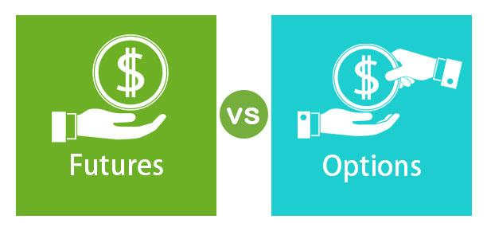

## Table of Contents

## What are futures and how do they differ from options?

Futures are contracts where you agree to buy or sell something at a set price on a specific date in the future. This "something" can be anything from oil to corn, or even financial products like stock indexes. When you trade futures, you're making a promise to complete the transaction when the contract expires. If the price of the item goes up, you can make money, but if it goes down, you could lose money. Futures are often used by businesses to manage the risk of price changes.

Options are different because they give you the right, but not the obligation, to buy or sell something at a set price before a certain date. With options, you pay a fee called a premium for this right. If the price moves in your favor, you can use your option to make a profit. If it doesn't, you can just let the option expire and your loss is limited to the premium you paid. Options can be used for speculation or to hedge against price movements, but they offer more flexibility than futures because you're not locked into completing the transaction.

## How do futures provide more direct exposure to the underlying asset?

Futures give you a more direct way to deal with the thing you're trading, like oil or corn, because when you buy a futures contract, you're agreeing to actually buy or sell that thing later. It's like making a promise to trade the real stuff at a set price on a set day. This means that the value of your futures contract goes up and down directly with the price of the thing you're trading. So, if the price of oil goes up, the value of your oil futures contract goes up too, and you could make money if you sell it before it's time to actually trade the oil.

Options, on the other hand, are a bit different. When you buy an option, you're buying the right to buy or sell the thing later, but you don't have to do it if you don't want to. This means that options don't give you as direct a connection to the thing you're trading. The value of an option can go up or down based on the price of the thing, but also on other things like how much time is left before the option expires and how much the price might move around. So, with options, you're not as directly tied to the price changes of the thing you're trading as you are with futures.

## What are the advantages of futures in terms of liquidity?

Futures markets are often very liquid. This means it's easy to buy and sell futures contracts without affecting their price too much. There are usually a lot of people and big companies trading futures, so there's always someone ready to trade with you. This makes it easier to get in and out of your trades quickly, which can be really helpful if you need to react fast to changes in the market.

Because futures are so liquid, you can also trade them in large amounts without worrying too much about the price moving against you. This is important for big investors or companies that need to buy or sell a lot of futures at once. The high [liquidity](/wiki/liquidity-risk-premium) in futures markets means they can do this without causing big price swings, which helps them manage their risks better.

## How do futures contracts help in managing risk more effectively than options?

Futures contracts help manage risk more effectively than options because they give you a clear and direct way to lock in prices. When you buy or sell a futures contract, you're agreeing to trade the actual thing, like oil or wheat, at a set price on a set date. This means you know exactly what you're getting into, and you can plan your business around that price. If you're a farmer and you want to make sure you get a good price for your wheat, you can sell wheat futures to lock in that price, no matter what happens to the market later. This direct connection to the price of the thing you're trading makes futures a strong tool for managing risk.

Options, on the other hand, give you more flexibility but less certainty. When you buy an option, you're paying for the right to buy or sell something at a set price, but you don't have to do it if you don't want to. This means that while options can be used to manage risk, they don't give you the same level of control over the final price as futures do. If the market moves against you, you can just let the option expire and only lose the money you paid for it. But this also means you might not be able to lock in the price you need, which can make it harder to plan and manage your risks effectively.

## What are the tax implications of trading futures versus options?

When you trade futures, the tax rules are a bit different from trading options. For futures, any money you make or lose is treated as a 60/40 split for tax purposes. This means 60% of your profit or loss is considered long-term capital gain or loss, and 40% is short-term. Long-term gains are usually taxed at a lower rate than short-term gains, which can be a good thing if you're making money. But remember, you have to report these gains and losses on your tax return, and you might need to fill out a special form called Form 6781.

Trading options has a different tax treatment. If you hold an option for a year or less before you sell it or it expires, any profit or loss is considered short-term capital gain or loss. This is taxed at your regular income tax rate, which could be higher than the rate for long-term gains. If you hold the option for more than a year, then it's a long-term capital gain or loss, which is taxed at a lower rate. Just like with futures, you need to report these on your tax return, but you'll use Schedule D instead of Form 6781. So, the tax treatment can affect how you decide to trade futures or options, depending on how long you plan to hold them and how much money you make or lose.

## How does the standardization of futures contracts benefit traders?

Standardization of futures contracts means that all contracts for a certain thing, like oil or corn, are the same size and have the same rules. This makes it a lot easier for traders to buy and sell these contracts because everyone knows exactly what they're getting. If you want to trade oil futures, you don't have to worry about different sizes or different rules for different contracts. This helps traders compare prices and make quick decisions without getting confused.

Because futures contracts are standardized, it also makes the market more liquid. More people can trade these contracts because they're all the same, so there are usually a lot of buyers and sellers. This means you can get in and out of trades more easily and at better prices. Standardization helps create a smooth and efficient market where traders can manage their risks and make trades without a lot of hassle.

## In what ways do futures offer better leverage opportunities compared to options?

Futures offer better leverage opportunities because they let you control a big amount of something with just a small amount of money. When you trade futures, you only need to put down a small part of the total value of the contract, called the margin. This means you can use less money to make trades that could lead to big profits if the price moves your way. For example, if you want to trade oil futures, you might only need to put down a few thousand dollars to control a contract worth much more. This can make your money go further, but it also means you could lose more if the price moves against you.

Options also use leverage, but they work a bit differently. When you buy an option, you pay a fee called a premium, which lets you control a certain amount of the thing you're trading. The premium is usually less than the margin for futures, but the total amount you can control with an option is often smaller than with a futures contract. So, while options give you leverage, futures can give you more bang for your buck because you can control a bigger amount with the same amount of money. Just remember, with more leverage comes more risk, so you need to be careful.

## How can futures be used for hedging purposes more efficiently than options?

Futures can be used for hedging more efficiently than options because they lock in prices in a clear and straightforward way. If you're a farmer who wants to protect against falling wheat prices, you can sell wheat futures to guarantee a certain price for your crop. This means no matter what happens to the market price, you know exactly what you'll get. Futures contracts are standardized, so everyone knows what they're trading, which makes it easier to plan and manage risks.

Options, while useful for hedging, don't give the same level of certainty. When you buy an option, you're paying for the right to buy or sell something at a set price, but you don't have to if you don't want to. This flexibility can be good, but it also means you might not be able to lock in the price you need. If the market moves against you, you can let the option expire and only lose the premium you paid, but you might miss out on the protection you were looking for. So, futures are often more efficient for hedging because they give you a direct and reliable way to manage your price risks.

## What are the differences in margin requirements between futures and options?

When you trade futures, you only need to put down a small part of the total value of the contract to start trading. This is called the initial margin. It's like a deposit that shows you're serious about the trade. The margin for futures is usually higher than the cost of buying an option, but it lets you control a bigger amount of the thing you're trading. If the price moves against you, you might need to add more money to your account to keep your position open. This is called a margin call.

Options work differently. When you buy an option, you pay a fee called the premium. This is the full cost to buy the option, and you don't need to put down any more money after that. The premium is usually less than the margin for futures, but it only lets you control a smaller amount of the thing you're trading. If you sell an option, you might need to put down a margin, but it's usually less than the margin for futures. This means options can be cheaper to start with, but they might not give you as much leverage as futures.

## How does the pricing mechanism of futures affect their advantages over options?

The pricing of futures is straightforward because it's based directly on the price of the thing you're trading, like oil or wheat. When you buy or sell a futures contract, the price you see is the price you get. This makes it easy to know exactly what you're dealing with. If the price of the thing you're trading goes up or down, the price of your futures contract moves the same way. This direct link to the price of the thing you're trading makes futures a good tool for locking in prices and managing risks.

Options have a more complicated pricing mechanism because they're affected by more than just the price of the thing you're trading. The price of an option depends on things like how much time is left before the option expires, how much the price might move around, and even interest rates. This means the price of an option can change in ways that aren't just about the price of the thing you're trading. While this gives options more flexibility, it can also make them harder to use for locking in prices and managing risks as effectively as futures.

## Can you explain how futures can be more cost-effective than options for certain strategies?

Futures can be more cost-effective than options when you want to lock in prices and manage risks. When you trade futures, you only need to put down a small part of the total value of the contract, called the margin. This lets you control a big amount of something with less money upfront. If you're a farmer trying to make sure you get a good price for your wheat, using futures can help you do that without spending a lot of money right away. The clear and direct pricing of futures also means you know exactly what you're getting into, which can save you money by avoiding surprises.

On the other hand, options can be more expensive for certain strategies because you have to pay the full premium to buy them. While the premium might be less than the margin for futures, it's still money you can't get back if the option doesn't work out. Options are also affected by more things than just the price of what you're trading, like how much time is left before they expire and how much the price might move around. This can make options trickier to use and potentially more costly if you're trying to lock in prices and manage risks in a straightforward way.

## What are the advanced strategies that can be implemented with futures but not with options?

One advanced strategy that you can use with futures but not with options is called "calendar spreading." This is when you buy and sell futures contracts for the same thing, like oil, but they expire at different times. For example, you might buy an oil futures contract that expires in three months and sell one that expires in six months. The idea is to make money from the difference in prices between the two contracts. This strategy can be tricky because it depends a lot on how the market changes over time, but it can be a good way to take advantage of price differences without betting on whether the price will go up or down.

Another strategy is called "intermarket spreading." This is when you trade futures contracts for different but related things, like trading corn futures and wheat futures at the same time. The idea is to make money from the price differences between these related markets. For example, if you think corn prices will go up more than wheat prices, you might buy corn futures and sell wheat futures. This can be a good way to manage risks and make money from the relationships between different markets. Options don't work as well for these kinds of strategies because they're more about betting on whether the price will go up or down, not about the differences between different contracts or markets.

## References & Further Reading

[1]: Bergstra, J., Bardenet, R., Bengio, Y., & Kégl, B. (2011). ["Algorithms for Hyper-Parameter Optimization."](https://papers.nips.cc/paper/4443-algorithms-for-hyper-parameter-optimization) Advances in Neural Information Processing Systems 24.

[2]: ["Advances in Financial Machine Learning"](https://www.amazon.com/Advances-Financial-Machine-Learning-Marcos/dp/1119482089) by Marcos Lopez de Prado

[3]: ["Evidence-Based Technical Analysis: Applying the Scientific Method and Statistical Inference to Trading Signals"](https://www.amazon.com/Evidence-Based-Technical-Analysis-Scientific-Statistical/dp/0470008741) by David Aronson

[4]: ["Machine Learning for Algorithmic Trading"](https://github.com/PacktPublishing/Machine-Learning-for-Algorithmic-Trading-Second-Edition) by Stefan Jansen

[5]: ["Quantitative Trading: How to Build Your Own Algorithmic Trading Business"](https://books.google.com/books/about/Quantitative_Trading.html?id=j70yEAAAQBAJ) by Ernest P. Chan