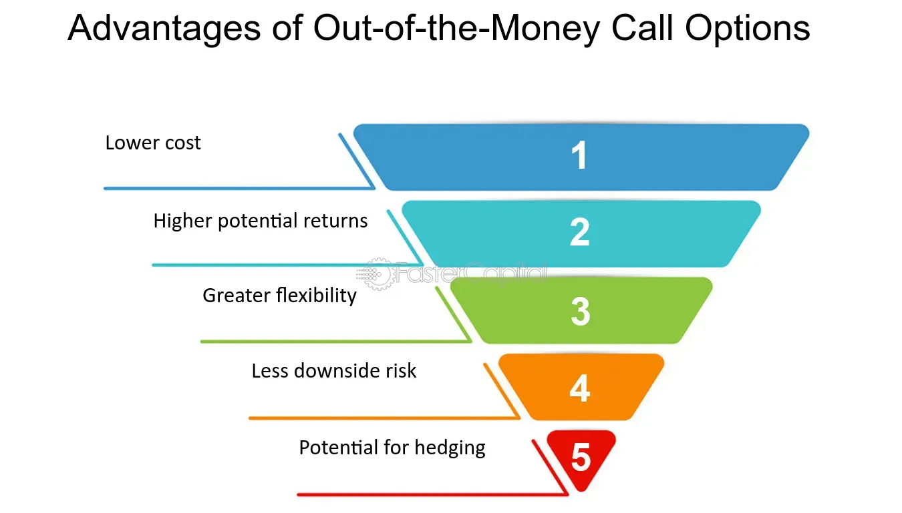

## Table of Contents

## What is an in-the-money call option?

An in-the-money call option is a type of option contract where the current price of the underlying stock is higher than the strike price of the option. The strike price is the set price at which the option can be exercised, or used to buy the stock. For example, if you have a call option with a strike price of $50 and the stock is currently trading at $60, your option is in-the-money because you can buy the stock at $50 and immediately sell it at the market price of $60, making a profit.

In-the-money call options have intrinsic value, which is the difference between the current stock price and the strike price. In the example above, the intrinsic value would be $10 per share ($60 - $50). This intrinsic value represents the immediate profit you could make if you were to exercise the option right away. The more the stock price exceeds the strike price, the deeper in-the-money the option is, and the more valuable it becomes.

## How does an in-the-money call option differ from an out-of-the-money call option?

An in-the-money call option and an out-of-the-money call option differ based on the relationship between the strike price of the option and the current market price of the underlying stock. An in-the-money call option means the stock's current price is higher than the strike price. If you have this kind of option, you can buy the stock at the lower strike price and sell it at the higher market price, making a profit right away. For example, if the strike price is $50 and the stock is trading at $60, you're in-the-money by $10.

On the other hand, an out-of-the-money call option means the stock's current price is lower than the strike price. With this option, if you were to exercise it, you would have to buy the stock at the higher strike price and sell it at the lower market price, which would result in a loss. For example, if the strike price is $50 and the stock is trading at $40, you're out-of-the-money by $10. The main difference is that in-the-money options have immediate value, while out-of-the-money options do not, and they rely on the stock price increasing to become profitable.

## What are the basic advantages of buying in-the-money call options?

Buying in-the-money call options has some clear advantages. One big advantage is that they already have value right away. This is called intrinsic value. It's the difference between the stock's price now and the option's strike price. So, if you buy an in-the-money call option, you can make money immediately if you decide to exercise it or sell it to someone else. This gives you a head start compared to out-of-the-money options, which don't have any value until the stock price goes up.

Another advantage is that in-the-money call options are less affected by time decay. Time decay means that the value of an option goes down as it gets closer to its expiration date. In-the-money options lose value more slowly because they already have intrinsic value. This makes them a safer bet if you think the stock will keep going up, but you're not sure when. It's like having a cushion that helps protect your investment from losing value too quickly.

## How can in-the-money call options be used for income generation?

In-the-money call options can be used for income generation by selling them to other investors. If you own a stock and think it will stay about the same or go up a little, you can sell in-the-money call options on that stock. When you sell these options, you get money right away. This money is called the premium. If the stock price stays below the strike price by the expiration date, the options will expire worthless, and you keep the premium as income. This strategy is called a covered call because the stock you own "covers" or backs up the call option you sold.

Another way to use in-the-money call options for income is by buying them and then selling them for a profit. If you think a stock will go up a lot, you can buy an in-the-money call option. If the stock price goes up as you expected, the value of your option will go up too. You can then sell the option to someone else for more than you paid for it, making a profit. This profit is your income. The key is to buy the option when it's already in-the-money, so you have a head start and less risk compared to out-of-the-money options.

## What is the impact of time decay on in-the-money call options?

Time decay, or theta, is how the value of an option goes down as it gets closer to its expiration date. For in-the-money call options, time decay is less of a problem compared to out-of-the-money options. This is because in-the-money options have intrinsic value, which is the difference between the stock's price and the strike price of the option. This intrinsic value doesn't go away as time passes, so the impact of time decay is smaller.

Even though time decay affects in-the-money call options less, it still matters. The part of the option's price that comes from time, called time value, will still go down as the expiration date gets closer. But because in-the-money options already have value from the stock price being higher than the strike price, they lose less value over time than options that are out-of-the-money. So, if you're holding an in-the-money call option, you don't have to worry as much about time decay as you would with other options.

## How does delta affect the pricing and behavior of in-the-money call options?

Delta is a measure that shows how much the price of an option changes when the price of the stock it's based on changes. For in-the-money call options, delta is usually higher than for out-of-the-money options. This means that if the stock price goes up, the price of an in-the-money call option will go up more than an out-of-the-money option. For example, if a stock goes up by $1, an in-the-money call option with a delta of 0.8 might go up by about 80 cents. This higher delta makes in-the-money call options more sensitive to changes in the stock price, which can be good if you think the stock will keep going up.

The higher delta of in-the-money call options also affects how they behave. Because they move more closely with the stock price, they act a bit like owning the stock itself but with less money upfront. This can be a way to get similar benefits to owning the stock without spending as much. However, the higher delta also means that if the stock price goes down, the value of the in-the-money call option will drop more than an out-of-the-money option. So, while in-the-money call options can offer bigger gains when the stock goes up, they can also lead to bigger losses if the stock goes down.

## What are the tax implications of trading in-the-money call options?

Trading in-the-money call options can have different tax outcomes depending on how long you hold them and whether they are part of your job. If you hold the option for less than a year before selling it, any profit you make is considered a short-term capital gain. This is taxed as regular income, which means it could be taxed at a higher rate, depending on your income level. But if you hold the option for more than a year, any profit becomes a long-term capital gain, which usually has a lower tax rate.

If you are a professional trader, the rules can be different. The IRS might see your option trading as part of your business, so your profits could be taxed as business income. This means you might have to pay self-employment tax on top of your regular income tax. It's a good idea to keep good records of your trades and talk to a tax expert to make sure you're handling your taxes the right way.

## How can in-the-money call options be used as part of a hedging strategy?

In-the-money call options can be a good way to protect your investments from big drops in stock prices. Imagine you own a stock and you're worried it might go down. You can buy an in-the-money call option on that stock. This gives you the right to buy the stock at a lower price than it's trading at now. If the stock price falls, you can still buy it at the lower strike price and sell it at the higher market price you locked in with the option. This can help you make up for any losses from the stock going down.

Another way to use in-the-money call options for hedging is if you're worried about a whole market going down, not just one stock. You can buy in-the-money call options on an index like the S&P 500. If the market goes down, the value of your stocks might drop, but the call options can go up in value because they let you buy the index at a lower price. This can help balance out your losses and protect your portfolio. Using in-the-money call options like this can be a smart way to manage risk without selling your stocks.

## What are the risks associated with in-the-money call options?

Buying in-the-money call options comes with some risks. One big risk is that if the stock price goes down, the value of your option can drop too. Even though in-the-money options lose less value over time than out-of-the-money options, they can still lose a lot if the stock goes down a lot. Also, if you pay a high price for the option, you might lose that money if the stock doesn't go up as much as you hoped. So, it's important to think about how much you're willing to lose before you buy.

Another risk is that even though in-the-money call options have some value right away, they can still expire worthless if the stock price falls below the strike price by the expiration date. This means you could lose all the money you spent on the option. Plus, if you're using options as part of a bigger investment plan, like hedging, things can get complicated. If the stock doesn't move the way you expect, your whole plan might not work out, and you could end up losing money instead of protecting your investments.

## How do market conditions influence the effectiveness of in-the-money call options?

Market conditions can really change how well in-the-money call options work for you. If the market is going up and the stock price is rising, in-the-money call options can be a great choice. They already have some value because the stock price is higher than the strike price. So, if the stock keeps going up, the option can become even more valuable, and you can make more money. But if the market is not doing well and stock prices are falling, in-the-money call options can lose value too. The good thing is, they don't lose value as fast as out-of-the-money options because they have that built-in value, but they can still end up being worth less or even nothing if the stock price drops below the strike price by the time the option expires.

Another thing to think about is how much the market is moving around. If the market is very up and down, in-the-money call options can be riskier. The stock price might go up and down a lot, which can make the value of your option change a lot too. This can be good if you're trying to make money quickly, but it can also be bad if the price goes the wrong way. If the market is calm and not moving much, in-the-money call options might not change in value as much, which can be good if you're trying to protect your investments but not so good if you're trying to make a big profit. So, it's important to look at what's happening in the market and decide if in-the-money call options are the right choice for what you want to do.

## What advanced strategies can be employed using in-the-money call options?

One advanced strategy using in-the-money call options is called a "collar." Imagine you own a stock and you want to protect it from going down too much, but you also want to keep some chance of making money if it goes up. You can buy an in-the-money call option on your stock. This gives you the right to buy more of the stock at a lower price than it's trading at now. At the same time, you sell an out-of-the-money put option on the same stock. This means someone else can make you sell your stock at a higher price than it's at now if it falls. This way, you limit how much you can lose if the stock goes down, but you also limit how much you can make if it goes up a lot. It's like putting a safety net under your stock while still giving it room to grow.

Another strategy is called a "bull call spread." If you think a stock will go up but not by a huge amount, you can use in-the-money call options to make money. You buy an in-the-money call option with a lower strike price and sell an out-of-the-money call option with a higher strike price on the same stock. The money you get from selling the out-of-the-money option helps pay for the in-the-money option you bought. If the stock price goes up but stays below the higher strike price, you can make money from the difference between the two options. This strategy can be less risky than just buying a call option because it costs less, but it also limits how much you can make if the stock goes up a lot.

A third strategy is using in-the-money call options for "rolling." If you bought an in-the-money call option and the stock price is going up, but your option is about to expire, you can "roll" it to a new option with a later expiration date. You sell your current option and use the money to buy a new in-the-money call option with the same or a higher strike price. This lets you keep your position in the stock without having to exercise your option right away. It can be a good way to keep making money from a stock that's going up, but you need to be careful because rolling can cost more money and the new option might not be as valuable if the stock price doesn't keep going up.

## How can one optimize the timing of buying and selling in-the-money call options?

Timing is really important when you're buying and selling in-the-money call options. You want to buy them when you think the stock price will go up soon. Look at the company's news, earnings reports, and what's happening in the market. If there's good news coming up or if the stock is starting to go up, that might be a good time to buy. Also, think about how much time is left before the option expires. If there's a lot of time left, the option might cost more, but it also gives the stock more time to go up. If you buy when there's less time left, it might be cheaper, but you have less time for the stock to move in your favor.

When it's time to sell your in-the-money call option, you want to do it when the stock price has gone up enough to make you a good profit. Keep an eye on the stock's price and the option's value. If the stock keeps going up, the value of your option will go up too, and you might want to sell it to someone else for a profit. But if the stock starts to go down, you might want to sell the option before it loses too much value. Also, think about time decay. As the option gets closer to expiring, it loses value, so you might want to sell it before that happens too much. The key is to watch the market and be ready to act when the time is right.

## What are Call Options and How Do They Work?

A call option is a financial contract that grants the holder the right, but not the obligation, to purchase a specific stock at a predetermined price—referred to as the strike price—within a set period. This contractual nature introduces flexibility and strategic opportunities for investors seeking to capitalize on stock price movements.

The intrinsic value of a call option becomes evident when the market price of the underlying asset surpasses the strike price. In such cases, the option is considered "in-the-money" (ITM), providing immediate profit potential equal to the difference between the market price and the strike price: 

$$
\text{Intrinsic Value} = \text{Market Price} - \text{Strike Price}
$$

For instance, if a call option has a strike price of $50 and the asset's market price is $55, the intrinsic value amounts to $5. This imbued value underscores the advantage ITM options provide in realizing potential profits promptly.

Conversely, "out-of-the-money" (OTM) call options are those where the market price stands below the strike price. These options possess no intrinsic value, as exercising them would not yield an immediate profit. Their potential advantage lies in leveraging anticipated future price increases.

The concept of "moneyness"—the relationship between the option's strike price and the underlying asset's market price—is crucial in assessing an option's value and potential profitability. Understanding this concept aids traders in determining the most advantageous options to engage with, aligning their strategies to market movements and individual risk appetites. By acknowledging and analyzing these dynamics, investors are better positioned to make informed decisions in options trading.

## References & Further Reading

[1]: Hull, J. C. (2018). ["Options, Futures, and Other Derivatives."](https://www.semanticscholar.org/paper/Options%2C-Futures%2C-and-Other-Derivatives-Hull/89bdee500c8623864fc9eb7a471546aa713acc44) Pearson Education.

[2]: Marcos Lopez de Prado (2018). ["Advances in Financial Machine Learning."](https://www.amazon.com/Advances-Financial-Machine-Learning-Marcos/dp/1119482089) Wiley.

[3]: Chan, E. P. (2017). ["Algorithmic Trading: Winning Strategies and Their Rationale."](https://github.com/ftvision/quant_trading_echan_book) Wiley.

[4]: Jansen, S. (2020). ["Machine Learning for Algorithmic Trading."](https://github.com/stefan-jansen/machine-learning-for-trading) Packt Publishing.

[5]: Natenberg, S. (1994). ["Option Volatility and Pricing: Advanced Trading Strategies and Techniques."](https://www.amazon.com/Option-Volatility-Pricing-Strategies-Techniques/dp/0071818774) McGraw-Hill Education.