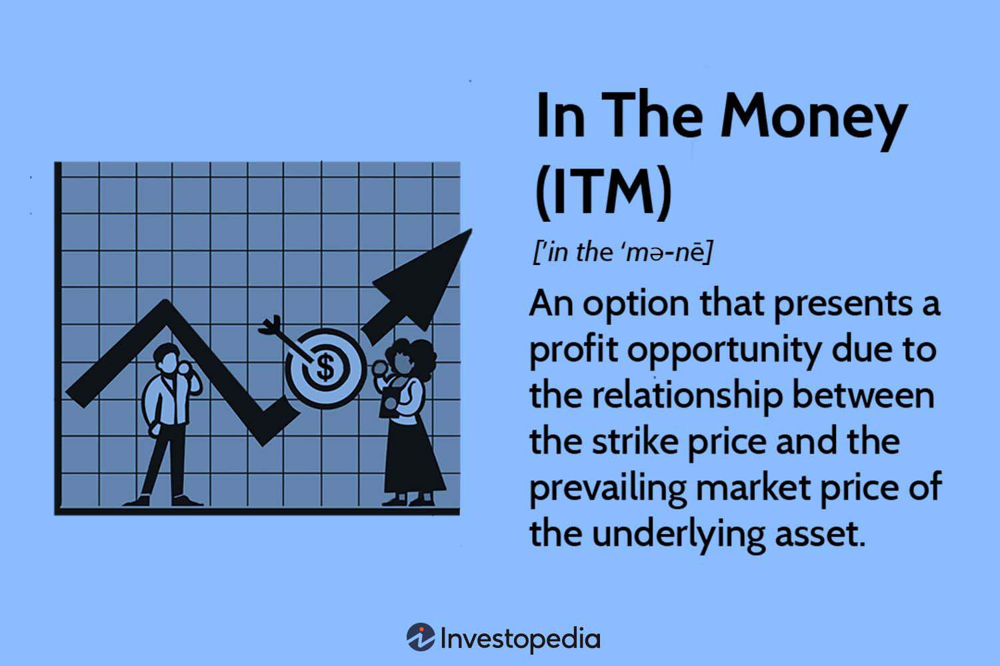

Options trading is a versatile and complex financial strategy used by traders worldwide. At the heart of this strategy lies the call option, a financial contract that grants the holder the right—but not the obligation—to purchase a security at a predetermined price, known as the strike price. This flexibility allows traders to benefit from upward movements in the market without committing to a purchase unless it is favorable.

A fundamental aspect of call options is understanding whether they are in-the-money (ITM) or out-of-the-money (OTM). An ITM call option presents an opportunity for immediate profit, as the market price of the underlying asset exceeds the strike price. Conversely, an OTM call lacks intrinsic value because its strike price is above the current market price, making it a less immediately profitable choice. The differentiation between ITM and OTM options is essential for making informed trading decisions, as it directly impacts the likelihood of profitability.



Algorithmic trading, commonly known as algo trading, plays a significant role in modern options trading by enhancing the precision and efficiency of executing strategies. Through sophisticated algorithms, traders can analyze vast amounts of market data in real-time, identifying optimal trading opportunities and executing trades with unmatched speed and accuracy. This technological advancement allows for the dynamic adjustment of trading strategies, maximizing potential benefits and minimizing risks.

This article aims to explore the advantages of trading in-the-money call options and demonstrate how algorithmic trading can amplify these benefits. By understanding these concepts, traders can better navigate the complexities of options trading and potentially achieve more successful outcomes.

## Table of Contents

## Understanding Call Options

A call option is a financial contract that grants the holder the right, but not the obligation, to purchase a specific stock at a predetermined price—referred to as the strike price—within a set period. This contractual nature introduces flexibility and strategic opportunities for investors seeking to capitalize on stock price movements.

The intrinsic value of a call option becomes evident when the market price of the underlying asset surpasses the strike price. In such cases, the option is considered "in-the-money" (ITM), providing immediate profit potential equal to the difference between the market price and the strike price: 

$$
\text{Intrinsic Value} = \text{Market Price} - \text{Strike Price}
$$

For instance, if a call option has a strike price of $50 and the asset's market price is $55, the intrinsic value amounts to $5. This imbued value underscores the advantage ITM options provide in realizing potential profits promptly.

Conversely, "out-of-the-money" (OTM) call options are those where the market price stands below the strike price. These options possess no intrinsic value, as exercising them would not yield an immediate profit. Their potential advantage lies in leveraging anticipated future price increases.

The concept of "moneyness"—the relationship between the option's strike price and the underlying asset's market price—is crucial in assessing an option's value and potential profitability. Understanding this concept aids traders in determining the most advantageous options to engage with, aligning their strategies to market movements and individual risk appetites. By acknowledging and analyzing these dynamics, investors are better positioned to make informed decisions in options trading.

## Benefits of In-the-Money Call Options

In-the-money (ITM) call options present distinct advantages that make them a compelling choice for traders seeking reduced risk and increased potential profitability. One of the primary benefits of ITM call options lies in their intrinsic value. Unlike out-of-the-money (OTM) options, which [carry](/wiki/carry-trading) no intrinsic value, ITM options have a market price that exceeds the strike price, providing immediate profitability upon exercise. This inherent value makes ITM options less speculative and more attractive to risk-averse investors who prefer strategies with a higher probability of success.

The higher likelihood of profitability is another key advantage of ITM call options. Because these options can be exercised at any time for an immediate profit, traders can capitalize on upward market movements without waiting for the market price to surpass the strike price. This ability to exercise options for a profit contributes to a higher expected return compared to their OTM counterparts, which require favorable price movements to generate value.

ITM call options also typically exhibit lower [volatility](/wiki/volatility-trading-strategies). Volatility measures the degree of price fluctuations, and options with lower volatility are generally considered less risky. This reduced risk profile is appealing to traders who prioritize stability and want to minimize potential losses.

Furthermore, the strategic use of ITM call options allows traders to leverage market positions without committing the full capital required for outright stock purchases. For instance, buying 100 shares of a stock priced at $100 would require an investment of $10,000. In contrast, acquiring an ITM call option for the same stock might require significantly less capital, allowing the trader to control the same number of shares with a smaller financial outlay. This leveraging capability enables traders to gain from short-term price movements while preserving capital for other investments or opportunities.

A final advantage of ITM call options is their reduced sensitivity to time decay, quantifiable by the option's "theta." Time decay refers to the erosion of an option's value as it approaches its expiration date. ITM options are less affected by this phenomenon compared to OTM options, as they have intrinsic value that supports their price. This reduced time decay impact can be calculated using the Black-Scholes model or alternative options pricing methodologies, helping traders assess potential time-related risks as expiration nears.

In conclusion, in-the-money call options offer multiple benefits to traders, including intrinsic value, increased chances of profitability, lower volatility, leveraging opportunities, and reduced time decay effects. These characteristics make ITM options a valuable component in a trader's toolkit, especially for those seeking a balance between potential return and risk exposure.

## Leveraging Algorithmic Trading

Algorithmic trading, commonly known as algo trading, significantly augments the capacity to execute trading strategies with enhanced precision and speed. In the context of options, particularly in-the-money (ITM) call options, the benefits are pronounced. Algo trading systems employ sophisticated algorithms to systematically identify optimal entry and [exit](/wiki/exit-strategy) points for ITM call options. These systems rely on predefined criteria and data analytics to determine conditions that align with the trader's goals, improving the decision-making process by removing human biases and emotions.

Automated trading systems help mitigate emotional involvement, leading to more rational and consistent trading decisions. When human emotions are reduced or removed from the trading equation, the potential for irrational decision-making diminishes, resulting in strategies that align more closely with statistical and analytical insights rather than personal sentiments.

One of the primary advantages of algorithmic systems is their ability to swiftly adapt to changing market conditions. These systems are designed to process large volumes of market data in real-time, enabling them to adjust open positions promptly to ensure that the strategy remains aligned with current market dynamics. This adaptability is crucial in maintaining effective strategy execution, particularly in volatile markets where conditions can shift unexpectedly.

The integration of [algorithmic trading](/wiki/algorithmic-trading) technology enhances the overall efficiency of managing ITM call option portfolios. By automating routine tasks and conducting complex analyses at speeds unattainable by human traders, algorithmic trading platforms free up significant amounts of time and resources. This efficiency gain allows traders to focus on strategy development and monitoring rather than execution, providing a streamlined method for portfolio management.

In summary, leveraging algorithmic trading in the management of ITM call options empowers traders with the tools for more precise execution, rational decision-making, and efficient portfolio management, leading to optimized trading strategies and potentially better financial outcomes.

## Examples and Illustrations

Consider a call option on a stock with a strike price of $50, while the stock is currently trading at $55 in the market. This scenario results in an in-the-money (ITM) status for the call option, yielding an intrinsic value of $5 per share. Exercising this option provides the investor with a $5 profit for each share, thereby highlighting the intrinsic value of ITM options.

To improve the efficiency of such trades, algorithmic trading tools can be employed to automatically execute them when the market conditions align with predefined criteria. These systems can be configured to monitor various market indicators and trigger trades at the optimal moment, thereby minimizing the risks associated with human intervention and emotional decision-making.

For example, a Python algorithm might utilize a combination of moving averages and relative strength index (RSI) to ascertain the best time to exercise the ITM call option:

```python
def should_execute_trade(stock_price, moving_avg, rsi, strike_price):
    intrinsic_value = stock_price - strike_price
    # Execute trade if stock is above moving average and RSI indicates a buy signal
    if stock_price > moving_avg and rsi < 30 and intrinsic_value > 0:
        return True
    return False

# Example usage
current_stock_price = 55
moving_average = 52
current_rsi = 28
strike_price = 50

if should_execute_trade(current_stock_price, moving_average, current_rsi, strike_price):
    print("Execute ITM call option trade")
```

Real-world case studies underline the benefits of leveraging ITM options in both volatile and stable market conditions. During periods of heightened market volatility, ITM options provide a cushion against significant capital loss, allowing traders to capitalize on fluctuating prices without the full capital exposure of owning the underlying asset. Conversely, in stable market environments, the intrinsic value of ITM options offers immediate profitability potential, making them a reliable component of a balanced trading strategy.

In summary, the use of ITM call options exemplifies strategic trading with intrinsic value, and the integration of algorithmic trading technology can streamline the execution process, maximizing potential gains across varying market conditions.

## Conclusion

The benefits of trading in-the-money (ITM) call options are significant due to their inherent potential for immediate profitability and relatively reduced risk levels compared to out-of-the-money options. ITM call options carry intrinsic value as the market price of the underlying asset surpasses the strike price, thus granting an immediate profit opportunity for investors. This characteristic minimizes the speculative nature of such trades, making them a favorable choice for risk-averse traders aiming for a tangible probability of profit.

Algorithmic trading further magnifies these inherent advantages by delivering enhanced precision, speed, and adaptability in trade execution. Modern trading algorithms can automatically identify and execute trade opportunities when predetermined criteria are met, reducing the emotional and psychological biases associated with manual trading. This systematic approach not only improves the likelihood of capturing optimal entry and exit points for ITM call options but also empowers traders to swiftly adjust their strategies in response to real-time market fluctuations, thereby maintaining an efficient options portfolio.

Understanding the mechanics of ITM call options, coupled with advanced algorithmic strategies, allows traders to maximize their potential in the options market. By leveraging technology and data-driven insights, investors can refine their methods, thereby optimizing returns and mitigating risks. This approach is beneficial to both seasoned traders, who can expand their strategies with innovative tools, and newcomers, who gain a structured methodology to start their trading journey with a reduced learning curve.

Incorporating these strategies into a broader investment framework can therefore provide a strategic edge, enhancing overall portfolio performance while aligning with diverse risk appetites and investment objectives.

## References & Further Reading

[1]: Hull, J. C. (2018). ["Options, Futures, and Other Derivatives."](https://www.semanticscholar.org/paper/Options%2C-Futures%2C-and-Other-Derivatives-Hull/89bdee500c8623864fc9eb7a471546aa713acc44) Pearson Education.

[2]: Marcos Lopez de Prado (2018). ["Advances in Financial Machine Learning."](https://www.amazon.com/Advances-Financial-Machine-Learning-Marcos/dp/1119482089) Wiley.

[3]: Chan, E. P. (2017). ["Algorithmic Trading: Winning Strategies and Their Rationale."](https://github.com/ftvision/quant_trading_echan_book) Wiley.

[4]: Jansen, S. (2020). ["Machine Learning for Algorithmic Trading."](https://github.com/stefan-jansen/machine-learning-for-trading) Packt Publishing.

[5]: Natenberg, S. (1994). ["Option Volatility and Pricing: Advanced Trading Strategies and Techniques."](https://www.amazon.com/Option-Volatility-Pricing-Strategies-Techniques/dp/0071818774) McGraw-Hill Education.