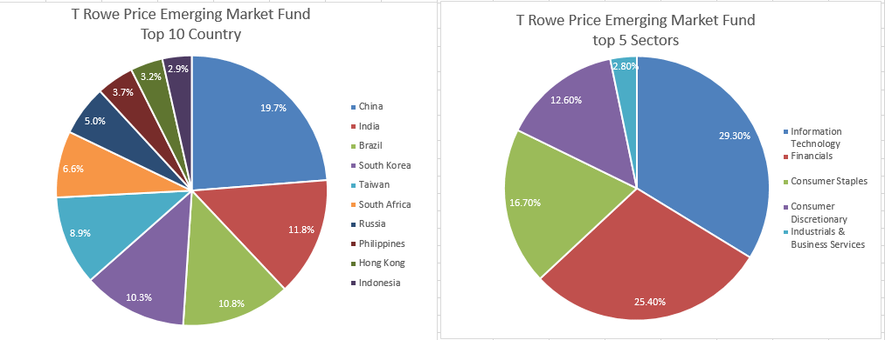

In recent times, investing has experienced notable transformations as diverse investment vehicles gain traction among both veteran investors and beginners. Of the various options, mutual funds persist as a favored choice due to their inherent diversified investment strategy and ease of access. This popularity stems from the unique ability of mutual funds to pool resources from multiple investors, thereby enabling investment in a diverse array of assets which reduces risk and enhances potential returns. Moreover, mutual funds offer investors the advantage of professional management, ease of liquidity, and economies of scale.

Concurrently, the financial markets have been significantly impacted by the emergence of algorithmic trading. This technological advancement has introduced a new dimension characterized by speed, efficiency, and the elimination of human emotional bias. Algorithmic trading employs sophisticated algorithms and computer programs to execute trades at optimal speeds and prices, often beyond human capabilities. As such, this method has increasingly attracted institutional investors and is becoming more accessible to retail investors.



This article aims to comprehensively explore the multiple advantages associated with mutual fund investment, highlighting their role in diversification and access. In addition, it addresses the benefits of integrating algorithmic trading into investment strategies, discussing how this integration can lead to optimized trading processes and potential benefits in terms of precision and market liquidity. Through an understanding of these concepts, investors can make informed decisions that align with their unique financial goals and risk tolerances, paving the way for more effective and resilient investment strategies.

## Table of Contents

## The Advantages of Mutual Funds

Mutual funds are collective investment vehicles that pool capital from numerous investors to purchase a diversified portfolio of securities. This investment mechanism presents several advantages, positioning mutual funds as a preferred choice for both novice and seasoned investors.

One of the most significant benefits of mutual funds is diversification. By allocating resources across a diverse array of assets—such as stocks, bonds, and other securities—mutual funds mitigate the risks associated with investing in individual securities. Diversification reduces portfolio volatility since the performance of the various investments tends to offset each other during market swings, thereby stabilizing overall returns.

Economies of scale represent another advantage of mutual funds. Because mutual funds consolidate the financial resources of many investors, they can execute trades at a reduced cost per unit, compared to individual investors conducting the same transactions independently. These lowered transaction costs directly translate to cost savings for investors, enhancing their investment returns.

Liquidity is an additional key feature of mutual funds. Investors have the flexibility to buy or redeem their shares in open-ended mutual funds at the close of every trading day at the prevailing net asset value (NAV). This feature ensures that investors can access their capital relatively quickly without substantially influencing the fund's price or operations.

Another advantage is professional management. Mutual funds are overseen by professional portfolio managers, who are supported by a team of analysts and researchers. These financial experts are equipped with the resources to make informed and strategic investment decisions, monitor market conditions, and adjust the portfolio as necessary to meet the fund’s objectives.

Finally, mutual funds offer unparalleled convenience. Investors can engage with mutual funds easily through a variety of platforms, such as banks, brokerage firms, or directly from mutual fund companies. Moreover, they often have lower initial investment requirements compared to direct investments in securities, making them accessible to a wide range of investors with different financial capacities.

Collectively, these advantages underscore the enduring appeal of mutual funds in the investment landscape. By providing diversification, reduced transaction costs, [liquidity](/wiki/liquidity-risk-premium), expert management, and accessibility, mutual funds continue to be a cornerstone of many investors' portfolios.

## What is Algorithmic Trading?

Algorithmic trading, commonly known as algo trading, involves using sophisticated computer algorithms to execute trades in financial markets based on predefined criteria. These algorithms process vast amounts of market data, performing complex calculations to identify profitable trading opportunities and execute orders at optimal prices. The speed at which these algorithms operate is significantly superior to human capabilities, allowing trades to be executed in milliseconds or even microseconds, thereby capitalizing on fleeting market inefficiencies.

The algorithms are programmed to analyze various market indicators, such as price, [volume](/wiki/volume-trading-strategy), and timing, which enables them to make informed trading decisions. By doing so, [algorithmic trading](/wiki/algorithmic-trading) ensures that trades are conducted purely based on logic rather than emotions, which typically affect human traders' judgment. This characteristic helps in minimizing mistakes that occur due to psychological factors like fear and greed, which can lead to suboptimal investment decisions.

Algo trading is increasingly prevalent among institutional investors, such as hedge funds, banks, and asset management firms, due to its ability to handle vast volumes of transactions swiftly and efficiently. It is also gaining traction among retail investors, who are now accessing algorithmic trading tools that were once exclusive to institutional players. The popularity of algorithmic trading among diverse investors is driven by its potential for improved accuracy, enhanced trading opportunities, and reduced transaction costs.

Overall, by harnessing the computational power and efficiency of algorithmic trading, participants in the financial markets can gain a significant edge, optimizing their strategies to achieve better outcomes.

## Benefits of Algorithmic Trading

Algorithmic trading significantly enhances trading efficiency and accuracy due to its ability to operate at high speeds. The capability to execute trades in fractions of a second allows traders to capitalize on fleeting market inefficiencies and secure optimal pricing before prices adjust. One notable example is the use of High-Frequency Trading ([HFT](/wiki/high-frequency-trading-strategies)), which leverages speed to capture profitable opportunities in the market.

Automation in trading processes mitigates the risk of human error and yields greater precision. Traditional manual trading strategies are often susceptible to emotional biases and inconsistencies. In contrast, algorithmic systems follow predefined rules, ensuring that trading decisions are logical and based on historical and real-time data. 

Algorithmic trading also facilitates diversification by enabling multiple trading strategies across various markets simultaneously. This allows traders to spread risk and explore diverse investment opportunities without being confined to a single strategy or market.

A critical advantage of algorithmic trading is the ability to backtest strategies using historical data. Traders can simulate different scenarios to assess the potential risks and rewards before executing trades in live markets. This testing framework empowers traders to refine their strategies, leading to more robust and reliable performance.

By reducing transaction times and managing large orders efficiently, algorithmic trading enhances market liquidity. Algorithms can break down substantial orders into smaller segments to minimize market impact, thus avoiding significant price disruptions that large trades might cause.

In summary, the advantages of algorithmic trading such as high-speed execution, reduced human error, diversification support, [backtesting](/wiki/backtesting) capabilities, and enhanced market liquidity position it as a powerful tool in modern investment strategies.

## Integrating Algo Trading with Mutual Funds

Combining mutual funds with algorithmic trading offers a synergistic approach to optimizing investment strategies by harnessing the strengths inherent in each method. Investors can leverage algorithms to meticulously select mutual funds that align with specific criteria such as asset class, risk profile, and projected returns. This process enhances portfolio customization, allowing investors to tailor their investments to meet predefined financial objectives.

Algorithmic trading systems excel at constant portfolio monitoring and rebalancing with the integration of real-time market data and pre-set investment goals. This continuous oversight ensures that mutual fund portfolios maintain their desired asset allocation, adjusting dynamically in response to market fluctuations. Such active management is crucial for capitalizing on emerging opportunities and mitigating potential risks inherent in volatile market conditions.

The integration of algorithmic strategies with mutual funds also provides an additional layer of security and growth potential. Active management facilitated through algorithms enables informed trading decisions free from emotional bias, which is a critical advantage in maintaining steady investment growth. By automating these processes, investors can enhance their ability to achieve a balance between risk and return while focusing on long-term financial goals.

Implementing algorithms for fund selection and management can be sophisticated. For instance, a basic algorithm could be structured to calculate the Sharpe Ratio for different funds, helping choose the ones with the best risk-adjusted returns. In Python, this could involve:

```python
import numpy as np

# Assume 'returns' is a numpy array of historical returns of a mutual fund
# and 'risk_free_rate' is the prevailing risk-free interest rate

excess_returns = returns - risk_free_rate
sharpe_ratio = np.mean(excess_returns) / np.std(excess_returns)

# Selection criteria based on Sharpe Ratio
if sharpe_ratio > threshold:
    select_fund(fund_id)
```

By incorporating such quantitative techniques, investors can make more data-driven decisions, potentially enhancing the overall efficacy of their investment strategies through the combination of mutual funds and algorithmic trading.

## Risks and Considerations

Despite the many advantages of mutual funds and algorithmic trading, both come with inherent risks that necessitate careful consideration by investors. Economic downturns and market [volatility](/wiki/volatility-trading-strategies) are significant concerns for mutual fund investors, as they can negatively impact fund returns. During periods of economic instability, the underlying assets in a mutual fund portfolio may experience substantial fluctuations in value. To mitigate these risks, investors must carefully select and diversify their holdings within mutual funds. Diversification involves spreading investments across various asset classes and sectors, reducing the impact of poor performance by any single investment.

Algorithmic trading, while offering speed and efficiency, is not without its challenges. The heavy reliance on technology makes algorithmic systems susceptible to technical glitches and system failures. Such incidents can result in significant financial losses, especially if trades occur at unfavorable prices due to incorrect coding or unexpected system downtime. Furthermore, algorithmic trading systems may encounter issues with data integrity or latency, which can compromise the effectiveness of trading strategies.

Regulatory scrutiny is another important consideration for those engaging in algorithmic trading. As the practice becomes more prevalent, financial authorities are increasingly focused on monitoring and regulating algorithmic activities to ensure market stability and fairness. Changes in regulations could potentially impact the widespread adoption and implementation of algorithmic trading strategies. Therefore, traders must remain informed about current regulatory requirements and be prepared to adapt their systems accordingly.

In conclusion, while mutual funds and algorithmic trading offer various benefits, investors must remain vigilant about the associated risks. By understanding and addressing these challenges, investors can better protect their portfolios and enhance the potential for achieving their financial objectives.

## Conclusion

Investors aiming to enhance their portfolios should consider the interplay between mutual funds and algorithmic trading. Mutual funds offer diversified investment opportunities and the guidance of professional management, providing a solid foundation for any investment strategy. By incorporating algorithmic trading, investors can further refine their financial approach, taking advantage of the precision and efficiency that technology offers.

Algorithms provide the capability to make data-driven decisions swiftly, eliminating emotional biases which often affect trading judgments. The utilization of automated trading strategies can facilitate better timing and execution, which are pivotal in capturing market opportunities. Additionally, algorithmic trading can assist in maintaining a diversified portfolio by dynamically rebalancing assets in response to real-time market changes.

However, a comprehensive understanding of the benefits and risks associated with these investment tools is critical. The potential for technical glitches in algorithmic systems, market volatility, and economic downturns requires investors to approach these tools with caution and due diligence. An informed strategy that carefully selects mutual funds and constructs trading algorithms can mitigate these risks.

Ultimately, thorough research and selection of suitable funds and algorithmic strategies can guide investors towards consistent returns and capital growth. Rigorous analysis and regular evaluation of investment approaches are key to leveraging the advantages offered by mutual funds and algorithmic trading.

## References & Further Reading

[1]: Bergstra, J., Bardenet, R., Bengio, Y., & Kégl, B. (2011). ["Algorithms for Hyper-Parameter Optimization."](https://papers.nips.cc/paper/4443-algorithms-for-hyper-parameter-optimization) Advances in Neural Information Processing Systems 24.

[2]: ["Advances in Financial Machine Learning"](https://www.amazon.com/Advances-Financial-Machine-Learning-Marcos/dp/1119482089) by Marcos Lopez de Prado

[3]: ["Evidence-Based Technical Analysis: Applying the Scientific Method and Statistical Inference to Trading Signals"](https://www.amazon.com/Evidence-Based-Technical-Analysis-Scientific-Statistical/dp/0470008741) by David Aronson

[4]: ["Machine Learning for Algorithmic Trading"](https://github.com/stefan-jansen/machine-learning-for-trading) by Stefan Jansen

[5]: ["Quantitative Trading: How to Build Your Own Algorithmic Trading Business"](https://www.amazon.com/Quantitative-Trading-Build-Algorithmic-Business/dp/1119800064) by Ernest P. Chan