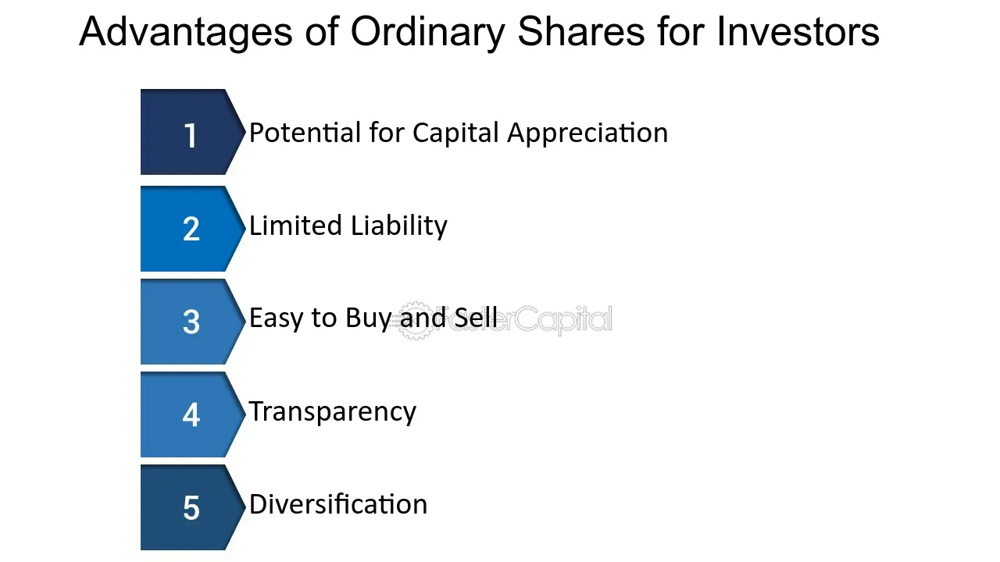

## Table of Contents

## What are ordinary shares?

Ordinary shares, also known as common shares, are a type of stock that companies issue to investors. When you buy ordinary shares, you become a part-owner of the company. This means you have a say in how the company is run, usually by voting at shareholder meetings. Ordinary shares are the most common type of stock that people buy and sell on stock markets.

One key feature of ordinary shares is that they can go up or down in value. If the company does well, the value of the shares might increase, and you could make a profit if you sell them. However, if the company does poorly, the value of the shares might drop, and you could lose money. Another important thing to know is that ordinary shareholders are usually the last to get paid if the company goes bankrupt. This means they only get money back after everyone else, like banks and bondholders, has been paid.

## How do ordinary shares differ from other types of shares?

Ordinary shares are different from other types of shares, like preference shares. Ordinary shares give you a vote in the company's decisions, but preference shares usually don't. This means if you own preference shares, you can't vote at shareholder meetings. Also, preference shares often pay a fixed dividend, which is like getting a regular payment from the company. Ordinary shares might pay dividends too, but the amount can change and is not guaranteed.

Another difference is how you get paid if the company goes bankrupt. If a company goes bankrupt, preference shareholders get paid before ordinary shareholders. This makes preference shares a bit safer, but ordinary shares can offer more chances to make money if the company does well. Ordinary shares can increase in value a lot, which can be good for you if you sell them at the right time. So, ordinary shares can be riskier but also potentially more rewarding than preference shares.

## What are the basic rights associated with owning ordinary shares?

When you own ordinary shares, you get some basic rights. One important right is the ability to vote at shareholder meetings. This means you can have a say in big decisions about the company, like choosing the board of directors or approving major changes. The number of votes you have usually depends on how many shares you own. This gives you a chance to help guide the company's future.

Another right you have is the possibility to receive dividends. Dividends are payments that companies sometimes give to shareholders out of their profits. However, dividends for ordinary shares are not guaranteed and can change. If the company does well and decides to share its profits, you might get a dividend. But if the company struggles, you might not get anything. Also, if the company ever goes bankrupt, you are last in line to get any money back, after everyone else like banks and bondholders have been paid.

## How can ordinary shares provide income to shareholders?

Ordinary shares can provide income to shareholders mainly through dividends. Dividends are payments that a company makes to its shareholders from its profits. When a company has a good year and makes a lot of money, it might decide to share some of that money with its shareholders. The board of directors decides if and how much to pay in dividends. If you own ordinary shares, you might get these payments, but remember, they are not guaranteed. The amount can change, and sometimes the company might not pay any dividends at all.

Another way ordinary shares can provide income is through capital gains. This happens when you sell your shares for more money than you paid for them. If the company does well and the value of its shares goes up, you can sell your shares at a higher price than what you bought them for. This profit is called a capital gain. It's like buying something for a low price and then selling it later for a higher price. However, this also involves risk because if the company does poorly, the value of the shares could go down, and you might lose money instead of making it.

## What is the potential for capital appreciation with ordinary shares?

Ordinary shares have a lot of potential for capital appreciation. This means that the value of the shares can go up over time. If you buy shares in a company that does well, the price of those shares might increase. You can make money by selling the shares for more than you paid for them. This is called a capital gain. For example, if you buy a share for $10 and later sell it for $15, you have a capital gain of $5 per share.

However, the potential for capital appreciation comes with risks. The value of ordinary shares can also go down if the company doesn't do well. If the company faces problems or if the overall market goes down, the price of the shares might drop. This means you could lose money if you need to sell your shares when their value is low. So, while ordinary shares offer the chance for big gains, they also [carry](/wiki/carry-trading) the risk of big losses.

## How do ordinary shares contribute to voting rights in a company?

Ordinary shares give you the right to vote on important decisions in a company. When you own ordinary shares, you can vote at shareholder meetings. These meetings are where big choices are made, like who should be on the board of directors or whether to approve big changes in the company. The number of votes you get usually depends on how many shares you own. If you own more shares, you have more votes, which means you have a bigger say in what the company does.

Voting rights are important because they let you help guide the company's future. You can vote on things that matter to you, like the company's goals or how it treats the environment. By voting, you can help make sure the company does things you agree with. This is a big part of being a shareholder and owning ordinary shares.

## What are the tax implications of owning ordinary shares?

When you own ordinary shares, you need to think about taxes. If you get dividends from the company, you usually have to pay taxes on that money. The tax rate can be different depending on where you live and how much money you make. Sometimes, the company might already take out some tax from your dividends before they give them to you, but you still might need to pay more when you file your taxes.

Another tax you might have to pay is called capital gains tax. This happens when you sell your shares for more money than you paid for them. The profit you make is called a capital gain, and you have to pay tax on that profit. The tax rate for capital gains can be different from the tax rate for your regular income. Also, if you hold onto your shares for a long time before selling them, you might pay a lower tax rate on the gains than if you sell them quickly. It's a good idea to talk to a tax expert to understand all the rules and how they apply to you.

## How does the liquidity of ordinary shares affect their advantages?

The [liquidity](/wiki/liquidity-risk-premium) of ordinary shares means how easily you can buy or sell them. If shares are very liquid, it's easy to find someone to buy them from you or sell them to you. This is good because it means you can quickly turn your shares into cash if you need to. For example, if you need money for something important, you can sell your shares without waiting a long time to find a buyer. This makes ordinary shares more attractive because you don't have to worry about being stuck with them.

On the other hand, if ordinary shares are not very liquid, it can be hard to sell them quickly. You might have to wait a long time to find someone who wants to buy them, or you might have to sell them for less money than you want. This can be a disadvantage because it makes it harder to get your money out of the shares when you need it. So, the liquidity of ordinary shares can make a big difference in how useful they are to you as an investor.

## What role do ordinary shares play in a diversified investment portfolio?

Ordinary shares are an important part of a diversified investment portfolio. They can help you spread out your money across different types of investments. When you own ordinary shares, you own a piece of a company. This means you can make money if the company does well and the value of the shares goes up. You might also get dividends, which are payments from the company's profits. By including ordinary shares in your portfolio, you can balance out other investments like bonds or real estate, which might not grow as fast but are usually safer.

Having ordinary shares in your portfolio can also help you manage risk. If one part of your investments goes down, the ordinary shares might go up and help make up for the loss. This is because different types of investments often do well at different times. For example, if the stock market is doing well, your ordinary shares might increase in value, even if your bonds are not doing as well. By mixing ordinary shares with other investments, you can create a portfolio that is more likely to grow over time while also protecting you from big losses.

## How can ordinary shares be used in corporate governance?

Ordinary shares play a big role in how a company is run, which is called corporate governance. When you own ordinary shares, you get to vote at shareholder meetings. These meetings are where important decisions are made, like who should be on the board of directors or if the company should make big changes. The more shares you own, the more votes you have. This means you can help decide the future of the company and make sure it does things you agree with. Voting is a way for shareholders to have a say in how the company is managed.

By using their voting rights, shareholders can influence the company's policies and practices. For example, they can vote on things like how much the top executives should be paid or how the company should treat the environment. If shareholders are unhappy with how the company is doing, they can vote to change the board of directors. This can lead to new people running the company who might do a better job. So, ordinary shares are a powerful tool for shareholders to make sure the company is run well and in a way that benefits them.

## What are the risks associated with ordinary shares and how do they balance against the advantages?

Owning ordinary shares comes with some risks. One big risk is that the value of the shares can go down if the company does not do well. This means you could lose money if you need to sell your shares when their price is low. Another risk is that dividends, which are payments from the company's profits, are not guaranteed. If the company has a bad year, it might not pay any dividends at all. Also, if the company goes bankrupt, ordinary shareholders are the last to get any money back, after everyone else like banks and bondholders have been paid. This makes ordinary shares riskier than some other types of investments.

However, ordinary shares also have some big advantages that can balance out these risks. One main advantage is the potential for capital appreciation. This means that if the company does well, the value of your shares can go up a lot, and you can make a good profit by selling them. Another advantage is the chance to get dividends. Even though they are not guaranteed, when the company does well, it might share its profits with shareholders. Plus, owning ordinary shares gives you voting rights, which means you can have a say in how the company is run. This can be important if you care about the company's direction and decisions. So, while ordinary shares can be risky, they also offer the chance for big gains and a voice in the company's future.

## How do market conditions influence the advantages of holding ordinary shares?

Market conditions can really change how good it is to hold ordinary shares. When the market is doing well, like when the economy is growing and people are buying a lot, the value of ordinary shares can go up. This means you might make more money if you sell your shares. Also, when companies are making more profit, they might pay bigger dividends to shareholders. So, in a good market, holding ordinary shares can be a great way to make money.

But, when the market is not doing well, like during a recession or when there's a lot of uncertainty, the value of ordinary shares can go down. This means you could lose money if you need to sell your shares at that time. Companies might also cut back on dividends or stop paying them altogether if they're not making as much money. So, in a bad market, holding ordinary shares can be riskier and might not be as good of an investment.

## What are the advantages of investing in ordinary shares?

Ordinary shares, often referred to as common shares, provide several advantages that make them a popular choice among investors. Firstly, they offer voting rights, which allow shareholders to participate in corporate governance. Ownership of ordinary shares grants individuals the power to vote on crucial company matters, such as the election of the board of directors and significant corporate policies. This voting power ensures that shareholders can influence the direction and management of the company, aligning corporate decisions with the interests of those invested in its success.

Secondly, ordinary shares provide investors with the potential for capital gains and dividends, which are significant sources of returns. Capital gains occur when the price of shares appreciates over time, allowing investors to sell them at a higher price than their purchase cost. Dividends, on the other hand, are distributions of a portion of a company's earnings to its shareholders, usually in the form of cash payments or additional shares. Companies may offer regular dividends, providing a steady source of income, or special dividends in exceptional circumstances. Although dividends are not guaranteed, many organizations seek to reward shareholders through consistent payments, particularly if they achieve stable profitability.

The formula for calculating the return on investment (ROI) from ordinary shares, considering both capital gains and dividends, is as follows:

$$
\text{ROI} = \left(\frac{\text{Capital Gains} + \text{Dividends}}{\text{Initial Investment}}\right) \times 100
$$

This formula helps investors evaluate the financial performance and attractiveness of their share investments.

Moreover, ordinary shares entail limited liability, which is a critical benefit for investors. This principle ensures that shareholders are only responsible for the amount they have invested in the shares, protecting personal assets from being used to cover company debts or liabilities. In the event of a company's insolvency or financial distress, shareholders risk losing only their initial investment without any further financial obligation, which reduces the overall risk exposure when investing in ordinary shares.

Overall, these features make ordinary shares a cornerstone of equity investments, providing individuals with both a say in company decisions and the opportunity for financial returns, while safeguarding their personal assets through limited liability.

## References & Further Reading

[1]: ["Ordinary shares explained."](https://www.investopedia.com/terms/o/ordinaryshares.asp) Investopedia.

[2]: Narang, R. K. (2013). ["Inside the Black Box: A Simple Guide to Quantitative and High-Frequency Trading."](https://onlinelibrary.wiley.com/doi/book/10.1002/9781118662717) Wiley.

[3]: Aldridge, I. (2013). ["High-Frequency Trading: A Practical Guide to Algorithmic Strategies and Trading Systems."](https://www.amazon.com/High-Frequency-Trading-Practical-Algorithmic-Strategies/dp/1118343506) Wiley.

[4]: Kissell, R. L. (2014). ["The Science of Algorithmic Trading and Portfolio Management."](https://www.sciencedirect.com/book/9780124016897/the-science-of-algorithmic-trading-and-portfolio-management) Academic Press.

[5]: Soni, A. (2020). ["A Comprehensive Guide to Developing a Winning Algorithmic Trading System."](https://www.amazon.com/Algorithmic-Trading-Comprehensive-Beginners-Training/dp/1091263973) QuantInsti.