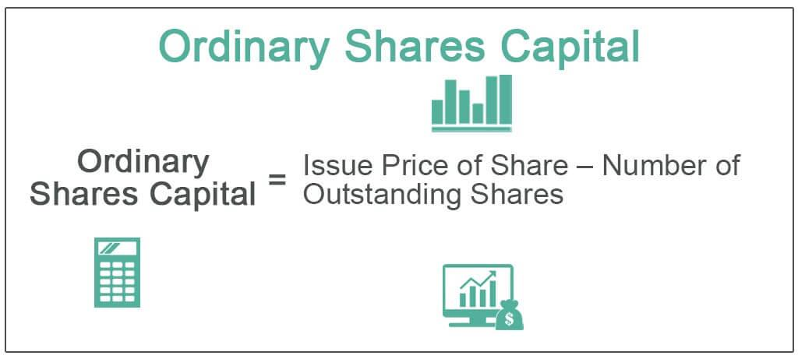

The world of investments offers numerous avenues, each tailored to meet diverse financial goals and risk appetites. Among these, ordinary shares stand out as a pivotal financial instrument for investors seeking to participate in the ownership and success of companies. Ordinary shares, also known as common shares, are a popular vehicle due to their potential for substantial returns and the empowerment they provide investors through voting rights in corporate governance. This opportunity to share in a company's success through dividends and capital appreciation makes them a significant component of equity investment.

Moreover, the landscape of trading securities has been revolutionized by the advent of algorithmic trading. This technology-driven approach employs complex algorithms to automate trading processes, significantly enhancing the efficiency and precision of transactions. Algorithmic trading has had a profound impact on the trading of securities, including ordinary shares, by introducing unparalleled speed and accuracy, reducing transaction costs, and enabling sophisticated trading strategies.



This article aims to explore the benefits of investing in ordinary shares and the transformative role of algorithmic trading in elevating equity investment. Through a comprehensive analysis, we will examine how these tools can be leveraged to maximize investment outcomes while also addressing the associated challenges and considerations.

## Table of Contents

## Understanding Ordinary Shares

Ordinary shares, commonly referred to as common shares, provide individuals with an ownership stake in a company. These shares confer several privileges and responsibilities upon shareholders, most notably the right to vote on corporate matters. Typically, one ordinary share equates to one vote, enabling shareholders to influence significant company decisions, such as the election of the board of directors and the approval of major corporate actions. This voting right underscores the democratic principle in corporate governance, allowing shareholder participation in guiding the company's strategic direction.

Additionally, ordinary shares offer a share in a company’s financial success through dividends. Dividends are often declared from the company's profits and distributed to shareholders as a return on their investment. However, it is important to note that dividends on ordinary shares are not guaranteed and will fluctuate based on the company's performance and profit distribution policy. Companies may choose to reinvest profits back into the business to foster growth, sometimes resulting in reduced or no dividend payouts.

Investing in ordinary shares is a prevalent method for investors looking to gain exposure to a company’s growth and profitability. The potential for capital gains arises when the value of the shares increases over time, allowing investors to sell at a higher price than the purchase price. This potential for appreciation, combined with dividend income, makes ordinary shares an attractive investment vehicle. The relationship between risk and return is pivotal, and ordinary shares offer higher risk and reward due to their sensitivity to market fluctuations and economic conditions. Investors often diversify their portfolios by holding ordinary shares from various sectors and industries to mitigate risk, leveraging the growth prospects of different market segments.

Ordinary shares thus serve as a fundamental component of equity investment, aligning shareholder interests with the company's financial health and performance. Through ownership, voting rights, and the potential for financial returns, these shares play a critical role in the broader investment landscape.

## Advantages of Investing in Ordinary Shares

Ordinary shares, often referred to as common shares, provide several advantages that make them a popular choice among investors. Firstly, they offer voting rights, which allow shareholders to participate in corporate governance. Ownership of ordinary shares grants individuals the power to vote on crucial company matters, such as the election of the board of directors and significant corporate policies. This voting power ensures that shareholders can influence the direction and management of the company, aligning corporate decisions with the interests of those invested in its success.

Secondly, ordinary shares provide investors with the potential for capital gains and dividends, which are significant sources of returns. Capital gains occur when the price of shares appreciates over time, allowing investors to sell them at a higher price than their purchase cost. Dividends, on the other hand, are distributions of a portion of a company's earnings to its shareholders, usually in the form of cash payments or additional shares. Companies may offer regular dividends, providing a steady source of income, or special dividends in exceptional circumstances. Although dividends are not guaranteed, many organizations seek to reward shareholders through consistent payments, particularly if they achieve stable profitability.

The formula for calculating the return on investment (ROI) from ordinary shares, considering both capital gains and dividends, is as follows:

$$
\text{ROI} = \left(\frac{\text{Capital Gains} + \text{Dividends}}{\text{Initial Investment}}\right) \times 100
$$

This formula helps investors evaluate the financial performance and attractiveness of their share investments.

Moreover, ordinary shares entail limited liability, which is a critical benefit for investors. This principle ensures that shareholders are only responsible for the amount they have invested in the shares, protecting personal assets from being used to cover company debts or liabilities. In the event of a company's insolvency or financial distress, shareholders risk losing only their initial investment without any further financial obligation, which reduces the overall risk exposure when investing in ordinary shares.

Overall, these features make ordinary shares a cornerstone of equity investments, providing individuals with both a say in company decisions and the opportunity for financial returns, while safeguarding their personal assets through limited liability.

## Algorithmic Trading and Its Impact on Shares

Algorithmic trading employs sophisticated algorithms to perform trading operations automatically, revolutionizing how shares and other securities are bought and sold. This method leverages computational power to execute trades at speeds impossible for human traders, thereby offering significant advantages such as speed, accuracy, and reduced transaction costs.

Speed is one of the primary benefits of [algorithmic trading](/wiki/algorithmic-trading). Algorithms can initiate and complete transactions in microseconds, taking advantage of minute price fluctuations that can occur in brief timeframes. This rapid execution minimizes market impact and allows traders to capitalize on opportunities that might dissipate quickly.

Accuracy is another compelling advantage. By using pre-programmed criteria, algorithmic trading eliminates human error associated with manual trading processes. This precision ensures that trades are executed exactly as intended, optimizing transaction outcomes based on planned strategies.

Additionally, reduced transaction costs are a major advantage. Algorithms can aggregate multiple small trades across a broad portfolio, minimizing costs associated with bid-ask spreads and enabling more efficient trade execution. This is particularly beneficial for institutional investors managing large volumes of shares.

For ordinary shares, algorithmic trading enhances market [liquidity](/wiki/liquidity-risk-premium). Liquidity is critical for efficient market functioning, as it allows investors to buy or sell shares without causing significant price changes. Algorithmic trading contributes to liquidity by increasing trading volumes and facilitating the rapid matching of buy and sell orders, which stabilizes the market.

Furthermore, algorithmic trading enables the deployment of complex trading strategies, including high-frequency trading ([HFT](/wiki/high-frequency-trading-strategies)). High-frequency traders use proprietary algorithms to conduct thousands of trades per second, exploiting momentary [arbitrage](/wiki/arbitrage) opportunities. While these strategies can yield significant profits, they require sophisticated infrastructure and risk management protocols.

In summary, algorithmic trading fundamentally improves the efficiency and dynamism of share trading, through advantages like increased speed, precision, and affordability, while also enhancing liquidity and enabling advanced trading strategies.

## Integrating Algo Trading into Equity Investment

Incorporating algorithmic trading into equity investment can significantly enhance portfolio management by utilizing advanced computational techniques to automate and optimize trading strategies. Algorithmic trading, commonly referred to as algo trading, leverages pre-defined parameters and complex algorithms to process large volumes of market data rapidly. This ability to conduct real-time analysis allows traders to identify profitable trading opportunities with increased precision.

Algo trading systems are capable of executing trades based on criteria such as price fluctuations, timing, and [volume](/wiki/volume-trading-strategy), thereby enabling precise management of equity portfolios. By minimizing human intervention, these systems reduce the potential for emotional decision-making, which can lead to suboptimal trading choices. The algorithmic approach ensures that trades are executed at optimal prices, thereby reducing transaction costs and enhancing overall portfolio returns.

Python, with its extensive libraries like NumPy, pandas, and scikit-learn, provides a robust framework for building algorithmic trading strategies. For instance, a simple moving average crossover strategy can be implemented as follows:

```python
import pandas as pd

# Load historical stock data
data = pd.read_csv('stock_data.csv', parse_dates=True, index_col='Date')

# Calculate short-term and long-term moving averages
short_window = 40
long_window = 100

data['Short_MA'] = data['Close'].rolling(window=short_window, min_periods=1).mean()
data['Long_MA'] = data['Close'].rolling(window=long_window, min_periods=1).mean()

# Generate trading signals: Buy when Short_MA crosses above Long_MA, Sell otherwise
data['Signal'] = 0
data['Signal'][short_window:] = np.where(data['Short_MA'][short_window:] > data['Long_MA'][short_window:], 1.0, 0.0)

# Calculate trading positions
data['Position'] = data['Signal'].diff()

```

In addition to executing trades efficiently, algo trading offers investors a competitive edge by enabling the design of sophisticated strategies, such as high-frequency trading and [statistical arbitrage](/wiki/statistical-arbitrage). These strategies capitalize on minuscule price discrepancies across markets, yielding profits that traditional trading strategies might miss.

The integration of algorithmic trading in equity investment allows investors to process extensive datasets quickly and execute trades at scales and speeds unprecedented for manual trading operations. By harnessing these capabilities, investors can maintain their competitive advantage in rapidly evolving and highly competitive stock markets. As with any advanced technology, careful implementation and ongoing system adjustments are vital to maintaining performance in dynamic market environments.

## Challenges of Algo Trading in Equity Markets

Algorithmic trading, while offering numerous advantages, also presents several challenges within equity markets. One major concern is market [volatility](/wiki/volatility-trading-strategies). Automated trading systems can exacerbate price fluctuations, contributing to market instability. This occurs when algorithms execute trades at high speeds in response to market events, causing rapid price changes that might not reflect the underlying economic fundamentals. This volatility can, in turn, increase the risk of flash crashes, where drastic price drops happen within a very short time, negatively impacting investor confidence.

Technological failures present another significant challenge. Algorithmic trading relies heavily on technology, and any failure in the system can lead to substantial financial losses. These failures might stem from hardware malfunctions, software glitches, or connectivity issues, potentially leading to erroneous trades or missed opportunities. Ensuring system reliability and having backup systems in place are essential to mitigate these risks.

Ethical concerns also arise with algorithmic trading, particularly related to fairness and market manipulation. High-frequency trading (HFT), a subset of algorithmic trading, may give certain market participants an unfair advantage over others due to their ability to execute trades at blazing speeds. This capability can lead to information asymmetry, where HFT traders make profits at the expense of traditional investors, raising questions about the equity of market practices.

Market manipulation poses a further ethical dilemma. Algorithms can be used to create false market signals by executing large numbers of orders, which can mislead other investors about stock prices and trading volumes. Such practices contravene principles of transparent and fair trading, thus requiring stringent regulatory oversight and ethical compliance.

Investors utilizing algorithmic strategies need to exercise caution. They should ensure that their trading algorithms are robust, incorporating risk management features to handle market volatility and mitigate the potential for technological failures. Ethical compliance is crucial, necessitating adherence to market regulations and ethical standards that promote fair trading. Vigilance in these areas is critical to leveraging the benefits of algorithmic trading while minimizing its inherent risks.

## Conclusion

Ordinary shares are a critical component of equity investments, providing shareholders with notable advantages such as voting rights and the potential for financial returns through capital gains and dividends. These shares enable investors to partake in the financial successes of companies and influence corporate decision-making, making them a valuable asset in any investment portfolio. 

The integration of algorithmic trading into ordinary share investments introduces a layer of efficiency that enhances the trading process. By leveraging advanced algorithms, investors can benefit from improved speed and accuracy in trade execution, as well as reduced transaction costs. This advancement not only streamlines the process but also allows for complex strategies, including high-frequency trading, thereby optimizing portfolio management and providing investors with a competitive edge in the stock market.

Nevertheless, the adoption of algorithmic trading is not without its challenges. Issues such as market volatility, technological failures, and ethical concerns, including fairness and the potential for market manipulation, remain prevalent. Therefore, investors must approach algorithmic strategies with caution, ensuring that robust systems are in place and that there is a commitment to ethical compliance. Through strategic implementation and careful consideration, the potential benefits of integrating algorithmic trading with ordinary share investments can be maximized, leading to more informed and efficient investment decisions.

## References & Further Reading

[1]: ["Ordinary shares explained."](https://www.investopedia.com/terms/o/ordinaryshares.asp) Investopedia.

[2]: Narang, R. K. (2013). ["Inside the Black Box: A Simple Guide to Quantitative and High-Frequency Trading."](https://onlinelibrary.wiley.com/doi/book/10.1002/9781118662717) Wiley.

[3]: Aldridge, I. (2013). ["High-Frequency Trading: A Practical Guide to Algorithmic Strategies and Trading Systems."](https://www.amazon.com/High-Frequency-Trading-Practical-Algorithmic-Strategies/dp/1118343506) Wiley.

[4]: Kissell, R. L. (2014). ["The Science of Algorithmic Trading and Portfolio Management."](https://www.sciencedirect.com/book/9780124016897/the-science-of-algorithmic-trading-and-portfolio-management) Academic Press.

[5]: Soni, A. (2020). ["A Comprehensive Guide to Developing a Winning Algorithmic Trading System."](https://www.amazon.com/Algorithmic-Trading-Comprehensive-Beginners-Training/dp/1091263973) QuantInsti.