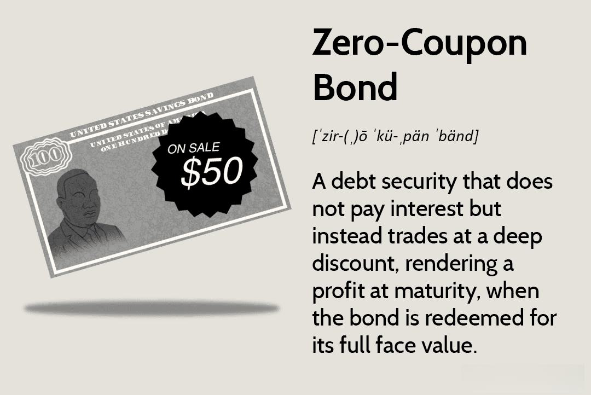

## Table of Contents

## What are Zero-Coupon Treasury Bonds?

Zero-Coupon Treasury Bonds are a type of bond issued by the U.S. government that do not pay interest periodically like traditional bonds. Instead, they are sold at a discount to their face value, which means you buy them for less than what you will get when they mature. For example, you might buy a bond for $900 that will be worth $1,000 when it matures. The difference between the purchase price and the face value is the interest you earn, but you receive it all at once at the end of the bond's term.

These bonds are popular because they are very safe, backed by the full faith and credit of the U.S. government. They are also attractive for investors who want to know exactly how much money they will have at a future date, making them useful for planning long-term financial goals like saving for a child's college education or retirement. However, because they do not provide regular interest payments, they might not be the best choice for someone who needs income from their investments on a regular basis.

## How do Zero-Coupon Treasury Bonds work?

Zero-Coupon Treasury Bonds work by being sold at a lower price than what they will be worth when they mature. For example, you might buy a bond for $900, but when it matures in, say, 20 years, you get $1,000. The difference between what you paid and what you get at the end is your interest. You don't get any payments along the way, just that one big payment at the end.

These bonds are backed by the U.S. government, so they're very safe. They're good for people who want to save money for a long time and know exactly how much they'll have at the end. For example, if you're saving for your kid's college, you can buy a bond that matures when they start school. But, because you don't get any money until the end, they're not good if you need regular income from your investments.

## What are the main advantages of investing in Zero-Coupon Treasury Bonds?

One big advantage of Zero-Coupon Treasury Bonds is that they are very safe. They are backed by the U.S. government, which means they are one of the safest investments you can make. This makes them a good choice if you want to keep your money safe and not take big risks. Another advantage is that you know exactly how much money you will get at the end. If you buy a bond for $900 that will be worth $1,000 in 20 years, you can plan your future knowing you'll have that $1,000 when the bond matures.

Another benefit is that they can help with long-term planning. If you need money at a specific time in the future, like when your child goes to college or when you retire, you can buy a bond that matures at that time. This makes it easier to save for big goals because you know exactly when you'll get your money. Plus, since you buy the bond at a discount and get the full amount at maturity, you don't have to worry about reinvesting interest payments or dealing with taxes on them each year.

## What are the risks associated with Zero-Coupon Treasury Bonds?

One risk of Zero-Coupon Treasury Bonds is that they might lose value if you need to sell them before they mature. If interest rates go up after you buy the bond, the price of your bond might go down. This means if you need to sell it early, you might get less money than you paid for it. This is called [interest rate](/wiki/interest-rate-trading-strategies) risk.

Another risk is that because you don't get any interest payments along the way, you might miss out on other investment opportunities. If you need income from your investments, these bonds might not be the best choice because all the money comes at the end. This is called opportunity cost.

Lastly, even though these bonds are backed by the U.S. government, there's still a small risk that the government could default on its debt. It's very unlikely, but it's something to think about. Also, you have to pay taxes on the interest you earn each year, even though you don't get the money until the bond matures. This can be tricky to manage.

## How does the concept of deep discount apply to Zero-Coupon Treasury Bonds?

The concept of deep discount is a key part of how Zero-Coupon Treasury Bonds work. These bonds are sold at a deep discount, which means you buy them for much less than their face value. For example, you might buy a bond for $900 that will be worth $1,000 when it matures. The difference between what you pay and what you get at the end is your interest. This deep discount allows you to earn interest without getting any payments along the way, which is different from regular bonds that pay interest every so often.

This deep discount is attractive because it lets you know exactly how much money you'll have in the future. If you need money for something like college tuition or retirement, you can buy a bond that matures when you need the money. The deep discount also means you don't have to worry about reinvesting interest payments or paying taxes on them each year, since you only get one big payment at the end. However, if you need to sell the bond before it matures, you might get less money than you paid for it, especially if interest rates have gone up.

## What is the tax treatment of Zero-Coupon Treasury Bonds?

When you invest in Zero-Coupon Treasury Bonds, you don't get interest payments every year like with regular bonds. Instead, you buy the bond at a lower price and get the full amount when it matures. But even though you don't get the money until the end, you still have to pay taxes on the interest you earn each year. This is called imputed interest, and the IRS treats it as if you were getting interest payments every year, even though you're not.

This can be a bit tricky because you have to pay taxes on money you haven't actually received yet. You need to report this imputed interest as income on your tax return each year. The good news is that the interest from Treasury Bonds is exempt from state and local taxes, so you only have to worry about federal taxes. But you still need to plan for these taxes, since they can affect how much money you have when the bond finally matures.

## How does interest rate risk affect Zero-Coupon Treasury Bonds?

Interest rate risk is a big deal for Zero-Coupon Treasury Bonds. If you buy a bond and then interest rates go up, the price of your bond can go down. This happens because new bonds are being sold with higher interest rates, so people don't want to buy your old bond as much. If you need to sell your bond before it matures, you might have to sell it for less than what you paid for it. This is why interest rate risk is important to think about when you're investing in these bonds.

Even though Zero-Coupon Treasury Bonds are safe because they're backed by the U.S. government, the price can still change a lot if interest rates move. If you plan to hold onto the bond until it matures, this risk doesn't matter as much because you'll get the full face value at the end. But if you might need to sell the bond early, it's important to keep an eye on what's happening with interest rates.

## Can you explain the reinvestment risk in the context of Zero-Coupon Treasury Bonds?

Reinvestment risk is not a big concern with Zero-Coupon Treasury Bonds because you don't get any interest payments until the bond matures. With other types of bonds, you might get interest payments every year and then have to decide what to do with that money. If interest rates go down, you might have to reinvest that money at a lower rate, which is the reinvestment risk. But with Zero-Coupon Bonds, you don't have to worry about this because you get all your money at the end.

However, there's a small twist to think about. Even though you don't get interest payments, you still have to pay taxes on the interest you earn each year. This means you might need to set aside some money to pay those taxes. If you use some of your other money to pay these taxes, you might miss out on other investment opportunities. So, while reinvestment risk isn't a direct concern, the need to manage taxes can affect your overall investment strategy.

## What is the duration of Zero-Coupon Treasury Bonds and why is it significant?

The duration of a Zero-Coupon Treasury Bond is the same as its maturity date. This means if you buy a bond that matures in 20 years, its duration is 20 years. Duration is important because it tells you how sensitive the bond's price is to changes in interest rates. For Zero-Coupon Bonds, the longer the duration, the more the bond's price will go up or down when interest rates change.

This is significant because if you might need to sell your bond before it matures, you need to think about what's happening with interest rates. If rates go up, the price of your bond could go down a lot, and you might lose money if you sell it early. But if you plan to hold onto the bond until it matures, you don't have to worry about this as much because you'll get the full face value no matter what happens with interest rates.

## How do Zero-Coupon Treasury Bonds fit into a diversified investment portfolio?

Zero-Coupon Treasury Bonds can be a good addition to a diversified investment portfolio because they are very safe and help with long-term planning. Since they are backed by the U.S. government, they have almost no risk of default. This makes them a good choice if you want to keep some of your money safe while still investing in other things that might be riskier but could give you higher returns. You can use these bonds to save for big goals like college tuition or retirement, knowing exactly how much money you'll have at a specific time in the future.

However, Zero-Coupon Treasury Bonds might not be the best fit for everyone. Because you don't get any interest payments until the bond matures, they're not good if you need regular income from your investments. Also, if you need to sell the bond before it matures, you might lose money if interest rates have gone up. So, they work well in a diversified portfolio if you plan to hold them until they mature and if you need a safe way to save for the future. But you should balance them with other investments that can give you income or grow faster.

## What are the considerations for holding Zero-Coupon Treasury Bonds to maturity?

If you plan to hold Zero-Coupon Treasury Bonds until they mature, you need to think about a few things. First, these bonds are very safe because they are backed by the U.S. government. This means you can be pretty sure you'll get your money when the bond matures. They are good for saving for big goals like paying for college or retirement because you know exactly how much money you'll have at a certain time in the future. You buy the bond at a lower price and get the full amount when it matures, so you don't have to worry about interest payments or reinvesting them.

However, there are some things to consider. You need to plan for taxes because even though you don't get interest payments each year, you still have to pay taxes on the interest you earn. This can be tricky because you have to pay taxes on money you haven't actually received yet. Also, if you need to sell the bond before it matures, you might lose money if interest rates have gone up. So, it's important to make sure you can hold onto the bond until it matures and that you can manage the taxes on the interest you earn each year.

## How do market conditions influence the pricing and yield of Zero-Coupon Treasury Bonds?

Market conditions, especially changes in interest rates, have a big impact on the pricing and yield of Zero-Coupon Treasury Bonds. When interest rates go up, the price of these bonds goes down. This happens because new bonds are being sold with higher interest rates, making your older bond less attractive to buyers. If you need to sell your bond before it matures, you might get less money than you paid for it. On the other hand, if interest rates go down, the price of your bond goes up because it's more valuable compared to new bonds with lower rates.

The yield of Zero-Coupon Treasury Bonds also changes with market conditions. Yield is the interest you earn on the bond, calculated as the difference between what you paid and what you get at maturity, divided by the time you hold the bond. If interest rates rise after you buy your bond, the yield you could get from new bonds would be higher, making your bond's yield less competitive. But if you hold onto the bond until it matures, you'll still get the full face value, so the market conditions won't affect your final payout.

## References & Further Reading

[1]: Fabozzi, F. J. (2008). ["Bond Markets, Analysis, and Strategies"](https://books.google.com/books/about/Bond_Markets_Analysis_and_Strategies_ten.html?id=bQpNEAAAQBAJ). Prentice Hall.

[2]: Hull, J. C. (2015). ["Options, Futures, and Other Derivatives"](https://books.google.com/books/about/Options_Futures_and_Other_Derivatives_Gl.html?id=sdg2EAAAQBAJ). Pearson.

[3]: ["Algorithmic Trading and DMA: An introduction to direct access trading strategies"](https://www.amazon.com/Algorithmic-Trading-DMA-introduction-strategies/dp/0956399207) by Barry Johnson

[4]: Pedersen, L. H. (2015). ["Efficiently Inefficient: How Smart Money Invests and Market Prices are Determined"](https://press.princeton.edu/books/hardcover/9780691166193/efficiently-inefficient). Princeton University Press.

[5]: ["Quantitative Momentum: A Practitioner's Guide to Building a Momentum-Based Stock Selection System"](https://www.amazon.com/Quantitative-Momentum-Practitioners-Momentum-Based-Selection/dp/111923719X) by Wesley R. Gray and Jack R. Vogel