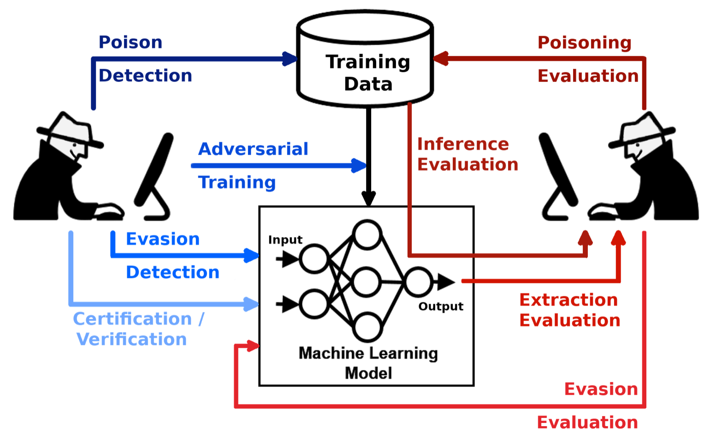

## Table of Contents

## What is an adversarial attack in the context of machine learning?

An adversarial attack in machine learning happens when someone tries to trick a machine learning model by giving it special inputs that make it make mistakes. These special inputs are called adversarial examples. For example, imagine a computer program that can recognize pictures of cats and dogs. Someone could change the picture of a cat in a tiny way that a human wouldn't notice, but the computer thinks it's a dog instead. The changes are often so small that they look like noise to us, but they can fool the computer.

These attacks are important because they show that machine learning models can be tricked, which can be a big problem in important areas like security or self-driving cars. Researchers study adversarial attacks to understand how they work and to find ways to make models stronger against them. They might try to change how the models are trained or add extra checks to catch these tricky inputs. By studying these attacks, we can make machine learning safer and more reliable for everyone.

## How do adversarial attacks affect machine learning models?

Adversarial attacks can mess up machine learning models by tricking them into making wrong guesses. Imagine a model that's really good at telling apart pictures of apples and oranges. Someone could change an apple picture just a tiny bit, so tiny that you wouldn't notice, but the model suddenly thinks it's an orange. These tiny changes are called adversarial examples. They can fool the model because the changes are in places that the model pays a lot of attention to, even if those places don't matter much to humans.

These attacks are a big deal because they show that even the best models can be tricked. This can be dangerous in important places like hospitals or self-driving cars. If a self-driving car's model gets tricked into thinking a stop sign is something else, it could cause an accident. That's why people who study [machine learning](/wiki/machine-learning) are always trying to find ways to make models stronger against these tricks. They might change how the models learn or add extra checks to catch the tricky inputs before they cause problems.

## What are some common types of adversarial attacks?

There are several common types of adversarial attacks that people use to trick machine learning models. One type is called the "Fast Gradient Sign Method" (FGSM). This method changes the input in a way that pushes the model to make a wrong guess. It uses the model's own way of learning to figure out how to trick it. Imagine a model that's trying to guess what's in a picture. FGSM would make tiny changes to the picture that make the model think it's something else.

Another common type is the "Projected Gradient Descent" (PGD) attack. This attack is a bit like FGSM but it's more careful and can be more powerful. It makes many small changes to the input, checking after each change to see if it's tricking the model yet. If not, it keeps going until it finds a way to fool the model. PGD is often used when attackers want to be sure their trick will work.

There's also something called a "Black-box Attack." In this type of attack, the attacker doesn't know how the model works inside. They just send different inputs to the model and see how it reacts. By trying lots of different inputs, they can figure out how to trick the model without knowing its secrets. Black-box attacks are tricky because they show that you don't need to know everything about a model to fool it.

## Can you explain the Fast Minimum-Norm Attack and its purpose?

The Fast Minimum-Norm Attack is a type of adversarial attack where the goal is to trick a machine learning model with the smallest change possible to the input. Imagine you have a picture that a model can recognize correctly. The Fast Minimum-Norm Attack would change this picture just a tiny bit, so tiny that you wouldn't notice, but enough to make the model guess wrong. The "minimum-norm" part means that the attack tries to use the smallest possible change, which makes it harder to spot and fix.

The purpose of the Fast Minimum-Norm Attack is to test how strong a machine learning model is against these tiny changes. By using the smallest possible change, researchers can see how sensitive the model is to even the tiniest tricks. This helps them understand where the model might be weak and how they can make it better. By finding these weak spots, they can work on making the model more reliable and less likely to be fooled by adversarial attacks in real-world situations.

## How does G-NIA (Gradient-based Norm-Informed Attack) work?

G-NIA, or Gradient-based Norm-Informed Attack, is a type of adversarial attack that tries to trick machine learning models by making the smallest possible changes to the input. It works by looking at how the model reacts to changes in the input, called gradients. The attack uses these gradients to figure out which tiny changes will make the model guess wrong. The "norm-informed" part means that G-NIA tries to keep these changes as small as possible, so they are hard to spot. By using the smallest changes that still trick the model, G-NIA can show how sensitive the model is to even tiny tricks.

The way G-NIA works is by taking the gradient of the loss function, which tells the attack how to change the input to make the model's guess wrong. The attack then uses this gradient to make small changes to the input, always keeping an eye on how big these changes are. The goal is to find the smallest change that still fools the model. By doing this, G-NIA helps researchers understand where the model is weak and how they can make it stronger against these kinds of attacks. This is important because it can help make machine learning models safer and more reliable in real-world situations where they might be tricked.

## What is Morphence and how does it differ from other adversarial attacks?

Morphence is a special kind of adversarial attack that tricks machine learning models by making very small changes to the input. These changes are so tiny that they look like noise to humans, but they can make the model guess wrong. What makes Morphence different from other attacks is that it uses something called "morphological operations" to create these changes. Morphological operations are like special filters that change the shape and structure of the input in a way that's hard for the model to handle. By using these filters, Morphence can create adversarial examples that are very effective at fooling models.

Unlike other attacks like the Fast Gradient Sign Method (FGSM) or Projected Gradient Descent (PGD) that use gradients to figure out how to trick the model, Morphence doesn't rely on gradients. Instead, it focuses on changing the shape and structure of the input. This makes Morphence good at creating adversarial examples that are hard to spot and fix because they don't follow the same patterns that gradient-based attacks do. By using a different approach, Morphence helps researchers find new ways to make models stronger against all kinds of adversarial attacks.

## What is the concept behind Adversarial Solarization?

Adversarial Solarization is a special type of attack that tricks machine learning models by changing pictures in a way that looks like an old photo effect called solarization. Solarization is when parts of a photo turn into their opposite colors, making the picture look strange but still recognizable to humans. In adversarial solarization, the attackers use this effect to create changes in the picture that fool the model but are hard for people to notice. They do this by figuring out which parts of the picture the model pays attention to and then using solarization to change those parts just enough to trick the model.

What makes adversarial solarization different from other attacks is that it uses this photo effect instead of tiny changes that look like noise. Other attacks might use math formulas to find the smallest changes that fool the model, but adversarial solarization uses the visual trick of solarization. This can make it harder for the model to learn how to defend against these attacks because the changes are more like a style change than random noise. By studying adversarial solarization, researchers can learn more about how models see and understand pictures, and find new ways to make them stronger against all kinds of tricks.

## How does RandSol generate adversarial examples?

RandSol, short for Randomized Solarization, generates adversarial examples by using a special photo effect called solarization. Solarization is when parts of a picture turn into their opposite colors, making the picture look strange but still recognizable to humans. RandSol takes a picture and randomly applies this solarization effect to different parts of it. The randomness helps make sure that the changes are hard for machine learning models to predict and defend against. By doing this, RandSol creates adversarial examples that can trick the model into making wrong guesses, even though the changes might be hard for people to notice.

What makes RandSol different is that it uses randomness and solarization together. Instead of making tiny changes that look like noise, RandSol uses the visual trick of solarization in a random way. This means that every time RandSol creates an adversarial example, it might look a bit different. This randomness makes it harder for models to learn how to spot and fix these tricks. By studying how RandSol works, researchers can learn more about how models see and understand pictures, and find new ways to make them stronger against all kinds of adversarial attacks.

## What is the principle of Spectral DeTuning in adversarial attacks?

Spectral DeTuning is a way to trick machine learning models by changing pictures in a special way. It works by messing with the colors and patterns in the picture, making it hard for the model to understand what it's seeing. Imagine you have a picture of a cat. Spectral DeTuning would change the colors and patterns in the picture so that the model thinks it's a dog instead. The changes are often so small that humans wouldn't notice them, but they can fool the model because they mess with the way the model sees the picture.

The principle behind Spectral DeTuning is to change the picture in a way that affects how the model processes it. It does this by changing the "spectrum" of the picture, which is like the range of colors and patterns it has. By making these changes, Spectral DeTuning can create adversarial examples that are hard for the model to handle. This helps researchers understand how models see and understand pictures, and find new ways to make them stronger against these kinds of tricks.

## Can you describe the DSiRe method and its effectiveness?

The DSiRe method, which stands for "Denoising and Smoothing-based Robustness Enhancement," is a way to make machine learning models stronger against tricks called adversarial attacks. It works by cleaning up the input, like a picture, to remove tiny changes that might fool the model. Imagine you have a picture of a cat that someone changed a tiny bit to make it look like a dog to the model. DSiRe would clean up those tiny changes, making the picture look normal again so the model can guess right. It does this by using special math formulas to smooth out the picture and remove the noise.

DSiRe is pretty good at making models more robust. It can help the model ignore small changes that are meant to trick it, making it more reliable in real-world situations. Researchers have tested DSiRe on different kinds of models and found that it helps them guess right more often, even when someone tries to fool them. By cleaning up the input, DSiRe makes it harder for attackers to trick the model, which is important for keeping things like self-driving cars and security systems safe and working well.

## How can machine learning models be defended against these adversarial attacks?

One way to defend machine learning models against adversarial attacks is by using something called adversarial training. This means showing the model lots of tricky examples during its learning time. By seeing these examples, the model learns to spot and ignore the tiny changes that attackers use to fool it. Imagine a model that's learning to tell apart pictures of cats and dogs. If you show it lots of cat pictures that have been changed to look like dogs, it can learn to see past the changes and guess right. This makes the model stronger and less likely to be tricked in the real world.

Another way to defend models is by using special methods to clean up the input before it reaches the model. One such method is called DSiRe, which stands for Denoising and Smoothing-based Robustness Enhancement. DSiRe works by smoothing out the input and removing any tiny changes that might fool the model. For example, if someone changes a picture of a cat to trick the model, DSiRe can clean up the picture so the model sees it correctly. By cleaning up the input, these methods help the model guess right even when someone tries to trick it. This is important for keeping things like self-driving cars and security systems safe and working well.

## What are the latest advancements in adversarial attack techniques and their implications for future machine learning security?

Recent advancements in adversarial attack techniques have pushed the boundaries of how machine learning models can be tricked. One new method is called RandSol, which uses a special photo effect called solarization to create adversarial examples. Solarization changes parts of a picture into their opposite colors, making it look strange but still recognizable to humans. RandSol applies this effect randomly to different parts of the picture, making it hard for models to predict and defend against these changes. Another new technique is Spectral DeTuning, which messes with the colors and patterns in a picture to confuse the model. These methods show that attackers are finding new ways to fool models, even when they're trained to spot and ignore tiny changes.

These advancements have big implications for future machine learning security. As attackers find new ways to trick models, it becomes more important for researchers to keep finding ways to make models stronger. This means using methods like adversarial training, where models are shown lots of tricky examples during their learning time, and special methods like DSiRe to clean up inputs before they reach the model. By staying one step ahead of attackers, researchers can help keep important systems like self-driving cars and security systems safe and working well. The ongoing battle between new attack methods and new defense strategies will shape how we use and trust machine learning in the future.