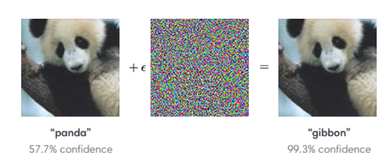

## Table of Contents

## What is Adversarial Image Data Augmentation in the context of machine learning?

Adversarial Image Data Augmentation is a technique used in machine learning to improve the robustness and performance of image classification models. It involves creating slightly altered versions of images, called adversarial examples, which are designed to trick the model into making incorrect predictions. By training the model on these adversarial examples alongside regular images, the model learns to better recognize and classify images even when they are slightly modified or corrupted. This helps the model perform better in real-world scenarios where images might not be perfect or might be intentionally altered.

The process of creating adversarial examples typically involves adding small, carefully crafted perturbations to the original images. These perturbations are often so subtle that they are imperceptible to the human eye but can significantly impact the model's predictions. For example, a model might correctly identify a picture of a dog, but when a tiny amount of noise is added to the image in a specific way, the model might mistakenly classify it as a cat. By exposing the model to these adversarial examples during training, it learns to be more resilient to such manipulations, thereby improving its overall accuracy and reliability.

## How does Adversarial Image Data Augmentation improve model performance?

Adversarial Image Data Augmentation helps make machine learning models better at recognizing images by showing them tricky versions of pictures during training. These tricky versions, called adversarial examples, are made by adding tiny changes to the original images. These changes are so small that people can't see them, but they can fool the model into making wrong guesses. By training the model with both normal and tricky images, it learns to spot these changes and still get the right answer. This makes the model stronger and more reliable when it sees new or slightly changed images in the real world.

For example, if a model is trained to tell the difference between dogs and cats, it might get confused if someone adds a little bit of noise to a dog picture, making it look like a cat to the model. By using adversarial image data augmentation, the model sees many versions of dog pictures with different kinds of noise added. Over time, the model learns that these noisy dog pictures are still dogs, not cats. This way, when it sees a new dog picture with some noise or changes, it is more likely to correctly identify it as a dog. This process helps the model perform better and be more accurate in real-life situations where images might not be perfect.

## What are the basic principles behind techniques like DiffAugment, Adversarial Color Enhancement, and MaxUp?

DiffAugment, Adversarial Color Enhancement, and MaxUp are techniques used to make machine learning models better at recognizing images by changing the images in different ways during training. DiffAugment works by applying random changes to images, like flipping them, rotating them, or changing their colors. This helps the model learn to recognize images even if they look a bit different from what it has seen before. Adversarial Color Enhancement, on the other hand, focuses on changing the colors in images to create tricky versions that can fool the model. By training the model with these color-changed images, it learns to be less confused by color changes in new images it sees. MaxUp takes a different approach by using multiple versions of the same image, each slightly changed, to help the model make better predictions. It does this by averaging the predictions from these different versions, which makes the model's final guess more accurate.

These techniques all aim to make the model more robust and reliable. By showing the model many different versions of the same image, it learns to focus on the important parts of the image and ignore small changes that don't matter. For example, if a model is trained to recognize a dog, it should still recognize the dog even if the image is flipped, the colors are changed, or the image is slightly rotated. This helps the model perform better in real-life situations where images might not be perfect or might be intentionally altered. By using these techniques, the model becomes better at understanding and classifying images, making it more useful and reliable for tasks like image recognition in various applications.

## Can you explain how DiffAugment works to augment image data?

DiffAugment is a way to make images different during training so that a machine learning model can learn better. It does this by applying random changes to the images, like flipping them, rotating them, or changing their colors. Imagine you're teaching a child to recognize a dog. You show them pictures of dogs in different positions, sizes, and colors. DiffAugment does something similar for the model, helping it to see dogs (or whatever it's learning to recognize) in many different ways. This makes the model better at recognizing dogs even if the pictures it sees later are a bit different from what it saw during training.

For example, if you have a picture of a dog, DiffAugment might flip it horizontally, rotate it a little, and change its color slightly. The model then sees this new version of the dog picture and learns from it. By doing this over and over with many different images, the model gets better at understanding what a dog looks like, no matter how the picture is changed. This helps the model perform well in real life, where pictures might not be perfect or might be taken from different angles or in different lighting conditions.

## What specific benefits does Adversarial Color Enhancement provide in image classification tasks?

Adversarial Color Enhancement helps make image classification models better by changing the colors in pictures in a tricky way. It adds small changes to the colors that can fool the model into making wrong guesses. By training the model with these color-changed images, it learns to be less confused by color changes in new images it sees. This makes the model more reliable when it's used in real life, where pictures might have different lighting or color effects.

For example, if a model is trained to tell the difference between a red apple and a green apple, it might get confused if the colors are changed a bit. Adversarial Color Enhancement would show the model many versions of apples with different color changes. Over time, the model learns that these color-changed apples are still apples, not something else. This way, when it sees a new apple picture with different lighting or color effects, it is more likely to correctly identify it as an apple. This process helps the model perform better and be more accurate in real-life situations where images might not be perfect.

## How does MaxUp enhance the robustness of machine learning models against adversarial attacks?

MaxUp makes machine learning models better at handling tricky images by using many slightly changed versions of the same picture. Imagine you're trying to teach a model to recognize a dog. You show it lots of pictures of dogs, but you also show it many versions of the same dog picture, each one a little different. Maybe one picture is a bit brighter, another is rotated slightly, and another has a small change in color. By looking at all these different versions, the model learns to focus on what's important about the dog and ignore small changes that don't matter. This helps the model stay accurate even when someone tries to trick it with a changed image.

When someone tries to fool the model with an adversarial attack, they add small changes to the image to make the model guess wrong. But because MaxUp trains the model with lots of different versions of images, it becomes good at seeing through these tricks. The model makes its final guess by averaging the predictions from all the different versions of the image. This averaging helps the model make a more reliable guess, making it harder for adversarial attacks to work. So, MaxUp helps the model stay strong and accurate, even when faced with tricky images designed to fool it.

## What are the challenges faced when implementing Adversarial Image Data Augmentation techniques?

One big challenge with using adversarial image data augmentation is that it can be really hard to make the right kind of tricky images. These images need to be just different enough to fool the model but not so different that they don't help the model learn. If the changes are too small, the model might not learn anything new. But if they're too big, the model might get confused and learn the wrong things. Finding the right balance takes a lot of work and testing. Also, making these tricky images can take a lot of computer power, which can be expensive and time-consuming.

Another challenge is that adversarial image data augmentation might make the model too focused on the tricky images and not good enough at recognizing regular images. This can happen if the model sees too many tricky images during training and not enough normal ones. It's important to mix the tricky and normal images in the right way so the model learns to be good at both. If not, the model might do well on tricky images but poorly on regular ones, which isn't helpful in real life where most images are normal. Balancing the training data is key to making sure the model works well in all situations.

## How can one measure the effectiveness of Adversarial Image Data Augmentation?

To measure how well adversarial image data augmentation works, you can look at how the model performs on regular images and tricky images. One way to do this is by testing the model on a set of images it hasn't seen before. You can see if the model's accuracy goes up when it's trained with tricky images. Accuracy is just a way to see how often the model gets the right answer. If the model does better on both regular and tricky images after using adversarial image data augmentation, it means the technique is helping the model learn better.

Another way to measure the effectiveness is by looking at how well the model resists being tricked by adversarial attacks. You can create a special set of tricky images designed to fool the model and see if it can still get the right answer. If the model is more resistant to these attacks after being trained with adversarial image data augmentation, it shows that the technique is making the model stronger. By comparing the model's performance before and after using adversarial image data augmentation, you can tell if it's really helping the model become more accurate and reliable.

## What are some common pitfalls to avoid when using Adversarial Image Data Augmentation?

One common pitfall to avoid when using adversarial image data augmentation is overdoing it. If you show the model too many tricky images and not enough regular ones, it might become too focused on the tricky images and not good at recognizing regular images. This can make the model perform poorly in real-life situations where most images are normal. It's important to balance the tricky and regular images so the model learns to handle both well.

Another pitfall is not finding the right balance in the changes made to the images. If the changes are too small, they might not help the model learn anything new. But if the changes are too big, they could confuse the model and make it learn the wrong things. It takes a lot of testing and tweaking to find the right amount of change that helps the model without making it worse.

## How do these augmentation techniques compare to traditional data augmentation methods?

Adversarial image data augmentation techniques like DiffAugment, Adversarial Color Enhancement, and MaxUp are different from traditional data augmentation methods because they focus on making images tricky to fool the model. Traditional methods, like flipping, rotating, or zooming images, help the model learn to recognize images from different angles or in different sizes. These methods are good for making the model more flexible, but they don't prepare it for images that are changed to trick it on purpose. Adversarial techniques, on the other hand, add small changes to images that can confuse the model, helping it learn to be more resistant to these tricks. This makes the model better at handling real-life situations where images might be altered to fool it.

Both types of augmentation aim to make the model better at recognizing images, but they do it in different ways. Traditional methods are easier to use and don't need as much computer power. They help the model learn to recognize images even if they are a bit different from what it saw during training. Adversarial methods, however, need more work and computer power to create the tricky images. They help the model learn to see through attempts to fool it, making it more reliable in situations where images might be intentionally changed. By using both traditional and adversarial methods together, you can make the model even stronger and more accurate.

## What advanced strategies can be employed to further optimize Adversarial Image Data Augmentation?

One advanced strategy to optimize adversarial image data augmentation is to use adaptive learning rates when creating the tricky images. This means changing how fast the model learns from the tricky images based on how well it's doing. If the model is doing well, you can make the learning rate smaller so it doesn't change too much. If it's struggling, you can make the learning rate bigger to help it learn faster. This helps the model learn in a more balanced way, making it better at recognizing both regular and tricky images. Another strategy is to use different types of adversarial attacks to create the tricky images. By using a mix of different attacks, like changing colors, adding noise, or rotating the image, you can make the model more resistant to a wider range of tricks. This helps the model stay strong and accurate no matter how someone tries to fool it.

Another advanced strategy is to use ensemble methods, where you train multiple models with different sets of tricky images and then combine their predictions. This can make the overall prediction more reliable and less likely to be fooled by any single type of adversarial attack. For example, you could train one model with images that have color changes, another with images that have added noise, and a third with images that are rotated. By averaging the predictions from all these models, you can get a more accurate and robust final guess. Additionally, using techniques like curriculum learning, where you start with easier tricky images and gradually make them harder, can help the model learn more effectively. This way, the model builds up its ability to handle tricky images step by step, making it more prepared for real-life situations where images might be altered in complex ways.

## Can you discuss any recent research or developments in the field of Adversarial Image Data Augmentation?

Recent research in adversarial image data augmentation has focused on improving the techniques to make them more effective and less resource-intensive. One notable development is the introduction of more sophisticated methods for generating adversarial examples, such as using generative adversarial networks (GANs) to create more realistic and diverse tricky images. Researchers have also explored the idea of adaptive adversarial training, where the model's learning rate is adjusted based on its performance on adversarial examples. This helps the model learn more efficiently and become more resistant to a variety of adversarial attacks. Another area of research is the use of ensemble methods, where multiple models are trained with different sets of adversarial images and their predictions are combined to improve overall robustness.

In addition to these advancements, there has been a push towards understanding the theoretical foundations of adversarial image data augmentation. Studies have shown that by analyzing the loss landscape of neural networks, researchers can better understand how adversarial examples affect the model's decision-making process. This has led to the development of new algorithms that can generate adversarial examples more effectively by targeting specific vulnerabilities in the model. For example, a recent paper introduced a method that uses $$ \nabla_{\mathbf{x}} L(\mathbf{x}, y; \theta) $$ to calculate the gradient of the loss function with respect to the input image, allowing for more precise perturbations. These theoretical insights are helping to refine the practical applications of adversarial image data augmentation, making it a more powerful tool for improving the robustness of machine learning models.