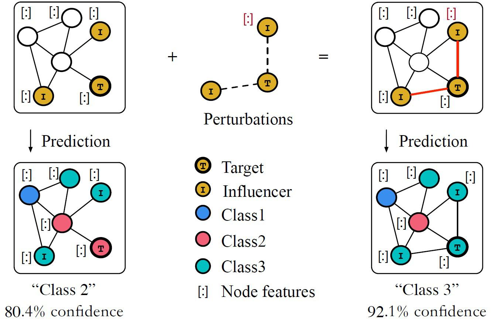

Adversarial learning is a contemporary method in machine learning that is increasingly being adopted across various fields, including algorithmic trading. This article explores the concept of adversarial learning with an emphasis on its application and effects in algorithmic trading, often referred to as algo trading. 

Adversarial learning involves two competing machine learning models, typically known as the generator and the discriminator. The generator creates synthetic data instances, while the discriminator evaluates these instances, allowing both models to improve their performance iteratively. This mechanism of self-improvement and competition, initially successful in domains like image processing, is gaining momentum in the financial sector, specifically in algo trading.

In this context, adversarial learning supports the development of trading strategies that are adaptive and responsive to the continually fluctuating market conditions. By simulating various trading environments, adversarial models refine their strategies in real-time, ensuring they are equipped to handle potential market instabilities. Given the complexity and dynamism of financial markets, this adaptability provides a crucial advantage for traders seeking to enhance their decision-making processes. 

This article will discuss the fundamentals of adversarial learning and its integration into trading algorithms. It will also address the benefits and challenges of using these advanced techniques in trading. Whether you're a professional trader or a technology enthusiast, understanding adversarial learning can offer critical insights into the rapidly changing landscape of financial trading, where technology increasingly plays a pivotal role.

## Table of Contents

## Understanding Adversarial Learning

Adversarial learning leverages machine learning models that engage in a competitive process to enhance their performance. This methodology often involves two primary models: a generator and a discriminator. The generator is responsible for creating synthetic data instances, while the discriminator evaluates these instances, distinguishing between real and generated data.

In mathematical terms, the generator $G$ attempts to reproduce data that can fool the discriminator $D$. This dynamic can be expressed through a minimax game framework commonly used in Generative Adversarial Networks (GANs). The objective can be formalized as follows:

$$
\min_G \max_D V(D, G) = \mathbb{E}_{x \sim p_{\text{data}}(x)}[\log D(x)] + \mathbb{E}_{z \sim p_z(z)}[\log(1 - D(G(z)))]
$$

Here, $p_{\text{data}}(x)$ represents the probability distribution of the real data, and $p_z(z)$ is the probability distribution of the latent space from which the generator samples to produce synthetic data.

The interaction between the generator and discriminator iteratively improves their capabilities. The generator's goal is to produce data that becomes increasingly difficult for the discriminator to classify, while the discriminator aims to become more proficient in discerning real data from fake. Over time, this adversarial process hones the models' abilities to produce realistic data and accurately classify it.

Adversarial learning, renowned for its transformative impact in fields such as image processing and computer vision, is now gaining traction in [algorithmic trading](/wiki/algorithmic-trading). In image processing, GANs have demonstrated success in tasks such as image synthesis, denoising, and super-resolution. The same adversarial principles are being applied in developing trading algorithms, where dynamic market data serves as the 'real' set, and simulated scenarios generated by the learning models act as the 'fake' set.

As these models adapt to changing environments, they improve their strategy development capabilities, allowing them to anticipate and respond to market fluctuations with increased precision. This adaptability makes adversarial learning a promising methodology for enhancing the robustness and efficacy of algorithmic trading systems.

## Adversarial Learning in Algo Trading

Adversarial learning in algorithmic trading harnesses the power of dynamic model interactions to craft advanced trading strategies responsive to evolving market conditions. These learning models operate by engaging in simulated trades within virtual environments, continuously analyzing the outcomes and adapting strategies based on the feedback received. This iterative learning process allows the models to refine their decision-making capabilities in real-time, leading to a sophisticated understanding of complex market patterns.

The use of adversarial systems in trading provides a mechanism to detect and address potential weaknesses within trading algorithms. By effectively predicting vulnerabilities, these systems work to preemptively resolve them, thereby minimizing the likelihood of exploitation by market adversaries. The proactive approach ensures a robust defense mechanism within the trading framework, enhancing overall strategy efficiency.

Research underscores the significant impact of adversarial learning on the advancement of trading algorithms. These studies highlight that adversarial learning mechanisms benefit trading strategies by incorporating adaptive learning paths, which adjust algorithm parameters dynamically in response to market behavior. Consequently, trading algorithms equipped with adversarial learning show resilience against market [volatility](/wiki/volatility-trading-strategies), enhancing their ability to maintain optimal performance under varying conditions.

By unlocking potential weak points and enabling continuous improvement of trading strategies, adversarial learning contributes to a more resilient and capable trading infrastructure. This adaptability is crucial in navigating the complexities of financial markets, offering the potential for increased profitability and strategic robustness over static algorithmic approaches.

## Advantages of Adversarial Learning for Traders

Traders employing adversarial learning techniques can benefit from a more robust strategy development process that evolves with market conditions. These systems offer traders a competitive edge by enabling them to anticipate and adapt swiftly to the ever-changing dynamics of financial markets. Unlike static strategies, adversarial models continually learn and refine their approaches, improving over time as they interact with and respond to new data.

One of the key advantages of adversarial learning is its capacity to enable continuous testing and strategy optimization. Through the iterative interactions of adversarial components—such as a generator and a discriminator—traders can enhance the efficiency and profitability of their strategies. This dynamic process is akin to a real-time simulation environment where strategies are stressed under various market conditions, leading to a deeper understanding of potential market scenarios and strategic responses.

Furthermore, the adaptability of adversarial learning systems significantly contributes to effective risk management. These models are designed to identify potential vulnerabilities and adjust accordingly, ensuring consistent performance even amidst market volatility. By preemptively addressing weaknesses and fortifying strengths, adversarial learning provides a vital tool for traders aiming to maintain stable gains and mitigate losses.

In summary, adversarial learning enhances the strategic flexibility of traders, allowing them to foster stronger, more resilient trading methodologies. The ability to dynamically adjust to market shifts not only boosts performance but also supports better risk management, making adversarial learning a crucial asset in the arsenal of modern trading strategies.

## Challenges and Considerations

Adversarial learning shows significant promise in transforming algorithmic trading, yet it faces several challenges and considerations that must be addressed for its successful implementation. One of the primary challenges is the need for substantial computational resources and technical expertise. Developing and deploying adversarial learning models necessitates powerful computing infrastructure to handle the extensive data processing and complex calculations involved. These systems often require high-performance GPUs or parallel computing clusters, which can incur significant costs.

Moreover, the intricacy of adversarial models leads to interpretability issues. The decision-making processes within such systems can become opaque, raising concerns about transparency and accountability. Traders and financial analysts require clarity in understanding how models reach certain decisions, especially in high-stakes trading environments where these decisions can have profound financial impacts.

Data quality is another crucial consideration. Adversarial models rely on large volumes of high-quality data to train effectively. Incomplete or biased datasets can impair model performance, leading to suboptimal trading strategies. Ensuring data integrity and diversity is thus vital to develop robust adversarial learning systems.

Despite these challenges, ongoing research and development are expected to address these limitations. Advances in computational technology and methodologies for enhancing model interpretability are underway. Researchers are exploring techniques like explainable AI to make adversarial models more transparent. Additionally, collaboration between financial practitioners and AI researchers can foster the development of more interpretable and effective systems.

The potential of adversarial learning in algorithmic trading continues to drive interest and investment. As technology evolves and more sophisticated models emerge, the financial industry is likely to embrace these systems more broadly, leading to more adaptive and resilient trading strategies. This continued development is crucial for overcoming current challenges, ultimately facilitating widespread adoption in financial markets.

## Future Prospects

The potential of adversarial learning in algorithmic trading is immense, as advancements in [artificial intelligence](/wiki/ai-artificial-intelligence) continue to fuel further innovation. This progress is expected to drive the development of more sophisticated and resilient trading systems, increasing adoption among traders who recognize the benefits of this approach.

As traders and financial institutions become increasingly aware of the advantages offered by adversarial learning, its use in algorithmic trading is anticipated to expand. This growth will result in trading systems that are more adaptable and capable of handling complex market conditions with greater efficiency. The implementation of adversarial learning models allows for continuous refinement of trading algorithms, leading to enhanced accuracy and performance over time.

Collaboration between financial experts and AI researchers will be crucial in unlocking the full potential of adversarial learning in trading. These partnerships will facilitate the integration of cutting-edge AI methodologies with domain-specific knowledge, ultimately leading to the creation of powerful and effective trading strategies. By combining the expertise of professionals from both fields, adversarial learning can be further tailored to address the unique challenges and opportunities present in financial markets.

Furthermore, ongoing investment in technology and infrastructure will be essential to improving the performance and effectiveness of adversarial trading systems. This includes the development of specialized hardware and software capable of supporting the computational demands of adversarial models. As a result, traders will benefit from faster, more reliable systems that can process vast amounts of data and execute trades with precision.

The continued evolution of adversarial learning in algorithmic trading promises to redefine the landscape of financial markets. As AI-driven strategies become more prevalent, they will contribute to a more dynamic and efficient market environment. By embracing these advancements, traders will be well-positioned to capitalize on emerging opportunities and mitigate risks, ensuring their ongoing success in an increasingly competitive trading arena.

## Conclusion

Adversarial learning represents a cutting-edge approach to algorithmic trading, offering numerous benefits to traders looking to leverage technology for better trading outcomes. This innovative method stands out due to its ability to create dynamic models that continuously adapt to the ever-changing conditions of financial markets. By simulating competitive environments where models are pitted against each other, adversarial learning fosters the development of more resilient and sophisticated trading strategies.

While challenges persist, notably in the areas of computational intensity and model interpretability, the promise of enhanced adaptability and improved risk management underscores the importance of adversarial learning in the trading sector. Complexities related to data quality and technical implementation must be addressed, yet these hurdles do not overshadow the significant advantages offered by this approach. Through continuous refinement and learning, adversarial systems can preemptively manage and mitigate risks, ensuring consistent trading performance.

As the field continues to evolve, staying informed and engaged with the latest developments will be crucial for traders seeking to harness these advancements effectively. The collaboration between AI researchers and financial experts will be essential in overcoming current challenges and unlocking the full potential of adversarial learning in trading.

Ultimately, adversarial learning is set to play a significant role in shaping the future of algorithmic trading, making it an exciting area to watch. As adoption grows and technologies mature, the integration of adversarial learning in mainstream trading is expected to lead to more efficient and robust financial systems, positioning it as a valuable tool for advancing trading methodologies.

## References & Further Reading

[1]: Goodfellow, I., Pouget-Abadie, J., Mirza, M., Xu, B., Warde-Farley, D., Ozair, S., ... & Bengio, Y. (2014). ["Generative Adversarial Nets."](https://arxiv.org/abs/1406.2661) Advances in Neural Information Processing Systems.

[2]: Lopez de Prado, M. (2018). ["Advances in Financial Machine Learning."](https://www.amazon.com/Advances-Financial-Machine-Learning-Marcos/dp/1119482089) John Wiley & Sons.

[3]: Jansen, S. (2020). ["Machine Learning for Algorithmic Trading."](https://github.com/stefan-jansen/machine-learning-for-trading) Packt Publishing.

[4]: Zhang, H., Yuan, S., & Wang, W. (2019). ["Deep Learning-Based Stock Price Forecasting Using LSTM and GANs."](https://ieeexplore.ieee.org/document/6844831) IEEE Access.

[5]: Chan, E. P. (2008). ["Quantitative Trading: How to Build Your Own Algorithmic Trading Business."](https://github.com/ftvision/quant_trading_echan_book) John Wiley & Sons.

[6]: Bahrammirzaee, A. (2010). ["A comparative survey of artificial intelligence applications in finance: artificial neural networks, expert system and hybrid intelligent systems."](https://link.springer.com/article/10.1007/s00521-010-0362-z) Neural Computing and Applications.