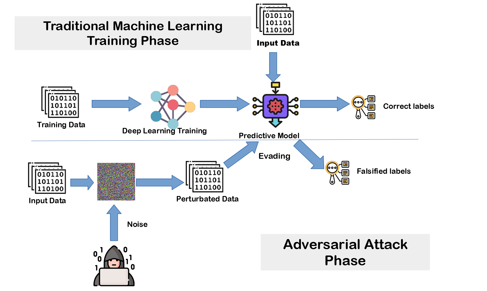

## Table of Contents

## What is adversarial learning?

Adversarial learning is a way of training computer programs, especially in artificial intelligence, by using two models that compete against each other. One model, called the generator, tries to create something that looks real, like an image or a piece of text. The other model, called the discriminator, tries to tell if what the generator made is real or fake. They keep playing this game, with the generator getting better at making realistic things and the discriminator getting better at spotting fakes.

This method is often used in creating what are called Generative Adversarial Networks (GANs). GANs have become popular because they can make very realistic images, videos, and even voices. For example, they can create pictures of people who don't exist or make a video look like it's from a different time of day. By constantly challenging each other, both the generator and the discriminator improve, leading to better and more realistic results.

## How does adversarial learning differ from traditional machine learning?

Adversarial learning is different from traditional machine learning because it uses two models that work against each other, while traditional machine learning usually uses just one model that learns from examples. In adversarial learning, one model, called the generator, tries to make something fake but realistic, like a picture or a piece of text. The other model, called the discriminator, tries to figure out if what the generator made is real or fake. They keep going back and forth, with each model trying to get better than the other. This competition helps both models improve over time.

Traditional [machine learning](/wiki/machine-learning), on the other hand, works by feeding a single model a lot of examples and letting it learn from them. For example, if you want to teach a computer to recognize cats, you would show it many pictures of cats and tell it which ones are cats. The model then figures out what makes a cat a cat and gets better at recognizing them. It doesn't have another model challenging it; it just keeps learning from the examples you give it. So, while adversarial learning uses competition between two models, traditional machine learning relies on learning from a set of examples.

## What are the main components of an adversarial learning system?

An adversarial learning system has two main parts: a generator and a discriminator. The generator tries to create fake data that looks real, like pictures or text. It starts with random noise and tries to turn it into something that looks like the real thing. The discriminator's job is to look at the data and decide if it's real or if the generator made it. They work against each other, with the generator trying to fool the discriminator and the discriminator trying to get better at spotting fakes.

As they keep playing this game, both the generator and the discriminator get better at their jobs. The generator learns to make more realistic fake data, and the discriminator gets better at telling real from fake. This back-and-forth helps both parts improve over time. Together, they make up the core of what's called a Generative Adversarial Network, or GAN, which is a popular way to use adversarial learning.

## Can you explain the concept of a generator and discriminator in adversarial learning?

In adversarial learning, there are two main parts: the generator and the discriminator. The generator is like an artist that tries to create fake things, like pictures or text, that look real. It starts with random noise and tries to turn it into something that looks like the real thing. The generator's goal is to fool the discriminator by making its creations as realistic as possible.

The discriminator is like a detective that looks at the data and tries to figure out if it's real or if the generator made it. It gets better at spotting fakes by learning from both real examples and the fake ones the generator makes. The discriminator's job is to tell the difference between real and fake, and it gets better at this as it keeps playing the game with the generator.

As they keep going back and forth, both the generator and the discriminator improve. The generator gets better at making realistic fakes, and the discriminator gets better at telling real from fake. This competition helps both parts of the system to learn and get better over time, which is the key idea behind adversarial learning.

## What are some common applications of adversarial learning?

Adversarial learning is used in many cool ways, especially in making things that look real but are actually made by computers. One big use is in making pictures and videos that look very lifelike. For example, people use adversarial learning to create pictures of faces that don't exist in real life but look like they could. These are called "deepfakes." Another use is in making art or designing things. Artists and designers can use it to come up with new ideas or styles that they might not have thought of on their own.

Another common application is in improving how computers understand and create language. Adversarial learning helps make chatbots and language translators better by teaching them to create more natural-sounding text. This is done by having one part of the system try to make realistic sentences, while another part tries to spot if the sentences are real or made up. This back-and-forth helps the system get better at making text that sounds like it was written by a person.

Adversarial learning is also used to make computer security better. Hackers might try to trick computers by making fake data that looks real, so adversarial learning helps computers learn to spot these tricks. By training the system to recognize and resist these attacks, it can protect important information and keep systems safe. This is really important in today's world where cyber attacks are a big problem.

## How does adversarial learning contribute to improving model performance?

Adversarial learning helps make models better by using two parts that compete against each other. One part, called the generator, tries to make fake things that look real, like pictures or text. The other part, called the discriminator, tries to figure out if what the generator made is real or fake. As they keep playing this game, both the generator and the discriminator get better. The generator learns to make more realistic fakes, and the discriminator gets better at spotting them. This competition pushes both parts to improve, which makes the whole system perform better.

This way of learning is really helpful because it makes models more accurate and reliable. For example, when making pictures, the generator can create images that are so realistic they can fool people. This is useful in art and design, where new and creative ideas are needed. In language tasks, adversarial learning helps chatbots and translators sound more natural, making them better at understanding and creating human-like text. By constantly challenging each other, the generator and discriminator help the model perform at its best, which is why adversarial learning is so important in improving how computers learn and work.

## What are the challenges faced when implementing adversarial learning?

Implementing adversarial learning can be tricky because it's hard to keep the generator and discriminator in balance. If the discriminator gets too good too quickly, it can stop the generator from learning anything new. This is called "mode collapse," where the generator just keeps making the same kind of fake thing over and over because it's the only thing that can fool the discriminator. On the other hand, if the generator gets too good, the discriminator might not be able to tell real from fake anymore, which also stops the learning process. Finding the right balance between the two is a big challenge.

Another challenge is that adversarial learning needs a lot of computer power. Training the generator and discriminator to get better takes a lot of time and energy. This can make it hard for people who don't have access to powerful computers to use adversarial learning. Also, because the generator and discriminator are always trying to outdo each other, the training process can be unstable. Sometimes, the system might not learn anything useful at all, and you have to start over. These challenges make it tough to use adversarial learning, but when it works, it can lead to really cool results.

## Can you describe the process of training a model using adversarial learning?

Training a model using adversarial learning is like a game between two players, the generator and the discriminator. The generator starts by making fake data, like pictures or text, from random noise. It tries to make this fake data look as real as possible. The discriminator then looks at the data and tries to guess if it's real or fake. If the discriminator says it's fake, the generator learns from its mistake and tries to do better next time. This back-and-forth continues, with the generator trying to fool the discriminator and the discriminator trying to get better at spotting fakes.

As they keep playing this game, both the generator and the discriminator get better. The generator learns to make more realistic fake data, and the discriminator gets better at telling real from fake. They keep going until they reach a point where the generator can make fake data that's really hard to tell from the real thing, and the discriminator can still spot it most of the time. This process can take a lot of time and computer power, but it helps the model perform really well at tasks like making realistic images or understanding human language.

## What are adversarial examples and how are they used in adversarial learning?

Adversarial examples are special inputs, like pictures or sounds, that are made to trick a computer model into making mistakes. They might look or sound almost the same as normal inputs, but they have tiny changes that confuse the model. For example, a picture of a cat might be changed just a little bit so that the model thinks it's a dog instead. These examples are used to test how good a model is at recognizing things and to make it stronger against tricks.

In adversarial learning, adversarial examples are used to help the generator and the discriminator get better. The generator makes these tricky examples to try and fool the discriminator. If the generator can make an adversarial example that the discriminator thinks is real, it learns that it's doing a good job. The discriminator, on the other hand, uses these examples to learn how to spot fakes better. By playing this game over and over, both parts of the system improve, making the whole model more reliable and accurate.

## How can adversarial learning be used to enhance data privacy and security?

Adversarial learning can help keep data private and safe by making models better at spotting tricks. Hackers might try to fool computers by making fake data that looks real. Adversarial learning helps computers learn to see through these tricks. It does this by using a generator to make fake data and a discriminator to spot it. As they keep playing this game, the discriminator gets better at telling real from fake, which helps protect important information from being stolen or messed with.

Another way adversarial learning helps with privacy is by making it harder for people to figure out personal details from data. For example, if a model is trained to recognize faces, someone might try to use it to find out who is in a picture. Adversarial learning can make the model less likely to give away private information by adding noise or changing the data in small ways that don't affect how well it works but make it harder to get personal details. This way, the model can still do its job well while keeping people's privacy safe.

## What are some advanced techniques used in adversarial learning to improve model robustness?

One way to make models stronger using adversarial learning is by using something called "adversarial training." This means you train the model not just with normal examples, but also with tricky ones made by the generator. By showing the model these hard examples, it learns to be better at spotting and handling them. It's like practicing with really tough puzzles so that when you see them again, you can solve them easily. This helps the model stay accurate even when someone tries to trick it with fake data.

Another technique is called "defensive distillation." This is a bit like making a secret recipe harder to copy. You train the model once, then use what it learned to train another model. This second model is less likely to be fooled by adversarial examples because it's been taught in a more complicated way. It's like learning from a teacher who has already figured out all the tricks, so you're better prepared for anything that comes your way. Both of these methods help make models more reliable and secure against attacks.

## How does adversarial learning integrate with other machine learning paradigms like reinforcement learning?

Adversarial learning can work together with [reinforcement learning](/wiki/reinforcement-learning) to make models even better. In reinforcement learning, a model learns by trying things out and getting rewards or penalties based on how well it does. When you add adversarial learning, you can use a generator to make tricky situations that the model has to deal with. The model learns from these challenges and gets better at handling them. It's like practicing with hard puzzles so that when you see them again, you can solve them easily. This way, the model not only learns from normal examples but also gets ready for tricky ones.

For example, in a game where a computer player needs to learn how to play well, adversarial learning can create tough opponents or tricky game situations. The computer player then uses reinforcement learning to figure out the best moves against these challenges. By facing these hard situations over and over, the player gets better at the game and learns to handle all sorts of tricky moves. This combination helps the model become more robust and ready for anything that comes its way.

## What is Understanding Adversarial Learning?

Adversarial learning leverages machine learning models that engage in a competitive process to enhance their performance. This methodology often involves two primary models: a generator and a discriminator. The generator is responsible for creating synthetic data instances, while the discriminator evaluates these instances, distinguishing between real and generated data.

In mathematical terms, the generator $G$ attempts to reproduce data that can fool the discriminator $D$. This dynamic can be expressed through a minimax game framework commonly used in Generative Adversarial Networks (GANs). The objective can be formalized as follows:

$$
\min_G \max_D V(D, G) = \mathbb{E}_{x \sim p_{\text{data}}(x)}[\log D(x)] + \mathbb{E}_{z \sim p_z(z)}[\log(1 - D(G(z)))]
$$

Here, $p_{\text{data}}(x)$ represents the probability distribution of the real data, and $p_z(z)$ is the probability distribution of the latent space from which the generator samples to produce synthetic data.

The interaction between the generator and discriminator iteratively improves their capabilities. The generator's goal is to produce data that becomes increasingly difficult for the discriminator to classify, while the discriminator aims to become more proficient in discerning real data from fake. Over time, this adversarial process hones the models' abilities to produce realistic data and accurately classify it.

Adversarial learning, renowned for its transformative impact in fields such as image processing and computer vision, is now gaining traction in [algorithmic trading](/wiki/algorithmic-trading). In image processing, GANs have demonstrated success in tasks such as image synthesis, denoising, and super-resolution. The same adversarial principles are being applied in developing trading algorithms, where dynamic market data serves as the 'real' set, and simulated scenarios generated by the learning models act as the 'fake' set.

As these models adapt to changing environments, they improve their strategy development capabilities, allowing them to anticipate and respond to market fluctuations with increased precision. This adaptability makes adversarial learning a promising methodology for enhancing the robustness and efficacy of algorithmic trading systems.

## References & Further Reading

[1]: Goodfellow, I., Pouget-Abadie, J., Mirza, M., Xu, B., Warde-Farley, D., Ozair, S., ... & Bengio, Y. (2014). ["Generative Adversarial Nets."](https://arxiv.org/abs/1406.2661) Advances in Neural Information Processing Systems.

[2]: Lopez de Prado, M. (2018). ["Advances in Financial Machine Learning."](https://www.amazon.com/Advances-Financial-Machine-Learning-Marcos/dp/1119482089) John Wiley & Sons.

[3]: Jansen, S. (2020). ["Machine Learning for Algorithmic Trading."](https://github.com/stefan-jansen/machine-learning-for-trading) Packt Publishing.

[4]: Zhang, H., Yuan, S., & Wang, W. (2019). ["Deep Learning-Based Stock Price Forecasting Using LSTM and GANs."](https://ieeexplore.ieee.org/document/6844831) IEEE Access.

[5]: Chan, E. P. (2008). ["Quantitative Trading: How to Build Your Own Algorithmic Trading Business."](https://github.com/ftvision/quant_trading_echan_book) John Wiley & Sons.

[6]: Bahrammirzaee, A. (2010). ["A comparative survey of artificial intelligence applications in finance: artificial neural networks, expert system and hybrid intelligent systems."](https://link.springer.com/article/10.1007/s00521-010-0362-z) Neural Computing and Applications.