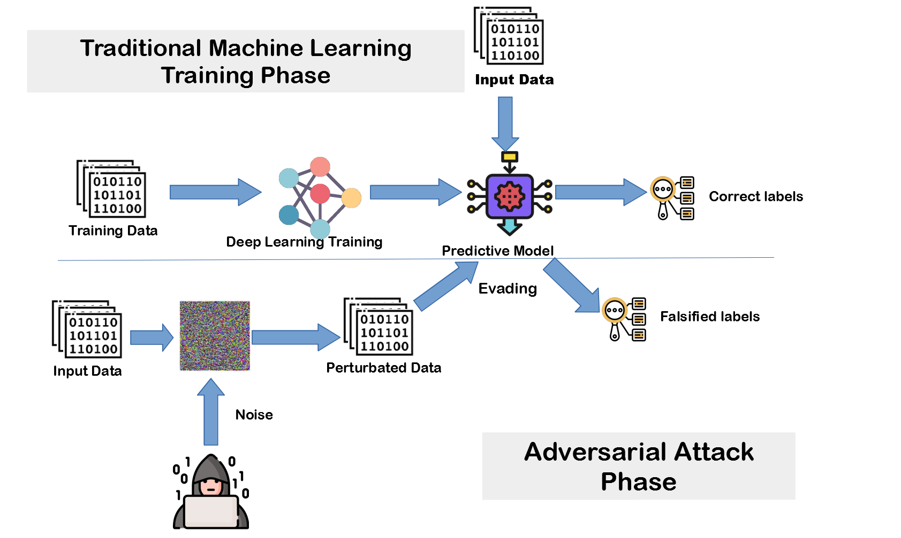

## Table of Contents

## What is adversarial training in machine learning?

Adversarial training is a technique used in machine learning to make models stronger and more reliable. It works by intentionally showing the model tricky or misleading examples, called adversarial examples, during its training process. These examples are designed to fool the model, but by including them in training, the model learns to recognize and handle them better. This helps the model perform better in real-world situations where it might encounter similar tricky data.

For example, in image recognition, an adversarial example might be a picture of a dog that has been slightly altered to look like a cat to the model. By training with these altered images, the model can learn to still identify the dog correctly, even when faced with such alterations. This process not only improves the model's accuracy but also its robustness against potential attacks or errors in data. Adversarial training is especially important in areas like security and safety, where the model's ability to handle unexpected inputs can be critical.

## Why is adversarial training important for improving model robustness?

Adversarial training helps make machine learning models stronger by showing them tricky examples on purpose. These tricky examples, called adversarial examples, are made to fool the model. By training with these examples, the model learns how to spot and deal with them better. This is important because in real life, data can be messy or even manipulated by bad actors. If a model can handle these tricky cases, it will work better and be more reliable when it's used for real.

For instance, in things like self-driving cars or security systems, it's really important that the model can handle unexpected situations. If someone tries to trick a self-driving car's camera with a special sticker, the car needs to still know it's a stop sign. Adversarial training helps the model learn from these tricky situations so it can keep working well, even when things get tough. This makes the model more robust and trustworthy in the real world.

## How does adversarial training work to enhance model performance?

Adversarial training helps make [machine learning](/wiki/machine-learning) models better by showing them tricky examples during training. These tricky examples, called adversarial examples, are made to fool the model. By including them in training, the model learns how to handle them better. For example, if you're training a model to recognize pictures of dogs, you might show it a picture of a dog that's been changed a little to look like a cat. The model sees this and learns to still recognize it as a dog. This way, the model gets better at recognizing dogs even when the pictures are a bit off.

This process makes the model more robust because it learns from its mistakes. In real life, data can be messy or even changed on purpose to trick the model. By training with adversarial examples, the model gets better at dealing with these situations. This is really important for things like self-driving cars or security systems, where the model needs to work well even when things are not perfect. Adversarial training helps the model be more reliable and perform better in the real world, where it might see all sorts of tricky data.

## What are some common techniques used in adversarial training?

Adversarial training involves a few common techniques to make machine learning models better at handling tricky data. One popular method is called the Fast Gradient Sign Method (FGSM). In FGSM, small changes are made to the input data to create adversarial examples. These changes are calculated using the model's own gradients, which show how the model's output changes with different inputs. By adding these changes to the original data, the model can be trained to recognize the altered examples as the correct class. For example, if a model is trained to recognize pictures of dogs, FGSM might change the picture a little bit to make it look like a cat to the model, but the model learns to still see it as a dog.

Another technique is Projected Gradient Descent (PGD), which is like FGSM but more thorough. PGD makes multiple small changes to the input data, checking after each change to see if the model still gets it right. This method is more time-consuming but can create stronger adversarial examples, helping the model become even better at recognizing tricky data. Both FGSM and PGD use the model's own information to create these tricky examples, making the model more robust and reliable in real-world situations where data might be messy or manipulated.

## Can you explain the concept of Generative Adversarial Imitation Learning (GAIL)?

Generative Adversarial Imitation Learning (GAIL) is a way to teach a computer to do things by watching how someone else does it. Imagine you're trying to learn how to play a game by watching a pro player. GAIL works kind of like that. It uses two parts: a generator and a discriminator. The generator tries to mimic the actions of the expert, while the discriminator tries to tell the difference between the expert's actions and the generator's actions. By going back and forth, the generator gets better at copying the expert, and the computer learns how to do the task.

In GAIL, the generator and discriminator work together in a loop. The generator starts by making actions that it thinks are like the expert's. The discriminator then looks at these actions and says whether they look like the expert's or not. If the generator's actions are not good enough, the discriminator tells it to try again. Over time, the generator gets better and better at making actions that are hard for the discriminator to tell apart from the expert's. This way, the computer learns to do the task just like the expert, without needing to know the exact rules or rewards of the game.

## What is AdvProp and how does it contribute to adversarial training?

AdvProp is a method used to make machine learning models better at handling tricky data, known as adversarial examples. It works by adding an extra step to the training process where the model is shown these tricky examples. This helps the model learn to recognize and handle them better. The idea behind AdvProp is to make the model more robust, so it can perform well even when it encounters data that's been changed on purpose to fool it.

In AdvProp, the model is trained with both normal data and adversarial examples at the same time. This dual training helps the model to not only learn from the regular data but also from the tricky examples, making it stronger overall. For example, if you're training a model to recognize pictures of cats, AdvProp would show it both normal cat pictures and slightly altered ones that might look like dogs to the model. By doing this, the model learns to still identify the altered pictures as cats, improving its performance in real-world situations where data might not be perfect.

## How does Singular Value Clipping help in adversarial training?

Singular Value Clipping is a way to make machine learning models better at dealing with tricky data. In adversarial training, we want the model to learn from examples that are made to fool it. Singular Value Clipping helps by limiting how much the model can change its internal numbers, called singular values, when it sees these tricky examples. By doing this, the model can still learn from the tricky data but in a way that keeps it stable and less likely to be fooled.

For example, if a model is trained to recognize pictures of dogs, someone might try to trick it by changing the picture a little to look like a cat. Singular Value Clipping makes sure the model's internal math doesn't go too wild when it sees this changed picture. This helps the model learn to still recognize the dog, even when the picture is a bit off. By keeping the model's changes in check, Singular Value Clipping helps make the model more reliable and better at handling unexpected data in real life.

## What is DiffAugment and its role in improving model generalization?

DiffAugment is a way to make machine learning models better at handling different kinds of data. It works by changing the training data a little bit in different ways, like turning it, stretching it, or adding noise. This helps the model see many versions of the same thing, so it learns to recognize it no matter how it looks. By doing this, the model gets better at working with new data it hasn't seen before, which is called generalization.

For example, if you're training a model to recognize pictures of cats, DiffAugment might show the model pictures of cats that are flipped, rotated, or have different lighting. This way, the model learns that a cat is still a cat, even if the picture looks different. By training with these changed pictures, the model becomes more reliable and can work well with all sorts of cat pictures it might see in real life.

## Can you describe the SimAug method and its impact on adversarial training?

SimAug is a way to make machine learning models better at handling tricky data, called adversarial examples. It works by adding a step where the model is shown these tricky examples during training. The idea is to make the model more robust, so it can still do its job well even when it sees data that's been changed on purpose to fool it. SimAug does this by simulating different kinds of changes to the data, like adding noise or changing the brightness. By training with these changed examples, the model learns to recognize the important parts of the data and ignore the changes that are meant to trick it.

For example, if you're training a model to recognize pictures of dogs, SimAug might show it pictures of dogs with added noise or different lighting. This helps the model learn that a dog is still a dog, even if the picture looks a bit different. By practicing with these changed pictures, the model gets better at recognizing dogs in all sorts of conditions. This makes the model more reliable and better at handling unexpected data in real life, which is really important for things like security systems or self-driving cars where the model needs to work well no matter what.

## What is the Accuracy-Robustness Area (ARA) metric and why is it significant?

The Accuracy-Robustness Area (ARA) metric is a way to measure how well a machine learning model can handle both normal data and tricky data, called adversarial examples. It looks at two things: how accurate the model is with normal data, and how well it can still be accurate even when the data is changed to try to fool it. The ARA metric combines these two measures into one number, which helps us see how good the model is overall. If a model has a high ARA score, it means it's good at recognizing things correctly even when the data is a bit off or changed on purpose.

This metric is important because it gives us a better picture of how reliable a model is in real life. In the real world, data can be messy or even manipulated by bad actors. A model with a high ARA score is more likely to work well even in these tricky situations. For example, in things like self-driving cars or security systems, it's really important that the model can handle unexpected inputs. The ARA metric helps us choose models that are not just accurate but also robust, making them more trustworthy and useful in practical applications.

## How does Protagonist Antagonist Induced Regret Environment Design enhance adversarial training?

Protagonist Antagonist Induced Regret Environment Design, or PAIR, is a way to make machine learning models better at handling tricky situations. It works by creating a game-like setup where two parts of the model, the protagonist and the antagonist, compete against each other. The protagonist tries to do its job well, like recognizing pictures correctly, while the antagonist tries to make it hard by changing the pictures a little bit. This back-and-forth helps the protagonist learn to be better at its job, even when the data is changed to fool it. By playing this game during training, the model gets stronger and can handle unexpected data in real life.

In PAIR, the model learns from its mistakes, which is called regret. When the protagonist makes a mistake because of the antagonist's changes, it feels regret and tries to do better next time. This process helps the model become more robust because it learns from these tricky situations. For example, if a model is trained to recognize pictures of cats, the antagonist might change the picture to make it look like a dog. The protagonist sees this and learns to still recognize it as a cat. This way, the model can work well even when the data is messy or manipulated, making it more reliable and useful in real-world applications.

## What are the latest advancements in adversarial training methods like Fast_BAT and ASAF?

Fast_BAT, which stands for Fast Batch Adversarial Training, is a new way to make machine learning models better at dealing with tricky data. It works by showing the model many tricky examples at the same time during training. This helps the model learn faster and become more robust. In Fast_BAT, the model sees a lot of different changed examples in one go, which helps it understand how to handle these changes better. This method is quicker than older ways of adversarial training because it uses batches of data, making it more efficient. For example, if a model is trained to recognize pictures of dogs, Fast_BAT might show it many different changed pictures of dogs all at once. By doing this, the model learns to still recognize dogs even when the pictures are a bit off, making it more reliable in real life.

ASAF, or Adversarial Self-Adaptive Fine-tuning, is another new method that helps machine learning models get better at handling tricky data. It works by letting the model adjust itself as it learns from these tricky examples. ASAF uses a special way to change the model's settings based on how well it's doing with the tricky data. This helps the model become more accurate and robust over time. For example, if a model is trained to recognize pictures of cats, ASAF might change how the model looks at these pictures based on the tricky examples it sees. By doing this, the model can learn to still recognize cats even when the pictures are changed a little bit. This method is helpful because it makes the model more adaptable and reliable in real-world situations where data can be messy or manipulated.