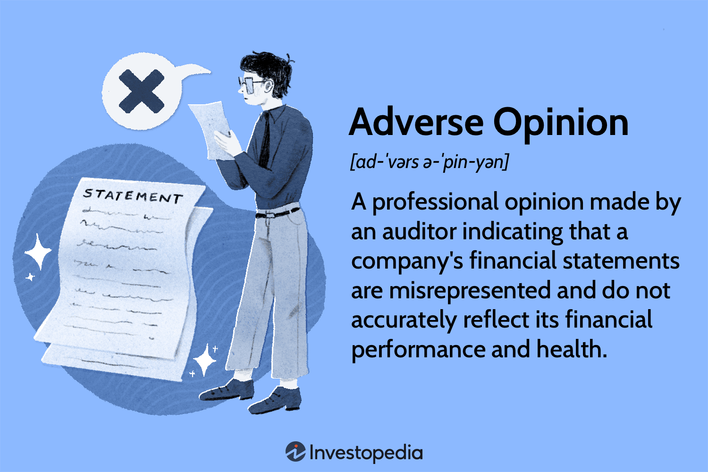

The world of finance and trading is a vast and intricate network, where diverse elements intersect to form the core of corporate activities. Central to this network is the reliability of financial statements and the effectiveness of trading strategies. Financial statements, prepared by companies, offer a structured reflection of their financial position, performance, and cash flows, providing crucial insights for decision-making by stakeholders. The robustness of these statements underpins the foundation of investor trust and market stability.

Auditors assume a pivotal role in this context by evaluating these financial statements through detailed audit reports. By adhering to established standards and employing rigorous methodologies, auditors assess whether these statements present a true and fair view of a company's financial conditions. An essential outcome of this evaluation is the audit opinion, which can be categorized into four types: unqualified, qualified, adverse, or disclaimer of opinion. Each type carries distinct implications for stakeholders, influencing their perception of the company's financial integrity.



An adverse opinion, among these, holds particular significance as it signals to stakeholders that the financial statements are not reliable. This opinion suggests that these statements contain significant misstatements or fail to comply with generally accepted accounting principles (GAAP), raising alarms about the company's financial health or integrity. Such an opinion can have profound repercussions, notably affecting the sphere of algorithmic trading, which relies heavily on precise and timely financial data for executing trades.

In algorithmic trading, algorithms are utilized to make swift trading decisions based on pre-defined criteria, leveraging vast amounts of historical and real-time financial information. The accuracy of financial statements is, therefore, critical to algorithmic traders who use this data to predict market trends, maximize returns, and manage risks. An adverse opinion can cast doubt on the reliability of this information, potentially leading to flawed trading decisions and subsequent financial losses.

This article discusses the complexity of financial statements audit reports, explains adverse opinions, and outlines their potential impact on algorithmic trading. By understanding these elements, stakeholders can better navigate the challenges posed by unreliable financial reporting and safeguard the integrity of their trading activities.

## Table of Contents

## Understanding Financial Statements Audit Reports

Audit reports serve as an impartial evaluation of a company's financial statements, providing crucial insights into their accuracy and compliance with established accounting standards. Typically generated by external auditors, these reports play a pivotal role in enhancing the credibility and trustworthiness of financial information disclosed by a company. The primary aim of an audit report is to ascertain whether the financial statements adhere to generally accepted accounting principles (GAAP).

During the audit process, the auditor meticulously examines the company's financial records, including balance sheets, income statements, cash flow statements, and related disclosures. This examination involves not only verifying the numerical accuracy of these documents but also assessing the appropriateness of the accounting policies adopted by the company. In conducting the audit, the auditor applies both qualitative and quantitative methods to gather sufficient and appropriate evidence that supports the conclusions drawn in the audit report.

The conclusion of an audit is encapsulated in one of several possible opinions: unqualified, qualified, adverse, or a disclaimer of opinion. An unqualified opinion, often referred to as a "clean" opinion, signifies that the financial statements present a true and fair view in conformity with GAAP. This opinion indicates that the auditor did not identify any significant misstatements or discrepancies during their examination, thereby providing a high level of assurance to stakeholders.

Conversely, a qualified opinion suggests that, except for certain identified issues, the financial statements are presented fairly. These issues, while significant, are not pervasive and typically arise from minor deviations from GAAP or limitations in the scope of the audit. An adverse opinion is issued when the auditor concludes that the financial statements are materially misstated and do not conform to GAAP, indicating grave concerns about the integrity of the financial reporting.

Lastly, a disclaimer of opinion is rendered when the auditor is unable to express an opinion on the financial statements due to significant uncertainties or limitations encountered during the audit process. This absence of an opinion signifies a lack of sufficient evidence to form a basis for an audit conclusion, often resulting from constraints imposed by the company on the audit procedure.

Each type of audit opinion carries distinct implications for various stakeholders. Investors, creditors, and regulatory bodies rely heavily on these opinions to gauge the financial health and operational transparency of a company. An unqualified opinion is likely to enhance investor confidence and facilitate access to capital markets. In contrast, qualified, adverse, or disclaimer opinions may trigger concerns, prompting stakeholders to reassess their engagements with the company and potentially leading to adverse financial consequences.

## What Constitutes an Adverse Opinion?

An adverse opinion in an audit report is a critical marker that signals to investors, creditors, and other stakeholders that the financial statements presented by a company are significantly flawed. This opinion suggests either severe misstatements or that the information does not present a true and fair view of the company's financial health. In essence, such an opinion strongly implies that stakeholders cannot rely on the financial data.

The issuance of an adverse opinion typically results from a company's deviation from Generally Accepted Accounting Principles (GAAP) or International Financial Reporting Standards (IFRS). Such deviations often involve inaccuracies or material misstatements in financial data, such as incorrect revenue recognition, improper accounting of expenses, or the misrepresentation of assets and liabilities. Detecting these inaccuracies requires auditors to thoroughly analyze the company's accounting records and policies to ensure compliance with established accounting frameworks.

Moreover, substantial discrepancies in the financial statements that obscure the true financial position and performance of the company can also lead to an adverse opinion. For example, if a company overstates its revenue or undervalues its liabilities, the financial statements would not accurately reflect the risks or financial stability of the company.

Adverse opinions are relatively rare compared to unqualified or even qualified opinions. This rarity is partly because companies generally strive to resolve potential issues before the financial statements are published. However, when issued, an adverse opinion can have severe ramifications. It can undermine investor trust, lead to difficulties in obtaining financing, and may prompt regulatory scrutiny or delisting from stock exchanges.

The issuance of an adverse opinion highlights the crucial role of auditors in maintaining the integrity of financial information. Their assessments ensure that financial statements reflect the true economic activities and conditions of a company, which is essential for informed decision-making by stakeholders.

## Implications of Adverse Opinions on Companies

Receiving an adverse opinion can profoundly affect a company's reputation and investor confidence. Such an opinion, indicating severe misstatements in financial statements, often triggers immediate concern among investors and stakeholders. As a result, the company's stock price might decline, reflecting the market's uncertainty regarding the company's financial health and future prospects. In extreme cases, continuous financial reporting issues leading to adverse opinions could result in the company being delisted from stock exchanges, as regulatory requirements for listed companies typically include the provision of valid and reliable financial statements.

Beyond market reactions, companies receiving adverse opinions might encounter increased scrutiny from regulatory bodies. Organizations like the Securities and Exchange Commission (SEC) in the United States have mandates to protect investors and maintain fair, orderly, and efficient markets. Receiving an adverse opinion could attract their attention, leading to investigations, which might uncover further financial inaccuracies or violations. If regulatory infractions are discovered, companies could face significant penalties, impacting their financial stability and market standing.

To address the challenges posed by an adverse opinion, companies are often compelled to take corrective actions. Revising financial statements to align with Generally Accepted Accounting Principles (GAAP) is usually a first step in rectifying the issues identified in the audit. This process involves detailed reassessment and restatement of financial data to correct errors and provide accurate information to stakeholders. In addition to revising previous statements, companies must focus on strengthening their internal controls to prevent future inaccuracies. This might include implementing more robust accounting systems, enhancing oversight functions, and ensuring regular compliance checks.

In some cases, if the damage to the company's brand and reputation is significant, rebranding efforts might be pursued to signal a fresh start and rebuild trust with investors and the market. Rebranding involves changing the company's corporate identity, which could include a new name, logo, or marketing strategy, aimed at disassociating from past issues and emphasizing a commitment to transparency and integrity.

Overall, an adverse opinion can serve as a wake-up call for companies, prompting significant organizational changes to restore confidence and ensure compliance with financial reporting standards.

## Algorithmic Trading and Its Dependence on Financial Information

Algorithmic trading heavily depends on the precision and timeliness of financial data to execute trades with efficiency and accuracy. The process involves the use of sophisticated algorithms and statistical tools that analyze both historical and real-time financial information. These tools are employed to identify patterns and trends that may influence trading decisions. The accuracy of this financial data is crucial since algorithmic strategies are based on predictive models that forecast market movements.

Inaccurate or misleading financial statements can result in faulty algorithm outputs, leading traders to make poor decisions that might cause significant financial losses. Anomalies or discrepancies in financial data can skew the analysis conducted by these algorithms, thus impacting their forecasts and the overall strategy. For instance, if an algorithmic system is fed erroneous balance sheets or income statements, the resultant analysis would misguide future trades. 

Moreover, when auditors issue an adverse opinion on a company's financial statements, it casts doubt on the authenticity and reliability of the data provided. This can affect the confidence traders place in their algorithms, potentially leading to changes in trading strategies or a complete suspension of trades associated with the affected entity. 

To illustrate with a simple Python example, consider an algorithm designed to calculate a company's Price-to-Earnings (P/E) ratio, a common metric used in [algorithmic trading](/wiki/algorithmic-trading):
```python
def calculate_pe_ratio(market_price, earnings_per_share):
    if earnings_per_share == 0:
        raise ValueError("Earnings per share cannot be zero.")
    return market_price / earnings_per_share

# Example usage
market_price = 150
earnings_per_share = reported_earnings_per_share  # Hypothetically obtained from financial statements

try:
    pe_ratio = calculate_pe_ratio(market_price, earnings_per_share)
    print(f"The P/E ratio is {pe_ratio}")
except ValueError as e:
    print(e)
```
If the earnings per share are reported inaccurately, the P/E ratio calculated would be erroneous, leading to misguided trading actions.

In summary, the dependency on accurate financial information is paramount in algorithmic trading. Adverse audit opinions can raise significant concerns regarding the data's reliability, leading traders to reassess the validity of their strategies and potentially incur substantial changes in their trading approach.

## Mitigating Risks Associated with Adverse Opinions in Trading

Algorithmic traders operate in high-speed environments where decisions must be made almost instantaneously. In this context, the reliability of financial data is crucial, as any inaccuracies can lead to flawed decision-making processes. To mitigate the risks associated with adverse opinions in audit reports, traders must implement a multi-faceted approach, starting with diversification of their data sources. By tapping into varied data streams, traders can reduce reliance on a single provider, thereby minimizing the risk of decision-making based on erroneous data. This approach also involves integrating real-time data analytics, which allows traders to access the most current information and make timely adjustments to their trading strategies.

In addition to data diversification, the stability and performance of trading algorithms themselves must be regularly audited. This process includes evaluating the algorithm's ability to handle inputs that may be based on misstated financial information. By conducting these audits, traders can detect potential weaknesses and correct them before substantial financial losses occur. Regularity in these audits ensures consistent performance and reliability, which are essential for maintaining confidence in the systems used.

Moreover, maintaining open communication lines with data providers and financial analysts is a critical component of a robust risk management strategy. This collaboration enables traders to receive timely updates and insights that can influence trading strategies positively. Establishing such communication can serve as a feedback mechanism to quickly address any data discrepancies highlighted by adverse audit opinions.

In conclusion, implementing these strategies not only protects against the risks posed by adverse audit opinions but also fosters a more resilient trading environment. By prioritizing the rectification of discrepancies in financial reporting and enhancing data accuracy, algorithmic traders can safeguard their operations against unexpected market shifts and maintain a competitive edge.

## Conclusion

Adverse audit opinions represent significant discrepancies or misstatements in a company's financial statements, flagging potential financial instability. These findings can critically impact trading strategies, especially within algorithmic trading, which relies on the accuracy of financial data to make informed trading decisions. Recognizing the severity of adverse opinions, algorithmic traders need to implement strategic measures to mitigate the risks associated. This includes diversifying data sources, enhancing real-time data analysis, and reinforcing algorithmic audit protocols to safeguard against inaccurate financial reporting.

Transparency is a cornerstone for maintaining investor trust. Ensuring that internal controls are effective and that compliance standards are met can help restore investor confidence and prevent future occurrences of adverse opinions. Companies must prioritize these areas to assure stakeholders of the credibility of their financial disclosures.

The alignment between accurate financial reporting and robust trading strategies is crucial for sustainable financial growth. By ensuring the reliability of financial data, traders can make better-informed decisions, reducing the likelihood of significant financial losses due to erroneous trading signals. Thus, fostering a transparent, compliant, and well-controlled financial environment supports both corporate integrity and market stability.

## References & Further Reading

[1]: Graham, D., & Smart, S. (2012). ["Principles of Corporate Finance"](https://books.google.com/books/about/Corporate_Finance_Linking_Theory_to_What.html?id=N72DMyq_QToC) (11th ed.). McGraw-Hill.

[2]: Lopez de Prado, M. (2018). ["Advances in Financial Machine Learning"](https://www.amazon.com/Advances-Financial-Machine-Learning-Marcos/dp/1119482089). Wiley.

[3]: Aronson, D. R. (2007). ["Evidence-Based Technical Analysis: Applying the Scientific Method and Statistical Inference to Trading Signals"](https://www.amazon.com/Evidence-Based-Technical-Analysis-Scientific-Statistical/dp/0470008741). Wiley.

[4]: Kieso, D. E., Weygandt, J. J., & Warfield, T. D. (2019). ["Intermediate Accounting"](https://books.google.com/books/about/Intermediate_Accounting_IFRS.html?id=3XntDwAAQBAJ) (17th ed.). Wiley.

[5]: Chan, E. P. (2009). ["Quantitative Trading: How to Build Your Own Algorithmic Trading Business"](https://github.com/ftvision/quant_trading_echan_book). Wiley.

[6]: Jansen, S. (2020). ["Machine Learning for Algorithmic Trading: Predictive models to extract signals from market and alternative data for systematic trading strategies with Python"](https://www.amazon.com/Machine-Learning-Algorithmic-Trading-alternative/dp/1839217715). Packt Publishing.

[7]: International Auditing and Assurance Standards Board (IAASB). (2020). ["International Standards on Auditing (ISA)"](https://www.iaasb.org/publications/2020-handbook-international-quality-control-auditing-review-other-assurance-and-related-services).