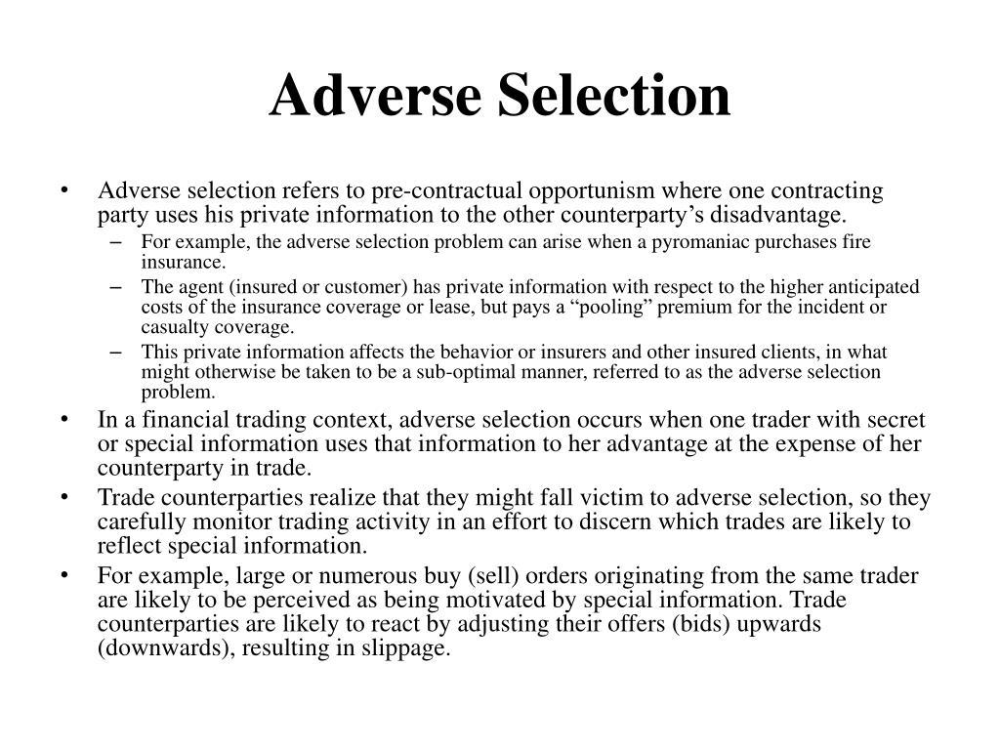

## Table of Contents

## What is adverse selection in trading?

Adverse selection in trading happens when one side of a trade knows more than the other side. This usually means that the person with more information has an advantage and makes better trades. For example, if someone knows a company's stock is going to drop because of bad news that hasn't been made public yet, they might sell their shares before the news comes out. This leaves the other traders, who don't know about the bad news, at a disadvantage.

This problem can make markets less fair and can scare people away from trading. If traders think others have secret information, they might not want to trade at all. This can make it harder for companies to raise money by selling stocks or bonds. To fight adverse selection, rules and regulations are put in place to make sure everyone has the same information at the same time. This helps keep the market fair and encourages more people to trade.

## How does adverse selection affect financial markets?

Adverse selection can make financial markets less efficient and fair. When some traders know more than others, those with the secret information can make trades that benefit them at the expense of others. For example, if someone knows a company is about to go bankrupt but hasn't told anyone yet, they can sell their shares before the news breaks. This leaves other investors, who don't know about the bankruptcy, holding shares that will soon be worth less. This can lead to a loss of trust in the market, as people feel they are at a disadvantage.

To combat adverse selection, regulators create rules to make sure everyone has access to the same information at the same time. This helps level the playing field and encourages more people to participate in the market. Without these rules, fewer people might want to invest, which can make it harder for companies to raise money through stocks or bonds. Overall, managing adverse selection is important for keeping financial markets healthy and trustworthy.

## Can you provide an example of adverse selection in stock trading?

Imagine you work at a big company and you find out that the company is going to lose a lot of money because of a big problem. You know this before anyone else does. If you sell your company's stock before the bad news comes out, you're using your secret information to make money. This is an example of adverse selection because you know something that other people buying or selling the stock don't know.

When you sell your stock before the bad news is public, other people who buy the stock from you will lose money when the price drops after the news comes out. They didn't know about the problem, so they thought the stock was worth more than it really was. This can make the stock market unfair because people with secret information can make better trades than those without it.

## What are the signs of adverse selection in a trading environment?

You can spot adverse selection in a trading environment when you see that some traders always seem to make money no matter what happens in the market. If certain people are consistently selling stocks just before bad news comes out or buying stocks right before good news is announced, it might mean they have secret information that others don't. This can make the market feel unfair because these traders are using their advantage to win trades.

Another sign is when there's a big difference between what people expect from a stock and what actually happens. If a stock's price suddenly drops a lot after a surprise announcement, it could mean that some traders knew about the news beforehand and sold their shares early. This kind of sudden change can make other traders lose trust in the market, thinking that some people always know more than they do.

## How can traders identify adverse selection in real-time?

Traders can identify adverse selection in real-time by watching for unusual patterns in trading activity. If they see that certain traders are always selling stocks right before bad news is released or buying stocks just before good news comes out, it might mean those traders have inside information. This kind of pattern can make the market seem unfair because some people are using their secret knowledge to make better trades than others.

Another way to spot adverse selection is by looking at sudden, big changes in stock prices. If a stock's price drops a lot right after a surprise announcement, it could mean that some traders knew about the news before it was public and sold their shares early. This sudden change can make other traders feel like the market isn't fair, because it looks like some people always know more than others.

## What strategies can traders use to mitigate the risks of adverse selection?

Traders can use a few strategies to lower the risks of adverse selection. One way is to do a lot of research and stay updated on news about the companies they invest in. This can help them understand what's happening with those companies and make better guesses about what might happen next. By knowing as much as they can, traders can make more informed decisions and not be caught off guard by sudden news that affects stock prices.

Another strategy is to diversify their investments. Instead of putting all their money into one stock, traders can spread it out across many different stocks or even different types of investments like bonds or real estate. This way, if one investment goes down because of secret information they didn't know about, they won't lose all their money. Diversifying can help protect them from the risks of adverse selection and keep their overall investment safer.

## How does adverse selection impact market liquidity?

Adverse selection can make the market less liquid. When people think that some traders know secret information, they might not want to buy or sell stocks as much. They get worried that they'll lose money to these traders who know more than them. This fear can make people trade less, which means there are fewer buyers and sellers in the market. When there are fewer people trading, it becomes harder to buy or sell stocks quickly, and this is what we mean by lower [liquidity](/wiki/liquidity-risk-premium).

To make the market more liquid again, rules are put in place to make sure everyone has the same information. If everyone knows the same things, people feel safer trading. They are more likely to buy and sell stocks because they trust that no one has a big advantage over them. When more people are trading, it's easier to find someone to buy or sell to, which makes the market more liquid. So, fighting adverse selection helps keep the market working smoothly.

## What role does information asymmetry play in adverse selection?

Information asymmetry is when some people know more than others. In trading, this means that some traders might have secret information that others don't have. This can lead to adverse selection because the people with the secret information can make trades that help them and hurt others. For example, if someone knows a company is about to have a big problem but hasn't told anyone yet, they can sell their stock before the news comes out. This leaves other traders, who don't know about the problem, holding onto stocks that will soon be worth less.

This kind of unfair advantage can make the market less fair and less liquid. When traders think others have secret information, they might not want to trade as much because they're scared of losing money. If fewer people are trading, it becomes harder to buy and sell stocks quickly. To fix this, rules are made to make sure everyone has the same information. When everyone knows the same things, more people feel safe to trade, which helps keep the market running smoothly and fairly.

## How do regulatory measures address adverse selection in trading?

Regulatory measures help fight adverse selection by making rules that make sure everyone has the same information at the same time. This is called transparency. For example, companies have to tell the public about important news that could affect their stock price. This way, no one can use secret information to make trades that hurt others. By making information public, regulators help keep the market fair so everyone can make good choices about buying and selling stocks.

Another way regulators address adverse selection is by punishing people who use secret information to trade. This is called insider trading, and it's against the law. If someone gets caught using secret information to make money, they can go to jail or have to pay big fines. This scares people away from doing it and helps keep the market honest. When traders know that everyone is playing by the same rules, they feel safer and are more likely to trade, which keeps the market working well.

## What are the long-term effects of adverse selection on market efficiency?

Adverse selection can make markets less efficient over time. When some traders know more than others, it's hard for everyone to make fair trades. This can make people trust the market less. If traders think others have secret information, they might not want to trade as much. When fewer people trade, it's harder to buy and sell stocks quickly. This makes the market less liquid, which means it doesn't work as well as it should. Over time, this can hurt the whole economy because companies find it harder to raise money by selling stocks or bonds.

To fix these problems, rules are put in place to make sure everyone has the same information. When everyone knows the same things, they feel safer to trade. This helps keep the market fair and efficient. Over time, these rules can help the market work better. More people will want to trade, which makes it easier to buy and sell stocks. This helps companies get the money they need to grow, which is good for the economy. So, fighting adverse selection helps keep the market healthy and efficient in the long run.

## How do advanced trading algorithms attempt to overcome adverse selection?

Advanced trading algorithms try to beat adverse selection by looking at lots of data very quickly. They use computers to find patterns in how people trade. If the algorithm sees that some traders always seem to know things before everyone else, it can try to guess what might happen next. This helps the algorithm make better trades even if it doesn't know the secret information. By doing this, the algorithm can help make the market fairer because it's not just relying on secret information to make trades.

Another way these algorithms work is by trading very fast. They can buy or sell stocks in just a few seconds, which is much faster than people can. This speed can help the algorithm get ahead of traders who might be using secret information. If the algorithm sees a stock price starting to change, it can act quickly to make a trade before the price moves too much. This quick trading can help reduce the advantage that people with secret information have, making the market more efficient and fair over time.

## What current research is being conducted on adverse selection and its implications for trading strategies?

Researchers are looking into how adverse selection affects trading strategies and what can be done about it. They are studying how traders can use data and computers to guess what might happen next in the market. This can help them make better trades even if they don't know secret information. They are also trying to find new ways to spot when someone might be using secret information to trade. By doing this, they hope to make the market fairer for everyone.

Another area of research is about how rules and regulations can help fight adverse selection. Scientists are looking at how making information public can help level the playing field. They are also studying how punishing people for using secret information can keep the market honest. By understanding these things better, researchers hope to come up with new strategies that can help traders make good choices and keep the market working well.

## References & Further Reading

[1]: Akerlof, G. A. (1970). ["The Market for 'Lemons': Quality Uncertainty and the Market Mechanism."](https://personal.utdallas.edu/~nina.baranchuk/Fin7310/papers/Akerlof1970.pdf) The Quarterly Journal of Economics, 84(3), 488-500.

[2]: O'Hara, M. (1995). ["Market Microstructure Theory."](https://openlibrary.org/books/OL1103097M/Market_microstructure_theory) Blackwell Publishing.

[3]: Easley, D., & O'Hara, M. (1987). ["Price, Trade Size, and Information in Securities Markets."](https://www.sciencedirect.com/science/article/pii/0304405X87900298) Journal of Financial Economics, 19(1), 69-90.

[4]: Budish, E., Cramton, P., & Shim, J. (2015). ["The High-Frequency Trading Arms Race: Frequent Batch Auctions as a Market Design Response."](https://academic.oup.com/qje/article/130/4/1547/1916146) The Quarterly Journal of Economics, 130(4), 1547-1623.

[5]: Hirschey, J. (2018). ["Do High-Frequency Traders Anticipate Buying and Selling Pressure?"](https://pubsonline.informs.org/doi/abs/10.1287/mnsc.2020.3608) Journal of Financial Economics, 130(1), 15-30.

[6]: Lopez de Prado, M. (2018). ["Advances in Financial Machine Learning."](https://www.amazon.com/Advances-Financial-Machine-Learning-Marcos/dp/1119482089) Wiley.

[7]: Harris, L. (2003). ["Trading and Exchanges: Market Microstructure for Practitioners."](https://academic.oup.com/book/52292) Oxford University Press.

[8]: Lewis, M. (2014). ["Flash Boys: A Wall Street Revolt."](https://en.wikipedia.org/wiki/Flash_Boys) W. W. Norton & Company.

[9]: U.S. Securities and Exchange Commission (2015). ["SEC Market Access Rule."](https://www.sec.gov/files/rules/final/2010/34-63241.pdf) Release No. 34-63241.