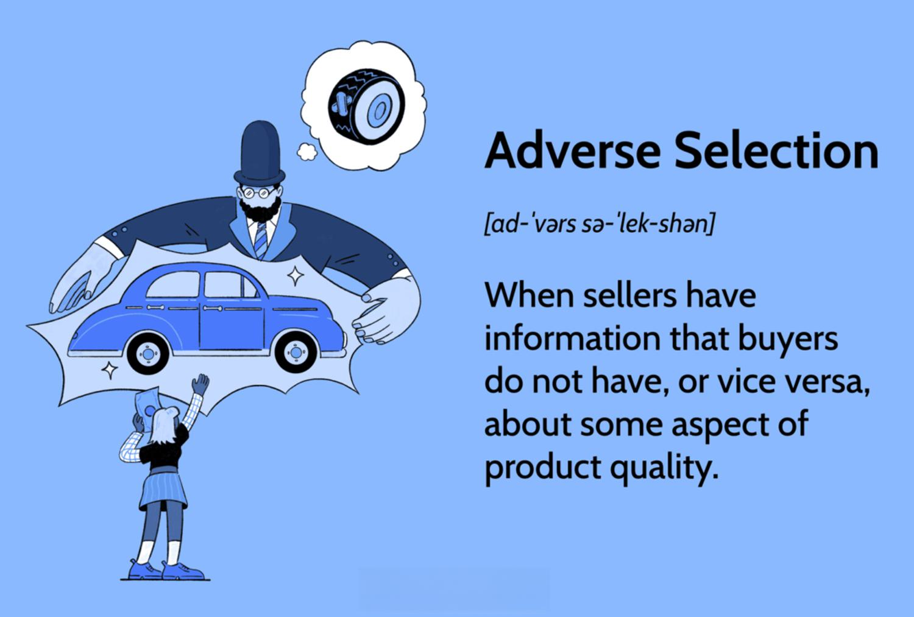

The world of finance and economics frequently contends with intricate concepts that significantly influence the behavior and efficiency of markets. Central among these are the 'lemons problem', 'adverse selection', and 'information asymmetry'. These concepts, originally developed to explain distortions in traditional markets, now have profound implications for the increasingly complex field of algorithmic trading.

The 'lemons problem', introduced by economist George A. Akerlof in his seminal 1970 paper "The Market for Lemons: Quality Uncertainty and the Market Mechanism", describes a scenario where sellers have more information about the quality of a product than buyers. This information disparity can lead to market failures, as seen in the used car market where it originated, and can be extrapolated to financial markets where low-quality securities might be indistinguishable from high-quality ones by less informed buyers.



Adverse selection, closely related to the lemons problem, arises when trading partners possess unequal levels of information. This misalignment can result in higher-risk participants, such as those with inferior quality assets, being more likely to engage in transactions. In financial markets, this might manifest in companies with overvalued stocks that are eagerly sold to uninformed investors. This imbalance often culminates in inefficient market outcomes, impacting liquidity and pricing.

Information asymmetry, a broader concept encompassing both the lemons problem and adverse selection, occurs when one party in a transaction has superior knowledge. In the context of algorithmic trading, sophisticated algorithms might leverage access to non-public information, thus gaining an unfair edge over other market participants. This creates challenges in ensuring fairness and transparency within the trading environment.

Appreciating these theories is essential for investors and traders seeking to successfully navigate today’s markets. The potential for these concepts to distort market efficiency calls for a keen understanding of their dynamics and the development of robust strategies to mitigate their impact. This article explores the ramifications of these economic theories on algorithmic trading and scrutinizes the mechanisms that exist to counteract their adverse effects, striving to ensure a more equitable trading landscape.

## Table of Contents

## Understanding the Lemons Problem

The "lemons problem" is a concept introduced by economist George A. Akerlof in his seminal 1970 paper, "The Market for Lemons: Quality Uncertainty and the Market Mechanism." This concept addresses the challenges faced in markets where there is an imbalance of information between buyers and sellers, often referred to as information asymmetry. The term "lemons" is used to describe products of inferior quality that are indistinguishable from high-quality products due to the lack of available information.

Akerlof's model posits that in any market where sellers have more information about the quality of a product than buyers, there is a risk that lower-quality goods will become more prevalent. This is because buyers are unable to accurately assess the quality of the goods they are purchasing and, therefore, tend to offer a price that reflects an average expected value of all goods in the market. Knowing this, sellers of high-quality products may [exit](/wiki/exit-strategy) the market, as they cannot receive a fair price, leaving behind a market primarily composed of "lemons."

A classic example of the lemons problem is found in the used car market. Sellers typically have more knowledge about the condition of the car than buyers. This information asymmetry can lead buyers to be suspicious of the quality of used cars, causing them to be unwilling to pay full value. As a result, the market is flooded with lower-quality cars, while high-quality cars are underrepresented.

This phenomenon of adverse selection, as highlighted by the lemons problem, transcends to numerous other markets, including the securities market. In the context of securities, asymmetrical information can manifest when company insiders have a more accurate understanding of their company's value and prospects compared to outside investors. This disparity allows insiders to benefit at the expense of less-informed participants. For instance, insiders may sell shares before bad news becomes public, leaving less informed investors to absorb the fallout of declining stock prices.

Mathematically, the lemons problem can be represented in financial markets by analyzing expected values:

$$
P = q \cdot V_h + (1-q) \cdot V_l
$$

Where $P$ is the market price, $q$ is the probability of a high-quality good, $V_h$ is the value of the high-quality good, and $V_l$ is the value of the low-quality good. If buyers cannot distinguish between high and low-quality goods due to information asymmetry, they may only offer a price $P$, which is lower than $V_h$, leading to an underrepresentation of high-quality goods in the market.

Understanding and addressing the lemons problem is paramount for mitigating market inefficiencies and ensuring fair transactions. Mechanisms such as certification, warranties, and regulatory measures aim to alleviate the problem by increasing transparency and reducing information disparities.

## Adverse Selection and Its Impact on Markets

Adverse selection is a phenomenon in financial markets where parties possess asymmetric information, leading to the participation of potentially riskier entities in transactions. This issue emerges prominently when sellers possess more information about the true value of a security than buyers. For instance, a firm may issue stock when it knows the shares are overvalued, benefiting from its insider knowledge while buyers remain unaware of the situation. This inequality can result in market inefficiencies, as misinformed buyers may end up with assets worth less than they assumed.

The presence of adverse selection in financial markets can influence behavior across various market participants. In particular, uninformed traders usually demand a risk premium to compensate for the potential disadvantages of dealing with better-informed parties. This premium is often integrated into the price of traded securities, leading to a distortion in pricing mechanisms. As a result, markets can experience reduced [liquidity](/wiki/liquidity-risk-premium) since the perceived risk discourages participation from uninformed traders, thus, affecting the overall market depth.

Another key impact of adverse selection is on market makers and liquidity providers. These entities face the risk of trading with those who have superior information, potentially leading them to adjust bid-ask spreads to account for this risk. This adjustment can increase trading costs and reduce the willingness of market makers to supply liquidity, further exacerbating market inefficiencies.

In markets with significant adverse selection, there is a tendency for a "lemons market" to form, wherein high-quality securities are driven out due to the risk posed by inferior ones. This can create a vicious cycle where the average quality of market offerings diminishes, leading to further pricing distortions and inefficiencies.

To quantify the effects of adverse selection, models like the "adverse selection model" are periodically employed. This model often involves calculating the probability that a trade is informed, affecting the likelihood of adverse selection costs impacting transaction prices. Advanced quantitative strategies could be employed to identify potential adverse selection, such as using [machine learning](/wiki/machine-learning) algorithms to analyze historical trading data for patterns indicative of information asymmetry.

Mitigating adverse selection involves increasing market transparency and implementing regulations that require full disclosure of relevant information. Additionally, developing sophisticated algorithms capable of detecting patterns associated with information advantages may offer a technological solution, providing more equitable trading conditions and enhancing market efficiency.

## Information Asymmetry and Algorithmic Trading

Information asymmetry, a fundamental concept in economics, occurs when one party in a transaction possesses more or superior information than the other. This imbalance can provide unfair advantages and influence the outcomes of financial trading. In the context of [algorithmic trading](/wiki/algorithmic-trading), information asymmetry is particularly significant, as algorithms can be designed to exploit these informational disparities for competitive gain.

Algorithmic trading systems operate by deploying complex algorithms to execute trades at speeds and frequencies that are beyond human capabilities. These systems can capitalize on minor price discrepancies, forecast market trends, and execute large orders while minimizing impact on market prices. However, when certain market participants have access to non-public or proprietary data, it introduces a layer of information asymmetry, skewing trading advantages towards those with the superior information.

### Implications of Information Asymmetry in Algorithmic Trading

1. **Market Efficiency and Fairness**: Information asymmetry challenges the concept of market efficiency, where price reflects all available information. In algorithmic trading, access to non-public information allows certain traders to predict price movements with greater accuracy, potentially leading to market manipulation. This not only affects traders with lesser information but raises concerns about the overall fairness of the financial markets.

2. **Latency Arbitrage**: One manifestation of exploiting information asymmetry is latency arbitrage. Traders with faster execution speeds due to proximity to exchange data centers, or those using state-of-the-art infrastructure, can capitalize on the slower response times of other market participants. For example, if Trader A has access to thunderously fast data feeds and execution enhancing their algorithmic models, they can react to price changes milliseconds before others, seizing arbitrage opportunities.

    ```python
    # Example of basic arbitrage opportunity detection
    import time
    import numpy as np

    def detect_arbitrage(price_feed1, price_feed2):
        threshold = 0.01  # Arbitrage detection threshold
        while True:
            diff = np.subtract(price_feed1.get_latest_price(), price_feed2.get_latest_price())
            if abs(diff) > threshold:
                return f'Arbitrage detected: Buy from feed{1 if diff < 0 else 2}, sell on feed{2 if diff < 0 else 1}'
            time.sleep(0.001)  # 1ms delay
    ```

3. **Market Impact**: Information asymmetry can also cause market distortions. As some algorithms react to proprietary information, they can trigger large-scale executions that affect market liquidity and stability. This may result in increased volatility, where prices swing unpredictably, adversely impacting traders who cannot adapt at such speeds.

4. **Regulatory Concerns**: The presence of information asymmetry in algorithmic trading underscores the need for robust regulatory frameworks. Authorities must strive to ensure that access to market-moving data is equitable to prevent manipulative behaviors. Regulations may include enforcing stricter controls on the dissemination of sensitive information and setting guidelines on trading infrastructure and latency.

5. **Algorithm Development**: For developers, understanding the dynamics of information asymmetry is critical. Algorithms should be designed to incorporate diverse data sources and utilize advanced predictive analytics to mitigate the vulnerabilities posed by asymmetric information. Employing sophisticated machine learning models can help in making more informed predictions, minimizing the edge that comes purely from unbalanced information access.

In conclusion, while algorithmic trading offers remarkable efficiencies, the specter of information asymmetry poses significant ethical and operational challenges. Its presence necessitates ongoing vigilance from regulatory bodies, continued innovation in algorithm design, and a commitment to maintaining the integrity and equitability of the financial markets.

## Mitigating Adverse Effects in Trading

## Mitigating Adverse Effects in Trading

Addressing adverse selection and the lemons problem in trading requires a multifaceted approach, comprising increased transparency, stringent regulations, advanced technology, and investor education.

### Transparency and Data Disclosure

One effective strategy is enhancing transparency through mandatory data disclosure. Regulatory bodies can enforce rules that require companies to provide comprehensive, timely, and accurate information to investors. This reduces the information gap between insiders and the general public, decreasing the opportunity for informed parties to exploit information asymmetry. 

### Regulatory Frameworks

Regulatory frameworks play a critical role in mitigating adverse effects. These frameworks establish the legal boundaries within which market participants operate. For example, the U.S. Securities and Exchange Commission (SEC) requires public companies to disclose significant financial information to reduce asymmetries. Regulations like the Markets in Financial Instruments Directive II (MiFID II) in the European Union aim to increase transparency across financial markets and standardize the regulatory disclosures required.

### Utilization of Technology

Technology can significantly counteract the adverse effects by enhancing data analysis capabilities. Algorithmic trading systems can be built to detect patterns and anomalies in market data, which might indicate adverse selection practices. Moreover, technologies such as blockchain can be employed to create immutable and transparent transaction records, reducing opportunities for unfair practices.

#### Example in Python

To illustrate, consider an algorithm that detects unusual trading patterns:

```python
import pandas as pd
import numpy as np

def detect_anomalies(prices, window_size=14, threshold=2.5):
    rolling_mean = prices.rolling(window=window_size).mean()
    rolling_std = prices.rolling(window=window_size).std()

    anomalies = (np.abs(prices - rolling_mean) > threshold * rolling_std)
    return anomalies

# Example usage
price_data = pd.Series([100, 102, 101, 107, 110, 112, 130, 120, 125])
anomalies = detect_anomalies(price_data)
print("Anomalies Detected at Indexes:", anomalies[anomalies].index.tolist())
```

This script identifies significant price changes that could indicate potential undesirable trading practices.

### Investor Education and Awareness

Educating investors can significantly mitigate the impact of adverse selection. Well-informed investors are less likely to fall prey to information asymmetry. Educational initiatives might include seminars, online courses, and tools that provide insights into market dynamics and potential red flags.

### Emerging Technology

Emerging technologies, such as [artificial intelligence](/wiki/ai-artificial-intelligence) (AI) and machine learning (ML), offer promising solutions. AI and ML can process vast amounts of data to identify deceptive patterns or outlier behaviors more efficiently than traditional methods. As computational power grows, these technologies will increasingly enable traders to minimize the risks associated with information asymmetry.

In summary, through a combination of transparency, prudent regulation, advanced technology, and rigorous investor education, financial markets can be better equipped to handle adverse selection and the lemons problem, making them more equitable and efficient.

## Case Studies in Algo Trading

Algorithmic trading, a cornerstone of the modern financial landscape, thrives on data and computational algorithms to make rapid trading decisions. Nonetheless, the presence of information asymmetry presents both opportunities and challenges, which are vividly illustrated through various case studies.

One notable example is the 2010 Flash Crash, an event that highlighted the profound impact of asymmetric information in algorithmic trading. During this short-lived market anomaly, the Dow Jones Industrial Average plummeted approximately 1,000 points within minutes. Investigations revealed that the event was partly driven by high-frequency trading algorithms that acted on fragmented information and lack of liquidity. The reliance on outdated or insufficient market data led to massive sell-offs, showcasing the dangers when algorithms operate without a comprehensive understanding of market dynamics.

Conversely, there are success stories where the strategic use of algorithmic trading efficiently addressed information asymmetry. Renaissance Technologies, a prominent quantitative [hedge fund](/wiki/hedge-fund-trading-strategies), is renowned for leveraging complex mathematical models to identify and exploit market inefficiencies. By systematically collecting and analyzing vast amounts of market data, the firm reduces asymmetries and uncovers patterns that are often imperceptible to human traders. This approach exemplifies how advanced data analysis can reconcile disparate information and turn asymmetric data into profitable insights.

Another cautionary tale is the case of Knight Capital Group in 2012, where a faulty algorithm caused losses exceeding $440 million within 30 minutes. A software glitch led to a series of unintended trades, highlighting the critical role of robust risk management systems in preventing the exploitation of unintended asymmetric advantages. This incident underscores the need for rigorous testing and oversight of algorithmic systems to mitigate risks associated with flawed or insufficient information.

These case studies underline the importance of managing information asymmetry in algorithmic trading. Successful strategies often involve not only cutting-edge technology and algorithms but also comprehensive risk management frameworks and data analytic capabilities. Inadequate information or failure to effectively process available data can lead to significant financial consequences, making it crucial for traders and firms to continuously adapt their strategies to the evolving landscape of financial markets.

## The Future of Trading in Asymmetric Markets

As technology continually advances, so do the strategies employed to address the challenges of adverse selection and information asymmetry in trading markets. Artificial intelligence (AI) and machine learning (ML) are at the forefront of these innovations, promising enhanced capabilities for data analysis and predictive modeling.

AI and ML can process vast quantities of financial and economic data more efficiently and accurately than traditional methods. By employing algorithms that learn from historical data, these technologies can offer predictions and insights that are less susceptible to human error or bias. This positions AI-driven platforms as powerful tools for identifying and mitigating the effects of information asymmetry. For example, AI models can be trained to detect patterns associated with informed trading, thus alerting market participants to potential price manipulations or inefficiencies.

Machine learning algorithms, particularly those based on neural networks, provide sophisticated techniques for handling unstructured data. This capability is increasingly important given the varied nature of data sources, such as social media, news articles, and market feeds, which can influence trading decisions. For instance, natural language processing (NLP) frameworks can be applied to extract actionable insights from textual data, enhancing the trader's ability to predict market movements.

Moreover, the integration of AI with blockchain technology is anticipated to increase transparency and reduce information asymmetry in trades. Blockchain provides a decentralized and immutable ledger that ensures data accuracy and traceability. When combined with AI's analytical prowess, it can further enhance the credibility and reliability of financial transactions and records.

The proliferation of quantum computing may also play a transformative role. Quantum computers have the potential to solve certain computational problems much faster than classical computers, which may significantly impact algorithmic trading strategies. These capabilities could improve the precision of high-frequency trading algorithms, enabling them to better anticipate and react to market conditions.

Future innovations are likely to include more refined algorithmic strategies that can autonomously adapt to changing market environments. The development of autonomous trading bots driven by [reinforcement learning](/wiki/reinforcement-learning)—a type of ML where algorithms learn optimal strategies through trial and error—may become more commonplace. Such bots could continuously optimize their performance by learning from the outcomes of their trading actions, offering a dynamic approach to portfolio management.

As these technologies continue to evolve, they will likely contribute to more efficient markets by reducing the information gaps that currently exist. However, they also raise important considerations regarding regulatory and ethical standards, as increased reliance on AI and ML necessitates robust frameworks to ensure these systems operate fairly and transparently. 

The ongoing exploration and implementation of AI and machine learning, alongside advances in computational resources and data management, suggest a future where trading in asymmetric markets is more equitable and efficient. Balancing these technological advancements with appropriate oversight will be crucial to achieve sustainable improvements in market dynamics.

## Conclusion

Lemons problem, adverse selection, and information asymmetry are central challenges in financial markets, impacting both traditional and algorithmic trading environments. These concepts highlight the struggles between informed and uninformed participants, often leading to inefficient market outcomes and unfair advantages. Addressing these issues demands a comprehensive approach leveraging technology, regulatory frameworks, and education.

Technology plays an essential role in mitigating these market inefficiencies. Advanced algorithms and machine learning models can sift through vast amounts of data to detect market patterns and anomalies that suggest information asymmetry. For instance, developing predictive models that assess the likelihood of adverse selection in real-time trading environments can enhance decision-making. Python libraries such as scikit-learn and TensorFlow can be employed to create these machine learning models to better analyze market trends and sentiments.

Regulation is equally crucial to ensure market fairness. Policymakers need to devise and enforce rules that promote transparency and accountability in trading practices. Stricter regulations regarding data disclosure and trading activities can help level the playing field for all market participants. An understanding of the regulatory landscape is vital as it shapes the ways in which information is disseminated and utilized.

Market education serves as another pillar, empowering investors with the knowledge to make informed decisions. Workshops, seminars, and resources aimed at increasing the financial literacy of traders can reduce the impact of information asymmetry and help investors recognize potential adverse selection scenarios. Educated investors are more likely to question, analyze, and ultimately make better-informed trading decisions.

The intersection of these strategies will play a significant role in shaping the efficiency and fairness of future financial markets. By harnessing the power of technology, aligning regulations with modern trading practices, and fostering a culture of education, the financial industry can better tackle the pervasive challenges posed by lemons problem, adverse selection, and information asymmetry.

## References & Further Reading

[1]: Akerlof, G. A. (1970). ["The Market for 'Lemons': Quality Uncertainty and the Market Mechanism."](https://www.jstor.org/stable/1879431) The Quarterly Journal of Economics, 84(3), 488-500.

[2]: Biais, B., Glosten, L., & Spatt, C. (2005). ["Market Microstructure: A Survey of Microfoundations, Empirical Results, and Policy Implications."](https://www.sciencedirect.com/science/article/abs/pii/S1386418104000382) Journal of Financial Markets, 8(2), 217-264.

[3]: Easley, D., & O'Hara, M. (1987). ["Price, Trade Size, and Information in Securities Markets."](https://www.sciencedirect.com/science/article/pii/0304405X87900298) Journal of Financial Economics, 19(1), 69-90.

[4]: O'Hara, M. (1995). ["Market Microstructure Theory."](https://books.google.com/books/about/Market_Microstructure_Theory.html?id=D-PGBwAAQBAJ) Blackwell Publishers.

[5]: Shefrin, H. (2000). ["Beyond Greed and Fear: Understanding Behavioral Finance and the Psychology of Investing."](https://academic.oup.com/book/27607) Harvard Business School Press.

[6]: Thaler, R. H. (2015). ["Misbehaving: The Making of Behavioral Economics."](https://psycnet.apa.org/record/2015-22902-000) W.W. Norton & Company.

[7]: Lopez de Prado, M. (2018). ["Advances in Financial Machine Learning."](https://www.amazon.com/Advances-Financial-Machine-Learning-Marcos/dp/1119482089) Wiley.

[8]: Chan, E. P. (2013). ["Algorithmic Trading: Winning Strategies and Their Rationale."](https://github.com/ftvision/quant_trading_echan_book) Wiley.

[9]: Jansen, S. (2020). ["Machine Learning for Algorithmic Trading - Second Edition: Predictive models to extract signals from market and alternative data for systematic trading strategies with Python."](https://thuvienso.hoasen.edu.vn/bitstream/handle/123456789/12260/Contents.pdf?sequence=1) Packt Publishing.