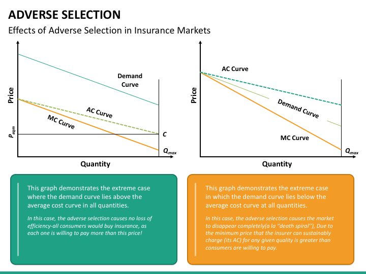

Adverse selection is a concept within economics and finance that describes a situation where there is an imbalance in information between parties involved in a transaction. This imbalance can lead to market inefficiencies, as the party with more information can manipulate the transaction to their advantage, leaving the less informed party at a disadvantage. Algorithmic trading, which relies on automated and data-driven strategies to execute trades, is particularly susceptible to adverse selection. This susceptibility arises because algorithmic traders aim to capitalize on small price discrepancies, and any information asymmetry can significantly impact the effectiveness of their strategies.

In algorithmic trading, adverse selection can introduce substantial risks. For example, when executing large orders, the likelihood of such orders being anticipated and acted upon by more informed traders can result in unfavorable price movements. This can lead to increased transaction costs and reduced profitability. Additionally, strategies that depend on high-frequency trading magnify these risks, as they exploit even the smallest informational advantages.

This article examines the influence of adverse selection on algorithmic trading. It focuses on the associated risks, such as order execution risk and liquidity challenges, and considers various strategies that can be employed to mitigate its impact. By understanding adverse selection, traders and financial institutions can develop more robust trading strategies, harness technological advancements, and influence regulatory policies to promote market efficiency and fairness.

## Table of Contents

## Understanding Adverse Selection

Adverse selection is a concept that emerges in situations of asymmetric information, where one party involved in a transaction possesses superior information compared to the other. This disparity can lead to suboptimal outcomes, as the informed party can leverage their informational advantage to benefit at the expense of the less informed party. In financial markets, adverse selection manifests when more knowledgeable traders capitalize on their insights, potentially causing inefficiencies and financial losses for the less informed traders.

The mechanism of adverse selection can be understood by considering a typical market scenario where buyers and sellers transact based on differing levels of information about the asset being traded. The informed party, armed with proprietary information or superior analyses, can predict price movements more accurately than the uninformed party. This ability enables them to make more profitable trades, often resulting in an uneven playing field.

For example, inspired by the classic 'lemons' problem in economics, if informed traders know that a particular asset is undervalued and likely to appreciate, they may buy substantial quantities before the price aligns with their information. Conversely, if they possess information suggesting an overvaluation, they may sell off the asset, leading to a price decline. In both scenarios, the uninformed traders, operating with less accurate information, may engage in transactions that ultimately result in losses.

Mathematically, adverse selection can influence the expected utility of participants in a market. Let $U_i$ denote the utility of an informed trader, and $U_u$ denote the utility of an uninformed trader. In adverse selection scenarios, typically $U_i > U_u$, reflecting the advantage realized by the informed upon participating in the market.

Addressing adverse selection in markets involves devising strategies that can mitigate its effects, such as enhancing market transparency, improving information dissemination, and developing mechanisms that can equitably adjust for the imbalance created by asymmetric information.

## Adverse Selection in Financial Markets

Adverse selection in financial markets is a phenomenon where the presence of asymmetric information can significantly affect order execution and market dynamics. This issue often emerges when one party in a transaction possesses more substantial informational advantages over the other. Consequently, this informational disparity leads to inefficient transactions that typically benefit the better-informed group, thereby creating an uneven playing field.

A critical aspect of adverse selection is order execution risk, which becomes particularly pronounced with large orders. Large orders are susceptible to front-running, a situation where traders with superior information or faster access to market data place their orders ahead of the original order to capitalize on anticipated price movements. The original trader, thus, faces execution at less favorable prices, reducing potential profit margins. This risk is amplified in markets where speed and information access differences are significant.

Information asymmetry in financial markets allows traders who possess higher-quality information to exploit market inefficiencies. These traders can predict market movements more accurately, thereby gaining an advantage over less informed participants. The existence of such disparities encourages informed traders to exploit inefficiencies, further widening the gap between informed and uninformed market participants. As a result, trust in market fairness and efficiency can be undermined.

An observable reaction to adverse selection risk in financial markets is the widening of bid-ask spreads. The bid-ask spread represents the difference between the selling price and the buying price for a security. When adverse selection risk is perceived to be high, market makers and [liquidity](/wiki/liquidity-risk-premium) providers increase the bid-ask spread as a protective measure against potential losses from trading with informed parties. This widening spread adds to the cost of trading, negatively impacting pricing and liquidity in the market. Traders face higher transaction costs, and the overall market liquidity diminishes, deterring trading activities and potentially leading to greater market [volatility](/wiki/volatility-trading-strategies).

Overall, adverse selection in financial markets introduces several risks that can degrade market efficiency, impact liquidity, and compromise the fairness of price discovery. Addressing these issues is of paramount importance to ensure the proper functioning of financial markets, safeguard investor interests, and maintain overall market integrity.

## Adverse Selection in Algorithmic Trading

Algorithmic trading has transformed financial markets by leveraging the power of computational speed and data analysis. However, this reliance on technology and data brings inherent vulnerabilities, particularly to adverse selection. Adverse selection in [algorithmic trading](/wiki/algorithmic-trading) occurs when there is an imbalance in information among different market participants, leading to inefficiencies that can be exploited by those with superior data access or processing capabilities.

High-frequency trading ([HFT](/wiki/high-frequency-trading-strategies)) is a subset of algorithmic trading characterized by the rapid execution of a large number of orders at exceptionally high speeds. This speed allows HFT firms to capitalize on minute informational advantages. For instance, when a trader can react to new information milliseconds faster than others, they can consistently execute trades at more favorable prices. This reactionary advantage exacerbates the risks of adverse selection by allowing high-frequency traders to effectively "pick off" slower market participants.

The core mechanics of adverse selection in algorithmic trading are grounded in the idea that the party with more information has the upper hand in the trading process. In a scenario where algorithms are tuned to detect and react to market signals faster than human traders, the likelihood of standardized market participants falling victim to adverse selection increases significantly.

Consider an example involving latency [arbitrage](/wiki/arbitrage), a strategy leveraged in HFT. Latency arbitrage exploits the differences in the speed of information dissemination across various trading venues. High-frequency traders can exploit this time lag by purchasing undervalued securities in one exchange and simultaneously selling them at a higher price in another. The profits gleaned from such transactions are often small per trade but can accumulate significantly over time—demonstrating a clear example of adverse selection at work.

Furthermore, the sophistication in data processing required in algorithmic trading means that firms with access to cutting-edge technologies and high-quality data feeds are better positioned to exploit these inefficiencies, often at the expense of less equipped market participants. The edge in data analytics allows these firms to identify patterns and price discrepancies more quickly, perpetuating a cycle where adverse selection becomes a persistent issue in the marketplace.

Ultimately, adverse selection in algorithmic trading underscores the dynamic challenges of maintaining an equitable trading environment, where disparities in data access and processing speeds create potential for exploitation. Understanding these complexities is crucial in devising measures to mitigate its impact and ensure that algorithmic trading continues to contribute to market efficiency and liquidity.

## Factors Contributing to Adverse Selection in Algorithmic Trading

Adverse selection in algorithmic trading is significantly influenced by several factors that can disrupt market dynamics and profitability. Among the most impactful is latency arbitrage. This occurs when market participants leverage time delays in data dissemination and trade execution, allowing faster traders to capitalize on minor informational advantages. A quintessential example is where a high-frequency trading (HFT) firm might detect a price movement on one exchange due to latency, enabling it to execute trades on a lagging exchange before prices adjust, capturing profits from the spread. The mathematical representation of this scenario might involve evaluating the price differences $\Delta P$ between exchanges and acting upon them faster than the market can correct:

$$
\text{Profit} = \Delta P \cdot \text{Volume}
$$

The practice of quote stuffing further amplifies adverse selection risks. Here, traders submit a large number of orders and cancel them almost immediately. This manipulation creates a false sense of market activity, causing delays and increasing the uncertainty in the [order book](/wiki/order-book-trading-strategies). It distorts the perception of supply and demand, confusing algorithms that rely on these indicators for trading decisions. Such tactics, besides disrupting real-time data, increase the computational load on trading systems, making it challenging for less sophisticated algorithms to compete.

Spoofing is another deceitful practice where traders place orders with no intention of executing them, merely to influence the market prices by creating a misleading picture of supply and demand. This tactic manipulates the market by inducing traders to react to a non-existent demand or supply, allowing the spoofer to trade at artificially influenced prices. Algorithms that detect price movements and respond to perceived market interest become vulnerable targets in such scenarios.

Together, these practices illustrate the cunning use of technological and strategic advantages to create and exploit information asymmetries, undermining market fairness and efficiency. Addressing these factors is crucial in designing trading strategies and systems that minimize the risks of adverse selection, ultimately preserving the integrity of market transactions.

## Real-World Examples

The events of May 6, 2010, commonly referred to as the 'Flash Crash,' serve as a seminal example of how adverse selection dynamics intertwined with algorithmic strategies can lead to substantial market volatility. On that day, the U.S. stock market experienced a dramatic and rapid decline in prices, with the Dow Jones Industrial Average plummeting nearly 1,000 points within minutes, only to recover much of the loss shortly thereafter. This incident highlighted the susceptibility of financial markets to adverse selection amplified by technological factors.

The 'Flash Crash' was precipitated by a large sell order placed by a mutual fund company aiming to hedge against impending market declines. The order, executed via an automated trading algorithm, eschewed consideration of price and market conditions, focusing solely on speed and [volume](/wiki/volume-trading-strategy). This aggressive execution strategy inadvertently contributed to market destabilization. The large order interacted with high-frequency trading (HFT) algorithms, which are programmatic systems designed to exploit minuscule information asymmetries with remarkable speed. These algorithms, reacting to the influx of sell orders, began to exacerbate the price decline by aggressively selling their positions, creating a feedback loop of selling pressure.

In this context, adverse selection manifested in the form of information asymmetry. Institutional investors, typically slower to react, found themselves at a disadvantage relative to HFT participants. The latter possessed superior processing capabilities and speed, allowing them to 'front-run' orders, i.e., executing trades based on predicting forthcoming market moves, effectively worsening the market impact of the initial sell-off. Computational latency, a type of adverse selection, played a crucial role as high-frequency traders capitalized on brief informational lags to gain an edge over slower market participants.

Interactions between institutional investors and high-frequency traders illustrate the persistent challenge of adverse selection. Traditional investment institutions, which often engage in substantial trades involving complex evaluation processes, struggle to compete against the rapid-fire strategies of high-frequency trading firms. When an institutional investor initiates a large trade, their slower-paced operations expose them to adverse selection risks, as high-frequency traders can quickly adjust to and exploit the disclosed order flow.

The 'Flash Crash' underscores the complexities and precariousness introduced by algorithmic and high-frequency trading, emphasizing the necessity for mechanisms to manage or mitigate adverse selection risks. These examples underscore the need for robust regulation and technical safeguards to prevent similar market disruptions in the future.

## Mitigating Adverse Selection

Randomizing order execution is an effective strategy to guard against adverse selection by reducing the predictability of large orders. By introducing uncertainty in the timing and size of trades, market participants can obscure their intentions, making it difficult for adversaries to anticipate and front-run these orders. This approach can involve random delays or breaking large orders into smaller, less conspicuous parts, thus minimizing information leakage.

Regulatory measures play a pivotal role in addressing the challenges of adverse selection. Various financial authorities have instituted rules mandating transparency and best execution practices to safeguard market participants. For example, the implementation of minimum tick sizes discourages high-frequency traders from exploiting minute price discrepancies that may arise from adverse selection. Additionally, periodic auction mechanisms, which aggregate orders and execute them at specific times, can decrease the influence of fleeting informational advantages, promoting a more equitable trading environment.

Trading venue designs have adapted to provide some protection against adverse selection. Dark pools, for instance, allow traders to execute large orders anonymously, reducing the chance of information leakage that could be exploited by better-informed counterparties. However, dark pools are not without trade-offs. The lack of pre-trade transparency inherent in these venues can lead to price discovery challenges and diminished liquidity. Furthermore, regulatory scrutiny over dark pools has increased, as authorities seek to balance the protective benefits they offer against potential risks to market integrity.

To mitigate adverse selection effectively, it is crucial to weigh the benefits and limitations of each strategy and adapt them according to the specific trading environments and regulatory frameworks in place. Through a combination of randomization techniques, adherence to regulatory standards, and thoughtful use of innovative trading venue designs, market participants can enhance fairness and efficiency in algorithmic trading.

## Firms and Solutions Addressing Adverse Selection

Companies within the financial technology sector have developed several strategies to address adverse selection risks associated with algorithmic trading. Virtu Financial and IEX Group are prominent examples that have implemented measures to mitigate such risks, ensuring a more level playing field.

Virtu Financial is a leading electronic market maker and liquidity provider. It leverages advanced quantitative techniques and a robust technology infrastructure to minimize the effects of adverse selection. By utilizing high-frequency trading algorithms, Virtu is able to provide continuous liquidity across multiple asset classes. Their algorithms are designed to enhance trade execution quality, reducing the impact of adverse selection by reacting swiftly to changing market conditions. Virtu's sophisticated risk management systems monitor trades in real-time, adjusting strategies to optimize pricing and execution, which can help in minimizing the negative effects caused by information asymmetry.

IEX Group, known for its focus on fairness and transparency, has adopted unique measures to counteract adverse selection. The company is renowned for implementing the "speed bump," a 350-microsecond delay on all orders. This delay aims to neutralize the advantages of high-frequency traders who might otherwise exploit latency arbitrage. By equalizing the speed of order transmissions, IEX works to create a trading environment where pricing and liquidity are less susceptible to manipulation through adverse selection. This measure empowers institutional investors to interact with the market on more equal terms, thus improving overall market fairness.

Investment Technology Group (ITG), now a part of Virtu Financial, provides advanced analytics and routing services specifically designed to optimize trade execution while mitigating adverse selection. ITG's innovative tools help traders analyze order flow and market conditions to make data-informed decisions. The company's Smart Order Router is designed to optimize trading by dynamically adjusting the execution strategy based on real-time market data and historical patterns. This technology aids in minimizing the exposure to adverse selection by improving the placement and timing of orders, maximizing liquidity access while reducing cost.

Through the adoption of cutting-edge technologies and strategic trading innovations, these firms contribute significantly to mitigating adverse selection, thus enhancing market efficiency and fostering a more equitable trading environment. Their ongoing efforts underscore the importance of technology in addressing the complexities of algorithmic trading and safeguarding against the inherent risks associated with informational disparities.

## Conclusion

Adverse selection presents persistent challenges in the landscape of algorithmic trading, necessitating the adoption of sophisticated strategies and stringent regulatory oversight. As algorithmic systems increasingly dominate trading environments, the risk of adverse selection magnifies, primarily due to information asymmetries that allow better-informed participants to exploit their advantages. This exploitation can lead to market inefficiencies where the uninformed party suffers, impacting both liquidity and fairness in financial markets.

To enhance market efficiency and maintain fairness, it is crucial to understand and mitigate the effects of adverse selection. Strategies aimed at reducing the vulnerability of trading algorithms to adverse selection include the implementation of dynamic order execution strategies, the use of sophisticated data analytics, and the adoption of technological solutions that minimize latency issues. Additionally, enhancements in trading venue structures, such as the adoption of dark pools, and the introduction of regulatory mechanisms, such as minimum resting times for orders, also offer potential mitigation pathways.

Regulatory bodies play an essential role in shaping the framework within which algorithmic trading operates. By establishing rules that curb manipulative practices like quote stuffing and spoofing, they ensure a more level playing field. Ongoing reforms and technological advancements in trading infrastructure aim to reduce the propensity for adverse selection, thereby promoting a market environment that rewards fairness and efficiency. Understanding these dynamics and actively working to counteract adverse selection are vital components in maintaining robust and equitable financial markets in the era of algorithmic trading.

## References & Further Reading

[1]: O'Hara, M. (1995). ["Market Microstructure Theory"](https://openlibrary.org/books/OL1103097M/Market_microstructure_theory). Blackwell Publishers.

[2]: Hasbrouck, J. (2007). ["Empirical Market Microstructure: The Institutions, Economics, and Econometrics of Securities Trading"](https://academic.oup.com/book/52241). Oxford University Press.

[3]: Lopez de Prado, M. (2018). ["Advances in Financial Machine Learning"](https://www.amazon.com/Advances-Financial-Machine-Learning-Marcos/dp/1119482089). Wiley.

[4]: Easley, D., López de Prado, M. M., & O'Hara, M. (2011). ["The Microstructure of the 'Flash Crash': Flow Toxicity, Liquidity Crashes, and the Probability of Informed Trading"](https://www.semanticscholar.org/paper/Flow-Toxicity-and-Liquidity-in-a-High-Frequency-Easley-Prado/9369430bd005d194f9332ae7cbd5a57ace5e9ab3). The Review of Financial Studies, 25(9), 2257-2333.

[5]: Kirilenko, A. A., Kyle, A. S., Samadi, M., & Tuzun, T. (2011). ["The Flash Crash: The Impact of High Frequency Trading on an Electronic Market"](https://www.jstor.org/stable/26652722). Commodity Futures Trading Commission.

[6]: Menkveld, A. J. (2013). ["High Frequency Trading and the New-Markets Paradigm"](https://papers.ssrn.com/sol3/papers.cfm?abstract_id=1722924). Journal of Financial Economics, 116(2), 293-309.