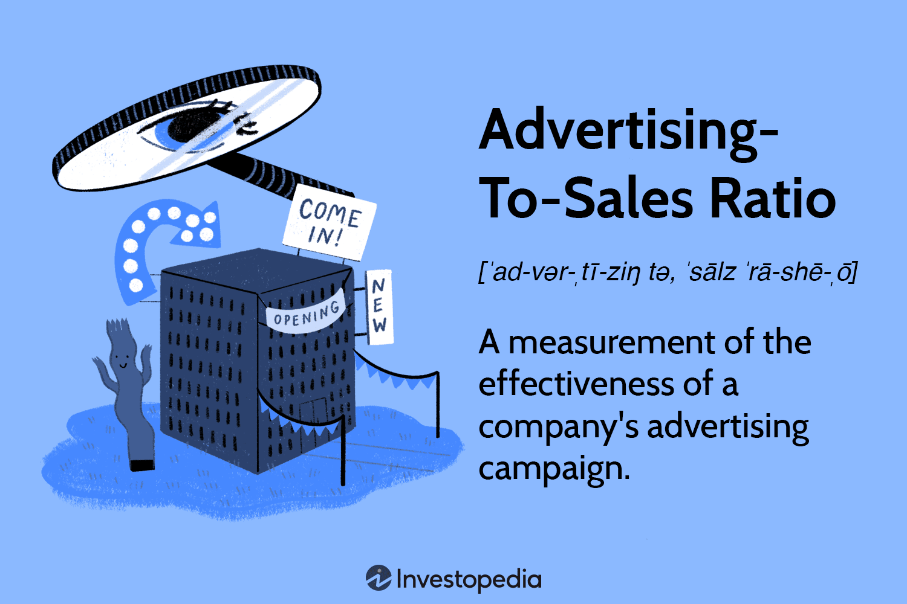

In today's digitally driven marketplace, understanding key metrics is essential for businesses seeking to optimize their marketing and advertising efforts. The dynamic nature of global markets demands that organizations continually adapt and refine their strategies to maintain a competitive edge. This article explores crucial marketing metrics with a particular focus on the advertising-sales ratio, a vital measure for understanding the relationship between advertising investments and sales outcomes. This metric allows businesses to assess the efficiency of their advertising spend, which is vital for strategic decision-making and resource allocation.

Additionally, the financial sector increasingly relies on algorithmic trading as a strategic tool to enhance trading efficiency and precision. By utilizing computer algorithms to execute trades at velocities beyond human capacity, algorithmic trading enables traders to capitalize on rapid market movements while reducing emotional biases that can cloud judgment. This article examines how the integration of algorithmic trading strategies can drive success in financial markets by leveraging predefined criteria and sophisticated algorithms.



These metrics and strategies are not confined to a single sector; they have broad applicability that can enhance both advertising efficiency and trading success across diverse industries. By integrating insights from marketing metrics and algorithmic trading, businesses can optimize their operations, ensuring they remain adaptable in the face of market changes and challenges. Join us on a comprehensive journey through marketing metrics and algorithmic trading to leverage these insights for significant business growth.

## Table of Contents

## Understanding Marketing Metrics: The Advertising-Sales Ratio

In the landscape of business analytics, the advertising-sales ratio stands as a critical metric for assessing the efficacy of advertising campaigns. This ratio, calculated by dividing total advertising expenditures by sales revenue, serves as an indicator of how efficiently advertising efforts generate sales. Mathematically, it is represented as:

$$
\text{Advertising-Sales Ratio} = \frac{\text{Total Advertising Expenses}}{\text{Sales Revenue}}
$$

A lower advertising-sales ratio is typically desirable, signifying a successful conversion of advertising spend into sales revenue. This implies that resources are being utilized effectively, achieving substantial sales returns with minimal expenditure.

However, interpreting this metric requires an understanding of industry-specific benchmarks. Industries differ in their typical ratios, stemming from varying cost structures, competitive environments, and consumer behaviors. For instance, sectors like retail or consumer goods might display different ratios compared to high-tech or B2B industries. Therefore, it is crucial to compare the advertising-sales ratio of a company against that of others within the same industry to draw meaningful conclusions about its advertising efficacy.

Practical applications of the advertising-sales ratio can be illustrated by assessing its role in strategic business decisions. Consider a company that experiences a higher ratio compared to its industry peers. This may indicate inefficiencies in its advertising strategy, prompting a re-evaluation of marketing channels, messaging, or target demographics. Conversely, a lower ratio can provide a competitive advantage, reflecting successful market penetration and brand recognition.

Case studies within businesses have shown that monitoring this metric allows for agile strategy adjustments. For example, if market conditions shift or a new competitor emerges, a company might decide to either ramp up advertising spend to maintain the ratio or optimize current campaigns to enhance effectiveness without increasing costs.

In summary, the advertising-sales ratio is not merely a figure but a diagnostic tool crucial for business analysis. It provides insights into the efficiency of advertising budgets and helps in tailoring strategies to maximize sales performance relative to spent resources.

## Key Marketing Metrics for Business Analysis

In analyzing marketing performance, businesses often go beyond the advertising-sales ratio to incorporate a variety of key performance indicators (KPIs). These metrics offer valuable insights, enabling businesses to measure efficiency, allocate budgets effectively, and make strategic decisions. 

**Return on Ad Spend (ROAS)** is a critical KPI used to evaluate the efficacy of advertising campaigns. ROAS is calculated by dividing the revenue generated from an advertising campaign by the expenditure on that campaign. Mathematically, it is expressed as:

$$
\text{ROAS} = \frac{\text{Revenue from Ads}}{\text{Advertising Cost}}
$$

A higher ROAS indicates that a campaign is generating more revenue per dollar spent on advertising, signifying a successful return on investment.

Another important metric is **Customer Acquisition Cost (CAC)**, which measures the cost associated with acquiring a new customer. CAC is calculated by dividing the total costs associated with acquisition (marketing expenses) by the number of new customers acquired during that period:

$$
\text{CAC} = \frac{\text{Total Marketing Expenses}}{\text{Number of New Customers}}
$$

Lower CAC values are preferable as they indicate cost-efficient acquisition strategies. Businesses aim to have a lower CAC relative to the lifetime value of a customer (LTV), ensuring long-term profitability.

The integration of diverse metrics like ROAS and CAC provides a comprehensive view of marketing performance. This holistic approach allows businesses to understand the interplay between different channels and campaigns. For instance, high CAC might be acceptable in scenarios where the LTV is substantially higher, ensuring long-term profitability despite short-term costs.

Moreover, these metrics guide strategic decisions regarding budget allocation. By analyzing ROAS and CAC alongside other metrics, businesses can identify high-performing channels and campaigns, reallocating resources to maximize returns. This data-driven strategy optimizes marketing efforts, ensuring that investments yield the desired outcomes in a competitive environment.

Understanding and effectively applying these metrics equip businesses with the analytical tools necessary to optimize their marketing strategies. In rapidly evolving markets, where customer preferences and competitive dynamics constantly change, leveraging these insights is crucial for sustaining growth and maintaining a competitive edge.

## Algorithmic Trading: A Strategic Overview

Algorithmic trading, commonly referred to as automated trading, represents a revolutionary approach to executing trades by deploying computer algorithms. These algorithms operate based on predefined criteria, allowing traders to capitalize on rapid market changes with enhanced efficiency. A key advantage of [algorithmic trading](/wiki/algorithmic-trading) is the significant reduction in emotional biases that often affect manual trading, thereby facilitating more rational decision-making.

Several distinct strategies underpin algorithmic trading, each serving different market objectives. Trend following, for instance, is a technique that involves algorithms designed to identify and exploit market trends. This strategy leverages historical data to predict future price movements, enabling traders to benefit from ongoing market directions without the influence of short-term [volatility](/wiki/volatility-trading-strategies).

Statistical [arbitrage](/wiki/arbitrage) is another vital strategy. It involves identifying and capitalizing on price inefficiencies between related financial instruments. This method often employs sophisticated statistical models to analyze historical correlations and deviations, allowing traders to execute trades that profit from temporary pricing anomalies.

High-frequency trading ([HFT](/wiki/high-frequency-trading-strategies)) is a prominent example of algorithmic trading that focuses on executing a large number of orders at extremely quick speeds. This strategy utilizes advanced algorithms and cutting-edge technology to implement trades in milliseconds, often exploiting minute price discrepancies that can be rapidly arbitraged.

The development and assessment of algorithmic trading strategies heavily rely on key performance metrics such as the Sharpe Ratio and Maximum Drawdown. The Sharpe Ratio is used to evaluate the risk-adjusted return of an investment strategy and is defined as:

$$
\text{Sharpe Ratio} = \frac{R_p - R_f}{\sigma_p}
$$

where $R_p$ is the portfolio return, $R_f$ is the risk-free rate, and $\sigma_p$ is the standard deviation of the portfolio's excess return, providing insights into the returns relative to risk undertaken.

On the other hand, Maximum Drawdown is a metric that measures the maximum observed loss from a peak to a trough of a portfolio before a new peak is achieved, indicating the risk related to losses:

$$
\text{Maximum Drawdown} = \frac{\text{Trough Value} - \text{Peak Value}}{\text{Peak Value}}
$$

Together, these metrics enable traders to assess and refine strategies, ensuring alignment with their risk tolerances and investment objectives. Through algorithmic trading, financial markets witness the merging of technology and finance, propelling trading activities toward greater precision and sophistication.

## Evaluating Algorithmic Trading Performance

Evaluating the performance of algorithmic trading strategies involves analyzing several key metrics designed to quantify different aspects of trading risk and return. These metrics provide a clearer understanding of a strategy's effectiveness and help in refining trading strategies for better alignment with investment goals and market dynamics.

The **Sharpe Ratio** is a widely-used metric for evaluating the risk-adjusted return of a trading strategy. It is calculated as:

$$
\text{Sharpe Ratio} = \frac{R_p - R_f}{\sigma_p}
$$

where $R_p$ is the expected portfolio return, $R_f$ is the risk-free rate, and $\sigma_p$ is the standard deviation of the portfolio's excess return. A higher Sharpe Ratio indicates more return for each unit of risk, which is desirable in trading scenarios.

The **Maximum Drawdown** metric measures the largest peak-to-trough decline in the value of a portfolio before a new peak is attained. It provides insights into the potential downside risk of a strategy, making it an essential metric for risk management. A smaller maximum drawdown is preferable, indicating reduced vulnerability to large losses.

The **Win Rate** is defined as the proportion of trades that are profitable over a certain period. It is calculated as:

$$
\text{Win Rate} = \frac{\text{Number of Winning Trades}}{\text{Total Number of Trades}}
$$

A higher win rate suggests a strategy's greater ability to generate profits consistently, though it should be analyzed alongside other metrics since high win rates might not always correspond with high profitability.

The **Profit Factor** is the ratio of gross profits to gross losses. It is calculated as:

$$
\text{Profit Factor} = \frac{\text{Total Profits}}{\text{Total Losses}}
$$

A profit [factor](/wiki/factor-investing) greater than one indicates that the strategy makes more money on winning trades than it loses on losing trades. This ratio helps gauge the efficiency of capital utilization within a strategy.

For quant developers and traders, incorporating these metrics into algorithmic systems can be done using programming languages such as Python. For instance, libraries like `pandas` and `NumPy` can calculate these metrics efficiently:

```python
import pandas as pd

def calculate_metrics(returns, risk_free_rate):
    # Compute Sharpe Ratio
    excess_returns = returns - risk_free_rate
    sharpe_ratio = excess_returns.mean() / excess_returns.std()

    # Compute Maximum Drawdown
    cumulative_returns = (1 + returns).cumprod()
    peak = cumulative_returns.cummax()
    max_drawdown = ((cumulative_returns - peak) / peak).min()

    return sharpe_ratio, max_drawdown

# Example usage
returns = pd.Series([...])  # Example returns data
risk_free_rate = 0.01
sharpe_ratio, max_drawdown = calculate_metrics(returns, risk_free_rate)
```

By leveraging these metrics, traders can not only assess the current performance of their trading strategies but also identify areas for improvement. A comprehensive evaluation that includes these metrics can enhance strategic adjustments and foster a better fit with individual investor goals and prevailing market conditions.

## Interconnection Between Marketing and Trading Metrics

Businesses often need to balance marketing performance with financial trading strategies to maintain fiscal health. The synergy between marketing metrics and financial trading techniques can significantly bolster business operations, especially in sectors where advertising plays a pivotal role in revenue generation. A deep understanding of marketing metrics, such as the advertising-sales ratio, equips businesses with the tools to evaluate how advertising expenditures translate into sales revenue. This connection between marketing and revenue streams ensures that funds are used effectively to maximize returns on advertising investment.

In tandem, algorithmic trading offers sophisticated methods to enhance marketing strategies by leveraging precise market forecasts to optimize the allocation of financial resources. Algorithmic trading relies on computer algorithms that can analyze vast amounts of market data with a speed and accuracy unattainable by human traders. This capability allows businesses to quickly adjust their financial positions in response to market shifts, thereby protecting and potentially increasing capital available for marketing endeavors.

For instance, a sector heavily influenced by rapid consumer behavior changes could benefit from algorithmic trading strategies that predict these shifts. By reallocating funds based on real-time market analysis, businesses can prioritize marketing efforts that yield the highest return on investment. This alignment of marketing and trading strategies not only promotes financial stability but also enhances the agility of businesses in responding to market changes.

Case studies provide illustrative examples of how businesses harness both marketing and trading insights to achieve competitive advantage. For example, a retail company might use data-driven marketing analytics to identify peak advertising performance periods, while simultaneously employing algorithmic trading strategies to ensure their financial capacity is primed to support these marketing pushes. Such an approach ensures synchronization between the timing of financial investments and marketing campaigns, maximizing the overall impact on the company's bottom line.

In summary, the interconnection between marketing metrics and trading strategies provides a robust framework for businesses seeking to optimize their performance. By integrating metrics like the advertising-sales ratio with algorithmic trading practices, businesses can effectively balance and enhance their marketing and financial strategies in a highly competitive environment.

## Conclusion

Marketing metrics, with a particular focus on the advertising-sales ratio, serve as crucial tools in assessing the effectiveness of advertising initiatives and the overall financial health of a business. This ratio, calculated by dividing total advertising expenses by sales revenue, provides a quantitative measure of how well advertising efforts are translating into sales. A desirable outcome is typically reflected by a lower ratio, indicating a more efficient use of resources to achieve higher sales returns. Understanding and monitoring this metric allows businesses to refine their advertising strategies, thereby enhancing financial performance.

On the other hand, algorithmic trading offers significant value to financial strategies by employing automated, precise, and adaptable techniques to respond to dynamic market conditions. These algorithms operate based on predefined criteria, enabling traders to execute trades rapidly and without the emotional biases that often affect human decision-making. Key strategies, such as [trend following](/wiki/trend-following) and high-frequency trading, rely on metrics like the Sharpe Ratio and Maximum Drawdown to assess performance and manage risks. As a result, traders are equipped to optimize strategies in alignment with their investment goals and prevailing market situations.

Integrating insights from both marketing metrics and algorithmic trading provides businesses with a robust framework for making informed strategic decisions. Such integration allows for a comprehensive approach to optimizing marketing efforts and financial strategies, thereby driving business growth. Moving forward, businesses stand to benefit from continued innovations and analyses in these fields, paving the way for future success across industries. This synthesis of marketing and trading insights ensures a balanced and strategic deployment of resources that align with business objectives, promoting sustained competitive advantage and fiscal health.

## References & Further Reading

[1]: Kothari, S.P., & Warner, J.B. (2006). ["Econometrics of Event Studies."](https://papers.ssrn.com/sol3/papers.cfm?abstract_id=608601) Handbook of Corporate Finance: Empirical Corporate Finance.

[2]: Ardern, A. (2019). ["Digital Marketing Metrics, Ratios and Benchmarks Guide"](https://www.researchgate.net/publication/377598832_EVALUATING_ROI_IN_DIGITAL_MARKETING_CAMPAIGNS_METRICS_MEASUREMENT_AND_INSIGHTS) Smart Insights.

[3]: Baker, M., & Wurgler, J. (2012). ["Behavioral Corporate Finance: An Updated Survey."](https://www.sciencedirect.com/science/article/pii/B9780444535948000057) In Handbook of The Economics of Finance.

[4]: Harris, L. (2003). ["Trading and Exchanges: Market Microstructure for Practitioners"](https://www.amazon.com/Trading-Exchanges-Market-Microstructure-Practitioners/dp/0195144708) Oxford University Press.

[5]: Chan, E. (2009). ["Quantitative Trading: How to Build Your Own Algorithmic Trading Business"](https://github.com/ftvision/quant_trading_echan_book) John Wiley & Sons.

[6]: Jansen, S. (2018). ["Machine Learning for Algorithmic Trading: Predictive Models to Extract Signals from Market and Alternative Data for Systematic Trading Strategies with Python"](https://github.com/stefan-jansen/machine-learning-for-trading) Packt Publishing.

[7]: Marcos López de Prado (2018). ["Advances in Financial Machine Learning"](https://www.amazon.com/Advances-Financial-Machine-Learning-Marcos/dp/1119482089) Wiley.