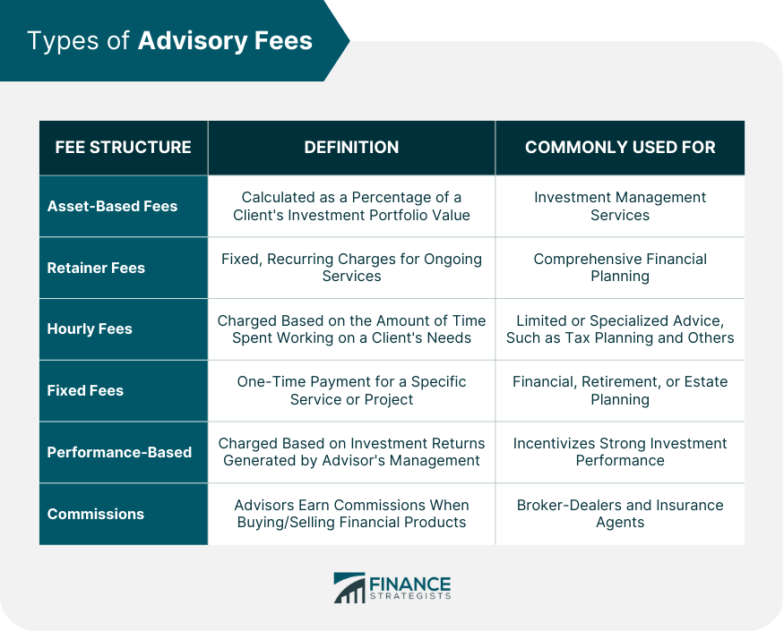

## Table of Contents

## What is an advisor fee?

An advisor fee is the money you pay to a financial advisor for their help and advice on managing your money. Financial advisors can help you with things like planning for retirement, investing your money, or figuring out how to save for big goals like buying a house. The fee you pay can be a flat amount, a percentage of the money they manage for you, or even an hourly rate.

The cost of an advisor fee can vary a lot. It depends on things like how much money you have, how complex your financial situation is, and what kind of services you need. Some advisors charge more because they offer specialized services or because they have a lot of experience. It's important to understand how much you will be paying and what you are getting in return before you decide to work with an advisor.

## Why do financial advisors charge fees?

Financial advisors charge fees because they provide valuable services that help people manage their money better. They spend time understanding your financial situation, goals, and needs. Then, they give you advice on how to invest your money, plan for retirement, or save for big purchases like a house. This advice can help you make smarter financial decisions and reach your goals faster. Just like any other professional service, like a doctor or a lawyer, financial advisors need to be paid for their time and expertise.

The fees also help cover the costs of running their business. Financial advisors often have to pay for things like office space, software to manage your investments, and ongoing education to stay up-to-date with the latest financial strategies and regulations. By charging fees, they can keep their business running smoothly and continue to provide high-quality advice to their clients. It's important for clients to understand these fees so they can see the value they're getting in return for what they pay.

## How are advisor fees typically calculated?

Advisor fees are usually calculated in a few common ways. One way is by taking a percentage of the assets they manage for you. This means if they manage $100,000 of your money and their fee is 1%, you would pay them $1,000 a year. Another way is a flat fee, which is a set amount of money you pay no matter how much money they manage. For example, you might pay $3,000 a year, regardless of the size of your investment.

Sometimes, advisors charge by the hour. This is common if you just need advice for a specific issue and not ongoing management. For example, you might pay $200 an hour for their time. Lastly, some advisors use a performance-based fee, where they get paid more if your investments do well. This can be motivating for the advisor but also comes with more risk for you. Each method has its own pros and cons, so it's important to pick the one that fits your needs and budget.

## What is the difference between a flat fee and an hourly fee for advisors?

A flat fee is a set amount of money you pay to a financial advisor, no matter how much work they do or how much money they manage for you. For example, you might pay $3,000 a year to an advisor, and that's it. This can be good if you want to know exactly how much you'll be spending on financial advice each year. It's like paying a fixed monthly bill for a service.

An hourly fee is different because you pay the advisor for each hour they spend working for you. If an advisor charges $200 an hour and spends 10 hours helping you, you would pay $2,000. This can be good if you only need help with a specific problem and don't need ongoing advice. It's like hiring a lawyer or a plumber for a specific job, where you only pay for the time they spend on your case.

## Can you explain the concept of an assets under management (AUM) fee?

An assets under management (AUM) fee is a way that some financial advisors charge for their services. It means you pay the advisor a certain percentage of the total amount of money they manage for you. For example, if you have $100,000 invested with an advisor and their AUM fee is 1%, you would pay them $1,000 a year. The more money you have with the advisor, the more you pay in fees, but the percentage stays the same.

This type of fee can be good because it's easy to understand and it aligns the advisor's interests with yours. If your investments do well and grow, the advisor earns more money too. But it can also mean that your fees go up as your investments grow, which might make you think twice about how much you're paying for advice. It's important to look at the total cost over time to make sure it fits with your financial goals.

## What are performance-based fees and how do they work?

Performance-based fees are another way that financial advisors might charge for their services. This type of fee means you pay the advisor more money if your investments do well. For example, if your investments grow by 10%, the advisor might get an extra fee on top of their regular fee because they helped you make more money.

This kind of fee can be good because it motivates the advisor to work hard to make your investments grow. But it can also be risky because if your investments don't do well, the advisor might not get paid as much, and they might take bigger risks to try to earn more. It's important to understand how these fees work and what you might have to pay before you agree to them.

## How do advisor fees impact investment returns?

Advisor fees can affect how much money you make from your investments. When you pay a fee to an advisor, that money comes out of your investment returns. For example, if your investments grow by 8% in a year but you pay a 1% advisor fee, your real return is only 7%. Over many years, these fees can add up and make a big difference in how much money you end up with.

It's important to think about advisor fees when you're choosing how to invest your money. If the fees are too high, they might eat up a lot of your returns, especially if the advisor isn't helping your investments grow a lot. But if the advisor helps you make more money than the fees cost, it might be worth it. Always look at the total cost and what you're getting for it to make sure it fits with your financial goals.

## Are advisor fees negotiable, and if so, how?

Yes, advisor fees can often be negotiated. Many financial advisors are willing to talk about their fees because they want to keep you as a client. If you feel like the fees are too high, you can ask if they can lower them. Sometimes, if you have a lot of money to invest or if you're a long-time client, the advisor might be more likely to give you a discount.

To negotiate, just talk to your advisor honestly about what you can afford and what you think is fair. They might be able to offer a lower percentage fee, a different fee structure, or even a special deal just for you. Remember, it's okay to shop around and compare fees from different advisors to find the best deal for your needs.

## What are some common ranges for advisor fees based on different fee structures?

Advisor fees can vary a lot depending on how they're calculated. If an advisor charges based on assets under management (AUM), the fee is usually between 0.5% and 2% of the money they manage for you. For example, if you have $100,000 invested and the fee is 1%, you'll pay $1,000 a year. Some advisors might charge less if you have more money with them, like 0.25% for big accounts.

Flat fees are another way advisors charge, and these can range from $1,000 to $10,000 a year. This fee stays the same no matter how much money you have invested. Hourly fees are less common but can be between $100 and $300 an hour. If you only need advice for a short time, this might be cheaper. Performance-based fees are more complicated and can be a percentage of the extra money your investments make, often around 10% to 20% of the gains.

## How can one evaluate if an advisor's fee is reasonable?

To figure out if an advisor's fee is fair, start by looking at what other advisors charge for similar services. You can do this by talking to friends, checking online, or using financial websites that compare fees. If your advisor's fee is a lot higher than what others charge, it might not be a good deal unless they offer something special that others don't. Also, think about how much money you have to invest. Advisors often charge a smaller percentage if you have more money with them, so make sure the fee matches the amount you're investing.

Next, consider what you're getting for the fee. A good advisor should help your money grow more than the fee they charge. If they're helping you make more money than what you're paying them, then the fee might be worth it. But if your investments aren't doing much better than if you did it yourself, the fee might be too high. It's also important to talk to your advisor about the fee. Sometimes, if you ask nicely, they might be willing to lower it, especially if you're a good client or have a lot of money to invest.

## What regulatory considerations should be taken into account regarding advisor fees?

When it comes to advisor fees, there are some rules that advisors need to follow. These rules are set by groups like the Securities and Exchange Commission (SEC) in the United States. Advisors have to tell you clearly how much they charge and how they get paid. They can't hide fees or trick you into paying more than you should. If they don't follow these rules, they can get into trouble and might have to pay fines or lose their license to give advice.

It's also important to know that some advisors have to act as fiduciaries. This means they have to put your interests first and not just try to make more money for themselves. If an advisor is a fiduciary, they have to be extra careful about the fees they charge and make sure they're fair. If you're not sure about the fees or if something feels off, you can always ask the advisor to explain or even report them to the SEC if you think they're doing something wrong.

## How have trends in advisor fee structures evolved over the past decade?

Over the past ten years, the way financial advisors charge for their services has changed a lot. More advisors now charge a percentage of the money they manage for you, called assets under management (AUM) fees. These fees used to be around 1% to 1.5% but have been going down. Many advisors now charge less, sometimes as low as 0.5%, especially if you have a lot of money with them. This change happened because people started looking for cheaper ways to get financial advice, and advisors had to lower their fees to stay competitive.

Another big change is that more advisors are using flat fees instead of AUM fees. A flat fee is a set amount you pay each year, no matter how much money you have invested. This can be good if you want to know exactly how much you'll be spending on advice. Also, some advisors now offer services online or through apps, which can be cheaper than meeting with someone in person. These new ways of charging have made it easier for more people to get help with their money without paying too much.

## What are financial advisory fees?

Financial advisory fees are charges imposed by financial advisors in exchange for their expertise and management of clients' investments. These fees cover a broad spectrum of advisory services, including financial planning, asset management, and executing trades in the market. The advisor's role involves not only providing tailored financial advice but also actively managing and optimizing investment portfolios to achieve desired financial outcomes.

The structure of advisor fees can vary significantly depending on the type of service provided. One common method is the fixed flat fee, where a predetermined amount is charged for a specific service or a bundle of services. This structure is often chosen for its predictability and transparency.

Another prevalent structure is the asset-based fee, where the charge is a percentage of the total assets under management (AUM). This type of fee generally incentivizes advisors to grow the client's portfolio, as their compensation increases with the value of the assets managed. A typical representation of the asset-based fee is illustrated with the formula:

$$
\text{Fee} = \text{AUM} \times \text{Fee Percentage}
$$

For instance, if an advisor manages $500,000 of assets and the fee percentage is 1%, the annual fee would be $5,000.

Transaction-based commissions represent another form of advisory fee, calculated based on the number or value of trades conducted by the advisor. These fees can vary, potentially leading to conflicts of interest if advisors are motivated to increase trading activity to augment their income.

Understanding these various fee structures is paramount for investors aiming to maximize returns and ensure their investments are aligned with personal financial objectives. By recognizing how different fees impact investment outcomes, individuals can make informed decisions about selecting financial advisors and the strategies employed to reach their financial goals.

## What are Transaction-Based Fees and Commissions?

Transaction-based fees are a common component in the framework of financial advisory services, typically incurred as commissions. These fees arise when financial products are bought or sold through a broker-dealer, serving as a key source of revenue for many financial advisors and brokerage firms.

These transaction-based fees can be structured in two primary ways: as a flat fee per trade or as a percentage of the transaction amount. A flat fee model is straightforward, charging a set fee for each trade regardless of its size or complexity. For instance, a broker might charge a fixed $10 fee for each trade executed, providing transparency and predictability in trading costs.

Alternatively, percentage-based fees calculate the commission as a percentage of the transaction's total value. This method may vary widely depending on the product traded. For example, a broker might charge a 1% commission on bond trades but only 0.5% on equities. This can be mathematically expressed as:

$$
\text{Commission Fee} = \text{Transaction Amount} \times \text{Commission Rate}
$$

Where the "Transaction Amount" is the total monetary value involved in the purchase or sale, and the "Commission Rate" is the percentage assigned as the fee. This structure can benefit clients who make smaller trades, as the fee adjusts with the transaction size, potentially offering cost savings over a flat rate for smaller positions.

While transaction-based fees can be appealing for their simplicity, they may also create potential conflicts of interest. Advisors operating under this fee structure might be incentivized to recommend frequent trading, which could lead to increased commission revenues at the expense of the client’s investment performance. This is known as "churning," where excessive buying and selling occur primarily to generate commissions.

Investors should exercise caution and ensure that the frequency and rationale behind trades align with their financial goals, rather than the advisor's compensation incentives. By understanding transaction-based fees and their potential implications, investors can better safeguard their portfolios and select advisory services that support their long-term investment strategies.

## References & Further Reading

[1]: Burton, B., & Wedel, M. (2012). ["Understanding Advisors' Transaction-Based Revenues."](https://psycnet.apa.org/record/2017-08086-004) InvestmentNews.

[2]: Hess, A. (2014). ["Robo-Advisors: A Portfolio Management Perspective."](https://ntnuopen.ntnu.no/ntnu-xmlui/handle/11250/2473732) SSRN Electronic Journal.

[3]: Christopher, L. (2018). ["The Costs of Investing: Understanding Advisory Fees."](https://pubmed.ncbi.nlm.nih.gov/29490366/) Journal of Financial Planning, 31(5), 48-55.

[4]: French, K. R. (2008). ["The Costs of Active Investing."](https://papers.ssrn.com/sol3/papers.cfm?abstract_id=1105775) The Journal of Finance, 63(4), 1537-1573.

[5]: Ackermann, C., McEnally, R., & Ravenscraft, D. (1999). ["The Performance of Hedge Funds: Risk, Return, and Incentives."](https://www.jstor.org/stable/222427) The Journal of Finance, 54(3), 833-874.