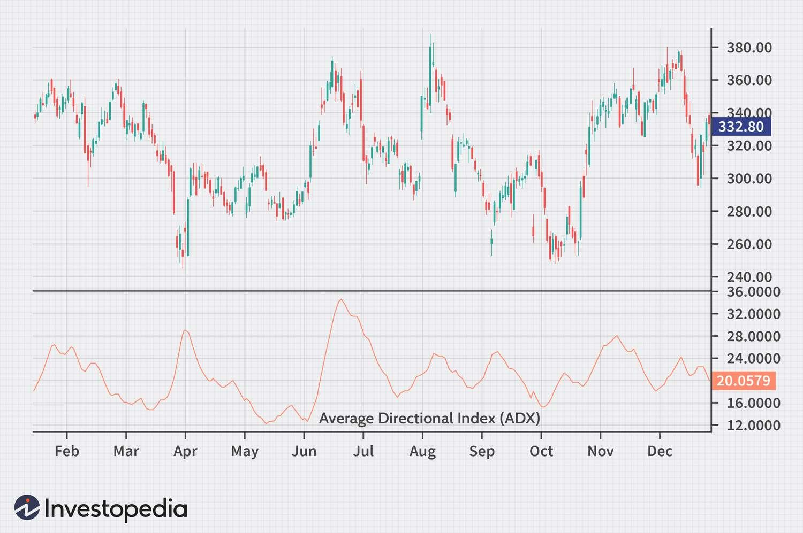

## Table of Contents

## What is the ADX indicator and what does it measure?

The ADX indicator, which stands for Average Directional Index, is a tool used in technical analysis to measure the strength of a trend in the market. It does not tell you the direction of the trend, whether it's going up or down, but rather how strong that trend is. The ADX is shown as a line on a chart and ranges from 0 to 100. If the ADX value is above 25, it usually means the trend is strong. If it's below 20, the trend is weak, and the market might be moving sideways.

To use the ADX, traders often look at it along with two other lines called the +DI (Positive Directional Indicator) and -DI (Negative Directional Indicator). These lines help show the direction of the trend. When the +DI line is above the -DI line, it suggests the market is trending upwards. When the -DI line is above the +DI line, it suggests the market is trending downwards. By combining the ADX with these directional indicators, traders can get a better sense of both the strength and direction of market trends, helping them make more informed trading decisions.

## How is the ADX calculated?

The ADX is calculated using price data from a chart, specifically the highs, lows, and closing prices over a period of time, usually 14 periods. To start, you need to calculate two other values: the Positive Directional Movement (+DM) and the Negative Directional Movement (-DM). The +DM is the current high minus the previous high, but only if it's positive and greater than the current low minus the previous low. The -DM is the current low minus the previous low, but only if it's positive and greater than the current high minus the previous high. If neither condition is met, both +DM and -DM are set to zero for that period.

Once you have the +DM and -DM, you calculate the True Range (TR), which is the greatest of the current high minus the current low, the absolute value of the current high minus the previous close, or the absolute value of the current low minus the previous close. Next, you calculate the +DI and -DI by dividing the smoothed +DM and -DM by the smoothed TR and multiplying by 100. The smoothed values are typically calculated using a Wilder's smoothing method, which is a type of moving average. Finally, the ADX itself is calculated by finding the difference between the +DI and -DI, dividing it by the sum of the +DI and -DI, taking the absolute value, multiplying by 100, and then smoothing this value over time. This final smoothed value is the ADX, which reflects the strength of the trend.

## What does an ADX value above 25 indicate?

An ADX value above 25 means the market trend is strong. It tells traders that the price is moving in a clear direction, either up or down. When the ADX is over 25, it's a good sign to follow the trend because it's likely to keep going in that direction for a while.

This doesn't mean the trend will last forever, though. Traders should keep watching the ADX because if it starts to drop below 25, it might mean the trend is getting weaker. So, an ADX above 25 helps traders know when to stay with a trend and when to be careful because the trend might be changing.

## How can the ADX be used to identify trending markets?

The ADX helps traders see if the market is moving in a strong trend. When the ADX line goes above 25, it means the market is in a strong trend. This is a sign that the price is moving clearly up or down, so traders might want to follow this trend. The ADX itself doesn't say if the trend is up or down, but it shows how strong the move is.

To figure out the direction of the trend, traders look at two other lines along with the ADX: the +DI and the -DI. If the +DI line is above the -DI line, it means the trend is up. If the -DI line is above the +DI line, the trend is down. So, by watching the ADX and these two lines together, traders can see both the strength and the direction of the market's trend. This helps them decide when to buy or sell based on whether the trend is strong and going in a certain direction.

## What are the components of the ADX indicator?

The ADX indicator has three main parts: the ADX line itself, the Positive Directional Indicator (+DI), and the Negative Directional Indicator (-DI). The ADX line tells you how strong the trend is in the market. It's a number from 0 to 100. If the ADX line is above 25, it means the trend is strong. If it's below 20, the trend is weak, and the market might not be moving in a clear direction.

The +DI and -DI lines help you see which way the market is moving. The +DI line shows the strength of the upward trend, while the -DI line shows the strength of the downward trend. When the +DI line is above the -DI line, it means the market is going up. When the -DI line is above the +DI line, it means the market is going down. By looking at all three parts together, traders can understand both how strong the market's trend is and which direction it's going.

## How do the Directional Indicators (+DI and -DI) work with the ADX?

The Directional Indicators, or +DI and -DI, work together with the ADX to give traders a full picture of the market. The ADX line itself tells you how strong the trend is. If it's above 25, the trend is strong, and if it's below 20, the trend is weak. But the ADX doesn't tell you if the market is going up or down. That's where the +DI and -DI come in.

The +DI shows the strength of the upward trend, and the -DI shows the strength of the downward trend. When the +DI line is above the -DI line, it means the market is going up. When the -DI line is above the +DI line, it means the market is going down. By looking at where these lines are compared to each other and checking the ADX to see how strong the trend is, traders can make better decisions about when to buy or sell.

## Can the ADX be used to determine entry and exit points in trading?

The ADX can help traders find good times to buy or sell by showing how strong a trend is. When the ADX line goes above 25, it means the trend is strong, and traders might want to join the trend. If the +DI line is above the -DI line, it's a sign to buy because the market is going up. If the -DI line is above the +DI line, it's a sign to sell because the market is going down. So, traders can use the ADX and the +DI and -DI lines to decide when to enter a trade.

For exiting trades, the ADX can also be useful. If the ADX starts to drop below 25 after being high, it might mean the trend is getting weaker. This could be a good time to sell if you're in a long position (you bought hoping the price would go up) or to buy back if you're in a short position (you sold hoping the price would go down). By keeping an eye on the ADX and the +DI and -DI lines, traders can decide when to get out of a trade before the trend changes too much.

## What are common misconceptions about using the ADX?

One common misconception about the ADX is that it can tell you which way the market is going. But the ADX only tells you how strong the trend is, not if it's going up or down. To know the direction, you need to look at the +DI and -DI lines along with the ADX. If you only use the ADX, you might make wrong decisions because you don't know if you should buy or sell.

Another misconception is thinking that a high ADX always means you should trade. Just because the ADX is over 25 and the trend is strong doesn't mean you should jump into a trade right away. You need to look at other things like the +DI and -DI to see which way the trend is going and use other tools to make sure it's a good time to trade. A high ADX just means the trend is strong, but it doesn't tell you if it's a good trade or not.

## How does the ADX perform in different market conditions?

The ADX works well in markets that have a clear trend, either going up or going down. When the ADX line goes above 25, it means the trend is strong. Traders can use this to decide if they should buy or sell, depending on if the +DI line is above the -DI line (for buying) or the -DI line is above the +DI line (for selling). In these trending markets, the ADX helps traders stay with the trend and make good trades because it shows them when the trend is strong and likely to keep going.

In markets that are moving sideways, or not really going up or down much, the ADX might not be as useful. When the ADX is below 20, it means the trend is weak, and the market might be moving sideways. In these times, the ADX might not give clear signals about when to buy or sell. Traders might need to use other tools or wait for the market to start trending again before using the ADX to make trading decisions.

## What are some advanced strategies that incorporate the ADX?

One advanced strategy that uses the ADX is called the ADX breakout strategy. In this strategy, traders wait for the ADX to go above 25, which means the trend is getting strong. When this happens, they look at the +DI and -DI lines to see which way the trend is going. If the +DI line is above the -DI line, they might buy, thinking the price will keep going up. If the -DI line is above the +DI line, they might sell, thinking the price will keep going down. This strategy helps traders catch the start of a strong trend and ride it for as long as the ADX stays high.

Another advanced strategy is the ADX trend-following strategy. In this strategy, traders use the ADX to stay in a trade as long as the trend is strong. When the ADX is above 25, traders stay in their positions, buying if the +DI is higher and selling if the -DI is higher. They only get out of the trade when the ADX starts to drop below 25, which means the trend might be getting weaker. This way, they can make the most of a strong trend and get out before it changes too much.

## How can the ADX be combined with other technical indicators for better results?

The ADX can be used with other indicators to make better trading decisions. One common way is to use the ADX with moving averages. Moving averages help smooth out price data to show the overall direction of the market. Traders can use the ADX to see if the trend is strong and the moving averages to see which way the trend is going. If the ADX is above 25 and the price is above a moving average, it might be a good time to buy. If the ADX is above 25 and the price is below a moving average, it might be a good time to sell. By using both, traders can get a clearer picture of both the strength and direction of the market.

Another way to use the ADX with other indicators is to combine it with the Relative Strength Index (RSI). The RSI helps traders see if a market is overbought or oversold. If the ADX shows a strong trend and the RSI is over 70, it might mean the market is overbought and could go down soon. If the ADX shows a strong trend and the RSI is under 30, it might mean the market is oversold and could go up soon. By looking at both the ADX and the RSI, traders can find good times to buy or sell based on the strength of the trend and whether the market is overbought or oversold.

## What are the limitations and potential pitfalls of relying on the ADX for trading decisions?

One big problem with using the ADX for trading is that it only tells you how strong a trend is, not which way it's going. If you just look at the ADX, you might think the market is moving strongly, but you won't know if it's going up or down. You need to use the +DI and -DI lines to see the direction. If you don't use these other lines, you might make the wrong trading decisions because you won't know if you should buy or sell.

Another issue is that the ADX might not work well in markets that aren't moving in a clear direction. When the market is moving sideways, the ADX might stay low, below 20, and not give you clear signals about when to buy or sell. If you rely too much on the ADX during these times, you might miss out on good trades or make bad ones because the ADX isn't giving you useful information. It's important to use other tools and wait for the market to start trending again before using the ADX to make trading decisions.

## How do you calculate the ADX?

The calculation of the Average Directional Movement Index (ADX) involves a series of methodical steps that begin with determining the True Range, proceed through the calculation of Directional Movement, and conclude with the creation of Directional Indicators. Each of these steps plays a crucial role in developing an accurate measure of trend strength within a market.

1. **True Range (TR) Calculation**: 
   The True Range is the greatest of the following:
   - The current period high minus the current period low.
   - The absolute value of the current period high minus the previous period close.
   - The absolute value of the current period low minus the previous period close.

   This formula is mathematically represented as:
$$
   TR = \max(\text{High} - \text{Low}, |\text{High} - \text{Previous Close}|, |\text{Low} - \text{Previous Close}|)

$$

2. **Directional Movement (DM) Calculation**:
   Directional movement is categorized into positive and negative values, which are used to gauge price movement direction:
   - Positive Directional Movement ($DM^+$): This occurs when the current high minus the previous high is greater than the previous low minus the current low. If true, then $DM^+ = \text{Current High} - \text{Previous High}$; otherwise, $DM^+ = 0$.
   - Negative Directional Movement ($DM^-$): Occurs when the difference between the previous low and the current low is greater than the current high minus the previous high. If true, then $DM^- = \text{Previous Low} - \text{Current Low}$; otherwise, $DM^- = 0$.

3. **Smoothing the Directional Indicators**:
   The Directional Indicators ($DI^+$ and $DI^-$) are derived from smoothed averages of directional movements as follows:
   - $DI^+ = \left(\frac{\text{Smoothed } DM^+}{\text{Smoothed True Range}}\right) \times 100$
   - $DI^- = \left(\frac{\text{Smoothed } DM^-}{\text{Smoothed True Range}}\right) \times 100$

   Smoothing is typically done using the Wilders Moving Average over a selected period, often 14 days.

4. **Calculating the Directional Movement Index (DX)**:
   The DX quantifies the difference between the DI values:
$$
   DX = \left(\frac{|DI^+ - DI^-|}{DI^+ + DI^-}\right) \times 100

$$

5. **Calculating the ADX**:
   The ADX is the average of the DX values over a specified period, providing a smooth measure of trend strength. Using the Wilder's smoothing method:
   - For the first ADX, use a simple average of a set number of DX values.
   - Subsequent ADX values are smoothed using:
$$
   ADX_{current} = \frac{(ADX_{previous} \times (n - 1)) + DX_{current}}{n}

$$
   where $n$ is the number of periods.

This step-by-step approach ensures that the ADX accurately reflects the strength of a trend, offering traders a valuable measure for strategic decision-making.

## References & Further Reading

[1]: ["Technical Analysis of the Financial Markets: A Comprehensive Guide to Trading Methods and Applications"](https://www.amazon.com/Technical-Analysis-Financial-Markets-Comprehensive/dp/0735200661) by John J. Murphy

[2]: ["New Concepts in Technical Trading Systems"](https://www.amazon.com/New-Concepts-Technical-Trading-Systems/dp/0894590278) by J. Welles Wilder Jr.

[3]: ["Algorithmic Trading: Winning Strategies and Their Rationale"](https://www.wiley.com/en-us/Algorithmic+Trading%3A+Winning+Strategies+and+Their+Rationale-p-9781118460146) by Ernest P. Chan

[4]: ["Quantitative Technical Analysis: An Integrated Approach to Trading System Development and Trading Management"](https://www.amazon.com/Quantitative-Technical-Analysis-integrated-development/dp/0979183855) by Howard B. Bandy

[5]: ["Trading Systems: A New Approach to System Development and Portfolio Optimisation"](https://www.amazon.com/Trading-Systems-2nd-development-optimisation/dp/085719755X) by Urban Jaekle and Emilio Tomasini

[6]: Wilder, J. W. (1978). ["New Concepts in Technical Trading Systems."](https://archive.org/details/newconceptsintec00wild) Trend Research.