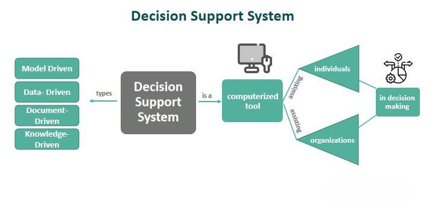

The Aegis System Barra in algorithmic trading represents a significant advancement in the field of investment and portfolio management. This system integrates sophisticated risk modeling and portfolio optimization techniques to assist traders and investors in maximizing returns while managing potential risks. Algorithmic trading has transformed the landscape of modern financial markets, offering traders the ability to execute large-scale trades with precision and minimal human intervention. This article explores the Aegis System Barra, a tool that enhances the capabilities of algorithmic trading through comprehensive risk analysis and strategic insights.

In the ever-evolving financial markets, algorithmic trading systems like the Aegis System Barra offer an edge by incorporating advanced analytical models. These models assess and mitigate risks, enabling traders to make informed decisions quickly and efficiently. The system's design focuses on integrating multifactor risk models, regression techniques, and data analysis, essential components in establishing effective trading strategies. By facilitating such data-driven methodologies, the Aegis System Barra ensures traders maintain a balanced approach between risk and return.

This article provides a detailed overview of the Aegis System Barra and its impact on algorithmic trading. The tool's main feature is its utilization of multifactor risk models. These models dissect complex market data into actionable insights, helping traders focus on strategies that balance potential returns against anticipated risks. Moreover, the system's emphasis on regression techniques allows for the estimation of expected returns, providing a backbone for strategic planning.

Understanding the tools and methodologies behind the Aegis System Barra can significantly benefit traders who seek to enhance their algorithmic trading setups. Incorporating an advanced system like Aegis Barra into trading strategies can lead to robust risk management and increased precision in decision-making. Thus, traders are enabled to optimize their portfolios effectively, achieving greater operational efficiency and maximizing returns.

## Table of Contents

## Understanding the Aegis System Barra

The Aegis System Barra is an advanced portfolio management tool designed to analyze and optimize investments through a multifactor risk model. This system forms a cornerstone for traders seeking to evaluate risk factors in both individual securities and comprehensive portfolios. By leveraging rigorous data analysis and modeling techniques, the Aegis System Barra provides a structured approach to understanding market dynamics.

At the heart of the Aegis System Barra is its use of regression models to generate monthly expected returns. These models are crucial for developing effective investment strategies. Expected returns are calculated by assessing the relationships between various risk factors and actual security returns. The use of regression allows the system to provide a statistical basis for predicting future performance, thereby helping traders in strategizing their investments.

The system's methodology encompasses several types of data, including fundamental, expectations, and [momentum](/wiki/momentum)-based information. The integration of these different datasets allows traders to employ a variety of trading strategies without being confined to a single approach. For example, fundamental data might include company financials, while momentum data could analyze price trends. This comprehensive approach ensures that traders can accommodate a broader scope of market information.

The primary purpose of the Aegis System Barra is to balance portfolios by attributing returns to various risk factors. This attribution aids in informed decision-making by providing clarity on the source of portfolio returns and the risks potentially affecting them. By understanding which factors are driving performance, traders can adjust their portfolios to enhance returns while managing risks.

In mathematical terms, the multifactor model employed by Aegis System Barra can be represented as:

$$
R_{i,t} = \alpha_i + \beta_{i1}F_{1,t} + \beta_{i2}F_{2,t} + \ldots + \beta_{ik}F_{k,t} + \epsilon_{i,t}
$$

Where:
- $R_{i,t}$ is the expected return of asset $i$ at time $t$
- $\alpha_i$ is the intercept term for asset $i$
- $\beta_{ik}$ is the sensitivity of asset $i$ to factor $k$
- $F_{k,t}$ represents the factor $k$ at time $t$
- $\epsilon_{i,t}$ is the error term for asset $i$ at time $t$

This equation captures the contribution of various factors (e.g., market, size, value) to the return of a security, enabling a granular analysis that is crucial for robust portfolio management. Through this multifactor approach, the Aegis System Barra supports traders in developing a nuanced understanding of market influences, leading to more strategic and well-informed investment decisions.

## Benefits of Using Aegis System Barra in Algorithmic Trading

The Aegis System Barra offers significant benefits to traders engaging in [algorithmic trading](/wiki/algorithmic-trading) through its ability to provide detailed evaluations of risk and return. This capability is crucial for traders who aim to identify valuable trading strategies while minimizing their exposure to risk. By integrating multifactor risk assessments, the system allows traders to gain a nuanced understanding of market dynamics. This enables the creation of diversified portfolios that can withstand various market conditions.

One of the key advantages of the Aegis System Barra is its enhancement of operational efficiency. By streamlining data analysis, it allows traders to react swiftly to market changes, significantly reducing the time required for decision-making processes. The system's efficiency is rooted in its ability to process and analyze vast amounts of data rapidly, facilitating quick adjustments to trading strategies based on real-time market information.

The system's multifactor risk model is particularly beneficial for understanding and managing market [volatility](/wiki/volatility-trading-strategies). By incorporating a wide range of data—historical and real-time—the system supports the development of adaptive trading strategies that can respond to fluctuations in market conditions. This adaptability ensures that trading strategies remain robust amid varying levels of market volatility, thus safeguarding against potential adverse effects.

Furthermore, the integration of advanced analytics and data-driven insights into the Aegis System Barra empowers traders to optimize their trading performance. By leveraging these analytics, traders can enhance their strategies with greater precision and accuracy. Data-driven insights provided by the system facilitate informed decision-making, allowing traders to maximize their returns while maintaining a balanced risk-reward ratio.

In summary, the Aegis System Barra's ability to assess risk with granular precision, streamline data analysis processes, and integrate adaptive strategies stands out as a powerful tool in the field of algorithmic trading. Its comprehensive approach enables traders to maintain competitiveness in rapidly changing markets by offering informed, strategic, and efficient trading solutions.

## How Aegis System Barra Enhances Decision-Making

The Aegis System Barra significantly enhances decision-making processes in algorithmic trading by leveraging its core functionality: projecting expected returns. This capability is vital for strategic planning, allowing traders to make informed decisions in a constantly evolving market environment. By analyzing diverse factors, such as beta, momentum, and earnings forecasts, the system provides traders with critical insights into market trends, enabling them to adjust their strategies in a timely manner. 

To better understand this process, consider the role of **beta** in assessing a security's sensitivity relative to overall market movements. The Aegis System Barra utilizes this metric, along with momentum indicators and earnings projections, to predict market directions and potential shifts. This comprehensive analysis facilitates the anticipation of favorable or adverse market conditions, aligning investment strategies with evolving trends.

The multifactor model employed by the system plays a crucial role in evaluating and mitigating systematic risks. By considering various systemic influences on a portfolio, the model helps traders make more precise investment and divestment decisions, effectively balancing portfolios to maintain stability. This multifactor approach allows for a holistic view of risk factors, ensuring that traders are both proactive and reactive to market changes.

In addition, the Aegis System Barra possesses robust scenario analysis capabilities. This feature enables users to simulate a wide array of market conditions and assess their likely impacts on portfolio returns. For example, by inputting historical data and adjusting variables to mimic different economic climates, traders can forecast potential outcomes and adjust their portfolios accordingly. This approach assists in preparing for market volatility and enables strategic reallocation of assets to mitigate potential losses.

Furthermore, the nuanced risk analysis provided by the Aegis System Barra ensures that traders can maintain a balanced risk-reward ratio. By thoroughly understanding the interplay of different risk factors, traders can pursue strategies that maximize returns while keeping risk exposure within acceptable bounds. This balance is crucial for achieving long-term, sustainable financial health in trading operations. The ability to manage this equilibrium effectively demonstrates the system’s transformative impact on algorithmic trading decision-making processes.

## Case Study: Application of Barra Aegis System

The application of the Barra Aegis System in constructing a portfolio using United States Expected Returns (USER) data provides a compelling demonstration of its strategic advantages. This case study focuses on leveraging the Barra Aegis System to align portfolio construction with expected market conditions, thus generating promising returns while efficiently managing risks over a specified period.

To begin with, the study utilized historical USER data to inform the risk modeling process intrinsic to the Barra Aegis System. This integration enabled a comprehensive risk-return optimization analysis, facilitating the construction of a robust portfolio tailored to anticipated market behaviors. The system's multifactor risk model played a pivotal role here, as it was used to quantify various contributing risk factors, providing an in-depth understanding of each potential investment's risk exposure. 

Key to the system's effectiveness was its ability to apply regression analysis in forecasting expected returns and assessing relevant risk factors. Regression techniques served as a cornerstone for identifying trends within the USER data, enabling precise estimation of future portfolio returns. This quantitative approach allowed for the adjustment of investment positions in response to predicted shifts, enhancing the decision-making process.

Moreover, the Barra Aegis System's capacity to adapt to diverse market climates was highlighted through this study. Its integration of USER data, combined with sophisticated risk modeling, underscored its versatility in portfolio optimization. By simulating different economic scenarios, the system showcased its strength in recalibrating portfolio composition dynamically in response to changing market dynamics, ensuring sustained performance.

In conclusion, this case study exemplifies the effectiveness of the Aegis System Barra in portfolio optimization. By harnessing USER data and sophisticated risk analytics, it optimizes algorithmic trading strategies to deliver reliable returns and adapt to evolving market conditions. This approach underscores the system's integral role in enhancing the precision and adaptability of trade execution, providing a strategic advantage in the algorithmic trading domain.

## Conclusion

The Aegis System Barra represents a transformative advancement in algorithmic trading, fundamentally changing traders' methods for addressing risk management and portfolio construction. Its sophisticated integration of multifactor models enables traders to consider various influences on asset performance, providing a comprehensive view of potential returns grounded in robust risk analysis. This capability is crucial for making informed strategic decisions, a necessity in the fast-paced environment of automated trading.

The system's advanced features allow traders to refine their operational strategies significantly, thus improving the accuracy and efficiency of executing trades. Specifically, the Aegis System Barra aids in optimizing trade execution through effective data analysis, enabling traders to respond swiftly to market movements. By doing this, it enhances profitability while maintaining a keen focus on risk minimization.

Looking towards the future, algorithmic trading is poised to benefit from further advancements in technologies reminiscent of those epitomized by the Aegis System Barra. As trading solutions evolve, they promise to introduce even more sophisticated tools, providing traders with refined methods to tackle market complexities. This continual innovation underscores a progressive shift towards more adaptive and resilient trading frameworks that leverage cutting-edge technology.

Ultimately, the Aegis System Barra exemplifies the pivotal role technology plays in navigating intricate financial landscapes. It maximizes returns while minimizing risks, underscoring its essential contribution to modern trading practices. Through such robust systems, traders can achieve new levels of success, guided by insights derived from advanced analytical techniques and comprehensive risk assessments.

## References & Further Reading

[1]: ["Advances in Financial Machine Learning"](https://www.amazon.com/Advances-Financial-Machine-Learning-Marcos/dp/1119482089) by Marcos Lopez de Prado

[2]: ["Evidence-Based Technical Analysis: Applying the Scientific Method and Statistical Inference to Trading Signals"](https://www.amazon.com/Evidence-Based-Technical-Analysis-Scientific-Statistical/dp/0470008741) by David Aronson

[3]: ["Machine Learning for Algorithmic Trading"](https://github.com/stefan-jansen/machine-learning-for-trading) by Stefan Jansen

[4]: ["Quantitative Trading: How to Build Your Own Algorithmic Trading Business"](https://books.google.com/books/about/Quantitative_Trading.html?id=j70yEAAAQBAJ) by Ernest P. Chan

[5]: ["The Econometrics of Financial Markets"](https://web.mit.edu/~alo/www/Books/efm_desc.html) by John Y. Campbell, Andrew W. Lo, and A. Craig MacKinlay

[6]: Fama, Eugene F. and French, Kenneth R. (1993). ["Common Risk Factors in the Returns on Stocks and Bonds."](https://people.hec.edu/rosu/wp-content/uploads/sites/43/2023/09/Fama-French-Common-risk-factors-1993.pdf) Journal of Financial Economics. 33(1), 3-56.