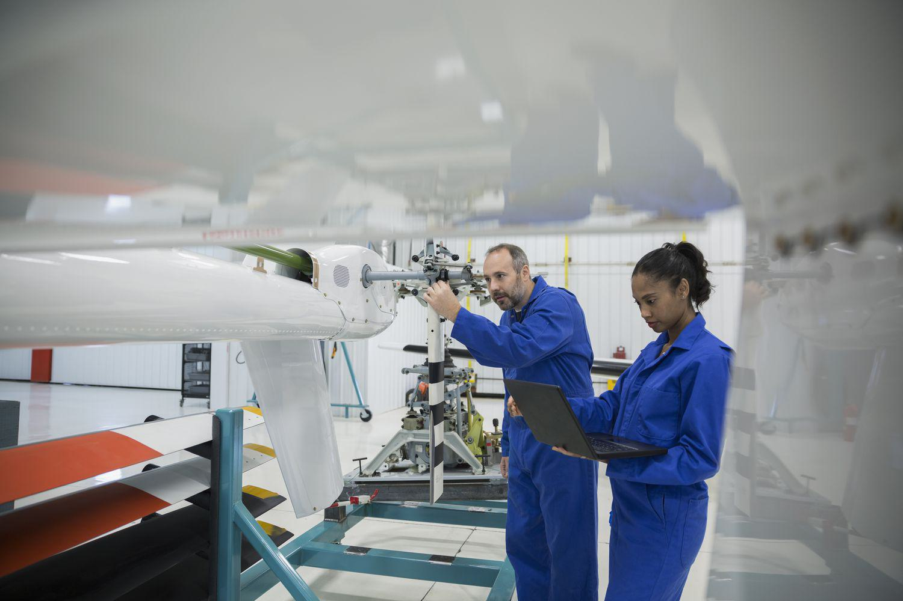

In the fast-evolving landscape of modern industries, aerospace and algorithmic trading are two sectors that have grown significantly and have demonstrated a profound impact on global markets. Aerospace, with its rich history, has transformed from modest beginnings to a multi-faceted industry encompassing military, commercial, and private aviation. Algorithmic trading, on the other hand, has revolutionized financial markets by automating trade execution through sophisticated algorithms.

Aerospace's history can be traced back to the early 20th century when pioneers like the Wright Brothers achieved the first powered flight in 1903, setting the stage for a century of technological advancements that included jet propulsion, space exploration, and the development of a global aviation industry. Today, aerospace continues to evolve with innovations in unmanned systems, sustainable fuels, and space tourism, reflecting its ongoing significance.



Similarly, algorithmic trading has a notable history rooted in the technological advancements of the 1970s, with the introduction of electronic trading platforms. This sector has expanded rapidly, offering advantages in speed, accuracy, and efficiency. High-frequency trading, a subset of algorithmic trading, exemplifies this transformation, executing trades at millisecond intervals.

Understanding the historical development and the impact of these sectors helps provide insights into their future directions. By examining their past, stakeholders can better anticipate future advancements and challenges, recognizing the pivotal role of innovation and technology in shaping their trajectories. This article will explore the evolution and significance of aerospace sub-sectors and algorithmic trading, highlighting their enduring influence on global industries.

## Table of Contents

## History of the Aerospace Sector

The aerospace sector, a cornerstone of technological advancement and innovation, spans various subsectors dedicated to military, commercial, and private aviation. Originating in the early 20th century, the U.S. aerospace industry owes its inception to the Wright Brothers, who achieved the first powered flight in 1903. This pivotal moment set the stage for exponential growth and development, fundamentally altering transportation and warfare.

Throughout the decades, the aerospace industry has been characterized by significant technological progress. The introduction of jet engines during the 1940s marked a revolutionary advancement, enabling aircraft to achieve higher speeds and altitudes than ever before, thus transforming both military and commercial aviation. The jet era not only enhanced efficiency and performance but also expanded the accessibility and appeal of air travel, laying a foundation for the global aviation network we recognize today.

In 1958, the establishment of the National Aeronautics and Space Administration (NASA) further propelled the aerospace sector into new frontiers. NASA's formation signified a commitment to explore beyond Earth's atmosphere, culminating in monumental achievements such as the Apollo moon landing in 1969. This era of space exploration underscored the scientific and strategic importance of aerospace advancements, fostering international collaboration and competition.

As the industry matured, focus expanded to include innovations in unmanned systems, alternative fuels, and space tourism. Unmanned aerial vehicles (UAVs), commonly known as drones, have become increasingly significant in both civilian and military applications, offering versatility in fields ranging from agriculture to surveillance. The pursuit of alternative fuels reflects a growing environmental consciousness, driving research into sustainable aviation fuel options that reduce carbon emissions and mitigate climate impact.

Moreover, the dawn of space tourism represents the latest evolution within aerospace, with private companies competing to make space travel accessible beyond governmental initiatives. This burgeoning sector promises to redefine human interaction with space, extending the boundaries of exploration and commerce.

In summary, the evolution of the aerospace sector is marked by a sequence of technological milestones and strategic initiatives. From the Wright Brothers' pioneering flight to contemporary innovations in unmanned systems and space tourism, the industry continues to adapt and expand, promising a dynamic future of technological progress and exploration.

## Aerospace Subsectors

The aerospace industry is a multifaceted sector comprising various subsectors, each fulfilling specific roles and needs. These include military aircraft, commercial aviation, space exploration, unmanned systems, and airport infrastructure, and aviation security.

Military Aircraft: This subsector plays a crucial role in national defense strategies, supplying fighter jets, bombers, and transport aircraft to military forces globally. Key manufacturers, such as Lockheed Martin, Boeing, and Northrop Grumman, are continuously innovating to enhance the maneuverability, stealth, and payload capacity of these aircraft. Recent advancements in materials like composite structures and propulsion systems have significantly increased the efficiency and effectiveness of military aircraft.

Commercial Aviation: This subsector forms the backbone of global passenger and cargo transport. It primarily includes airlines and commercial aircraft manufacturing companies like Airbus and Boeing. Over recent decades, the commercial aviation industry has witnessed a surge in demand due to increased globalization and tourism. Technological advancements have led to the development of more fuel-efficient engines and the use of lightweight materials, reducing operating costs and environmental impact. Moreover, the advent of low-cost carriers has democratized air travel, making it accessible to a larger population.

Space Exploration: The space exploration subsector encompasses the development of spacecraft, satellites, and related technologies. Organizations such as NASA, SpaceX, and ESA play a pivotal role in expanding our understanding of the cosmos and enhancing global communications. Satellites launched into orbit facilitate GPS navigation, weather forecasting, and telecommunication services. The ongoing international interest in space has led to aspirations beyond Earth's orbit, including manned missions to Mars and the establishment of lunar bases.

Unmanned Systems: Also known as drones, unmanned systems are becoming increasingly vital in civilian and military applications. Used for reconnaissance, surveillance, and even delivery services, these systems are valued for their capability to operate in environments deemed risky for human pilots. Technological advancements in [artificial intelligence](/wiki/ai-artificial-intelligence) and sensor integration have increased their efficiency and operational range. Companies like DJI and General Atomics are leading the way in producing innovative solutions tailored to diverse industry needs.

Airport Infrastructure and Aviation Security: This subsector focuses on creating robust systems to manage the growing demand for air travel. It incorporates the development of advanced security measures and the enhancement of airport facilities. The implementation of biometric systems, cybersecurity measures, and efficient traffic management solutions are pivotal in ensuring passenger safety and smooth airport operations. Additionally, infrastructure expansion projects aim to accommodate the forecasted increase in air traffic, driven by the rapid growth of urban centers and the commercial aviation industry.

Together, these subsectors form a comprehensive ecosystem that supports the rapid advancement and expansion of the aerospace industry, each contributing to its dynamic growth and addressing both current and future needs.

## The Rise of Algorithmic Trading

Algorithmic trading has become a cornerstone of modern financial markets, fundamentally altering how trades are executed. This methodology employs computer algorithms to determine trading strategies and execute orders for stocks, currencies, and other financial instruments. The origins of [algorithmic trading](/wiki/algorithmic-trading) can be traced back to the 1970s with the advent of electronic trading platforms, which paved the way for automation in financial transactions. These platforms allowed traders to surpass the traditional manual processes, leading to a significant reduction in execution time and increasing the efficiency of operations.

As technology advanced, the adoption of algorithmic trading systems grew exponentially. They provided unparalleled advantages in terms of speed and accuracy, and they minimized the likelihood of human errors typically associated with manual trading. The use of algorithms enables the execution of orders based on pre-determined criteria, such as timing, price, and [volume](/wiki/volume-trading-strategy). This approach is particularly beneficial in high-frequency trading ([HFT](/wiki/high-frequency-trading-strategies)), a prominent subset of algorithmic trading. HFT is characterized by a high turnover rate, with algorithms designed to initiate and [exit](/wiki/exit-strategy) positions within fractions of a second. Trades in HFT are often executed in milliseconds, emphasizing the importance of speed and computational power.

Algorithmic trading systems harness various quantitative models and statistical techniques to analyze vast datasets and identify lucrative trading opportunities. For instance, moving averages, statistical [arbitrage](/wiki/arbitrage), and [machine learning](/wiki/machine-learning) algorithms are frequently employed to make data-driven decisions. Python has become a preferred language for developing these algorithms, thanks to its extensive libraries and frameworks tailored for quantitative finance, such as NumPy, pandas, and Scikit-learn.

The impact of algorithmic trading is profound, contributing to increased market [liquidity](/wiki/liquidity-risk-premium) and tighter bid-ask spreads. On the flip side, it also introduces complexities and potential risks, including market [volatility](/wiki/volatility-trading-strategies) and the occurrence of flash crashes, where prices drop precipitously and recover rapidly. Nevertheless, the continuous evolution of algorithmic trading, propelled by advancements in artificial intelligence and machine learning, signals a dynamic and rapidly evolving future for financial markets.

## Impact of Algorithmic Trading on Markets

Algorithmic trading has become a cornerstone of modern financial markets due to its ability to enhance market liquidity and efficiency. By leveraging computer algorithms to automatically execute trades, algorithmic trading minimizes human intervention, leading to more streamlined transactions and reduced costs. This form of trading allows for high-frequency trading (HFT), where large volumes of trades are executed in mere milliseconds. This speed and precision contribute significantly to market liquidity, enabling traders to buy or sell a security without causing a significant change in its price.

However, algorithmic trading is not without its challenges. One of the most notable issues is increased market volatility, which can be exemplified by events known as flash crashes. A flash crash refers to a very rapid, deep, and volatile fall in security prices occurring within an extremely short time period and followed by a swift recovery. The flash crash of May 6, 2010, is a case in point, where the Dow Jones Industrial Average plunged about 1,000 points within minutes, but then quickly recovered. Such events highlight the potential risks associated with automated trading strategies which, if poorly designed, can amplify sudden price swings in the market.

Regulatory bodies are continuously working to adapt to these challenges by introducing measures to ensure market integrity. For instance, circuit breakers and trading curbs have been implemented to temporarily halt trading in instances of extreme volatility, allowing time for human intervention and assessment. Moreover, regulators are keen on increasing transparency and strengthening the oversight of algorithmic trading practices to mitigate potential systemic risks.

Looking ahead, artificial intelligence (AI) and machine learning are poised to further revolutionize algorithmic trading. These technologies have the potential to improve decision-making processes by analyzing vast datasets in real-time, identifying complex patterns, and adapting trading strategies dynamically. Machine learning models can optimize trade execution strategies by learning from past data and adjusting their parameters to current market conditions, potentially reducing the risk of human biases and errors. 

Python, a preferred language in this domain due to its powerful libraries like NumPy, Pandas, and scikit-learn, can be used to develop and test machine learning models for algorithmic trading. Below is a simple example of how one might use Python to optimize a trading strategy using historical market data:

```python
import pandas as pd
from sklearn.model_selection import train_test_split
from sklearn.ensemble import RandomForestClassifier

# Load historical market data
data = pd.read_csv('market_data.csv')

# Feature engineering
data['Price_Movement'] = data['Close'] - data['Open']
features = data[['Open', 'High', 'Low', 'Volume']]
target = (data['Price_Movement'] > 0).astype(int)

# Train-test split
X_train, X_test, y_train, y_test = train_test_split(features, target, test_size=0.2, random_state=42)

# Train a machine learning model
model = RandomForestClassifier(n_estimators=100, random_state=42)
model.fit(X_train, y_train)

# Evaluate model performance
accuracy = model.score(X_test, y_test)
print(f"Model Accuracy: {accuracy * 100:.2f}%")
```

Such advancements in AI and machine learning highlight the continuous evolution of algorithmic trading, indicating a future where trading systems become even more sophisticated and resilient.

## Conclusion

The historical developments of both the aerospace and algorithmic trading sectors showcase the essential role of innovation and technology in driving progress. In aerospace, milestones such as the invention of jet engines and the advancement of space exploration have distinctly altered global connectivity and scientific knowledge. Algorithmic trading, with roots in electronic trading platforms of the 1970s, has transformed financial markets by introducing unprecedented efficiency and speed.

As these industries continue to evolve, they present both opportunities and challenges. Aerospace faces the demand for sustainable technologies and enhanced safety measures, especially as the sector expands into unmanned aerial systems and space tourism. Meanwhile, algorithmic trading must address issues like market stability and regulatory compliance, especially as high-frequency trading and AI-driven strategies become more prevalent.

Understanding the historical context and impact of these sectors equips stakeholders to better anticipate future developments. In aerospace, for instance, understanding past advancements can aid in the smooth integration of alternative fuels and the development of sustainable aircraft. Similarly, comprehension of algorithmic trading's progression can assist in navigating new regulations and technological innovations, such as machine learning applications that optimize algorithms for better market predictions.

The ongoing interaction between technological advancements and industry demands will significantly influence the future directions of these sectors. Stakeholders who remain informed and adaptable to rapid technological shifts will likely capitalize on emerging trends while effectively managing associated risks.

## References & Further Reading

[1]: ["The Wright Brothers: How They Invented the Airplane"](https://archive.org/details/wrightbrothers00russ) by Russell Freedman

[2]: Bilstein, R. E. (1996). ["Flight in America: From the Wrights to the Astronauts"](https://archive.org/details/flightinamericaf00bils) (3rd edition). Johns Hopkins University Press.

[3]: Montgomery, D. C. (1996). ["NASA Historical Data Book, Volume I: NASA Resources - 1958-1968"](https://archive.org/details/nasahistoricalda0005unse). NASA.

[4]: Aldridge, B. D. (2010). ["Jet Age: The Comet, the 707, and the Race to Shrink the World"](https://archive.org/details/jetagecomet707ra0000verh) by Sam Howe Verhovek

[5]: Narang, R. K. (2012). ["Inside the Black Box: A Simple Guide to Quantitative and High Frequency Trading"](https://onlinelibrary.wiley.com/doi/book/10.1002/9781118662717) by Rishi K. Narang

[6]: Hendershott, T., Jones, C. M., & Menkveld, A. J. (2011). ["Does Algorithmic Trading Improve Liquidity?"](https://onlinelibrary.wiley.com/doi/full/10.1111/j.1540-6261.2010.01624.x) Review of Financial Studies, 24(5), 1465–1489.

[7]: Cartea, Á., Jaimungal, S., & Penalva, J. (2015). ["Algorithmic and High-Frequency Trading"](https://assets.cambridge.org/97811070/91146/frontmatter/9781107091146_frontmatter.pdf). Cambridge University Press.

[8]: Campbell-Kelly, M. (2009). ["The Rise of Computerized High-Frequency Trading: Use and Controversy"](https://scholarship.law.duke.edu/dltr/vol9/iss1/15/). IEEE Annals of the History of Computing, 31(1), 79-82.