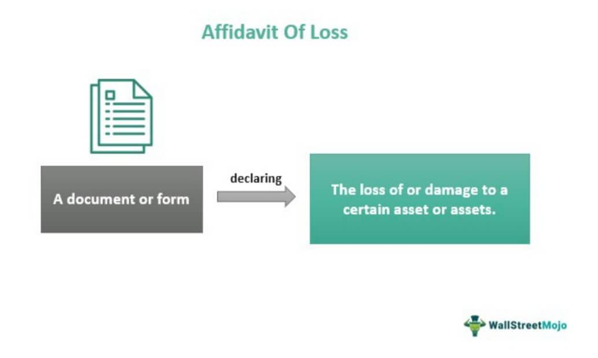

The digital transformation has revolutionized the way legal and financial transactions are executed, creating new challenges and opportunities. In this evolving landscape, the affidavit of loss emerges as a crucial legal instrument. This document becomes indispensable, particularly as it intersects with advanced fields such as algorithmic trading. The affidavit of loss is a formal sworn statement that declares the unintentional loss, theft, or destruction of important documents or assets, often acting as a prerequisite for obtaining replacements or indemnifications. 

In this article, we explore the legal significance of affidavits of loss and their relevance in algorithmic trading environments. With the advent of digital trading platforms, ensuring the completeness and authenticity of legal documentation is critical to safeguarding interests. Traders and investors increasingly encounter situations where affidavits of loss play a pivotal role in maintaining operations, especially when faced with the loss of essential securities or financial records.

Recognizing the strategic importance of these documents is essential not only for traders and investors but also for legal professionals who navigate the intricacies of digital and financial frameworks. This discussion will highlight the significant intersections between legal processes and financial management, providing clarity on how to handle lost securities and assets through the use of affidavits. As digital technologies continue to advance, understanding these intersections equips market participants with the tools to manage risks and secure financial interests effectively.

## Table of Contents

## Understanding the Affidavit of Loss

An affidavit of loss is a formal legal document that a person uses to declare the loss, theft, or destruction of an important document or asset. Common examples include stock certificates, property deeds, or even cashier's checks. The primary purpose of this affidavit is to provide a recorded statement of the loss, which typically acts as a prerequisite for obtaining a replacement or seeking indemnification.

The affidavit of loss must include all pertinent information to facilitate the legal tracking and recovery of the missing asset. This often involves detailing unique identifiers such as serial numbers, dates of issuance, and any other relevant attributes that distinguish the lost item. Including such detailed information helps in establishing a clear record, which is crucial not only for recovery purposes but also for preventing fraudulent claims that may arise from the misuse of the lost item.

The legal significance of this document is underscored by its role in protecting both the individual who has lost the document and the institution or entity responsible for replacing or indemnifying the loss. By filing an affidavit of loss, the affiant (the person making the declaration) formally acknowledges the loss and initiates a structured process towards resolution. This involves the potential recovery of the asset or obtaining a replacement, thereby reestablishing rights that were predicated on the originally issued document.

However, it is essential to recognize that the legal requirements for affidavits of loss can differ substantially depending on the jurisdiction. Each jurisdiction may have specific mandates regarding the content, format, or procedural steps involved in filing such affidavits. For instance, some jurisdictions may require the affidavit to be notarized to confirm the authenticity of the statement, adding an additional layer of legal credibility and enforceability. Therefore, individuals and legal professionals must be well-versed in local regulations to ensure compliance and to expedite the recovery process efficiently.

## Legal Use Cases for Affidavits of Loss

Affidavits of loss serve as a critical legal instrument across numerous scenarios where official documents or assets are misplaced, stolen, or destroyed. These affidavits are crucial in situations extending beyond securities, encompassing lost passports, academic diplomas, and property titles. Their role is to formalize the report of loss and create a legal pathway for reissuance or replacement of essential documents.

In the financial market, affidavits of loss are indispensable for the recovery of lost securities—a process vital for maintaining the integrity of investment portfolios in events of theft or physical destruction. Such securities could include stock certificates, bonds, or other financial instruments that require legal documentation for reinstatement. When an affidavit of loss is submitted, it provides the legal grounding needed to issue new certificates, ensuring that market participants can continue their investment activities without disruption.

Beyond securities, affidavits are instrumental in the replacement of vehicle titles. If a car owner's title is lost or stolen, an affidavit of loss allows the individual to declare this formally, enabling the issuance of a new document. This process is essential to confirm ownership and prevent any potential fraudulent activity associated with stolen vehicle titles.

Additionally, affidavits are applicable in the context of lost financial instruments such as promissory notes. These documents are legally binding instruments that acknowledge a debt and specify the terms of repayment. If such a note is lost, an affidavit of loss becomes necessary to prevent misuse and reestablish the rightful claim to the underlying obligation.

For legal professionals, having a comprehensive understanding of the applications of affidavits of loss is crucial. It empowers them to accurately advise clients on recovering assets and ensures a smooth navigation through the complexities of asset management and recovery. By leveraging the legal framework provided by affidavits, clients can reassert their ownership rights and secure reissuance of lost or damaged documents, thus protecting their interests.

Ultimately, the affidavit of loss acts as a foundational document to reaffirm ownership and protect legal rights over missing assets. It ensures that individuals and entities can rectify the impact of lost documents efficiently and maintain continuity in legal and financial engagements.

## Algorithmic Trading and Financial Documentation

Algorithmic trading, a methodology utilizing computer programs to execute trading strategies automatically, is highly dependent on precise financial data and documentation. Within this domain, the affidavit of loss emerges as an essential legal instrument, particularly when there are missing financial records. This document serves as a fundamental safeguard, ensuring that all securities and associated documentation remain accounted for, thus preventing disruption to trading algorithms and strategies.

For traders, ensuring that all securities and related documents are intact is paramount. Missing documentation can lead to significant issues, such as the inability to execute trades correctly or at all. This can have a ripple effect, causing disruptions that may affect not only individual trading strategies but also the broader market. Algorithmic trading systems are designed to operate on highly accurate inputs; any discrepancies or missing information can lead to errors in trade execution, impacting both profitability and compliance.

Financial institutions, responsible for maintaining the integrity of trading operations, often require affidavits of loss to resolve issues arising from lost or misplaced securities. These affidavits allow institutions to identify and rectify such issues promptly, enabling them to continue operations without significant interruption. By utilizing affidavits, institutions can navigate potential legal and financial complexities, reducing the risk of fraud or unauthorized trading activity.

The integrity of financial documents is critical to ensuring both the effectiveness and legality of trading operations. Inaccurate or absent documentation can expose traders and institutions to legal challenges and financial losses. The affidavit of loss provides a structured legal approach to mitigate these risks. By documenting and substantiating the loss of financial records, it establishes a formal process to address discrepancies, thus protecting traders and financial institutions from fraudulent activities.

Furthermore, [algorithmic trading](/wiki/algorithmic-trading) systems, typically relying on complex data inputs and outputs, require a robust framework for handling document losses. The affidavit of loss complements this framework by enabling traders and institutions to formally document and recover missing records. This legal underpinning not only facilitates continued trading operations but also enhances the overall trust and resilience of the financial markets.

In summary, the integration of affidavits of loss within the workflow of algorithmic trading highlights the critical interplay between legal documentation and data integrity. It ensures that trading strategies operate smoothly and legally, safeguarding against potential disruptions and fraudulent claims. As financial systems continue to evolve towards more automated and digitized processes, the capacity to efficiently address documentation issues through affidavits of loss will remain indispensable.

## Drafting and Notarizing an Affidavit of Loss

Drafting a robust affidavit of loss requires meticulous attention to detail and accuracy. It begins with a comprehensive description of the lost item, including unique identifiers such as serial numbers, issue dates, and any other distinguishing marks. This information is pivotal to preventing delays and legal complications that may arise due to missing or inaccurate details. The affidavit must clearly state the circumstances under which the item was lost, stolen, or destroyed, offering a transparent account to support the claim.

The role of a notary public is crucial in this process. Notarization adds a layer of legal credibility and enforceability to the document. The notary public is responsible for verifying the identity of the affiant—the person making the affidavit—and ensuring the authenticity of the document. This involves checking the affiant's identification and witnessing the signing of the affidavit, which helps deter potential fraud.

When drafting an affidavit of loss, it is essential to consider jurisdiction-specific legal requirements. Different regions may have varying stipulations regarding the content and formalization of affidavits. Compliance with these requirements ensures the affidavit’s validity and acceptability in legal or financial proceedings.

For professionals in trading or financial management, a thorough understanding of the legal draft process for affidavits of loss is vital. This knowledge assists in protecting the interests of clients by facilitating the recovery of lost assets, preventing misuse, and maintaining operational efficiency. Being well-versed in drafting precise and compliant affidavits can help professionals effectively manage the complexities associated with document loss.

## Conclusion

Affidavits of loss play a critical role in supporting individuals and businesses in reclaiming lost or destroyed documents. They are particularly significant in algorithmic trading, where maintaining the integrity of trading systems and financial operations is paramount. By providing a structured and legally recognized method for declaring and responding to lost documents, affidavits of loss help prevent fraudulent claims from undermining financial procedures and ensure the smooth recovery of critical assets.

As digital and financial landscapes continue to shift and expand, the importance of understanding the intersection of legal documents and digital assets becomes more pronounced. The digital era demands a swift and accurate response to document loss, emphasizing the necessity for traders, investors, and financial professionals to be well-versed in utilizing affidavits of loss effectively.

Preparing for potential document losses is a vital component of forward-thinking trading strategies. Establishing a robust process for the recovery of lost documents not only streamlines operations but also fortifies financial systems against unexpected disruptions. As such, future-proofing trading activities involves not only the implementation of advanced technology but also the diligent management of legal and financial documentation.

## References & Further Reading

[1]: ["Affidavits of Loss - Legal Document Details," Investopedia](https://www.investopedia.com/terms/a/affidavit_of_loss.asp)

[2]: Myers, C. F. (2003). ["The Handbook of Electronic Trading"](https://www.semanticscholar.org/paper/Financing-of-corporations-Myers/1a2f89a52e7bcc22f45cfa8be462a433d23cc6b0). McGraw-Hill. 

[3]: Murphy, J. (1999). ["Technical Analysis of the Financial Markets: A Comprehensive Guide to Trading Methods and Applications"](https://archive.org/details/technicalanalysi0000murp) New York Institute of Finance.

[4]: Lopez de Prado, M. (2018). ["Advances in Financial Machine Learning"](https://www.amazon.com/Advances-Financial-Machine-Learning-Marcos/dp/1119482089). Wiley.

[5]: Chan, E. P. (2009). ["Quantitative Trading: How to Build Your Own Algorithmic Trading Business"](https://github.com/ftvision/quant_trading_echan_book). Wiley Trading Series.