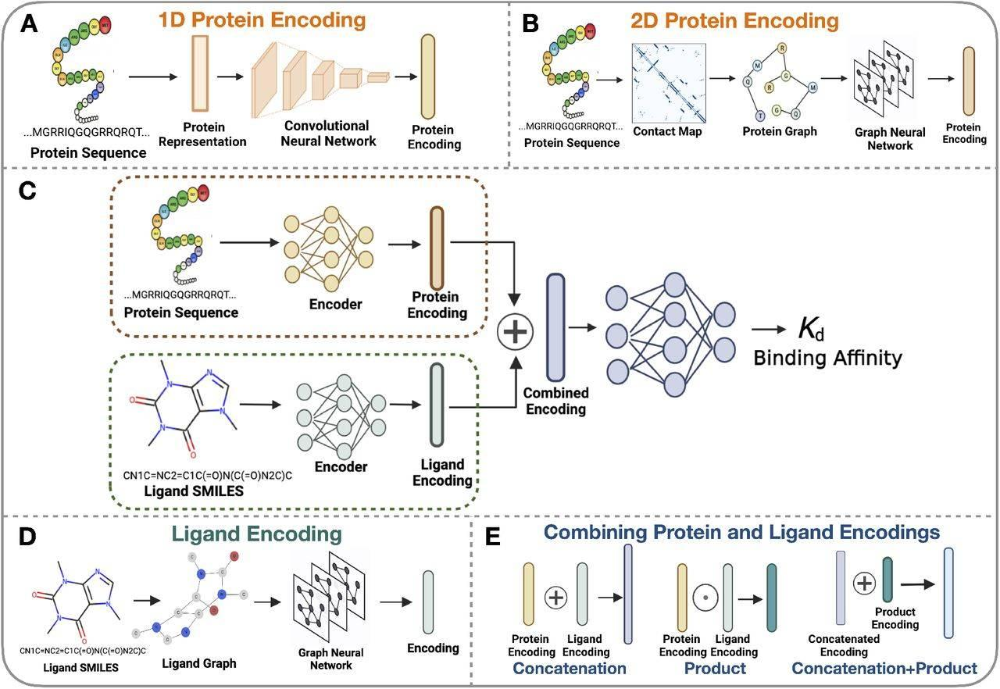

## Table of Contents

## What is an affinity function in the context of machine learning?

An affinity function in machine learning is a way to measure how similar or related two data points are. It's like giving a score to show how close or connected two things are. Imagine you have a bunch of pictures, and you want to know which ones look alike. The affinity function helps by calculating a number that tells you how similar two pictures are, based on things like color, shape, or other features.

In more technical terms, an affinity function often uses a mathematical formula to compute the similarity between data points. For example, a common affinity function is the Gaussian kernel, which looks like this: $$ \text{affinity}(x, y) = \exp\left(-\frac{\|x - y\|^2}{2\sigma^2}\right) $$. Here, $x$ and $y$ are two data points, and $\sigma$ is a parameter that controls how quickly the similarity drops off as the distance between $x$ and $y$ increases. This function is useful in algorithms like spectral clustering, where understanding the relationships between data points is crucial for grouping them effectively.

## How do affinity functions contribute to the performance of machine learning models?

Affinity functions play a crucial role in improving the performance of machine learning models by helping them understand the relationships between data points. When a model needs to group or cluster data, like in spectral clustering, the affinity function calculates how similar two points are. This similarity score helps the model decide which points should be grouped together. For example, if the model is trying to organize pictures of animals, the affinity function can help it figure out that pictures of dogs are more similar to each other than to pictures of cats. By using this information, the model can make better and more accurate groupings.

In addition to clustering, affinity functions are also important in other [machine learning](/wiki/machine-learning) tasks, such as dimensionality reduction and semi-supervised learning. In these cases, the affinity function helps the model understand the underlying structure of the data. For instance, in a task where the model needs to reduce the number of features while keeping important information, the affinity function can guide the model to keep features that are closely related to each other. This leads to more efficient and effective models. Overall, by providing a way to measure similarity, affinity functions enhance the model's ability to learn and make better predictions.

## Can you explain the basic concept of the Embedded Gaussian Affinity function?

The Embedded Gaussian Affinity function is a way to measure how similar two things are in a machine learning model. Imagine you have a bunch of objects, like pictures or data points, and you want to know which ones are alike. The Embedded Gaussian Affinity function helps by calculating a score that shows how connected two objects are. It does this by using a special math formula that looks at how the objects are represented in a space, often called an embedding space.

The formula for the Embedded Gaussian Affinity function is pretty simple but powerful. If you have two objects, let's call them $x$ and $y$, and they are represented by vectors in the embedding space, the affinity between them can be calculated using this formula: $$ \text{affinity}(x, y) = \exp\left(\frac{x^T y}{\sqrt{\|x\|^2 \|y\|^2}}\right) $$. Here, $x^T y$ means the dot product of the vectors $x$ and $y$, and $\|x\|$ and $\|y\|$ are the lengths of these vectors. This formula helps the model see which objects are close to each other in the embedding space, making it easier to group or understand them better.

## What is the difference between Embedded Gaussian Affinity and Embedded Dot Product Affinity?

The Embedded Gaussian Affinity and the Embedded Dot Product Affinity are two different ways to measure how similar two things are in a machine learning model. The Embedded Gaussian Affinity uses a special formula that takes into account not just the direct relationship between two objects but also their sizes. It's like saying, "These two things are similar, but let's also consider how big they are." The formula for the Embedded Gaussian Affinity is $$ \text{affinity}(x, y) = \exp\left(\frac{x^T y}{\sqrt{\|x\|^2 \|y\|^2}}\right) $$. This means it looks at how the objects line up with each other and normalizes it by their lengths, making it good for understanding complex relationships.

On the other hand, the Embedded Dot Product Affinity is simpler and more straightforward. It just looks at how directly related two objects are without considering their sizes. The formula for the Embedded Dot Product Affinity is $$ \text{affinity}(x, y) = x^T y $$. This means it only cares about the dot product of the two objects' vectors, which is a basic way to see how much they point in the same direction. While the Embedded Gaussian Affinity is better for capturing more nuanced relationships, the Embedded Dot Product Affinity is easier to compute and can be good enough for simpler tasks.

## How does the Concatenation Affinity function work and where is it typically applied?

The Concatenation Affinity function is another way to figure out how similar two things are in machine learning. It works by taking the vectors that represent two objects and sticking them together, or concatenating them. Then, it uses a special math trick to turn this long combined vector into a single number that shows how similar the two objects are. The formula for the Concatenation Affinity function is $$ \text{affinity}(x, y) = W^T \cdot \text{concat}(x, y) $$. Here, $W$ is a special vector that helps turn the concatenated vector into a similarity score. This method is useful because it can capture different kinds of relationships between the objects by looking at their combined features.

This type of affinity function is often used in tasks where you want to understand complex relationships between objects. For example, in neural networks that deal with images or text, the Concatenation Affinity function can help the model figure out which parts of different images or texts are similar. It's especially handy in attention mechanisms, where the model needs to focus on certain parts of the input data. By using concatenation, the model can see both objects at the same time and decide how they relate to each other, which can lead to better performance in tasks like image recognition or natural language processing.

## What are the key characteristics of the Gaussian Affinity function?

The Gaussian Affinity function is a popular way to measure how similar two things are in machine learning. It uses a special formula called the Gaussian kernel, which looks like this: $$ \text{affinity}(x, y) = \exp\left(-\frac{\|x - y\|^2}{2\sigma^2}\right) $$. In this formula, $x$ and $y$ are the two things you want to compare, and $\sigma$ is a number that helps control how quickly the similarity drops off as the distance between $x$ and $y$ gets bigger. The function gives a high score when $x$ and $y$ are close to each other and a low score when they are far apart, making it great for tasks like grouping similar data points together.

One key characteristic of the Gaussian Affinity function is that it's smooth and continuous. This means that small changes in the distance between $x$ and $y$ lead to small changes in the similarity score, which can help machine learning models work more smoothly. Another important feature is that it's symmetric, meaning that the similarity score between $x$ and $y$ is the same as the score between $y$ and $x$. This symmetry makes it easier for models to understand and use the relationships between data points, especially in tasks like clustering and dimensionality reduction.

## How do you implement an Embedded Gaussian Affinity function in a neural network?

To implement an Embedded Gaussian Affinity function in a [neural network](/wiki/neural-network), you start by getting the vectors that represent the things you want to compare. These vectors are often called embeddings. You take two embeddings, let's call them $x$ and $y$, and use the formula $$ \text{affinity}(x, y) = \exp\left(\frac{x^T y}{\sqrt{\|x\|^2 \|y\|^2}}\right) $$ to figure out how similar they are. Here, $x^T y$ is the dot product of the two vectors, and $\|x\|$ and $\|y\|$ are their lengths. This formula helps the neural network see which things are closely related in the embedding space.

In a neural network, you can write code to do this calculation. For example, if you're using a programming language like Python with a library like PyTorch, you can implement it like this:

```python
import torch

def embedded_gaussian_affinity(x, y):
    # Compute dot product
    dot_product = torch.matmul(x, y.t())

    # Compute norms
    norm_x = torch.norm(x, dim=1)
    norm_y = torch.norm(y, dim=1)

    # Compute affinity
    affinity = torch.exp(dot_product / torch.sqrt(torch.outer(norm_x, norm_y)))

    return affinity
```

This function takes two tensors $x$ and $y$ and returns a tensor that shows how similar each pair of elements from $x$ and $y$ are. By using this affinity function, the neural network can better understand and use the relationships between different data points, which can help it perform tasks like grouping similar things together or focusing on important parts of the data.

## What are the computational considerations when choosing between different types of affinity functions?

When choosing between different types of affinity functions, you need to think about how much computing power each one needs. The Embedded Dot Product Affinity is the simplest and fastest to compute because it just uses the dot product of two vectors. The formula is $$ \text{affinity}(x, y) = x^T y $$. This makes it a good choice when you need to process a lot of data quickly. On the other hand, the Embedded Gaussian Affinity takes a bit more work because it involves calculating the lengths of the vectors and doing some extra math. The formula is $$ \text{affinity}(x, y) = \exp\left(\frac{x^T y}{\sqrt{\|x\|^2 \|y\|^2}}\right) $$. It's more complex but can give better results when you need to understand more about how the data points relate to each other.

The Concatenation Affinity function is even more demanding because it combines the vectors and then uses a special weight vector to turn them into a similarity score. The formula is $$ \text{affinity}(x, y) = W^T \cdot \text{concat}(x, y) $$. This function needs more memory and processing power because it's dealing with longer vectors. In a programming language like Python with a library like PyTorch, you might implement it like this:

```python
import torch

def concatenation_affinity(x, y, W):
    # Concatenate x and y
    concat_xy = torch.cat((x, y), dim=1)

    # Compute affinity
    affinity = torch.matmul(concat_xy, W)

    return affinity
```

When deciding which affinity function to use, you need to balance the need for speed and simplicity against the need for more detailed and accurate similarity scores. If your neural network is working with a lot of data or needs to run quickly, the Embedded Dot Product might be the best choice. But if you need a more nuanced understanding of the data relationships, the Embedded Gaussian or Concatenation Affinity might be worth the extra computational cost.

## Can you describe a scenario where the choice of affinity function significantly impacts model performance?

Imagine you're working on a project to group pictures of different animals into categories like dogs, cats, and birds. You want your machine learning model to be really good at telling these animals apart. The choice of affinity function can make a big difference here. If you use the Embedded Dot Product Affinity, which is calculated as $$ \text{affinity}(x, y) = x^T y $$, the model might group the pictures based on simple features like color or shape. This could work okay, but it might not be good enough to tell the difference between a dog and a cat if they have similar colors or shapes. The model might mix them up, leading to less accurate groupings.

On the other hand, if you choose the Embedded Gaussian Affinity, which is calculated as $$ \text{affinity}(x, y) = \exp\left(\frac{x^T y}{\sqrt{\|x\|^2 \|y\|^2}}\right) $$, the model can look at more complex relationships between the pictures. This function considers not just how the pictures line up but also their sizes, which can help the model see more subtle differences between dogs and cats. By using this more detailed affinity function, the model can group the pictures more accurately, leading to better performance in telling the animals apart. In this scenario, choosing the right affinity function can significantly improve how well the model works.

## How can affinity functions be optimized for better performance in large-scale machine learning tasks?

When working on large-scale machine learning tasks, optimizing affinity functions is key to improving performance. One way to do this is by using approximations that make calculations faster. For example, instead of using the full Embedded Gaussian Affinity function $$ \text{affinity}(x, y) = \exp\left(\frac{x^T y}{\sqrt{\|x\|^2 \|y\|^2}}\right) $$, you can use a simpler version that still captures the main idea but is quicker to compute. Another approach is to use techniques like dimensionality reduction to lower the size of the data before applying the affinity function. This means you're working with fewer features, which speeds up the process without losing too much important information.

Another important strategy is to use parallel computing. By breaking down the task into smaller parts that can be worked on at the same time, you can make the calculations much faster. This is especially helpful when dealing with a lot of data. For example, in a programming language like Python with a library like PyTorch, you can write code to split the data and process it in parallel:

```python
import torch

def parallel_affinity_computation(x, y, batch_size):
    num_samples = x.size(0)
    affinities = torch.zeros(num_samples, num_samples)

    for i in range(0, num_samples, batch_size):
        for j in range(0, num_samples, batch_size):
            batch_x = x[i:i+batch_size]
            batch_y = y[j:j+batch_size]
            batch_affinity = embedded_gaussian_affinity(batch_x, batch_y)
            affinities[i:i+batch_size, j:j+batch_size] = batch_affinity

    return affinities

def embedded_gaussian_affinity(x, y):
    dot_product = torch.matmul(x, y.t())
    norm_x = torch.norm(x, dim=1)
    norm_y = torch.norm(y, dim=1)
    affinity = torch.exp(dot_product / torch.sqrt(torch.outer(norm_x, norm_y)))
    return affinity
```

By using these methods, you can handle large amounts of data more efficiently, making your machine learning model faster and more effective.

## What advanced techniques can be used to combine different affinity functions for improved results?

Combining different affinity functions can help a machine learning model understand data better. One way to do this is by using a technique called ensemble methods. Imagine you have different ways to measure how similar two things are, like the Embedded Gaussian Affinity $$ \text{affinity}(x, y) = \exp\left(\frac{x^T y}{\sqrt{\|x\|^2 \|y\|^2}}\right) $$ and the Embedded Dot Product Affinity $$ \text{affinity}(x, y) = x^T y $$. You can use both of these to get a more complete picture of how things relate to each other. By taking the average or a weighted sum of the results from these different functions, the model can make better decisions about grouping or understanding the data.

Another advanced technique is to use a neural network to learn how to combine different affinity functions. This is called a learnable affinity function. You can set up the neural network to take the outputs from different affinity functions and then figure out the best way to mix them together. For example, you might use a simple neural network layer to combine the results:

```python
import torch
import torch.nn as nn

class LearnableAffinity(nn.Module):
    def __init__(self, num_affinities):
        super(LearnableAffinity, self).__init__()
        self.combine_layer = nn.Linear(num_affinities, 1)

    def forward(self, affinities):
        combined_affinity = self.combine_layer(affinities)
        return combined_affinity

# Example usage
embedded_gaussian = embedded_gaussian_affinity(x, y)
embedded_dot_product = embedded_dot_product_affinity(x, y)
concatenation = concatenation_affinity(x, y, W)

affinities = torch.stack([embedded_gaussian, embedded_dot_product, concatenation], dim=1)
learnable_affinity = LearnableAffinity(num_affinities=3)
final_affinity = learnable_affinity(affinities)
```

By using these advanced techniques, you can make your machine learning model smarter and more accurate at understanding and working with data.

## How do recent research developments suggest future directions for affinity functions in machine learning?

Recent research in machine learning is looking at ways to make affinity functions even better. One big idea is using what's called "adaptive affinity functions." This means the function can change and get better over time as it learns more about the data. For example, a neural network might start with a simple affinity function like the Embedded Dot Product Affinity $$ \text{affinity}(x, y) = x^T y $$ and then slowly change it to something more complex like the Embedded Gaussian Affinity $$ \text{affinity}(x, y) = \exp\left(\frac{x^T y}{\sqrt{\|x\|^2 \|y\|^2}}\right) $$. By doing this, the model can find the best way to measure how similar things are, which can lead to better results.

Another exciting direction is using affinity functions in new areas like graph neural networks. These networks are good at understanding data that's connected in different ways, like social networks or molecules. Researchers are trying to come up with new affinity functions that work well with these types of data. For example, they might use a function that looks at how two points are connected in a graph, not just how close they are in space. This could help models understand and predict things in these complex systems better. By exploring these new ideas, researchers hope to make machine learning models even smarter and more useful in the future.